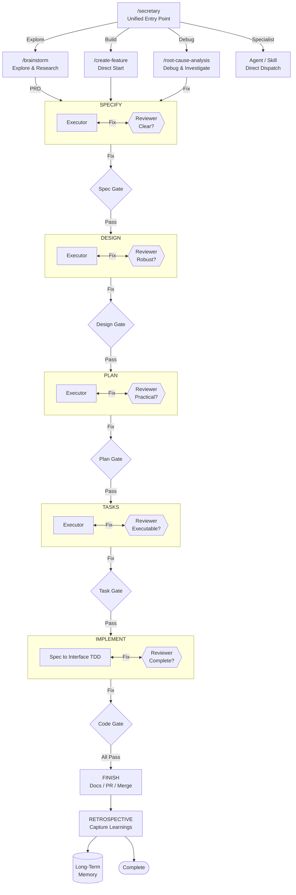
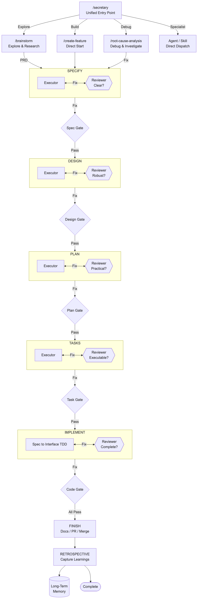

# iflow Plugin

> A Claude Code plugin that turns ideas into shipped features through structured phases — brainstorm, spec, design, plan, implement — with built-in quality gates, semantic memory, and autonomous operation.

## What It Does

iflow guides features from idea to merge through proven phases. Every phase has AI reviewers that catch issues before they compound. The plugin learns from retrospectives — memory persists across sessions and projects. It can run fully autonomously (YOLO mode) or step-by-step with user confirmation at each gate. Domain knowledge modules cover game design, crypto/DeFi, and data science.

## Installation

### Prerequisites

| Requirement | Version | Notes |
|-------------|---------|-------|
| Claude Code | latest | The CLI tool from Anthropic |
| Python | 3.10+ | Required for semantic memory. Linux: also install `python3-venv` |
| git | any | Required |

Optional: `rsync` and `gtimeout` (macOS: `brew install coreutils`).

### Install

```bash
/plugin marketplace add clthuang/my-ai-setup
/plugin install iflow@my-local-plugins
```

Core dependencies auto-install on first session — keyword memory works immediately.

### Setup semantic memory (recommended)

The plugin auto-installs core dependencies on first launch. For semantic search (vs keyword-only), configure an embedding provider:

```bash
# Find your plugin root and run the interactive setup
bash "$(ls -d ~/.claude/plugins/cache/*/iflow/*/scripts/setup.sh 2>/dev/null | head -1)"
```

The setup walks through provider selection, API key configuration, and project initialization.

| Provider | API Key | Notes |
|----------|---------|-------|
| gemini | `GEMINI_API_KEY` | Free tier available (default) |
| openai | `OPENAI_API_KEY` | text-embedding-3-small |
| voyage | `VOYAGE_API_KEY` | voyage-3-lite |
| ollama | — | Local; `ollama pull nomic-embed-text` |
| none | — | Keyword-only search |

### Troubleshooting

```bash
bash "$(ls -d ~/.claude/plugins/cache/*/iflow/*/scripts/doctor.sh 2>/dev/null | head -1)"
```

Read-only health check across 5 categories (system prerequisites, plugin environment, embedding provider, memory system, project context) with OS-specific fix commands.

## Quick Start

**Just describe what you need:**
```bash
/iflow:secretary "add email validation to the signup form"
```
Secretary routes your request to the right workflow phase or specialist automatically.

**Or start directly:**
```bash
/iflow:brainstorm "your idea here"       # Explore an idea
/iflow:create-feature "add user auth"    # Build something
```

Then follow the phases:
```
/iflow:specify → /iflow:design → /iflow:create-plan → /iflow:create-tasks → /iflow:implement → /iflow:finish-feature
```

## Key Features

### Autonomous Operation (YOLO Mode)

```bash
/iflow:secretary mode yolo              # Enable autonomous mode
/iflow:secretary orchestrate <desc>     # Build end-to-end without pausing
/iflow:secretary continue               # Resume from last completed phase
```

All quality gates (reviewers, phase validators) still run — YOLO mode only bypasses user confirmation at phase transitions. Safety boundaries stop execution on review failures, merge conflicts, or missing prerequisites.

**Modes:** `manual` (default) | `aware` (session hints) | `yolo` (fully autonomous)

### Semantic Memory

Two MCP tools persist learnings across sessions:

| Tool | Purpose |
|------|---------|
| `store_memory` | Save a pattern, anti-pattern, or heuristic to long-term memory |
| `search_memory` | Search past learnings by topic using semantic similarity |

Memory entries are injected automatically at session start. The global store (`~/.claude/iflow/memory/`) accumulates knowledge across all projects. See [README_FOR_DEV.md](./README_FOR_DEV.md) for configuration.

### Domain Knowledge

Built-in specialist knowledge for brainstorming and code review:
- **Game design** — core loop analysis, engagement strategy, aesthetic direction, feasibility
- **Crypto/DeFi** — protocol comparison, tokenomics, market strategy, risk assessment
- **Data science** — methodology assessment, pitfall analysis, modeling approach, DS code review

### Specialist Teams

`/iflow:create-specialist-team` assembles ephemeral multi-perspective teams for complex tasks that need diverse expertise.

## Commands

### Core Workflow

| Command | Purpose |
|---------|---------|
| `/iflow:brainstorm [topic]` | Explore ideas, produce evidence-backed PRD |
| `/iflow:create-feature <desc>` | Skip brainstorming, create feature directly |
| `/iflow:create-project <prd>` | Create project from PRD with AI-driven decomposition into features |
| `/iflow:specify` | Write requirements (spec.md) |
| `/iflow:design` | Define architecture (design.md) |
| `/iflow:create-plan` | Plan implementation (plan.md) |
| `/iflow:create-tasks` | Break into tasks (tasks.md) |
| `/iflow:implement` | Write code with TDD and review |
| `/iflow:finish-feature` | Merge, run retro, cleanup branch (iflow features) |
| `/iflow:wrap-up` | Wrap up implementation - review, retro, merge or PR |

### Utilities

| Command | Purpose |
|---------|---------|
| `/iflow:show-status` | See current feature progress |
| `/iflow:list-features` | List active features and branches |
| `/iflow:retrospect` | Run retrospective on a feature |
| `/iflow:add-to-backlog` | Capture ad-hoc ideas and todos |
| `/iflow:remember` | Capture a learning to long-term memory |
| `/iflow:cleanup-brainstorms` | Delete old brainstorm scratch files |
| `/iflow:secretary` | Intelligent task routing to agents and skills (supports YOLO mode with orchestrate subcommand) |
| `/iflow:create-specialist-team` | Create ephemeral specialist teams for complex tasks |
| `/iflow:root-cause-analysis` | Investigate bugs systematically |
| `/iflow:promptimize [file-path]` | Review a plugin prompt against best practices and return an improved version |
| `/iflow:refresh-prompt-guidelines` | Scout latest prompt engineering best practices and update the guidelines document |
| `/iflow:review-ds-analysis <file>` | Review data analysis for statistical pitfalls |
| `/iflow:review-ds-code <file>` | Review DS Python code for anti-patterns |
| `/iflow:init-ds-project <name>` | Scaffold a new data science project |
| `/iflow:sync-cache` | Sync plugin source files to cache |
| `/iflow:yolo [on\|off]` | Toggle YOLO autonomous mode on or off |

## How It Works

### Workflow





### Review System

Every phase has a skeptic reviewer that challenges assumptions and a gatekeeper that validates completeness. Quality gates prevent issues from compounding across phases.

### File Structure

```
docs/
├── brainstorms/           # From /iflow:brainstorm
├── features/{id}-{name}/  # From /iflow:create-feature
│   ├── spec.md, design.md, plan.md, tasks.md
│   └── .meta.json         # Phase tracking
├── projects/{id}-{name}/  # From /iflow:create-project
│   ├── prd.md             # Project PRD
│   └── roadmap.md         # Dependency graph, milestones
├── retrospectives/        # From /iflow:retrospect
└── knowledge-bank/        # Accumulated learnings
```

### Task Output Format

Tasks are organized for parallel execution:

- **Dependency Graph**: Mermaid diagram showing task relationships
- **Execution Strategy**: Groups tasks by parallel executability
- **Task Details**: Each task includes:
  - Dependencies and blocking relationships
  - Exact file paths and step-by-step instructions
  - Test commands or verification steps
  - Binary "done when" criteria
  - Time estimates (5-15 min each)

## Reference

iflow includes 29 skills and 28 agents that run automatically during the workflow. You don't invoke them directly.

### Skills

#### Workflow Phases

| Skill | Purpose |
|-------|---------|
| brainstorming | Guides 6-stage process producing evidence-backed PRDs with advisory team analysis and structured problem-solving |
| structured-problem-solving | Applies SCQA framing and type-specific decomposition to problems during brainstorming |
| specifying | Creates precise specifications with acceptance criteria |
| designing | Creates design.md with architecture and contracts |
| decomposing | Orchestrates project decomposition pipeline (AI decomposition, review, feature creation) |
| planning | Produces plan.md with dependencies and ordering |
| breaking-down-tasks | Breaks plans into small, actionable tasks with dependency tracking |
| implementing | Guides phased TDD implementation (Interface → RED-GREEN → REFACTOR) |
| finishing-branch | Guides branch completion with PR or merge options |

#### Quality & Review

| Skill | Purpose |
|-------|---------|
| promptimize | Reviews plugin prompts against best practices guidelines and returns scored assessment with improved version |
| reviewing-artifacts | Comprehensive quality criteria for PRD, spec, design, plan, and tasks |
| implementing-with-tdd | Enforces RED-GREEN-REFACTOR cycle with rationalization prevention |
| workflow-state | Defines phase sequence and validates transitions |
| workflow-transitions | Shared workflow boilerplate for phase commands (validation, branch check, commit, state update) |

#### Investigation

| Skill | Purpose |
|-------|---------|
| systematic-debugging | Guides four-phase root cause investigation |
| root-cause-analysis | Structured 6-phase process for finding ALL contributing causes |

#### Domain Knowledge

| Skill | Purpose |
|-------|---------|
| game-design | Game design frameworks, engagement/retention analysis, aesthetic direction, and feasibility evaluation |
| crypto-analysis | Crypto/Web3 frameworks for protocol comparison, DeFi taxonomy, tokenomics, trading strategies, MEV classification, market structure, and risk assessment |
| data-science-analysis | Data science frameworks for methodology assessment, pitfall analysis, and modeling approach recommendations (brainstorming domain) |
| writing-ds-python | Clean DS Python code: anti-patterns, pipeline rules, type hints, testing strategy, dependency management |
| structuring-ds-projects | Cookiecutter v2 project layout, notebook conventions, data immutability, the 3-use rule |
| spotting-ds-analysis-pitfalls | 15 common statistical pitfalls with diagnostic decision tree and mitigation checklists |
| choosing-ds-modeling-approach | Predictive vs causal modeling, method selection flowchart, Rubin/Pearl frameworks, hybrid approaches |

#### Specialist Teams

| Skill | Purpose |
|-------|---------|
| creating-specialist-teams | Creates ephemeral specialist teams via template injection into generic-worker |

#### Maintenance

| Skill | Purpose |
|-------|---------|
| retrospecting | Runs data-driven AORTA retrospective using retro-facilitator agent |
| updating-docs | Automatically updates documentation using agents |
| writing-skills | Applies TDD approach to skill documentation |
| detecting-kanban | Detects Vibe-Kanban and provides TodoWrite fallback |
| capturing-learnings | Guides model-initiated learning capture with configurable modes |

### Agents

#### Reviewers

| Agent | Purpose |
|-------|---------|
| brainstorm-reviewer | Reviews brainstorm artifacts with universal + type-specific criteria before promotion |
| code-quality-reviewer | Reviews implementation quality after spec compliance is confirmed |
| design-reviewer | Challenges design assumptions and finds gaps |
| implementation-reviewer | Validates implementation against full requirements chain |
| phase-reviewer | Validates artifact completeness for next phase transition |
| plan-reviewer | Skeptically reviews plans for failure modes and feasibility |
| prd-reviewer | Critically reviews PRD drafts for quality and completeness |
| project-decomposition-reviewer | Validates project decomposition quality (coverage, sizing, dependencies) |
| spec-reviewer | Reviews spec.md for testability, assumptions, and scope discipline |
| security-reviewer | Reviews implementation for security vulnerabilities |
| task-reviewer | Validates task breakdown quality for immediate executability |
| ds-analysis-reviewer | Reviews data analysis for statistical pitfalls, methodology issues, and conclusion validity |
| ds-code-reviewer | Reviews DS Python code for anti-patterns, pipeline quality, and best practices |

#### Workers

| Agent | Purpose |
|-------|---------|
| implementer | Implements tasks with TDD and self-review discipline |
| project-decomposer | Decomposes project PRD into ordered features with dependencies and milestones |
| generic-worker | General-purpose implementation agent for mixed-domain tasks |
| documentation-writer | Writes and updates documentation based on research findings |
| code-simplifier | Identifies unnecessary complexity and suggests simplifications |
| test-deepener | Systematically deepens test coverage after TDD scaffolding with spec-driven adversarial testing |

#### Advisory

| Agent | Purpose |
|-------|---------|
| advisor | Applies strategic or domain advisory lens to brainstorm problems via template injection |

#### Researchers

| Agent | Purpose |
|-------|---------|
| codebase-explorer | Analyzes codebase to find relevant patterns and constraints |
| documentation-researcher | Researches documentation state and identifies update needs |
| internet-researcher | Searches web for best practices, standards, and prior art |
| investigation-agent | Read-only research agent for context gathering |
| skill-searcher | Finds relevant existing skills for a given topic |

#### Orchestration

| Agent | Purpose |
|-------|---------|
| secretary-reviewer | Validates secretary routing recommendations before presenting to user |
| rca-investigator | Finds all root causes through 6-phase systematic investigation |
| retro-facilitator | Runs data-driven AORTA retrospective with full intermediate context |

## For Developers

See [README_FOR_DEV.md](./README_FOR_DEV.md) for:
- Component authoring (skills, agents, hooks)
- Architecture and design principles
- Release workflow
- Validation

Each project uses `.claude/iflow.local.md` for local settings (artifacts path, merge branch, memory config). See [README_FOR_DEV.md](./README_FOR_DEV.md) for the full configuration reference.
