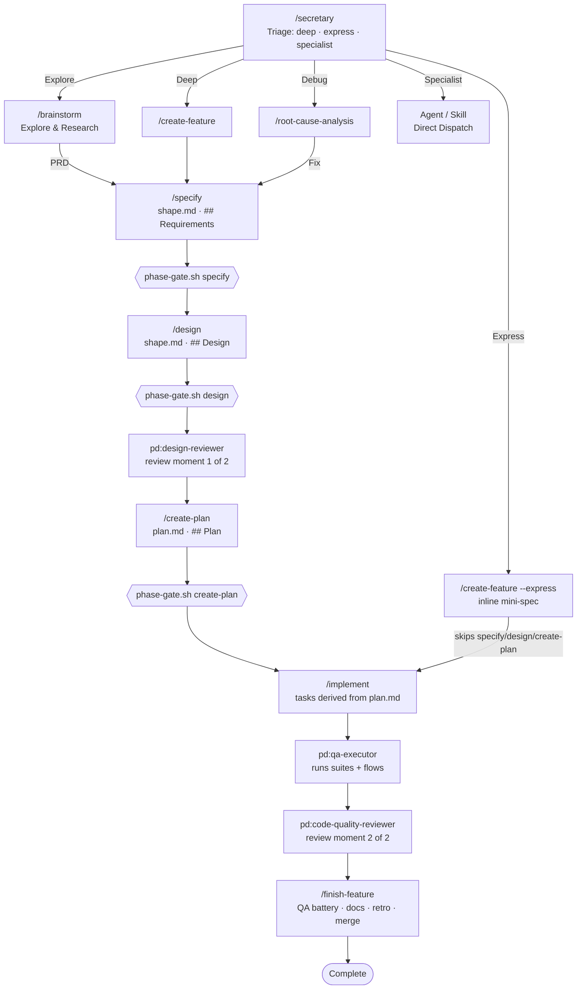

# pd Plugin

> A Claude Code plugin that turns ideas into shipped features through structured phases — brainstorm, spec, design, plan, implement — with built-in quality gates and autonomous operation.

## What It Does

pd guides features from idea to merge through proven phases. Every phase boundary has a mechanical gate, and two LLM review moments (design review, adversarial code review) catch issues before they compound. Retrospectives capture learnings as plain-markdown retros at feature completion. It can run fully autonomously (YOLO mode) or step-by-step with user confirmation at each gate. Small changes take an express lane that skips straight to implement. Domain knowledge modules cover game design, crypto/DeFi, and data science.

## Installation

### Prerequisites

| Requirement | Version | Notes |
|-------------|---------|-------|
| Claude Code | latest | The CLI tool from Anthropic |
| Python | 3.10+ | Required for MCP servers. Linux: also install `python3-venv` |
| git | any | Required |

Optional: `rsync` and `gtimeout` (macOS: `brew install coreutils`).

### Install

```bash
/plugin marketplace add clthuang/pedantic-drip
/plugin install pd@pedantic-drip-marketplace
```

Core dependencies auto-install on first session.

### Troubleshooting

```bash
bash "$(ls -d ~/.claude/plugins/cache/*/pd/*/scripts/doctor.sh 2>/dev/null | head -1)"
```

Read-only health check across system prerequisites, plugin environment, and project context with OS-specific fix commands (12 environment checks). For workspace data-consistency diagnostics, run `/pd:doctor` inside a session instead — it runs 10 checks including security-review command presence, stale worktree detection, status write-path enforcement, free-text status-parser regression detection, and severity vocabulary validation.

## Quick Start

**Just describe what you need:**
```bash
/pd:secretary "add email validation to the signup form"
```
Secretary routes your request to the right workflow phase or specialist automatically.

**Or start directly:**
```bash
/pd:brainstorm "your idea here"       # Explore an idea
/pd:create-feature "add user auth"    # Build something
```

Then follow the phases:
```
/pd:specify → /pd:design → /pd:create-plan → /pd:implement → /pd:finish-feature
```

## Key Features

### Autonomous Operation (YOLO Mode)

```bash
/pd:secretary mode yolo              # Enable autonomous mode
/pd:secretary orchestrate <desc>     # Build end-to-end without pausing
/pd:secretary continue               # Resume from last completed phase
```

All quality gates (mechanical phase gates, review moments, QA execution) still run — YOLO mode only bypasses user confirmation at phase transitions. Safety boundaries stop execution on engine transition rejections, merge conflicts, or a review gate still failing after its one fix round.

**Modes:** `manual` (default) | `aware` (session hints) | `yolo` (fully autonomous)

### Domain Knowledge

Built-in specialist knowledge for brainstorming and code review:
- **Game design** — core loop analysis, engagement strategy, aesthetic direction, feasibility
- **Crypto/DeFi** — protocol comparison, tokenomics, market strategy, risk assessment
- **Data science** — methodology assessment, pitfall analysis, modeling approach, DS code review

### Kanban Board (UI Server)

The plugin auto-starts a local Kanban board at `http://localhost:8718/` on every session start. The board shows features, brainstorms, backlog items, and projects with their workflow phases and lineage in real time, scoped to the current project's workspace by default. A header dropdown switches the view to any other populated workspace or to all workspaces at once (selection persists via cookie). No manual setup required.

Configure via `.claude/pd.local.md`:
- `ui_server_enabled: false` — disable auto-start
- `ui_server_port: 8718` — change the port

### Specialist Teams

`/pd:create-specialist-team` assembles ephemeral multi-perspective teams for complex tasks that need diverse expertise.

## Commands

### Core Workflow

| Command | Purpose |
|---------|---------|
| `/pd:brainstorm [topic]` | Explore ideas, produce evidence-backed PRD |
| `/pd:create-feature <desc>` | Skip brainstorming, create feature directly; `--express` takes the fast lane |
| `/pd:create-project <prd>` | Create project from PRD with AI-driven decomposition into features |
| `/pd:specify` | Write requirements (`shape.md` — `## Requirements`) |
| `/pd:design` | Define architecture (`shape.md` — `## Design`) |
| `/pd:create-plan` | Derive the ordered task plan (`plan.md` — `## Plan`) |
| `/pd:implement` | Write code with TDD, execution QA, and code review |
| `/pd:abandon-feature` | Transition a feature to abandoned status |
| `/pd:finish-feature` | QA battery, docs sync, retro, merge (pd features) |
| `/pd:wrap-up` | End the session — commit WIP, report engine state and open items |

### Utilities

| Command | Purpose |
|---------|---------|
| `/pd:show-lineage` | Display entity lineage tree for the current feature branch or a specified entity |
| `/pd:show-status` | See current feature progress |
| `/pd:list-features` | List active features and branches |
| `/pd:retrospect` | Run retrospective on a feature |
| `/pd:add-to-backlog` | Capture ad-hoc ideas and todos |
| `/pd:cleanup-backlog` | Archive fully-closed backlog sections in the entity DB |
| `/pd:cleanup-brainstorms` | Delete old brainstorm scratch files |
| `/pd:test-debt-report` | Aggregate deferred test debt across features and the backlog |
| `/pd:doctor` | Run 10 diagnostic checks on pd workspace health (incl. security-review command, stale worktrees, status-parser regression, and severity vocabulary) |
| `/pd:secretary` | Intelligent task routing to agents and skills (supports YOLO mode with orchestrate subcommand) |
| `/pd:create-specialist-team` | Create ephemeral specialist teams for complex tasks |
| `/pd:root-cause-analysis` | Investigate bugs systematically |
| `/pd:promptimize [file-path or inline text]` | Review a prompt against best practices and return an improved version |
| `/pd:refresh-prompt-guidelines` | Scout latest prompt engineering best practices and update the guidelines document |
| `/pd:review-ds-analysis <file>` | Review data analysis for statistical pitfalls |
| `/pd:review-ds-code <file>` | Review DS Python code for anti-patterns |
| `/pd:init-ds-project <name>` | Scaffold a new data science project |
| `/pd:generate-docs` | Generate three-tier documentation scaffold or update existing docs |
| `/pd:subagent-ras` | Research, analyze, and summarize any topic using parallel agents |
| `/pd:sync-cache` | Sync plugin source files to cache |
| `/pd:yolo [on\|off]` | Toggle YOLO autonomous mode on or off |

## How It Works

### Workflow


```mermaid
flowchart TD
    SEC["/secretary<br/>Triage: deep · express · specialist"] -->|Explore| BS["/brainstorm<br/>Explore & Research"]
    SEC -->|Deep| CF["/create-feature"]
    SEC -->|Express| CFX["/create-feature --express<br/>inline mini-spec"]
    SEC -->|Debug| RCA["/root-cause-analysis"]
    SEC -->|Specialist| AGENT["Agent / Skill<br/>Direct Dispatch"]

    BS -->|PRD| SPEC
    CF --> SPEC
    RCA -->|Fix| SPEC

    SPEC["/specify<br/>shape.md · ## Requirements"] --> G1{{"phase-gate.sh specify"}}
    G1 --> DES["/design<br/>shape.md · ## Design"]
    DES --> G2{{"phase-gate.sh design"}}
    G2 --> DR["pd:design-reviewer<br/>review moment 1 of 2"]
    DR --> PLN["/create-plan<br/>plan.md · ## Plan"]
    PLN --> G3{{"phase-gate.sh create-plan"}}
    G3 --> IMP
    CFX -->|skips specify/design/create-plan| IMP

    IMP["/implement<br/>tasks derived from plan.md"] --> QA["pd:qa-executor<br/>runs suites + flows"]
    QA --> CQ["pd:code-quality-reviewer<br/>review moment 2 of 2"]
    CQ --> FIN["/finish-feature<br/>QA battery · docs · retro · merge"]
    FIN --> DONE([Complete])
```

### Quality Gates

Every phase boundary runs a mechanical gate (`scripts/phase-gate.sh`) that checks artifacts, required sections, and duplicate contract blocks — no agent dispatch, no judgement. On top of that sit exactly two LLM review moments per deep feature: `design-reviewer` after the design phase gate, and `code-quality-reviewer` on the branch diff during implement. Each is one pass plus at most one fix round; anything still open escalates to you. `qa-executor` runs the suites and drives affected flows during implement, and `security-reviewer` runs at finish when the branch touches a security surface.

### File Structure

```
docs/
├── brainstorms/           # From /pd:brainstorm
├── features/{id}-{name}/  # From /pd:create-feature
│   ├── shape.md           # ## Requirements (specify) + ## Design (design)
│   ├── plan.md            # ## Plan — ordered tasks; no separate tasks.md
│   ├── retro.md           # From the finish phase
│   └── .meta.json         # Phase tracking (gitignored projection — use MCP tools to mutate)
├── projects/{id}-{name}/  # From /pd:create-project
│   ├── prd.md             # Project PRD
│   └── roadmap.md         # Dependency graph, milestones
├── backlog.md             # Gitignored projection — use /pd:add-to-backlog to add items
└── retrospectives/        # From /pd:retrospect
```

### Task Format

Tasks live in `plan.md` under `## Plan` and are derived into dispatches at implement time. Each task names:

- What it changes and which files it touches
- The command that proves it done (test invocation, script, or grep)
- Whether it is parallel-safe — non-intersecting file sets run as `implementer` agents in `.pd-worktrees/task-{N}` isolation and merge back in plan order

## Reference

pd includes 27 skills and 24 agents that run automatically during the workflow. You don't invoke them directly.

### Skills

#### Workflow Phases

| Skill | Purpose |
|-------|---------|
| brainstorming | Guides 6-stage process producing evidence-backed PRDs with advisory team analysis and structured problem-solving |
| structured-problem-solving | Applies SCQA framing and type-specific decomposition to problems during brainstorming |
| specifying | Creates precise specifications with acceptance criteria |
| designing | Creates design.md with architecture and contracts |
| decomposing | Orchestrates project decomposition pipeline (AI decomposition, review, feature creation) |
| planning | Produces plan.md with dependencies and ordering |
| implementing | Execution mechanics for the implement phase — inline vs worktree-isolated task dispatch, merge-back |
| finishing-branch | Guides branch completion with PR or merge options |

#### Quality & Review

| Skill | Purpose |
|-------|---------|
| promptimize | Reviews prompts against best practices guidelines and returns scored assessment with improved version |
| implementing-with-tdd | Enforces RED-GREEN-REFACTOR cycle with rationalization prevention |
| workflow-state | Defines phase sequence and validates transitions |
| workflow-transitions | Shared phase-transition contract for every phase command (engine entry/exit, global YOLO rule, review gate, dispatch hygiene) |

#### Investigation

| Skill | Purpose |
|-------|---------|
| systematic-debugging | Guides four-phase root cause investigation |
| root-cause-analysis | Structured 6-phase process for finding ALL contributing causes |

#### Research & Synthesis

| Skill | Purpose |
|-------|---------|
| researching | Orchestrates parallel research, analysis, and synthesis into decision-ready summaries |

#### Domain Knowledge

| Skill | Purpose |
|-------|---------|
| game-design | Game design frameworks, engagement/retention analysis, aesthetic direction, and feasibility evaluation |
| crypto-analysis | Crypto/Web3 frameworks for protocol comparison, DeFi taxonomy, tokenomics, trading strategies, MEV classification, market structure, and risk assessment |
| data-science-analysis | Data science frameworks for methodology assessment, pitfall analysis, and modeling approach recommendations (brainstorming domain) |
| writing-ds-python | Clean DS Python code: anti-patterns, pipeline rules, type hints, testing strategy, dependency management |
| structuring-ds-projects | Cookiecutter v2 project layout, notebook conventions, data immutability, the 3-use rule |
| spotting-ds-analysis-pitfalls | 15 common statistical pitfalls with diagnostic decision tree and mitigation checklists |
| choosing-ds-modeling-approach | Predictive vs causal modeling, method selection flowchart, Rubin/Pearl frameworks, hybrid approaches |

#### Specialist Teams

| Skill | Purpose |
|-------|---------|
| creating-specialist-teams | Creates ephemeral specialist teams via template injection into generic-worker |

#### Maintenance

| Skill | Purpose |
|-------|---------|
| retrospecting | Runs data-driven AORTA retrospective using retro-facilitator agent; writes plain-markdown retro.md |
| updating-docs | Automatically updates documentation using agents |
| writing-skills | Applies TDD approach to skill documentation |
| detecting-kanban | Detects Vibe-Kanban and provides TodoWrite fallback |

### Agents

#### Reviewers

| Agent | Purpose |
|-------|---------|
| design-reviewer | Challenges design assumptions and finds gaps (review moment 1 of 2) |
| code-quality-reviewer | Adversarially reviews the branch diff for correctness and maintainability (review moment 2 of 2) |
| plan-reviewer | Skeptically reviews plans for failure modes and feasibility |
| prd-reviewer | Critically reviews PRD drafts for quality and completeness |
| project-decomposition-reviewer | Validates project decomposition quality (coverage, sizing, dependencies) |
| security-reviewer | Reviews implementation for security vulnerabilities |
| ds-analysis-reviewer | Reviews data analysis for statistical pitfalls, methodology issues, and conclusion validity |
| ds-code-reviewer | Reviews DS Python code for anti-patterns, pipeline quality, and best practices |

#### Workers

| Agent | Purpose |
|-------|---------|
| implementer | Implements tasks with TDD and self-review discipline |
| qa-executor | Execution-grounded QA — runs the test battery and drives affected flows, returning command output as evidence |
| project-decomposer | Decomposes project PRD into ordered features with dependencies and milestones |
| generic-worker | General-purpose implementation agent for mixed-domain tasks |
| documentation-writer | Writes and updates documentation based on research findings |
| ras-synthesizer | Synthesizes multi-source research findings into thematic analysis with confidence calibration |
| relevance-verifier | Verifies coherence across the artifact chain (shape.md → plan.md → code) |
| test-deepener | Systematically deepens test coverage after TDD scaffolding with spec-driven adversarial testing |

#### Advisory

| Agent | Purpose |
|-------|---------|
| advisor | Applies strategic or domain advisory lens to brainstorm problems via template injection |

#### Researchers

| Agent | Purpose |
|-------|---------|
| codebase-explorer | Analyzes codebase to find relevant patterns and constraints |
| documentation-researcher | Researches documentation state and identifies update needs |
| internet-researcher | Searches web for best practices, standards, and prior art |
| investigation-agent | Read-only research agent for context gathering |
| skill-searcher | Finds relevant existing skills for a given topic |

#### Orchestration

| Agent | Purpose |
|-------|---------|
| rca-investigator | Finds all root causes through 6-phase systematic investigation |
| retro-facilitator | Runs data-driven AORTA retrospective with full intermediate context |

## For Developers

See [README_FOR_DEV.md](./README_FOR_DEV.md) for:
- Component authoring (skills, agents, hooks)
- Architecture and design principles
- Release workflow
- Validation

Each project uses `.claude/pd.local.md` for local settings (artifacts path, merge branch). See [README_FOR_DEV.md](./README_FOR_DEV.md) for the full configuration reference.
