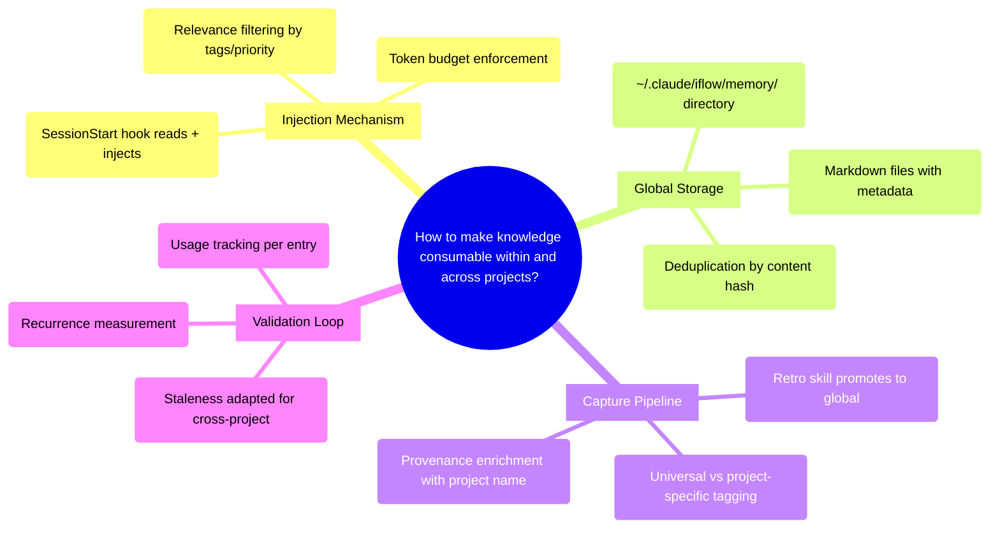

# PRD: Cross-Project Persistent Memory System

## Status
- Created: 2026-02-17
- Last updated: 2026-02-17
- Status: Draft
- Problem Type: Technical/Architecture
- Archetype: exploring-an-idea

## Problem Statement
iflow's knowledge bank captures structured engineering learnings during retrospectives (patterns, anti-patterns, heuristics) but has two compounding failures: (1) the knowledge bank is **never consumed** — no session hook, skill, or agent reads it, making it a write-only archive, and (2) the knowledge bank is **project-scoped** — learnings from one project are invisible in others. Together, these mean the model repeats known mistakes even within the same project, and accumulated wisdom never transfers to new contexts.

### Evidence
- Codebase analysis: `session-start.sh` injects feature workflow state but makes zero references to `docs/knowledge-bank/` — Evidence: `plugins/iflow-dev/hooks/session-start.sh:145-218`
- Feature #022 retrospective documents that the "Line Number References in Sequential Tasks" anti-pattern was captured in Feature #018 but violated again across multiple review iterations in Feature #022 — Evidence: `docs/features/022-context-and-review-hardening/retro.md`
- Knowledge bank has 44 entries across 399 lines (~4,630 tokens) accumulated over 22 features — no workflow skill reads these files — Evidence: `docs/knowledge-bank/` (23 patterns, 11 anti-patterns, 10 heuristics)
- Claude Code's native auto memory at `~/.claude/projects/<project>/memory/` is project-scoped with no cross-project aggregation — Evidence: [Claude Code Memory Docs](https://code.claude.com/docs/en/memory)
- Research: "Context rot" degrades LLM accuracy non-linearly — quality of injected content matters more than quantity — Evidence: [Chroma Context Rot Research](https://research.trychroma.com/context-rot)
- Research: Memory-based approaches dramatically outperform RAG — 92% vs 32% accuracy on long conversations, 100% vs 0% on 3+ hop reasoning — Evidence: [Token Crisis in Agentic Tasks](https://agamjn.com/technical/2025/10/11/token-crisis-in-agentic-tasks.html)

## Goals
1. Make the knowledge bank consumable — inject relevant entries into sessions so the model is aware of past learnings
2. Enable cross-project knowledge transfer — learnings from any project surface in other projects when relevant
3. Keep token overhead bounded — memory injection stays efficient regardless of corpus growth
4. Validate through usage — track which entries are referenced and measure whether recurrence of known anti-patterns decreases

## Success Criteria
- [ ] Knowledge bank entries are injected into session context at session start (within-project consumption)
- [ ] A learning captured during retro in Project A is visible when starting a session in Project B
- [ ] Token cost of memory injection is bounded (configurable limit, not growing linearly with corpus size)
- [ ] Anti-pattern recurrence tracking: each injected anti-pattern entry includes an observation count, and usage tracking logs whether the anti-pattern was relevant to the session's work (measured via retro analysis, not real-time detection)
- [ ] Usage tracking shows which entries were in context during sessions (basic instrumentation)

## User Stories

### Story 1: Within-project recall
**As a** developer running iflow **I want** the model to know about anti-patterns and heuristics captured from prior features in this project **So that** it avoids repeating known mistakes during design, planning, and implementation.
**Acceptance criteria:**
- At session start, relevant knowledge bank entries appear in the model's context
- When implementing, the model references a known anti-pattern to avoid a documented mistake

### Story 2: Cross-project recall
**As a** developer working on multiple projects with iflow **I want** universally applicable learnings (e.g., "always read the target file before writing a parser") to surface in new projects **So that** engineering wisdom accumulates across my entire development practice, not just within a single repo.
**Acceptance criteria:**
- A heuristic captured in project A appears in session context when working on project B
- Project-specific entries (e.g., codebase architecture details) do NOT leak into unrelated projects

### Story 3: Token-efficient injection
**As a** developer **I want** memory injection to be smart about what it includes **So that** it doesn't flood the context window with irrelevant history, especially as the memory store grows over months.
**Acceptance criteria:**
- The injection mechanism has a configurable entry limit (default: top N entries)
- High-observation-count entries are prioritized over low-confidence or stale entries
- Total token overhead of memory injection is visible/measurable

### Story 4: Automatic capture
**As a** developer **I want** learnings to be automatically promoted to the global store during retrospectives **So that** I don't need to manually manage memory files.
**Acceptance criteria:**
- The retrospecting skill writes qualifying entries to both project-local and global stores
- Deduplication prevents the same learning from accumulating multiple copies

## Use Cases

### UC-1: Session start with memory injection
**Actors:** Developer, session-start hook | **Preconditions:** Global memory store exists with entries, iflow plugin installed
**Flow:**
1. Developer opens Claude Code in any project
2. session-start hook reads global memory store
3. Hook filters entries by relevance (tags, observation count, recency)
4. Hook injects top N entries as additionalContext
5. Model begins session aware of past learnings
**Postconditions:** Model has relevant knowledge bank entries in context
**Edge cases:** Empty memory store → no injection, no error; memory.local.md disables injection → skip silently

### UC-2: Knowledge promotion during retro
**Actors:** Developer, retrospecting skill | **Preconditions:** Feature retro producing new knowledge bank entries
**Flow:**
1. Retrospecting skill generates new patterns/anti-patterns/heuristics (existing Step 4)
2. New step: for each entry, evaluate if it is project-agnostic (universal engineering wisdom) or project-specific
3. Project-agnostic entries are copied to global memory store with enriched provenance (project name + feature ID)
4. Duplicates detected by content similarity → increment observation count on existing entry
**Postconditions:** Global store updated, project-local store unchanged
**Edge cases:** Global store doesn't exist → create it; entry already exists → merge provenance, increment count

### UC-3: Cross-project knowledge surfacing
**Actors:** Developer, session-start hook | **Preconditions:** Developer switches to Project B, global memory has entries from Project A
**Flow:**
1. Developer opens Claude Code in Project B
2. session-start hook reads global memory store
3. Entries from Project A that are tagged as universal are included
4. Entries that are project-specific to Project A are excluded
5. Model surfaces relevant learning during design/implementation
**Postconditions:** Cross-project learning applied without context pollution
**Edge cases:** All entries are project-specific → nothing injected from global; very large global store → limit and prioritize

## Edge Cases & Error Handling
| Scenario | Expected Behavior | Rationale |
|----------|-------------------|-----------|
| Global memory store doesn't exist | Create directory and empty files on first retro | Graceful bootstrapping |
| `iflow-dev.local.md` disables injection (`memory_injection_enabled: false`) | Skip injection silently, no warning | User choice respected |
| SessionStart fires on `clear` (post-compact resume) | Skip memory injection on `clear` events — re-injecting would re-inflate context just compacted | Compact-safe by design (BC-2) |
| SessionStart fires on `resume` | Inject normally — user returning to an existing session benefits from memory | Resume is not a compact event |
| Knowledge bank entry has no tags | Include in injection (conservative — better to over-include than miss) | New entries may not be tagged yet |
| `iflow-dev.local.md` has no memory fields | Use defaults: injection enabled, limit 20 | Zero-config experience |
| Global store exceeds 100 entries | Inject only top N by priority score (observation count * recency) | Prevent unbounded token growth |
| Duplicate entry across projects | Merge: keep single entry with combined provenance and summed observation count | Prevent bloat, strengthen confidence |
| Entry contradicts existing entry | Flag both with "Contested" annotation, present both to model | Let the model reason about contradictions |
| Stop hook fails to capture session | No-op — retro is the primary capture path, session capture is bonus | Retro is reliable; Stop hooks are best-effort |
| Native Claude auto-memory conflicts | iflow memory and native memory are complementary — iflow focuses on structured engineering learnings, auto-memory on ad-hoc session notes | Clearly different scopes |

## Constraints

### Behavioral Constraints (Must NOT do)
- MUST NOT inject project-specific memories into unrelated projects — Rationale: Cross-project pollution actively harms more than it helps (context confusion)
- MUST NOT inject memories during compact events — Rationale: Compact-safe hook design from Feature #022; re-injecting at compact wastes the compaction savings
- MUST NOT require external services, cloud APIs, or network access — Rationale: Local-only constraint; must work offline
- MUST NOT modify Claude Code's native auto-memory files — Rationale: Separate concern; avoid conflicts with Anthropic's evolving memory system

### Technical Constraints
- Plugin hooks communicate with Claude Code exclusively via JSON stdout (additionalContext, decision blocks); however, hooks CAN read/write files during execution (e.g., `yolo-stop.sh` calls `write_hook_state`) — Evidence: `plugins/iflow-dev/hooks/yolo-stop.sh`, `docs/dev_guides/component-authoring.md:180-192`
- SessionStart additionalContext has no documented size limit but consumes context window tokens — Evidence: Codebase analysis
- Stop hooks receive stdin JSON but cannot access conversation content, only filesystem state — Evidence: `plugins/iflow-dev/hooks/yolo-stop.sh`
- SKILL.md files must stay under 500 lines / 5,000 tokens — Evidence: `docs/dev_guides/component-authoring.md:301-306`

## Requirements

### Functional
- FR-1: SessionStart hook reads global memory store and injects relevant entries as additionalContext. Injection format: structured markdown with entry category headers. Ordering follows "Lost in the Middle" research — highest-priority entries placed at the beginning and end of the injected block, lower-priority entries in the middle.
- FR-2: Retrospecting skill promotes project-agnostic entries to global memory store during /finish. Promotion happens via Claude tool use (Write/Edit) within the retrospecting skill's Step 4 — not via hook infrastructure. The skill classifies each new entry and writes qualifying entries to the global store path.
- FR-3: Global memory store lives at a well-known path (e.g., `~/.claude/iflow/memory/`) accessible from any project
- FR-4: Entries have structured metadata: content hash, provenance (project + feature), observation count, last observed timestamp, tags (universal/project-specific), confidence level
- FR-5: Injection prioritizes entries by: observation count (higher first), confidence (higher first), recency (more recent first)
- FR-6: Injection is bounded by a configurable entry limit stored in `iflow-dev.local.md` (reuses existing per-project config file, fields: `memory_injection_limit`, `memory_injection_enabled`)
- FR-7: Deduplication on promotion: entries with matching content hashes increment observation count rather than creating duplicates
- FR-8: Entry tagging: retro skill classifies entries as "universal" or "project-specific" based on whether they reference project-specific code/architecture

### Non-Functional
- NFR-1: Memory injection adds no more than 3 seconds to session start time
- NFR-2: Global store must work with 0 entries (graceful empty state) and 500+ entries (bounded injection)
- NFR-3: All memory state is human-readable markdown files — no binary databases required for Phase 1
- NFR-4: Memory system is opt-out per project via `iflow-dev.local.md` configuration (`memory_injection_enabled: false`)
- NFR-5: Compatible with the two-plugin model (iflow-dev + iflow) — release script handles reference conversion

## Non-Goals
- Full semantic search with embeddings and vector databases — Rationale: At current scale (~44 entries), keyword/tag matching is sufficient. Semantic search is a Phase 2/3 consideration only if the corpus exceeds what tag-based retrieval can serve.
- Session-level memory capture via Stop hooks — Rationale: Stop hooks are unreliable (user may kill terminal). The retro skill is the reliable capture point. Session capture is a future enhancement.
- MCP memory server — Rationale: Infrastructure overhead disproportionate to current scale. MCP is a Phase 3 consideration when pull-based retrieval is needed.
- Replacing Claude Code's native auto-memory — Rationale: Complementary systems with different purposes. iflow memory = structured engineering learnings; auto-memory = ad-hoc session notes.
- Team/multi-user memory sharing — Rationale: iflow is private tooling with a single user. Multi-user memory is out of scope.

## Out of Scope (This Release)
- Semantic retrieval via local embedding models (e.g., MiniLM-L6-v2 ONNX) — Future consideration: When corpus exceeds ~200 entries and tag-based retrieval shows precision problems
- MCP-based memory tools (`recall_memories`, `store_memory`) — Future consideration: When pull-based retrieval during mid-session is needed
- Memory consolidation/compression (merging similar entries) — Future consideration: When duplicate/near-duplicate entries become a curation burden
- Usage-based automatic retirement of entries — Future consideration: When usage tracking data is sufficient to determine which entries are never helpful
- Graph-based memory with relationships between entries — Future consideration: If entries develop complex interdependencies

## Research Summary

### Internet Research
- OpenClaw uses markdown as source of truth with SQLite + sqlite-vec for indexing; hybrid retrieval (vector + BM25) with ~400 token chunks — Source: [OpenClaw Docs](https://docs.openclaw.ai/concepts/memory)
- OpenClaw-Engram adds signal-first extraction (regex before LLM), 10 typed categories, confidence tiers, v3.0 namespaces for cross-project shared memory — Source: [GitHub](https://github.com/joshuaswarren/openclaw-engram)
- Mem0 processes message pairs with ADD/UPDATE/DELETE/NOOP evaluation against top-10 similar memories; ~7K tokens/conversation; 90% token savings vs full context — Source: [arXiv:2504.19413](https://arxiv.org/abs/2504.19413)
- claude-cognitive implements HOT/WARM/COLD attention-based file injection with decay/activation/co-activation dynamics; 64-95% token savings — Source: [GitHub](https://github.com/GMaN1911/claude-cognitive)
- Mnemosyne uses 40/30/20/10 context budget allocation (critical/skills/project/general), importance decay formula: `base * e^(-age/30)`, consolidation via Merge/Supersede/KeepBoth — Source: [Whitepaper](https://rand.github.io/mnemosyne/whitepaper.html)
- claude-diary uses Generative Agents-inspired diary entries; reflection detects patterns (2+ occurrences) and auto-updates CLAUDE.md — Source: [GitHub](https://github.com/rlancemartin/claude-diary)
- "Lost in the Middle" U-shaped performance: LLMs recall best from beginning and end of context, worst from middle — Source: [arXiv:2307.03172](https://arxiv.org/abs/2307.03172)
- Active Context Compression achieves 22.7% token reduction with identical accuracy via agent-autonomous consolidation — Source: [arXiv:2601.07190](https://arxiv.org/abs/2601.07190)
- LightMem three-stage memory (Atkinson-Shiffrin) achieves 117x token reduction via topic-aware segmentation and offline "sleep-time" consolidation — Source: [arXiv:2510.18866](https://arxiv.org/html/2510.18866v1)
- Anthropic official guidance: "Find the smallest set of high-signal tokens that maximize the likelihood of your desired outcome" — Source: [Anthropic Engineering](https://www.anthropic.com/engineering/effective-context-engineering-for-ai-agents)
- Community consensus: hooks for guaranteed capture at session boundaries + MCP for on-demand mid-session retrieval = hybrid winner — Source: [Blog](https://yuanchang.org/en/posts/claude-code-auto-memory-and-hooks/)
- mcp-memory-service (doobidoo): most mature MCP memory, SQLite + sqlite-vec + ONNX, 5ms retrieval, 88% token reduction, quality scoring — Source: [GitHub](https://github.com/doobidoo/mcp-memory-service)
- MemCP: 21 MCP tools, 5-tier retrieval degradation, 218x RLM token reduction — Source: [GitHub](https://github.com/maydali28/memcp)
- A-Mem (NeurIPS 2025): Zettelkasten-inspired with LLM-generated keywords, tags, dynamic linking; doubles performance on multi-hop reasoning — Source: [arXiv:2502.12110](https://arxiv.org/abs/2502.12110)
- Collaborative Memory: bipartite User-Agent access control, private vs shared tiers, temporal permission evolution — Source: [arXiv:2505.18279](https://arxiv.org/html/2505.18279v1)

### Codebase Analysis
- Knowledge bank: 44 entries, 399 lines, ~4,630 tokens across 4 files (constitution 35L, patterns 174L with 23 entries, anti-patterns 103L with 11 entries, heuristics 87L with 10 entries) — Location: `docs/knowledge-bank/`
- Write-only: retrospecting skill writes (Step 4) but nothing reads — Location: `plugins/iflow-dev/skills/retrospecting/SKILL.md:163-189`
- session-start.sh: injects feature workflow state via additionalContext, zero knowledge bank references — Location: `plugins/iflow-dev/hooks/session-start.sh:145-218`
- Hook infrastructure supports SessionStart, PreToolUse, PostToolUse, Stop with additionalContext injection — Location: `plugins/iflow-dev/hooks/hooks.json`
- Global paths accessible from hooks: `~/.claude/` used by cleanup-locks.sh and sync-cache.sh — Location: `plugins/iflow-dev/hooks/cleanup-locks.sh`
- lib/common.sh provides reusable: detect_project_root, escape_json, read_local_md_field, read/write_hook_state — Location: `plugins/iflow-dev/hooks/lib/common.sh`
- .local.md config pattern: YAML frontmatter, read via grep — Location: `plugins/iflow-dev/templates/iflow-dev.local.md`
- Two-tier storage: global at `~/.claude/`, project at `{root}/.claude/` — Location: various hooks

### Existing Capabilities
- Retrospecting skill: AORTA framework produces structured entries with provenance, confidence, observation counts — extends naturally to write to a global store
- Knowledge bank validation (Feature #022): staleness detection, observation count tracking, challenge/retire flow — provides curation primitives
- session-start.sh: proven additionalContext injection pattern — extends to include knowledge bank entries
- `~/.claude/CLAUDE.md` and `~/.claude/rules/*.md`: Claude Code's native cross-project injection — complementary mechanism, potential simple Phase 0
- sync-cache.sh: rsync pattern for global-to-local file syncing — reusable for memory sync

## Structured Analysis

### Problem Type
Technical/Architecture — System design for a persistent knowledge storage and retrieval layer that integrates with the existing hook infrastructure and retrospective workflow.

### SCQA Framing
- **Situation:** iflow captures structured engineering learnings during retrospectives into a project-local knowledge bank with provenance tracking, observation counts, and staleness detection (Feature #022). The hook infrastructure supports context injection at session start.
- **Complication:** The knowledge bank is write-only — no skill, hook, or agent reads it. Learnings captured from Feature #018 were violated in Feature #022 because the model never saw them. Additionally, the knowledge bank is project-scoped, so wisdom from one project cannot help in another.
- **Question:** How should we architect a system that makes knowledge bank entries consumable within and across projects while keeping token overhead bounded?
- **Answer:** A phased approach starting with the simplest possible fix (inject knowledge bank via session-start hook + sync to global store during retro), validating that consumption actually prevents recurrence, then scaling retrieval sophistication only as corpus size demands.

### Decomposition
```
Why is accumulated knowledge unused?
├── No read/injection path exists
│   ├── session-start.sh injects workflow state, not knowledge
│   └── No skill or agent references knowledge bank files
├── Knowledge is project-scoped
│   ├── docs/knowledge-bank/ lives in project git repo
│   └── No global aggregation mechanism
├── No relevance filtering for injection
│   ├── All entries or nothing — no prioritization
│   └── No context-awareness (project type, phase, domain)
└── No feedback loop
    ├── Unknown whether entries actually prevent mistakes
    └── No usage tracking to measure value
```

### Mind Map


## Strategic Analysis

### First-principles
- **Core Finding:** The knowledge bank is a write-only store — learnings are captured during retrospectives but never injected into any workflow phase. Before building cross-project infrastructure, the system needs to prove that *intra-project* memory recall delivers value.
- **Analysis:** The problem statement frames this as a cross-project transfer problem, but Socratic questioning reveals a more fundamental gap: the knowledge bank is not consumed even within its origin project. The "Line Number References" anti-pattern was captured in Feature #018 yet violated again in Feature #022 across 4 review phases. Building cross-project distribution for content with zero consumption is building an interstate highway system before confirming local roads connect to buildings. Most knowledge bank entries are domain-agnostic workflow learnings that could be made cross-project by relocating them into the plugin directory — no new infrastructure needed. The corpus of ~44 entries at ~4,630 tokens is well within what simple file reads can serve.
- **Key Risks:** Solving distribution before proving consumption delivers value; infrastructure disproportionate to corpus size; no baseline measurement exists for whether injection prevents recurrence
- **Recommendation:** Validate intra-project consumption first. Inject knowledge bank entries into session context and measure whether anti-pattern recurrence decreases. Only then expand to cross-project.
- **Evidence Quality:** strong

### Vision-horizon
- **Core Finding:** This is optimized for a 12-24 month strategic investment, but the most critical risk is building permanent infrastructure before Claude Code's native memory system closes the gap — auto memory is evolving rapidly (agent memory frontmatter added February 2026).
- **Analysis:** The external landscape is moving fast. Claude Code's native auto memory already writes to `~/.claude/projects/<project>/memory/` and loads 200 lines at session start. The MCP ecosystem is fragmenting with no clear winner. Research advances weekly (SimpleMem 30x efficiency, Zvec embeddable vector DB). The tension is between 6-month tactical (inject now, validate) and 2-year strategic (build semantic retrieval). Each phase should produce a working system independently and check whether Anthropic has shipped native cross-project memory. The key architectural decision: define a clean retrieval interface (query in, ranked entries out) that is backend-agnostic.
- **Key Risks:** Platform convergence (Anthropic ships cross-project memory natively); infrastructure lock-in to evolving ecosystem; token budget competition with existing context injection
- **Recommendation:** Phase as 3-stage investment with explicit off-ramps. Phase 1: flat files + hook injection. Phase 2: SQLite + relevance filtering. Phase 3: MCP server. Each phase validates independently.
- **Evidence Quality:** moderate

### Opportunity-cost
- **Core Finding:** The highest-value move is making the existing knowledge bank readable — a change requiring near-zero infrastructure that may satisfy 80% of the need.
- **Analysis:** Claude Code already provides `~/.claude/CLAUDE.md` and `~/.claude/rules/*.md` — both loaded globally for all projects at session start with zero infrastructure. The entire knowledge bank (4,630 tokens) fits comfortably in a single rules file. The approaches being considered (mem0, MCP servers, vector stores) solve problems at scale (thousands of entries), but the current corpus is 44 entries. The inversion test: doing nothing and just reading the knowledge bank at session start via a 20-line hook script already solves the core problem — "make the model aware of past learnings."
- **Key Risks:** Over-engineering for current scale; infrastructure maintenance burden for ~37 entries; development time diverted from higher-payoff backlog items; rapidly evolving landscape makes early commitment risky
- **Recommendation:** Run a minimum viable experiment first — add session-start injection and measure impact. Only build infrastructure when flat-file approach demonstrably fails at scale.
- **Evidence Quality:** strong

### Pre-mortem
- **Core Finding:** The most likely failure mode is that the memory system becomes a write-heavy, read-neglected data store replicating the exact write-only pattern the current knowledge bank already exhibits, but with added infrastructure complexity.
- **Analysis:** It is 2028, and the system is being torn out. The knowledge bank was already write-only, and the cross-project memory system repeated the pattern at larger scale. Entries accumulated, retrieval quality degraded through context rot, and cross-project injection pulled memories from wrong contexts (crypto entries during game design). The infrastructure (MCP server, vector DB) added complexity without the corpus size to justify it. The "I told you so" narrative: "We built sophisticated infrastructure before solving the simpler problem of making existing knowledge readable."
- **Key Risks:** Write-only trap (CRITICAL); context rot and retrieval degradation (HIGH); premature infrastructure complexity (HIGH); MCP ecosystem fragility (MEDIUM); cross-project context pollution (MEDIUM)
- **Recommendation:** Solve the read path first. Make knowledge bank injectable via session-start hook. Validate over 5-10 features. Only then consider cross-project expansion with the simplest mechanism possible.
- **Evidence Quality:** strong

### Working Backwards
- **Press Release:** *iflow plugin users working across multiple projects no longer lose engineering wisdom when switching contexts. The cross-project persistent memory system automatically surfaces relevant patterns, anti-patterns, and heuristics at session start — regardless of which project is active. A developer starting work on a new codebase sees warnings about anti-patterns they encountered months ago in a different repo. No manual curation required; retrospectives feed the memory automatically. Token usage stays efficient by injecting only high-confidence entries.*
- **Analysis:** The deliverable has a critical clarity gap: the problem statement says "learnings don't transfer across projects" but the knowledge bank is not even consumed within its origin project. Claude Code already provides `~/.claude/CLAUDE.md` and `~/.claude/rules/*.md` — zero-infrastructure cross-project injection. The question becomes: what does a custom memory system provide that copying entries into `~/.claude/rules/` would not? At current scale, the answer is "automatic curation and relevance filtering" — but only when the corpus grows large enough to need it.
- **Skeptical FAQ:** (1) Why build cross-project before solving single-project? A: Cross-project is the goal; single-project is the prerequisite. Phase 1 solves both. (2) Why not just use `~/.claude/rules/`? A: At current scale, that works. The system adds automatic promotion, deduplication, and relevance filtering for growth. (3) Why not use an existing MCP memory server? A: At 44 entries, none of them solve a problem a flat file doesn't.
- **Minimum Viable Deliverable:** (1) Modify session-start hook to inject knowledge bank entries, (2) Copy universal entries to `~/.claude/iflow/memory/` during /finish, (3) Read global store in other projects' session-start.
- **Recommendation:** Ship the minimum viable deliverable and instrument with usage counters. Only invest in retrieval infrastructure after measuring usage patterns at scale.
- **Evidence Quality:** strong

## Options Evaluated

### Option 1: Minimal — Hook injection + global file sync
- **Description:** Extend session-start.sh to read knowledge bank. Extend retro skill to copy universal entries to `~/.claude/iflow/memory/`. Read global store in session-start for cross-project injection. All plain markdown, no infrastructure.
- **Pros:** Zero infrastructure, immediate value, validates core hypothesis, aligned with "files are truth" philosophy
- **Cons:** No relevance filtering beyond tags/priority; entire global store injected up to limit; scaling depends on entry growth rate
- **Evidence:** All 5 advisors recommended this as the starting point

### Option 2: Moderate — SQLite index + tag-based retrieval
- **Description:** Phase 1 plus SQLite FTS5 index for entries. Filter by detected project language/domain, active workflow phase, tag matching. Still file-based source of truth, DB as index only.
- **Pros:** Better relevance filtering, bounded injection regardless of corpus size, reuses existing patterns (sqlite ships with macOS)
- **Cons:** Added complexity, requires maintaining index alongside files, may be premature given corpus size
- **Evidence:** doobidoo mcp-memory-service and OpenClaw both use this pattern successfully

### Option 3: Full — MCP memory server with semantic retrieval
- **Description:** Local MCP server providing `recall_memories(query)` and `store_memory(...)` tools. Embeddings via local ONNX model. Pull-based retrieval where the model decides when to query.
- **Pros:** Best scaling, semantic search, pull-based (doesn't consume context unless needed), cross-tool portability
- **Cons:** Significant infrastructure (SQLite + embeddings + MCP server process), departure from "everything is prompts", model must know to call memory tools
- **Evidence:** mcp-memory-service, MemCP, claude-mem all demonstrate this architecture

### Option 4: Adopt existing tool (e.g., claude-diary, Super-Claude-Kit)
- **Description:** Install an existing community memory solution and integrate with iflow's retro output
- **Pros:** No development time, community-maintained, battle-tested
- **Cons:** Different design philosophy, not integrated with iflow's structured knowledge bank format, dependency on external maintainers, may conflict with iflow's hook architecture
- **Evidence:** Community tools solve general memory; iflow's knowledge bank is already more structured with provenance/confidence/staleness

## Decision Matrix
| Criterion | Weight | Option 1: Minimal | Option 2: SQLite | Option 3: MCP | Option 4: Adopt |
|-----------|--------|-------------------|------------------|---------------|-----------------|
| Time to value | 5 | 5 (hours) | 3 (days) | 2 (weeks) | 3 (days) |
| Infrastructure cost | 4 | 5 (zero) | 4 (SQLite) | 2 (MCP+embeds) | 3 (external dep) |
| Scaling ceiling | 3 | 2 (~200 entries) | 4 (~5K entries) | 5 (unlimited) | 3 (varies) |
| Philosophy alignment | 4 | 5 (files are truth) | 4 (file+index) | 2 (new infra) | 2 (external) |
| Validates hypothesis | 5 | 5 (directly) | 4 (adds complexity) | 3 (over-engineers) | 2 (tangential) |
| Cross-project support | 4 | 4 (global files) | 5 (filtered) | 5 (semantic) | 3 (varies) |
| **Weighted Total** | | **112** | **99** | **76** | **66** |

**Recommendation:** Start with Option 1 (Minimal) covering Phases 1-2 of the roadmap, graduate to Option 2 (SQLite) at Phase 3 when corpus exceeds ~100 entries. Consider Option 3 (MCP) at Phase 4 only if pull-based mid-session retrieval is needed. See "Phased Roadmap" section for trigger criteria and off-ramps.

## Review History

### Iteration 0 → 1
**Reviewer:** prd-reviewer | **Result:** Not approved (1 blocker, 5 warnings, 4 suggestions)

**Corrections applied:**
1. **BLOCKER TC-1 fixed:** Corrected factual error — hooks CAN read/write files during execution (evidence: yolo-stop.sh calls write_hook_state). Updated TC-1 to clarify hooks communicate with Claude Code via JSON stdout but have full filesystem access during execution.
2. **WARNING entry count fixed:** Corrected 37 → 44 entries (23 patterns + 11 anti-patterns + 10 heuristics) across all references in the document.
3. **WARNING FR-2 execution model clarified:** Added detail that promotion happens via Claude tool use (Write/Edit) within the retrospecting skill's Step 4, not via hook infrastructure.
4. **WARNING FR-1 injection format specified:** Added format specification (structured markdown with category headers) and ordering strategy (Lost in the Middle research — high-priority entries at beginning and end).
5. **WARNING Open Question 4 elevated:** Moved `~/.claude/rules/` vs `~/.claude/iflow/memory/` decision to new "Pre-Implementation Decisions" section with rationale.
6. **WARNING SC-4 reframed:** Replaced unmeasurable "anti-patterns do not recur" criterion with measurable "recurrence tracking via observation counts and retro-based usage analysis."

**Suggestions noted (not blocking):** SKILL.md budget impact (deferred to design phase), decision matrix scoring transparency (totals recalculated), research source durability (accepted — URLs are point-in-time references), compaction interaction edge case (addressed in behavioral constraint BC-2).

### Iteration 1 → 2
**Reviewer:** User feedback | **Result:** Refinement requested

**Changes applied:**
1. **Open questions resolved:** All 4 open questions converted to concrete decisions (entry classification, injection limit, global store format, native memory coexistence) in a new "Decisions" section.
2. **Cross-project direction added:** New "Phased Roadmap" section with 4 phases (intra-project consumption → cross-project injection → SQLite FTS5 filtering → MCP server), each with trigger criteria, scope, and validation questions.
3. **Off-ramps defined:** Explicit conditions under which to stop, roll back, or skip phases.
4. **Decision matrix recommendation updated:** Now references phased roadmap with trigger criteria.

## Decisions

1. **Storage location:** Use `~/.claude/iflow/memory/` (custom path) rather than `~/.claude/rules/` (Claude Code native). Rationale: `~/.claude/rules/` is always injected into every session with no filtering or prioritization — suitable as a fallback but not as the primary mechanism for a growing corpus that needs relevance filtering. The custom path allows iflow to control injection format, ordering, and token budget. The design SHOULD support `~/.claude/rules/` as a Phase 0 fallback for users who want zero-infrastructure memory.

2. **Entry classification:** Auto-classify during retro. The retrospecting skill has full feature context and can detect project-specific references (file paths, architecture names, framework-specific patterns) vs universal engineering wisdom. Default to "universal" — over-sharing cross-project is better than under-sharing, because universal lessons (e.g., "read the file before editing") are the majority of entries. Tag as "project-specific" only when the entry explicitly references project-local constructs (specific file paths, architecture components, domain-specific APIs).

3. **Default injection limit:** 20 entries. At the current average of ~105 tokens/entry, 20 entries costs ~2,100 tokens — well within context budget and providing broad coverage. Configurable via `memory.local.md` (`injection_limit: N`). At corpus sizes under 20, inject all.

4. **Global store format:** Richer schema than project-local. The global store needs cross-project metadata that the project-local knowledge bank doesn't carry. Use the same markdown structure (human-readable) but with extended per-entry metadata: content hash (SHA-256 of normalized text), source project name, source feature ID, observation count (summed across projects), last observed timestamp, tags (`universal`/`project-specific`), confidence level. This enables deduplication, provenance tracking, and priority scoring without leaving markdown.

5. **Native memory coexistence:** Co-exist, don't integrate or replace. iflow memory = structured engineering learnings with provenance, confidence, and observation counts. Claude Code auto-memory = ad-hoc session notes. Different purposes, complementary. If Anthropic ships cross-project native memory, evaluate whether iflow's structured format still adds value over native (likely yes — structured > unstructured for engineering knowledge, and native memory lacks observation counts, confidence levels, or deduplication).

## Phased Roadmap

### Phase 1: Intra-project consumption + global store bootstrap
**Trigger:** Immediate (this feature)
**Scope:**
- Extend `session-start.sh` to read project-local `docs/knowledge-bank/` and inject top N entries as `additionalContext`
- Extend retrospecting skill Step 4 to auto-classify entries and write universal ones to `~/.claude/iflow/memory/`
- Global store uses richer schema (content hash, provenance, observation count, tags)
- Deduplication on write via content hash matching
- `memory.local.md` for per-project opt-out and injection limit config
**Note:** Phase 1 bundles both injection (read path) and global store (write path) because the global store write is low-cost (~30 lines in retro skill). If injection alone proves unhelpful, the global store work is minimal sunk cost.
**Validates:** Does the model actually use injected knowledge? Do anti-pattern recurrences decrease?

### Phase 2: Cross-project injection
**Trigger:** Phase 1 validated + global store has entries from 2+ projects
**Scope:**
- Extend `session-start.sh` to ALSO read `~/.claude/iflow/memory/` (global store) alongside project-local knowledge bank
- Merge and deduplicate: if an entry exists in both project-local and global, use the one with higher observation count
- Filter global entries: only inject entries tagged "universal" into other projects; skip "project-specific" entries from foreign projects
- Priority scoring across both sources: observation count (higher first), confidence (higher first), tiebreak by recency (matching FR-5; exact formula TBD during Phase 2 design)
- Total injection budget (local + global) stays within the configurable limit (default 20)
**Validates:** Do cross-project learnings surface correctly? Is context pollution avoided?

### Phase 3: Relevance filtering (SQLite FTS5)
**Trigger:** Corpus exceeds ~100 entries AND tag-based filtering shows precision problems (irrelevant entries in top 20)
**Scope:**
- Add SQLite FTS5 index over the global store (markdown files remain source of truth, DB is index only)
- Filter by detected project language/domain, active workflow phase, entry tags
- Context-aware ranking: entries relevant to current phase (design vs implementation vs review) score higher
- Rebuild index on each retro write (incremental, not full rebuild)
**Validates:** Does filtered injection outperform unfiltered top-N? Is precision measurably better?

### Phase 4: MCP memory server (optional)
**Trigger:** Pull-based mid-session retrieval becomes needed (model needs to query memory during implementation, not just at session start)
**Scope:**
- Local MCP server providing `recall_memories(query)` and `store_memory(...)` tools
- Embeddings via local ONNX model (MiniLM-L6-v2 or equivalent)
- Semantic search for mid-session queries; hook injection continues for session-start
- Hybrid: push (session-start injection) + pull (MCP tools on demand)
**Validates:** Does pull-based retrieval add value over push-only? Is the infrastructure worth maintaining?

### Off-ramps
- **After Phase 1:** If injection doesn't measurably help → stop, keep knowledge bank as documentation only
- **After Phase 2:** If cross-project adds noise → disable global injection, keep per-project only
- **Before Phase 3:** If Anthropic ships native cross-project memory with filtering → evaluate adopting native over custom
- **Before Phase 4:** If push-only (Phases 1-3) satisfies all needs → skip MCP entirely

## Next Steps
Ready for /iflow-dev:create-feature to begin implementation.
