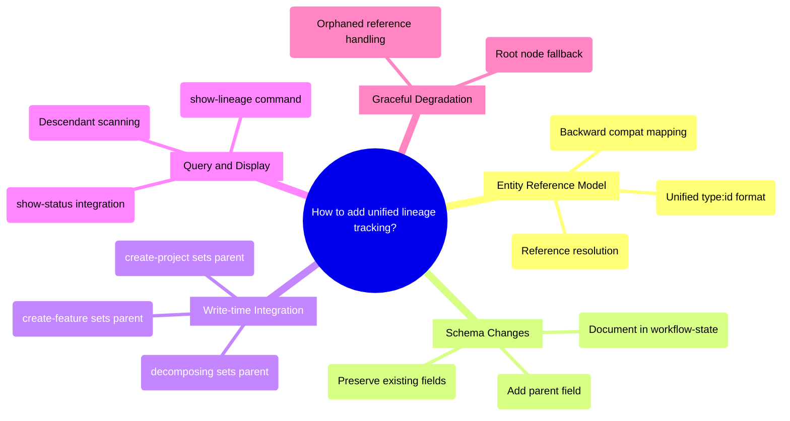

# PRD: Entity Lineage Tracking

## Status
- Created: 2026-02-27
- Last updated: 2026-02-27
- Status: Promoted
- Problem Type: Product/Feature
- Archetype: exploring-an-idea
- *Source: Backlog #00019*

## Problem Statement
iflow creates many interconnected entities across the development workflow — backlog items, brainstorms, projects, features, specs, designs, plans, and tasks — but there is no unified lineage tracking between them. When a feature is created from a project that originated from a backlog item, the full chain of origin is fragmented across ad-hoc fields (`brainstorm_source`, `backlog_source`, `project_id`) using inconsistent reference formats (file paths, numeric IDs, P-prefixed IDs). No consumption layer exists to traverse or query this lineage.

### Evidence
- Codebase analysis: 4 separate lineage fields exist in `.meta.json` using 3 different reference formats — Evidence: `plugins/iflow/skills/workflow-state/SKILL.md:283-291`
- All 27 existing features lack any `parent` or `children` fields — Evidence: `docs/features/028-enriched-documentation-phase/.meta.json`
- No lineage query command or traversal tool exists — Evidence: codebase-explorer scan of all skills and commands
- Existing `brainstorm_source` links are unidirectional — brainstorm files have no back-reference to features created from them — Evidence: `plugins/iflow/commands/create-feature.md:119-129`

## Goals
1. Establish a unified lineage model so every iflow entity can trace its origin and downstream descendants
2. Provide queryable lineage traversal — both upward (find root) and downward (find all descendants)
3. Unify the existing heterogeneous reference formats into a consistent scheme
4. Maintain backward compatibility with existing 27 features and all current workflows

## Success Criteria
- [ ] Every newly created entity has a `parent` reference (nullable for root entities)
- [ ] Lineage is traversable: given any entity, its full ancestry chain to root is derivable
- [ ] Lineage is traversable: given any entity, all descendant entities are discoverable
- [ ] A `/show-lineage` command or equivalent displays the lineage tree for any entity
- [ ] Existing features without lineage fields degrade gracefully (shown as root nodes)
- [ ] No existing workflow breaks — all current commands continue to function

## User Stories

### Story 1: Trace Feature Origin
**As a** developer **I want** to see where a feature came from **So that** I understand the full context and motivation behind it
**Acceptance criteria:**
- Given a feature ID, display its ancestry: feature <- brainstorm <- backlog item
- Display includes entity type, ID, name/slug, and creation date

### Story 2: See What a Backlog Item Produced
**As a** developer **I want** to see all work that originated from a backlog item **So that** I can track whether an idea has been fully addressed
**Acceptance criteria:**
- Given a backlog item ID, display all downstream entities (brainstorms, projects, features)
- Shows current status of each descendant

### Story 3: Project Decomposition Tree
**As a** developer **I want** to see the full tree of a project including all decomposed features **So that** I can understand project scope and progress
**Acceptance criteria:**
- Given a project ID, display all features with their status and phase
- Shows dependency relationships between features

## Use Cases

### UC-1: Query Feature Lineage
**Actors:** Developer | **Preconditions:** Feature exists with `.meta.json`
**Flow:** 1. Developer runs `/show-lineage --feature=028` 2. System reads feature's `.meta.json` 3. System traverses `parent` reference upward recursively 4. System displays ancestry chain
**Postconditions:** Full ancestry chain displayed
**Edge cases:** Feature has no parent (root entity) — display as standalone; Parent entity file missing — show "orphaned" with last-known reference

### UC-2: Entity Creation with Lineage
**Actors:** iflow commands | **Preconditions:** Parent entity exists
**Flow:** 1. User promotes brainstorm to feature via `create-feature --prd=path` 2. System writes `parent` reference on new feature `.meta.json` 3. System updates brainstorm's state to record promotion
**Postconditions:** Bidirectional link established or unidirectional parent recorded
**Edge cases:** Parent entity not found — create feature without parent reference, warn user

## Edge Cases & Error Handling
| Scenario | Expected Behavior | Rationale |
|----------|-------------------|-----------|
| Existing feature with no lineage fields | Treat as root node with no parent | Backward compatibility — 27 features must work |
| Parent entity deleted or abandoned | Preserve reference, mark as "orphaned" | Don't lose historical context |
| Circular reference attempted | Reject with error — tree constraint violated | Trees are acyclic by definition |
| Entity created outside iflow | No lineage tracked — invisible to system | Graceful degradation for manual operations |
| Brainstorm promoted to both project AND feature | First promotion sets the link; second is rejected or creates sibling | Single parent constraint |
| `brainstorm_source` uses mixed path formats | Normalize paths (resolve absolute/relative/external) before traversal | Existing data has absolute, relative, and external paths (e.g., `~/.claude/plans/`) |
| Backlog item promoted (deleted from backlog.md) | Mark as promoted instead of deleting; preserve for lineage root | Lineage tree needs persistent root entities |

## Constraints

### Behavioral Constraints (Must NOT do)
- Must NOT break any existing workflow command — Rationale: all 27 features and current development depend on existing `.meta.json` schema
- Must NOT require migration of existing `.meta.json` files to function — Rationale: backward compatibility; new fields should be additive and optional
- Must NOT create DAG structures (multi-parent) — Rationale: user explicitly requested tree structure for simplicity

### Technical Constraints
- Entity metadata is stored in flat JSON files (`.meta.json`), not a database — Evidence: `plugins/iflow/skills/workflow-state/SKILL.md`
- LLM agents write `.meta.json` statelessly across sessions — no transaction mechanism exists — Evidence: Pre-mortem advisory analysis
- Existing reference formats are heterogeneous: file paths (`brainstorm_source`), 5-digit IDs (`backlog_source`), P-prefixed IDs (`project_id`) — Evidence: `plugins/iflow/skills/workflow-state/SKILL.md:283-291`
- Backlog items are deleted from `backlog.md` on feature creation — they have no persistent `.meta.json` — Evidence: `plugins/iflow/commands/create-feature.md:133-145`. **Resolution:** Change backlog behavior from delete-on-promote to mark-as-promoted (add a `status` column or move to an "archived" section). This preserves the root entity for lineage traversal while keeping the active backlog clean.

## Requirements

### Functional
- FR-1: Define a unified entity reference format (e.g., `type:id`) usable across all entity types
- FR-2: Add `parent` field to feature `.meta.json` schema (nullable, single reference)
- FR-3: Provide lineage query capability — traverse upward to root, downward to descendants
- FR-4: Integrate lineage writing into entity creation commands (`create-feature` including `--prd` brainstorm promotion path, `create-project`, `decomposing` skill)
- FR-5: Display lineage in `/show-status` or a dedicated `/show-lineage` command
- FR-6: Handle orphaned references gracefully (parent deleted, entity abandoned)

### Non-Functional
- NFR-1: Lineage writes must not add perceptible latency to entity creation
- NFR-2: Lineage queries must complete within a single command execution (no background processing)
- NFR-3: Schema changes must be additive — existing `.meta.json` files without new fields must remain valid

## Non-Goals
- Full provenance tracking (who created what, when, with what tool) — Rationale: this is lineage (what came from what), not audit logging; backlog #00018 covers auto-logging separately
- DAG support (multiple parents per entity) — Rationale: user constraint; tree structure is simpler and sufficient for current workflows
- Cross-project lineage — Rationale: lineage is scoped to a single project workspace; cross-project is a separate concern
- Lineage for sub-feature artifacts (spec.md, design.md, plan.md) — Rationale: these are always children of their feature directory; no ambiguity exists

## Out of Scope (This Release)
- Migration tool to backfill `parent` on existing 27 features — Future consideration: could be a follow-up feature once schema is stable
- Visual lineage graph rendering (mermaid/d3) — Future consideration: `/show-lineage` starts as text-based; visualization can be added later
- Lineage-aware search ("find all features from backlog items about security") — Future consideration: requires indexing layer from backlog #00017

## Research Summary

### Internet Research
- dbt uses `parent_map` and `child_map` dictionaries in manifest.json with `<type>.<package>.<name>` node IDs for cross-project lineage — Source: https://docs.getdbt.com/reference/artifacts/manifest-json
- OpenLineage industry standard uses a `parent` facet with namespace:name pairs; adopted by Airflow, Spark, Snowflake — Source: https://openlineage.io/docs/spec/facets/
- W3C PROV-JSON separates entities from activities and relations (`wasDerivedFrom`) as first-class objects — Source: https://www.w3.org/submissions/prov-json/
- Best practice: store only first-order edges, derive full paths by traversal — avoid pre-computing ancestor/descendant paths — Source: https://atlan.com/know/data-lineage-tracking/
- Important distinction: separate *containment* edges (belongs-to) from *derivation* edges (produced-from) — Source: Informatica metadata model documentation
- DAGs are industry standard; trees are the constrained special case — Source: http://wp.doc.ic.ac.uk/theinis/wp-content/uploads/sites/63/2014/05/sigmod08.pdf

### Codebase Analysis
- 4 existing lineage fields in `.meta.json`: `brainstorm_source` (path), `backlog_source` (5-digit ID), `project_id` (P-prefixed), `depends_on_features` (array of `{id}-{slug}`) — Location: `plugins/iflow/skills/workflow-state/SKILL.md:283-291`. Note: `module` is a classification field, not a lineage reference.
- 4 top-level entity types participate in lineage: backlog item (table row), brainstorm (markdown file), project (directory + .meta.json), feature (directory + .meta.json). Sub-feature artifacts (spec, design, plan, tasks) are excluded — they are always children of their feature directory with no ambiguity — Location: `plugins/iflow/skills/workflow-state/SKILL.md:14-30`
- Actual lineage field population in existing data: `brainstorm_source` populated on ~78% of features (21/27), `backlog_source` on ~7% (2/27), `project_id`/`depends_on_features` on 0% (schema-only, no projects created yet). Effective coverage is primarily brainstorm→feature links.
- Backlog→brainstorm→feature three-tier chain exists via `*Source: Backlog #{id}*` marker pattern, regex-extracted at feature creation — Location: `plugins/iflow/commands/create-feature.md:133-145`
- Project→feature bidirectional link exists: project has `features` array, features have `project_id` — Location: `plugins/iflow/skills/decomposing/SKILL.md:265-275`
- No lineage query or traversal command exists anywhere in the codebase — Location: full skill/command scan

### Existing Capabilities
- `show-status` command already groups features under projects (Section 1.5) — relates as potential integration point for lineage display
- `workflow-state` skill defines the `.meta.json` schema — this is where new fields would be added
- `workflow-transitions` skill reads/writes `.meta.json` on every phase transition — potential enforcement point for lineage consistency
- `retrospecting` skill creates cross-feature provenance links in knowledge bank entries — demonstrates the pattern of entity cross-referencing
- `decomposing` skill writes `project_id` and `depends_on_features` on planned features — Phase B write-time integration target for setting `parent` on decomposed features

## Structured Analysis

### Problem Type
Product/Feature — user-facing capability to track and query entity lineage across the iflow workflow

### SCQA Framing
- **Situation:** iflow manages 4 top-level entity types (backlog, brainstorm, project, feature) across a structured development workflow. Four ad-hoc lineage fields already exist in `.meta.json` using three different reference formats. In practice, only `brainstorm_source` is widely populated (~78% of features); project-level fields are schema-only with no data yet.
- **Complication:** There is no unified lineage model, no consistent reference format, and no consumption layer (query/display). The existing fields are write-once and unidirectional — parent entities have no awareness of their children. This makes it impossible to answer "what originated from backlog #00019?" or "show me the full tree of project P001." Additionally, backlog items are deleted from `backlog.md` upon feature creation, breaking the lineage chain at the root.
- **Question:** How should we add unified, queryable lineage tracking to iflow entities while maintaining backward compatibility and avoiding consistency drift in a flat-file, LLM-agent-driven architecture?
- **Answer:** Implement a phased approach: (1) unify reference format to `type:id`, (2) add unidirectional `parent` field to `.meta.json` (child points to parent), (3) derive `children` lists by scanning rather than storing them, (4) build a `/show-lineage` query command.

### Decomposition
```
How should we add unified lineage tracking?
├── Entity Reference Model
│   ├── Unified type:id format (feature:028, project:P001, backlog:00019, brainstorm:20260227-054029-slug)
│   ├── Reference resolution (type:id → file path lookup)
│   └── Backward compat mapping (existing fields → type:id)
├── Schema Changes
│   ├── Add parent field to .meta.json (nullable, type:id string)
│   ├── Preserve existing fields (brainstorm_source, backlog_source, project_id) for compatibility
│   └── Document in workflow-state SKILL.md
├── Write-time Integration
│   ├── create-feature sets parent (brainstorm:slug or backlog:id)
│   ├── create-project sets parent (brainstorm:slug or backlog:id)
│   ├── decomposing sets parent on child features (project:P001)
│   └── Validation: reject if parent reference is unresolvable
├── Query & Display
│   ├── show-lineage command — traverse parent chain upward
│   ├── show-lineage --descendants — scan for children by matching parent references
│   └── show-status integration — display lineage summary in dashboard
└── Graceful Degradation
    ├── Existing features without parent → treated as root nodes
    ├── Missing parent entity → "orphaned" label
    └── No migration required — new fields are additive
```

### Mind Map


## Strategic Analysis

### Pre-mortem
- **Core Finding:** The most likely cause of failure is bidirectional reference drift — `children` arrays going out of sync with `parent` fields because LLM agents operate statelessly across sessions with no transaction mechanism.
- **Analysis:** The existing `.meta.json` schema already contains partial lineage signals using heterogeneous formats (paths, numeric IDs, P-prefixed IDs). Adding `parent` and `children` fields means adding more reference formats into this mix. Reviewing real `.meta.json` files, none carry `parent` or `children` today — the entire existing corpus will appear orphaned immediately after launch. Research into multi-agent LLM systems shows 41-86.7% failure rates attributable to stateless coordination, precisely the mechanism this feature relies on for maintaining tree consistency. Meta's lineage system post-mortem identified "insufficient consumption tools" and "noisy graph construction" as primary failure modes — they built storage but neglected verification and navigation tooling.
- **Key Risks:**
  - Bidirectional write discipline never enforced — dual writes require atomicity that flat files cannot provide
  - All 27 existing features appear orphaned on day one — violating backward-compatibility perception
  - No entity deletion or rename guard — abandoned features leave dangling references
  - No consumption layer defined — "navigable and queryable" stated but no implementation specified
  - Silent drift — referential inconsistency produces no errors, just quietly degrades
- **Recommendation:** Do not ship bidirectional references. Use unidirectional parent-only references (child stores `parent`, children derived by scanning), eliminating the dual-write consistency problem entirely. Address the backfill gap explicitly.
- **Evidence Quality:** strong

### Opportunity-cost
- **Core Finding:** The system already tracks 80-90% of the lineage relationships. Five lineage fields already exist in `.meta.json`. The gap is narrower than the problem statement implies: what is missing is upward-traversal and cross-entity tree queries, not the data itself.
- **Analysis:** A read-only `/show-lineage` command could reconstruct the full ancestry chain from existing fields (`brainstorm_source`, `backlog_source`, `project_id`, `depends_on_features`) at zero schema cost, serving as the minimum viable experiment. The `show-status` command already groups features under projects. The `roadmap.md` mermaid graph already represents the project-level dependency tree. Adding formal `parent`/`children` fields risks duplicating data that is already maintained in other fields, creating a consistency maintenance burden across six entity types that must be updated atomically by statelessly operating LLM commands.
- **Key Risks:**
  - Dual-write consistency: `children` arrays require a second write at promotion time
  - Backward compatibility requirement in tension with migration burden
  - Premature commitment: exact queries users need are unknown — building schema for assumed queries risks locking in the wrong abstraction
  - Opportunity cost: multi-session effort could instead fund features with zero existing coverage
- **Recommendation:** Build a single `/show-lineage` command first that derives lineage from existing fields. Run it on real workflows for 2-4 weeks. Only commit to schema additions after the queries it cannot answer reveal the precise data gaps.
- **Evidence Quality:** strong

## Options Evaluated

### Option 1: Unidirectional Parent References (Scan for Children)
- **Description:** Add only a `parent` field (type:id format) to `.meta.json`. Children lists are derived at query time by scanning all entities and matching on `parent` references. No `children` field stored.
- **Pros:** No dual-write consistency risk. Simple schema change. Backward compatible (missing `parent` = root node). Matches how `brainstorm_source`/`backlog_source` already work (unidirectional, child-to-parent).
- **Cons:** Children queries require scanning all entity files (O(n) per query). No instant child lookup. Performance may degrade with hundreds of entities.
- **Evidence:** Pre-mortem advisor strongly recommends this approach. dbt uses this pattern (`depends_on.nodes` on each model, `parent_map`/`child_map` derived at manifest build time).

### Option 2: Bidirectional Parent + Children References
- **Description:** Add both `parent` (type:id) and `children` (array of type:id) fields. Both written at entity creation time. Updates require dual writes.
- **Pros:** Instant lookup in both directions. Complete tree structure in each node. No scanning needed.
- **Cons:** Dual-write consistency problem — any write failure leaves the tree inconsistent. Requires updating parent entity when child is created (cross-file write). Pre-mortem analysis rates this as the primary failure mode.
- **Evidence:** Pre-mortem advisor warns against this. Informatica and Meta lineage post-mortems identify this pattern as the most common source of lineage degradation.

### Option 3: Read-Only Lineage Derivation (No Schema Change)
- **Description:** Build a `/show-lineage` command that derives the full lineage tree from existing fields (`brainstorm_source`, `backlog_source`, `project_id`, `depends_on_features`) without any schema changes.
- **Pros:** Zero migration risk. Zero consistency risk. Immediately useful. Validates whether users actually need lineage queries before committing to schema.
- **Cons:** Cannot represent lineage relationships not captured by existing fields (e.g., a brainstorm that was never promoted). Reference format remains heterogeneous. Limited to what the current 5 fields can express.
- **Evidence:** Opportunity-cost advisor recommends this as the minimum experiment. Covers 80-90% of use cases per codebase analysis.

### Option 4: Centralized Lineage Index File
- **Description:** Create a `lineage.json` manifest file (similar to dbt's `manifest.json`) containing `parent_map` and `child_map` dictionaries. Entity `.meta.json` files are unchanged. The index is rebuilt on demand from entity metadata.
- **Pros:** Single source of truth for lineage. No individual `.meta.json` changes needed. Fast lookups. Separates lineage concern from entity metadata.
- **Cons:** Index must be rebuilt when entities change — stale index risk. Another file to maintain. Not as naturally discoverable as inline `.meta.json` fields.
- **Evidence:** dbt manifest.json pattern. OpenLineage event store pattern. Trades dual-write consistency for index-staleness risk.

## Decision Matrix
| Criterion | Weight | Option 1: Unidirectional | Option 2: Bidirectional | Option 3: Read-Only | Option 4: Index File |
|-----------|--------|--------------------------|------------------------|---------------------|---------------------|
| Consistency safety | 5 | 4 | 1 | 5 | 3 |
| Query completeness | 4 | 4 | 5 | 3 | 5 |
| Implementation effort | 3 | 3 | 2 | 5 | 3 |
| Backward compatibility | 4 | 4 | 2 | 5 | 4 |
| Future extensibility | 3 | 4 | 4 | 2 | 5 |
| **Weighted Total** | | **73** | **51** | **78** | **75** |

## Recommended Approach

**Phased approach: Option 3 first, then Option 1 to close gaps.**

Both strategic advisors converge on this recommendation. The Pre-mortem advisor recommends unidirectional parent-only references (Option 1) to avoid dual-write drift. The Opportunity-cost advisor recommends starting with read-only derivation (Option 3) as the minimum experiment. The decision matrix confirms Option 3 scores highest (78), and the approaches are complementary:

**Phase A — Read-Only Lineage Derivation (Option 3):**
Build a `/show-lineage` command that derives the full ancestry chain from existing fields (`brainstorm_source`, `backlog_source`, `project_id`, `depends_on_features`). Zero schema change. Immediately useful. Validates whether users need lineage queries and which queries existing data cannot answer.

**Phase B — Unidirectional Parent Field (Option 1):**
After Phase A reveals specific data gaps, add a `parent` field (unified `type:id` format) to `.meta.json`. Children derived by scanning, not stored. Closes the remaining gap for entities whose lineage isn't captured by existing fields.

**Backlog entity preservation (prerequisite):**
Change backlog promotion from delete-on-promote to mark-as-promoted, so backlog items persist as navigable root entities in the lineage tree.

**Path format normalization (prerequisite):**
Existing `brainstorm_source` values use mixed absolute/relative/external paths. The `/show-lineage` command must normalize these before traversal.

**Phase transition gate:**
Phase A is complete when `/show-lineage` has been used on at least 5 real queries across 2+ features and at least one query type is identified that existing fields cannot answer. If no gaps are found after 4 weeks of use, Phase B is deferred indefinitely.

**Reference format coexistence:**
`type:id` coexists with existing fields during Phase A; replacement is evaluated in Phase B after observing which existing fields can be retired without data loss.

## Review History

### Review 0 (2026-02-27)
**Findings:**
- [blocker] No recommended option selected despite analysis pointing to clear phased approach (at: Options Evaluated / Decision Matrix)
- [blocker] Decision matrix arithmetic error: Option 3 scores 78, not 75 (at: Decision Matrix)
- [blocker] Backlog deletion tension unresolved — root entities deleted on promotion (at: Technical Constraints)
- [warning] "5 lineage fields" includes module which is classification, not lineage — corrected to 4 (at: Problem Statement)
- [warning] "28 features" should be 27 (no feature 001) — corrected throughout (at: multiple sections)
- [warning] "80-90% coverage" overstated — actual populated data is primarily brainstorm_source only (at: Strategic Analysis)
- [warning] brainstorm_source uses mixed path formats (absolute/relative/external) — added edge case (at: Constraints)
- [warning] "8 entity types" but only 4 participate in lineage — corrected (at: Codebase Analysis)
- [suggestion] Convert Open Question #5 (combine Options 1+3) into the explicit recommendation — done
- [suggestion] Address brainstorm ID ergonomics — added as open question
- [suggestion] Clarify FR-4 to reference actual commands — fixed

**Corrections Applied:**
- Added "Recommended Approach" section committing to phased Option 3→1 — Reason: blockers #1, #3
- Fixed Option 3 weighted total from 75 to 78 — Reason: blocker #2
- Changed "5 lineage fields" to "4" throughout, excluded module — Reason: warning #1
- Changed "28 features" to "27" throughout — Reason: warning #2
- Revised 80-90% coverage claim with actual population data — Reason: warning #3
- Added brainstorm_source path normalization edge case — Reason: warning #4
- Revised "8 entity types" to "4 top-level" with sub-feature exclusion — Reason: warning #5
- Resolved backlog deletion: mark-as-promoted instead of delete — Reason: blocker #3
- Resolved Open Question #5: phased approach is now the recommendation — Reason: suggestion #1
- Added brainstorm ID ergonomics open question — Reason: suggestion #2
- Fixed FR-4 wording to reference actual commands — Reason: suggestion #3

### Readiness Check 0 (2026-02-27)
**Result: APPROVED**
**Findings:**
- [warning] No phase transition criteria between Phase A and B — added concrete gate condition
- [warning] type:id coexistence vs replacement unresolved — added provisional answer
- [suggestion] decomposing skill missing from Existing Capabilities — added

**Corrections Applied:**
- Added phase transition gate criteria to Recommended Approach
- Added reference format coexistence answer to Recommended Approach
- Added decomposing skill to Existing Capabilities

## Open Questions
- Should the unified `type:id` format replace existing fields (`brainstorm_source`, `backlog_source`, `project_id`) or coexist alongside them?
- What is the performance threshold for entity scanning? At what entity count does scanning become unacceptable?
- Should brainstorm `.prd.md` files gain their own `.meta.json` to participate in the lineage system as first-class entities?
- How should brainstorm IDs be shortened for user ergonomics? (Current timestamp-slug format is unwieldy compared to feature:028 or project:P001)

## Next Steps
Ready for /iflow:create-feature to begin implementation.
