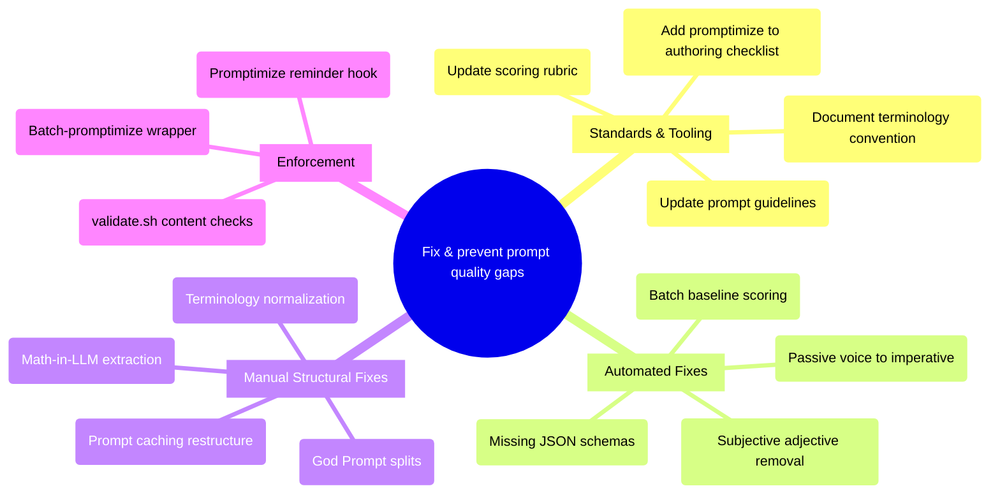

# PRD: Comprehensive Prompt Refactoring

## Status
- Created: 2026-02-28
- Last updated: 2026-02-28
- Status: Draft
- Problem Type: Product/Feature
- Archetype: improving-existing-work
- *Source: Backlog #00022*

## Problem Statement
The iflow plugin's 85 prompt files (28 commands, 29 skills, 28 agents) were written iteratively across 32 features without consistent adherence to Anthropic's prompt engineering best practices. This results in prompts that are less effective than they could be — using subjective adjectives, inconsistent terminology, passive voice, God Prompt anti-patterns, LLM-performed arithmetic, missing JSON schemas, and suboptimal content ordering for prompt caching.

### Evidence
- Codebase scan: ~28 subjective adjective instances across 15+ files (design-reviewer, code-quality-reviewer, ds-analysis-reviewer, prd-reviewer, plan-reviewer, spec-reviewer, secretary, create-specialist-team) — Evidence: `agents/design-reviewer.md:32,208,235`, `agents/code-quality-reviewer.md:38,44,49`
- Terminology inconsistency: "Stage" (42x in brainstorming), "Step" (27x in retrospecting), "Phase" in implement.md — zero documented convention distinguishing them — Evidence: `skills/brainstorming/SKILL.md:59`, `skills/retrospecting/SKILL.md`, `commands/implement.md:99`
- 2 confirmed God Prompt violations: `commands/review-ds-code.md:44-56` (5 orthogonal review axes, single dispatch), `commands/review-ds-analysis.md:48-57` (4-5 axes, single dispatch) — Evidence: Codebase analysis
- 2 math-in-LLM violations: `commands/promptimize.md:145-151` (sum/divide/multiply/round), `commands/secretary.md:469-478` (point tallying) — Evidence: Codebase analysis
- 2 reviewer dispatches with loose schemas (field names only, no typed JSON structure blocks): `review-ds-code.md:56` and `review-ds-analysis.md:56-57`. Note: `implement.md:89` is a code-simplifier dispatch (non-reviewer) and implement.md's actual reviewer dispatches (implementation-reviewer:295, code-quality-reviewer:461, security-reviewer:605) already have typed JSON schemas. `design.md:73,88` dispatches non-reviewer agents. `refresh-prompt-guidelines.md:58` already has a typed schema — Evidence: Codebase analysis (verified)
- ~12 passive voice instances in agent and skill files — Evidence: `agents/test-deepener.md` (3 hits), `agents/documentation-writer.md:73`, `skills/structuring-ds-projects/SKILL.md:69`
- Prompt caching inefficiency: 6 commands interleave static reviewer templates (~400 tokens each) with dynamic content, preventing prefix cache hits — estimated ~2,400 tokens per feature lifecycle wasted (6 commands × ~400 tokens each; exact savings depend on cache hit rates and API-level caching behavior) — Evidence: Prompt caching analysis
- Anthropic's official Claude 4 best practices explicitly warn against overthinking language ("CRITICAL: You MUST") which causes Opus 4.6 overtriggering — Evidence: https://docs.anthropic.com/en/docs/build-with-claude/prompt-engineering/claude-4-best-practices

## Goals
1. Establish and enforce measurable prompt quality standards across all 85 plugin prompt files
2. Eliminate prompt anti-patterns identified by Anthropic's best practices (God Prompts, LLM math, subjective language, missing schemas)
3. Restructure prompts for optimal prompt caching (static top, dynamic bottom)
4. Create a sustainable enforcement mechanism so quality doesn't regress with new components

## Success Criteria
- [ ] All 85 prompt files score >= 80 on promptimize's 10-dimension rubric (9 existing + cache-friendliness; new denominator is 30, threshold recalibrated accordingly)
- [ ] Zero subjective adjectives ("appropriate", "sufficient", "robust", "thorough", "proper", "adequate", "reasonable") in instruction text (defined as: SKILL.md core content, agent .md files, and command .md files — excluding description frontmatter trigger phrases, reference files under `references/`, domain-specific technical terms like "sufficient sample size" in statistics contexts, and code examples)
- [ ] Consistent terminology: one documented convention for Stage/Step/Phase usage
- [ ] All reviewer dispatch prompts include explicit JSON return schema blocks with field types
- [ ] Zero math calculations delegated to LLM (all computed by code)
- [ ] Zero God Prompt patterns (no single dispatch doing 4+ orthogonal tasks)
- [ ] All command files structured for prompt caching: static templates at top, dynamic injection points at bottom
- [ ] Agent files maintain current good caching structure (confirmed: all 28 agents already optimal)
- [ ] Enforcement gate exists: either pre-commit hook or authoring checklist that triggers promptimize on component edits
- [ ] validate.sh extended with at least one content-level check (e.g., subjective adjective grep)

## User Stories

### Story 1: Plugin Developer Authors New Component
**As a** plugin developer **I want** clear, enforced prompt writing standards **So that** every new component follows Anthropic best practices from creation, without manual review.
**Acceptance criteria:**
- component-authoring.md references promptimize as the quality gate
- A hook or checklist reminds author to run promptimize on new/edited component files
- Scoring rubric includes prompt caching structure as a dimension

### Story 2: Claude Model Interprets Refactored Prompts
**As** Claude (the model interpreting prompts) **I want** concrete, imperative instructions with consistent terminology and explicit output schemas **So that** I produce more reliable, predictable outputs.
**Acceptance criteria:**
- All instructions use imperative mood ("Return JSON" not "JSON should be returned")
- All terminology is consistent within and across files
- All reviewer dispatch prompts include typed JSON schemas
- No ambiguous subjective qualifiers requiring interpretation

### Story 3: Developer Runs Batch Quality Audit
**As a** plugin developer **I want** to run promptimize across all 85 files in batch **So that** I can measure current baseline quality and track improvement.
**Acceptance criteria:**
- A batch-promptimize script or wrapper exists that iterates all component files
- Per-file scores are aggregated into a summary report
- Files below threshold (< 80) are flagged for priority refactoring

## Use Cases

### UC-1: Batch Promptimize Execution
**Actors:** Developer | **Preconditions:** All 85 component files exist, promptimize skill is current (post-feature-032)
**Flow:**
1. Developer invokes batch-promptimize script
2. Script iterates: 28 agents, 29 skills, 28 commands
3. For each file: invoke `/iflow:promptimize <path>`
4. Collect scores and issues per file
5. Generate summary report with aggregate stats
**Postconditions:** Per-file reports exist; summary shows mean/median/min scores
**Edge cases:** File with malformed frontmatter → promptimize should warn and skip, not crash

### UC-2: Prompt Caching Restructure
**Actors:** Developer | **Preconditions:** Files identified for restructuring
**Flow:**
1. For each command file: identify static sections (reviewer templates, routing tables, rules, schemas)
2. Move static sections to named template blocks at top of file
3. Replace inline templates with references + dynamic injection points at bottom
4. Verify file still produces identical behavior via workflow test
**Postconditions:** Static content precedes all dynamic content in every command file
**Edge cases:** File where static and dynamic are deeply interleaved (secretary.md) → may need structural redesign, not just reordering

### UC-3: Terminology Normalization
**Actors:** Developer | **Preconditions:** Terminology convention is documented. Scope includes all 85 prompt files plus README and documentation files that reference Stage/Step/Phase terminology
**Flow:**
1. Establish convention: "Stage" for top-level workflow phases within skills, "Step" for sub-items within stages, "Phase" only for workflow-state phase names
2. Grep all files for mismatches
3. Apply find-and-replace with manual verification of cross-file references
4. Verify no hook scripts hard-reference phase names by string
**Postconditions:** Consistent terminology across all 85 files
**Edge cases:** ~640 instances of Stage/Step/Phase across ~70 files including READMEs → need automated sweep with manual spot-check

## Edge Cases & Error Handling
| Scenario | Expected Behavior | Rationale |
|----------|-------------------|-----------|
| Promptimize rewrites a command description that breaks secretary routing | Validate routing after each batch of changes by running secretary test scenarios | Routing behavior is encoded in text; description changes can silently break activation |
| God Prompt split changes agent dispatch contract | Manual review required for all God Prompt splits; do not auto-accept | Agent receives partial instructions if dispatch contract is changed |
| Terminology change breaks hook script reference | Grep hook scripts for hard-coded phase/step/stage strings before normalizing | Hook scripts reference workflow state by string matching |
| Batch run produces 85 diffs too large to review | Group files by risk tier; review high-risk (commands with dispatch templates) manually, low-risk (adjective removals) in bulk | Different change types have different blast radii |
| Prompt caching restructure changes model behavior | A/B test 5 pilot files through real workflow execution before and after restructuring | Content ordering can affect model attention and output quality |

## Constraints

### Behavioral Constraints (Must NOT do)
- Must NOT break any existing workflow functionality — Rationale: 85 files touched means high regression surface
- Must NOT build a parallel prompt quality system outside promptimize — Rationale: Self-cannibalization advisor confirmed promptimize is the right tool; parallel tracks create divergent quality standards
- Must NOT auto-accept God Prompt splits in YOLO mode — Rationale: Structural changes to agent dispatch contracts require human verification
- Must NOT change agent file structure — Rationale: All 28 agents already follow optimal caching order; restructuring adds risk with no gain

### Technical Constraints
- promptimize scoring rubric does not currently include a "cache-friendliness" dimension — Evidence: scoring-rubric.md analysis
- No behavioral regression test harness exists; validate.sh checks structure only — Evidence: Feasibility analysis
- Batch-promptimize wrapper does not exist yet — Evidence: Skill searcher analysis
- Minimum 1,024 tokens required for prompt cache breakpoint to activate — Evidence: https://platform.claude.com/docs/en/build-with-claude/prompt-caching

## Requirements

### Functional
- FR-1: Update scoring-rubric.md to add "cache-friendliness" dimension (static-top/dynamic-bottom ordering). Also update promptimize skill and command to support 10 dimensions: add cache-friendliness to canonical dimension list, update validator to expect 10 entries, change score denominator from 27 to 30
- FR-2: Update prompt-guidelines.md to fill 3 of 5 identified gaps: tool use prompting, system vs human turn placement, and negative framing guidance. Defer multimodal (out of scope per Non-Goals) and prefill (plugin does not use prefill patterns)
- FR-3: Create batch-promptimize script that iterates all 85 component files and produces aggregate report
- FR-4: Restructure 6 command files for prompt caching (specify, design, create-plan, create-tasks, implement, secretary) — hoist static templates to top
- FR-5: Restructure 3 skill files for prompt caching (brainstorming, implementing, retrospecting)
- FR-6: Add explicit typed JSON return schema blocks to 2 reviewer dispatch prompts (review-ds-code.md, review-ds-analysis.md) that currently list field names without structure or type definitions. Note: implement.md:89 is a code-simplifier dispatch (non-reviewer); implement.md's actual reviewer dispatches already have typed schemas
- FR-7: Fix 2 math-in-LLM violations: (a) promptimize score calculation — move sum/divide/round to orchestrating code; (b) secretary complexity scoring — evaluate whether point tallying is simple enough for inline LLM use or should be extracted to code (judgment call: 5-signal additive counting is borderline; document decision either way)
- FR-8: Split 2 God Prompt commands (review-ds-code, review-ds-analysis) into chained dispatches
- FR-9: Remove subjective adjective instances in instruction text (estimated ~28 based on sampling; exact count determined by batch promptimize audit); replace with measurable criteria. Instruction text boundary: SKILL.md core content, agent .md files, command .md files — excludes reference files, domain-specific technical terms, and code examples
- FR-10: Normalize Stage/Step/Phase terminology across all files per documented convention
- FR-11: Fix passive voice instances identified by batch promptimize audit (estimated ~12 based on sampling of test-deepener.md, documentation-writer.md, structuring-ds-projects SKILL.md); exact count to be determined during Phase 3
- FR-12: Add promptimize reminder to component-authoring.md quality checklist
- FR-13: Add at least one content-level check to validate.sh (subjective adjective grep)
- FR-14: Document terminology convention (Stage/Step/Phase) in component-authoring.md

### Non-Functional
- NFR-1: Batch-promptimize runtime < 60 minutes for all 85 files (parallel execution with max 5 concurrent; threshold accounts for Opus model latency per file)
- NFR-2: All changes pass validate.sh without regressions
- NFR-3: 5-file pilot validates approach before full batch (1 agent, 1 command, 1 skill, 2 God Prompt commands)

## Non-Goals
- Building a prompt testing/CI pipeline — Rationale: Useful but significantly larger scope; capture as separate backlog item
- Rewriting prompt logic or workflows — Rationale: This is a quality/clarity refactor, not a functionality change
- Covering hook shell scripts in the audit — Rationale: Hooks are bash, not prompt text; different quality criteria apply
- Adding multimodal prompting guidance — Rationale: Plugin doesn't use image inputs; out of scope for this refactor

## Out of Scope (This Release)
- Automated CI gate for promptimize scores — Future consideration: when CI infrastructure exists
- Behavioral regression test harness for prompts — Future consideration: needed but larger engineering effort
- Score history tracking over time — Future consideration: useful for monitoring quality trends
- Batch-promptimize integration with git diff (auto-detect recently modified files) — Future consideration: nice-to-have for incremental auditing

## Research Summary

### Internet Research
- Anthropic Claude 4 Best Practices: XML tags are the official recommendation for structure; chain complex prompts instead of God Prompts; use tools for deterministic tasks; "CRITICAL: You MUST" language causes Opus 4.6 overtriggering — replace with "Use X when..." — Source: https://docs.anthropic.com/en/docs/build-with-claude/prompt-engineering/claude-4-best-practices
- Context Engineering: "Context is a finite resource with diminishing marginal returns"; system prompts should target the 'right altitude'; organize with XML or Markdown headers; avoid exhaustive edge case lists — Source: https://www.anthropic.com/engineering/effective-context-engineering-for-ai-agents
- Building Effective Agents: "The most successful implementations weren't using complex frameworks — they were building with simple, composable patterns"; Evaluator-Optimizer pattern needs explicit pass/fail criteria; tool documentation matters more than overall prompt — Source: https://www.anthropic.com/research/building-effective-agents
- Multi-Agent Research System: Orchestrator prompts need strategic framing and scaling heuristics; worker prompts need clear objective, explicit output format, tool guidance, task boundaries — vague worker instructions caused duplication — Source: https://www.anthropic.com/engineering/multi-agent-research-system
- Prompt caching: static content must precede dynamic; cache reads cost 0.1x base price (90% discount); minimum 1,024 tokens per breakpoint — Source: https://platform.claude.com/docs/en/build-with-claude/prompt-caching
- Claude Code Best Practices: CLAUDE.md should be concise — "for each line, ask: 'Would removing this cause Claude to make mistakes?'"; hooks for actions that must happen every time; skills for domain knowledge loaded on demand; verification is the single highest-leverage pattern — Source: https://code.claude.com/docs/en/best-practices
- Concrete language over subjective adjectives: industry consensus — replace "appropriate indentation" with "2 spaces for code indentation"; replace "sufficient detail" with "include: objective, affected files, rationale in 3 bullet points" — Source: https://www.prompthub.us/blog/prompt-engineering-for-ai-agents

### Codebase Analysis
- Subjective adjectives: ~28 instances across 15 files; highest density in design-reviewer (3), code-quality-reviewer (3), ds-analysis-reviewer (3) — Location: `agents/design-reviewer.md:32,208,235`
- Terminology: "Stage" dominant in brainstorming (42x), "Step" dominant in retrospecting (27x), commands use "Step", no documented convention — Location: `skills/brainstorming/SKILL.md:59`
- validate/verify/check used interchangeably for identical gate operations — Location: `skills/workflow-transitions/SKILL.md:32`, `skills/finishing-branch/SKILL.md:27`
- "Phase vs Chain": NOT a collision in validation contexts; "Chain" is crypto-domain only — Location: resolved via codebase search
- God Prompts: review-ds-code.md (5 tasks), review-ds-analysis.md (4-5 tasks) — Location: `commands/review-ds-code.md:44-56`
- Math-in-LLM: promptimize score (sum/divide/multiply/round), secretary complexity (point tallying) — Location: `commands/promptimize.md:145-151`
- HTML comments: Only 1 benign instance in generate-docs.md; `<change>` XML tags used correctly everywhere else — Location: `commands/generate-docs.md:36`
- Loose JSON schemas: 2 reviewer dispatches with field names but no typed JSON structure blocks (review-ds-code.md:56, review-ds-analysis.md:56-57); implement.md:89 is a code-simplifier dispatch (non-reviewer) and its actual reviewer dispatches already have typed schemas; design.md dispatches non-reviewer agents; refresh-prompt-guidelines.md has typed schema — Location: `commands/review-ds-code.md:56`
- Prompt caching: Agents excellent (all static, zero dynamic leakage); 6 commands need restructuring (specify, design, create-plan, create-tasks, implement, secretary); 3 skills need restructuring (brainstorming, implementing, retrospecting) — Location: comprehensive caching analysis
- ~2,400 tokens per feature lifecycle wasted on re-rendered static reviewer templates (6 commands × ~400 tokens; actual savings vary with cache hit rates) — Location: prompt caching analysis

### Existing Capabilities
- `promptimize` skill + command: 9-dimension scoring rubric with Phase 1 (grading) and Phase 2 (rewriting), just redesigned in feature 032 — How it relates: the primary tool for executing this refactoring
- `prompt-guidelines.md`: 10 core principles with source citations, plugin-specific patterns, anti-patterns — How it relates: the scoring standard; has 5 identified gaps (no multimodal, no tool use, no system vs human turn, no prefill, no negative framing); 3 in scope for this feature (tool use, system vs human turn, negative framing), 2 deferred (multimodal — out of scope, prefill — not used by plugin)
- `scoring-rubric.md`: Pass/Partial/Fail behavioral anchors for 9 dimensions — How it relates: needs new "cache-friendliness" dimension
- `refresh-prompt-guidelines` command: auto-updates guidelines via web research — How it relates: keeps scoring standard current
- `writing-skills` skill: TDD-driven authoring with anthropic-best-practices.md and persuasion-principles.md references — How it relates: parallel system not integrated with promptimize; could cross-reference
- `component-authoring.md`: structural guide with naming, token budgets, activation optimization — How it relates: does not reference promptimize or prompt quality criteria; gap in authoring workflow

## Structured Analysis

### Problem Type
Product/Feature — this is a quality improvement to user-facing plugin components (prompts are the "product" that Claude consumes)

### SCQA Framing
- **Situation:** The iflow plugin has 85 prompt files across 28 commands, 29 skills, and 28 agents, serving as the instruction set for Claude's workflow execution. The plugin also has a `promptimize` tool (recently redesigned in feature 032) that scores and rewrites prompts against a 9-dimension rubric.
- **Complication:** The prompts were written iteratively without consistent quality standards. Anthropic's Claude 4 best practices reveal multiple anti-patterns: subjective adjectives that Claude must interpret, God Prompts that overload single dispatches, LLM-performed arithmetic, missing output schemas, and suboptimal content ordering that wastes prompt cache tokens. The authoring guide does not enforce quality and promptimize is not integrated into the authoring workflow.
- **Question:** How should we systematically identify, fix, and prevent prompt quality gaps across all 85 plugin files while maximizing prompt caching efficiency?
- **Answer:** Run a phased refactoring: (1) update the scoring rubric and guidelines to cover gaps including cache-friendliness, (2) pilot-test on 5 high-risk files, (3) batch-run promptimize across all 85 files, (4) manually address structural changes (God Prompt splits, caching restructure), (5) add enforcement gates so quality doesn't regress.

### Decomposition
```
How to systematically fix and prevent prompt quality gaps?
├── Standards & Tooling (What's the quality bar?)
│   ├── Update scoring rubric (add cache-friendliness dimension)
│   ├── Update prompt guidelines (fill 3 of 5 identified gaps)
│   ├── Document terminology convention (Stage/Step/Phase)
│   └── Add promptimize to component-authoring.md checklist
├── Automated Fixes (What can promptimize handle?)
│   ├── Subjective adjective removal (~28 instances)
│   ├── Passive voice → imperative mood (~12 instances)
│   ├── Typed JSON schema addition (2 reviewer dispatches)
│   └── Batch scoring to establish baseline
├── Manual Structural Fixes (What needs human judgment?)
│   ├── God Prompt splits (2 DS reviewer commands)
│   ├── Math-in-LLM extraction (2 violations)
│   ├── Prompt caching restructure (6 commands, 3 skills)
│   └── Terminology normalization (~640 instances, ~70 files)
└── Enforcement (How to prevent regression?)
    ├── Add promptimize reminder hook on component edits
    ├── Add content-level check to validate.sh
    └── Create batch-promptimize wrapper for periodic audits
```

### Mind Map


## Strategic Analysis

### First-principles
- **Core Finding:** The backlog item treats prompt quality as a text-cleanup task, but prompt quality is only meaningful relative to measurable behavioral outcomes — and no evaluation harness exists to verify whether the refactoring actually changes model behavior.
- **Analysis:** The assumption that subjective adjectives and non-imperative mood degrade prompt quality is accepted because familiar, not because unambiguously proven. Evidence from The Prompt Report (MDPI 2024) shows the highest-leverage interventions are few-shot examples and additional context — not grammar mood or synonym replacement. However, Anthropic's Claude 4 best practices explicitly warn against subjective language and "CRITICAL/MUST" overtriggering on Opus 4.6, lending direct evidence. The deeper problem is that the component authoring guide does not prohibit these patterns — fixing 85 files without fixing the authoring standard is analogous to mopping a leaking roof. The `comprehensive_feedback_report.md` referenced in the backlog does not exist, meaning the original scope was undefined.
- **Key Risks:**
  - Refactoring 85+ files with no before/after behavioral test creates unknown regression risk
  - Real defect is the authoring process, not the authored files — fixing files without fixing the guide means the problem regenerates
  - Scope creep: 85+ files, no stopping criterion beyond "zero subjective adjectives"
- **Recommendation:** Automate promptimize as a gate in the authoring workflow first. Limit retroactive refactoring to files scoring < 80 on the rubric. Measure actual output quality before and after on at least 5 representative files.
- **Evidence Quality:** strong

### Self-cannibalization
- **Core Finding:** The comprehensive refactoring effort (backlog 00022) and the promptimize redesign (backlog 00023 → feature 032) describe the same root problem from two angles — 00023 was promoted and resolved; 00022 was not updated to reflect this.
- **Analysis:** Feature 032 shipped today (2026-02-28) and already implements Anthropic best practices: two-phase grading/rewriting, XML `<change>` tags, score calculation outside the LLM, anchor-based partial acceptance. Running the refactoring independently of promptimize would create a parallel, ad-hoc quality pass that bypasses the exact tool built for this job. After a manual refactor, promptimize would still exist and could re-score the same files, potentially flagging different issues — two quality tracks with no single source of truth. The `refresh-prompt-guidelines` command provides a living, updateable standard; a manual one-time refactor freezes quality to current guidelines with no update path.
- **Key Risks:**
  - Two quality gates with no convergence guarantee
  - Missing feedback report means manual refactoring has no documented scope
  - YOLO-mode batch on 85+ files risks silent quality regressions
- **Recommendation:** Do not build a parallel manual refactoring track. Execute the refactoring by running `/iflow:promptimize` on each file, using the tool's built-in approval workflow. Reframe backlog 00022 as a batch-execution task against the existing promptimize tool.
- **Response:** The PRD retains broader scope than "batch-run promptimize only" because three categories of work cannot be automated by promptimize: (1) God Prompt structural splits require dispatch contract redesign, (2) prompt caching restructure requires content reordering beyond promptimize's current rubric, and (3) enforcement gates (hooks, validate.sh) are infrastructure changes. The batch-promptimize approach is adopted for FR-9/FR-11 (word-level fixes) per this advisor's recommendation; structural and infrastructure work is scoped separately in Phase 4-5.
- **Evidence Quality:** strong

### Adoption-friction
- **Core Finding:** The batch refactoring fixes 85+ files in one sweep, but without a continuous enforcement mechanism the new conventions will drift back within a few feature cycles because no new habit loop is created.
- **Analysis:** The learning curve is a gentle slope: 4 core conventions (imperative mood, static-top/dynamic-bottom, JSON schemas on reviewers, no math in LLM) spread across 2 reference files. The promptimize scoring report provides variable reward (score + strengths + issues) that creates a self-reinforcing habit loop per Eyal's Hook model. The batch run IS the migration — it eliminates cold-turkey adoption by handling historical debt automatically. However, the critical gap is enforcement: there is no mechanism (hook, validate.sh rule, or CI check) that enforces promptimize is run before committing a new or modified component. Research on continuous refactoring confirms that one-time batch cleanups without enforcement revert.
- **Key Risks:**
  - No pre-commit enforcement gate — highest abandonment risk
  - Nine-dimension mental model is invisible until tool is run — no authoring-time checklist
  - YOLO_MODE auto-accept can silently apply low-quality suggestions
  - Sole-author context removes peer pressure as adoption driver
- **Recommendation:** Embed a promptimize reminder in component-authoring.md checklist. Add a PostToolUse hook on Write/Edit targeting component files that emits an advisory message to run promptimize.
- **Evidence Quality:** moderate

### Feasibility
- **Core Finding:** The refactor is technically feasible but the critical unknown is whether promptimize's rewrite mechanism is reliable enough for automated batch mode without per-file human review — and there is no regression harness for prompt routing behavior.
- **Analysis:** Scope is confirmed at exactly 85 files. The promptimize command supports direct-path argument and YOLO mode, making a batch wrapper mechanically feasible. Batch runtime estimated at 42-127 minutes sequential, 10-25 minutes parallel. validate.sh catches structural regressions but is blind to prompt instruction content. Subjective adjective removal (~28 instances) and passive voice fixes are low-risk word-level changes safe for batch automation. God Prompt splits and prompt caching restructure are high-risk structural changes requiring manual review. Prompt caching restructuring is not covered by any current promptimize scoring dimension.
- **Key Risks:**
  - [Low cost] Adjective removal, passive voice, math fixes — safe for batch
  - [Medium cost] Missing JSON schemas — additive, reviewable in single pass
  - [Medium cost] Terminology normalization — ~640 instances, cross-file reference risk
  - [High cost] God Prompt splits — dispatch contract must be manually verified
  - [High cost] Caching restructure — per-file judgment, not in current rubric
  - [Highest cost] Zero behavioral regression coverage
- **Recommendation:** 5-file pilot batch first (1 agent, 1 command, 1 skill, 2 God Prompt commands) to validate promptimize reliability at batch scale. Scope prompt caching restructure separately and gate behind rubric update.
- **Evidence Quality:** strong

## Current State Assessment
The plugin has 85 prompt files written across 32 features without consistent quality standards. The `promptimize` tool was just redesigned (feature 032, shipped 2026-02-28) with Anthropic best practices built in. The tool exists but is not integrated into the authoring workflow — developers can commit components without ever running it. The `prompt-guidelines.md` is 4 days old (not stale) but has 5 identified content gaps. The `scoring-rubric.md` covers 9 dimensions but lacks cache-friendliness. The `component-authoring.md` does not reference promptimize.

## Change Impact
- **85 prompt files touched** — all commands, skills, and agents in the plugin
- **Scoring rubric updated** — adds 10th dimension (cache-friendliness)
- **Prompt guidelines updated** — fills 3 of 5 identified content gaps (tool use, system vs human turn, negative framing); 2 deferred
- **Component authoring guide updated** — adds promptimize reference and terminology convention
- **validate.sh extended** — new content-level check
- **New batch-promptimize wrapper** — enables periodic quality audits
- **6 commands restructured** for prompt caching (specify, design, create-plan, create-tasks, implement, secretary)
- **3 skills restructured** for prompt caching (brainstorming, implementing, retrospecting)
- **2 commands split** from God Prompt to chained dispatch (review-ds-code, review-ds-analysis)

## Migration Path
1. **Phase 1: Standards Update** — Update scoring rubric (add cache-friendliness), prompt guidelines (fill gaps), component-authoring.md (add promptimize reference), document terminology convention
2. **Phase 2: Pilot** — Run promptimize on 5 named files: design-reviewer.md (3 subjective adjective instances), secretary.md (routing risk + prompt caching), brainstorming/SKILL.md (40 Stage references + caching restructure), review-ds-code.md (God Prompt split), review-ds-analysis.md (God Prompt split). Validate results via workflow execution and behavioral comparison (run 2-3 representative tasks through the refactored prompts and verify output quality matches or exceeds baseline). secretary.md must be manually reviewed and tested in isolation — verify routing for at least 5 representative user prompts after refactoring. Measure before/after scores
3. **Phase 3: Batch Execution** — Create batch-promptimize wrapper; run across all 85 files in tiers (low-risk word changes first, structural changes last); review and accept changes per tier
4. **Phase 4: Manual Structural Fixes** — God Prompt splits (2 commands), prompt caching restructure (6 commands, 3 skills), terminology normalization (with cross-file reference verification)
5. **Phase 5: Enforcement** — Add promptimize reminder hook, extend validate.sh, update authoring checklist

## Review History

### Review 0 (2026-02-28)
**Findings:**
- [warning] Evidence line inflates JSON schema count: claims 6 missing schemas but design.md dispatches non-reviewer agents and refresh-prompt-guidelines.md already has typed schema; actual count is 3 (at: Evidence section, FR-6)
- [warning] Success Criteria ≥80 threshold ambiguous: adding 10th dimension changes denominator from 27 to 30, affecting threshold meaning (at: Success Criteria line 1)
- [warning] FR-7 math-in-LLM complexity understated: secretary's 5-signal additive counting is borderline for LLM; needs implementation approach notes (at: FR-7)
- [warning] Token savings estimate inflated: "4,000 tokens per feature lifecycle" but 400×6=2,400 (at: Evidence section, Codebase Analysis)
- [suggestion] Open Question 5 needs proposed direction (at: Open Questions)
- [suggestion] FR-4 selection criteria undocumented (noted but not actioned)
- [suggestion] Phase 2 should include behavioral testing (at: Migration Path)
- [suggestion] NFR-1 trivially satisfiable at 30 min (at: NFR-1)

**Corrections Applied:**
- Fixed JSON schema count from 6 to 3 across Evidence, FR-6, Codebase Analysis, and decomposition tree — Reason: finding 1
- Clarified ≥80 threshold applies to 10-dimension rubric with recalibrated denominator of 30 — Reason: finding 2
- Added implementation approach notes to FR-7 with secretary judgment call flagged — Reason: finding 3
- Corrected token savings from 4,000 to ~2,400 with methodology note — Reason: finding 4
- Added proposed direction to Open Question 5 — Reason: suggestion 1
- Added behavioral testing to Phase 2 pilot — Reason: suggestion 3
- Updated NFR-1 runtime threshold from 30 to 60 minutes with justification — Reason: suggestion 4

### Review 1 (2026-02-28)
**Findings:**
- [blocker] implement.md:89 is a code-simplifier dispatch (non-reviewer), not a missing reviewer schema. True count is 2 missing typed schemas, not 3. Propagates to FR-6, Evidence, Codebase Analysis, decomposition tree (at: Evidence, FR-6, decomposition)
- [warning] "missing JSON schema" overstates gap — review-ds-code and review-ds-analysis have field names, just lack typed JSON structure blocks (at: FR-6, Evidence)
- [warning] Subjective adjective count boundary undefined — "instruction text" not defined; grep returns 60+ matches including domain-appropriate terms (at: Evidence, FR-9, Success Criteria)
- [warning] FR-2 says "identified gaps" but only names 3 of 5; 2 deferred but not explained (at: FR-2, Existing Capabilities)
- [warning] Passive voice ~12 count thin on evidence; only 5 specific line refs (at: FR-11)
- [warning] Terminology count 666 vs 639 mismatch (~4%) (at: UC-3, decomposition)
- [warning] secretary.md routing regression not explicitly handled in pilot (at: Migration Path Phase 2)
- [warning] Adding 10th dimension requires updating promptimize skill/command too — no FR covers this (at: FR-1, Success Criteria)
- [suggestion] Name specific pilot files (at: Phase 2)
- [suggestion] Open Question 2 needs proposed direction (at: Open Questions)
- [suggestion] URL contains suspicious double '/docs/en/docs/' path (at: Evidence, Research Summary)

**Corrections Applied:**
- Fixed JSON schema count from 3 to 2, removed implement.md:89 reference, reworded as "loose schemas" (field names without typed blocks) — Reason: blocker + warning 1-2
- Defined "instruction text" boundary in Success Criteria and FR-9 (excludes reference files, domain terms, code examples) — Reason: warning 3
- Clarified FR-2 scope: 3 of 5 gaps in scope, 2 deferred with rationale — Reason: warning 4
- Updated FR-11 to acknowledge exact count determined by batch audit — Reason: warning 5
- Corrected terminology count from 666 to ~640 — Reason: warning 6
- Named secretary.md as pilot command in Phase 2 with explicit routing test requirement — Reason: warning 7
- Expanded FR-1 to include promptimize skill/command updates (10 dimensions, new validator, denominator 30) — Reason: warning 8
- Named all 5 pilot files explicitly in Phase 2 — Reason: suggestion 1

### Review 2 (2026-02-28)
**Findings:**
- [warning] Decomposition tree says "fill 5 identified gaps" but FR-2 and Change Impact correctly say "3 of 5" — residual from Review 1 corrections not propagated (at: Decomposition tree)
- [suggestion] "Stage" count says "42x" but grep returns ~40; minor variance (~5%) (at: Evidence)

**Corrections Applied:**
- Fixed decomposition tree from "fill 5" to "fill 3 of 5" — Reason: warning 1
- Stage count variance (42x vs ~40x) accepted as immaterial (~5% methodological variance from different grep boundary modes) — no correction applied

### Readiness Review 0 (2026-02-28)
**Findings:**
- [warning] Open Question 3 has no proposed direction (caching restructure: promptimize vs manual pass) (at: Open Questions)
- [warning] Open Question 4 has no proposed direction (behavioral testing level) (at: Open Questions)
- [warning] Review 2 Stage count suggestion left without explicit resolution in audit trail (at: Review History)
- [warning] Self-cannibalization advisor's narrowing recommendation unrebutted (at: Strategic Analysis)
- [suggestion] UC-3 scope unclear whether READMEs included in terminology normalization (at: UC-3)

**Corrections Applied:**
- Added proposed direction to Open Question 3 (manual pass in Phase 4, promptimize catches future issues) — Reason: warning 1
- Added proposed direction to Open Question 4 (manual workflow execution per Non-Goals) — Reason: warning 2
- Added explicit audit trail entry for Stage count variance acceptance — Reason: warning 3
- Added Response field to Self-cannibalization section explaining retained scope — Reason: warning 4

### Readiness Review 1 (2026-02-28)
**Findings:**
- [warning] UC-3 README inclusion stated only in edge case, not in flow/preconditions (at: UC-3)
- [suggestion] FR-4/FR-5 selection rationale implicit (at: FR-4, FR-5)
- [suggestion] FR-9 should cross-reference 3 high-priority reviewer agents from Open Question 5 (at: FR-9)

**Corrections Applied:**
- Added README/documentation scope to UC-3 Preconditions — Reason: warning 1

## Open Questions
- What is the exact terminology convention for Stage/Step/Phase? Proposed: "Stage" for top-level divisions in skills, "Step" for sub-items within stages, "Phase" reserved for workflow-state phase names (brainstorm, specify, design, plan, tasks, implement, finish)
- Should the batch-promptimize wrapper be a new command or a shell script? Trade-off: command provides YOLO mode and approval UI; shell script is simpler and can parallelize. Proposed direction: shell script wrapper that invokes `/iflow:promptimize` per file with parallel execution — shell scripts manage concurrency natively, YOLO mode can be passed as argument, and avoids the recursive problem of running a command that scores commands
- Should the prompt caching restructure (moving static templates to top of files) be done by promptimize or as a separate manual pass? The current rubric does not cover caching order. Proposed direction: separate manual pass in Phase 4 after the rubric update (FR-1), since promptimize cannot score or guide a dimension it does not yet support; once the cache-friendliness dimension is live, future caching issues can be caught by promptimize
- What level of behavioral testing is acceptable for the pilot? Manual workflow execution vs automated scenario testing? Proposed direction: manual workflow execution — run 2-3 representative tasks through each piloted file and compare output quality against baseline. Automated testing is out of scope per Non-Goals (no CI pipeline)
- Should the "Be thorough" copy-paste across 3 reviewer agents (prd-reviewer, plan-reviewer, spec-reviewer) be replaced with what? Need concrete replacement criteria per reviewer type. Proposed direction: replace each instance with domain-specific evaluation criteria (e.g., prd-reviewer checks evidence citations and measurability; plan-reviewer checks dependency ordering and risk identification; spec-reviewer checks testability and boundary conditions)

## Next Steps
Ready for /iflow:create-feature to begin implementation.
