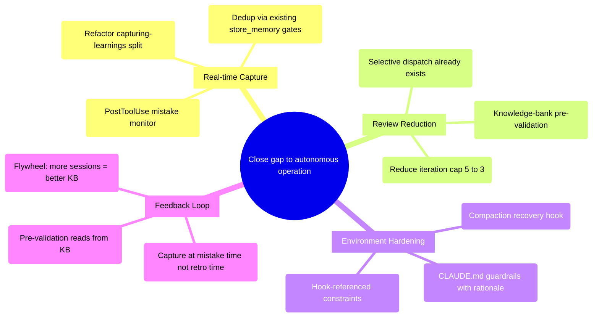

# PRD: Insights-Driven Workflow & Environment Hardening

## Status
- Created: 2026-04-06
- Last updated: 2026-04-06
- Status: Draft
- Problem Type: Technical/Architecture
- Archetype: improving-existing-work

## Problem Statement
pd's development workflow and Claude Code environment have measurable friction points identified through 111 sessions of usage data (March-April 2026). Two systemic gaps remain unaddressed: (1) knowledge capture is reactive rather than proactive — mistakes are only captured during post-feature retrospectives or when the model happens to notice, missing real-time correction opportunities; (2) the Claude Code environment lacks behavioral guardrails that would prevent known failure patterns from recurring.

### Evidence
- Claude Code Insights report: 44 buggy code instances, 33 wrong-approach corrections across 111 sessions — Evidence: Insights analysis (March 7 - April 5, 2026)
- 3-5 reviewer iterations per phase average, with iteration cap set at 5 — Evidence: `plugins/pd/commands/implement.md:248`
- No PostToolUse hook exists for memory capture — Evidence: `plugins/pd/hooks/hooks.json:97-116` (only PostToolUse hooks are for EnterPlanMode/ExitPlanMode)
- `capturing-learnings` skill is purely declarative — model must notice and act — Evidence: `plugins/pd/skills/capturing-learnings/SKILL.md:25-56`
- CLAUDE.md lacks YOLO persistence rules, reviewer iteration caps, and SQLite lock protocol — Evidence: Codebase verification (2026-04-06)
- SQLite self-healing and pre-session cleanup are already addressed (WAL mode, doctor auto-fix, cleanup-locks.sh) — Evidence: Codebase verification confirmed these are implemented

## Goals
1. Close the real-time knowledge capture gap so mistakes are captured at the moment they occur, not deferred to post-feature retrospectives
2. Reduce reviewer iteration cycles by front-loading validation with knowledge-bank-grounded pre-checks
3. Harden the Claude Code environment with CLAUDE.md guardrails and hook-based enforcement for known failure patterns
4. Establish a compounding feedback loop where each session's captured learnings improve all future sessions

## Success Criteria
- [ ] PostToolUse tool-failure monitor hook fires on Bash/Edit/Write failures, capturing learnings via `semantic_memory.writer` CLI
- [ ] `capturing-learnings` skill retains user-correction detection (conversational triggers) without overlap with hook
- [ ] Average reviewer iterations per phase reduced (baseline: 3-5 → target: 1-2, measured over next 10 features). Primary mechanism: KB-grounded pre-validation replacing first iteration + iteration cap reduced to 3. Note: iteration count also depends on implementation quality, which this PRD does not directly control.
- [ ] CLAUDE.md includes behavioral guardrails for YOLO persistence, reviewer caps, and SQLite protocol in rationale-first format (verified by audit)
- [ ] Knowledge bank entries from `source="session-capture"` grow by 20%+ within 30 days (measured via `search_memory` MCP with source filter)
- [ ] Zero new SQLite locking friction incidents reported (baseline: 8+ sessions affected in prior month — already addressed by WAL + doctor; this criterion validates continued stability)

## User Stories

### Story 1: Real-Time Mistake Capture
**As a** pd user **I want** mistakes captured automatically when they happen **So that** the knowledge bank accumulates learnings without depending on my manual invocation of `/pd:remember` or waiting for post-feature retrospectives.

This story has **two distinct detection vectors** with different mechanisms:
- **Tool failure detection** (PostToolUse `command` hook) — fires after Bash/Edit/Write failures, analyzes error output via shell script pattern matching, calls `semantic_memory.writer` CLI to store entries. Feasible because PostToolUse stdin JSON contains `tool_name`, `tool_input`, `tool_output`, and `error` fields.
- **User correction detection** (model-initiated, via `capturing-learnings` skill) — detects conversational corrections ("no, don't do that", "always use X instead"). Remains in the skill because PostToolUse hooks cannot access conversation history. The skill's 5 trigger patterns stay for correction detection; the hook handles tool failure detection only.

**Acceptance criteria:**
- PostToolUse `command` hook detects Bash failures (non-zero exit) and Edit/Write failures
- Hook calls `semantic_memory.writer` CLI (not MCP — shell hooks cannot call MCP tools directly)
- Hook respects `memory_model_capture_mode` by reading config from `~/.claude/pd/config.local.md`
- `capturing-learnings` skill retains user-correction detection (triggers 1, 4, 5) but drops tool-failure detection (triggers 2, 3) to avoid double-capture
- Dedup via existing store_memory gates: 20-char minimum (`memory_server.py:91`), 0.95 cosine similarity rejection (`memory_server.py:121-126`)
- False-positive rate stays below 10% (measured by entries manually deleted within 7 days)

### Story 2: Knowledge-Grounded Pre-Validation
**As a** pd user **I want** reviewers to check my artifacts against accumulated knowledge bank patterns before full review **So that** known anti-patterns are caught before the first reviewer iteration, reducing cycles.
**Acceptance criteria:**
- Pre-validation step reads from `patterns.md`, `anti-patterns.md`, `heuristics.md`
- Implemented as self-check within existing artifact creation flow (not a new agent/hook)
- First reviewer iteration sees fewer known-pattern violations

### Story 3: CLAUDE.md Environment Hardening
**As a** pd user **I want** CLAUDE.md to encode behavioral guardrails for YOLO mode, reviewer caps, and SQLite protocol **So that** Claude operates within proven constraints without needing per-session reminders.
**Acceptance criteria:**
- CLAUDE.md additions explain *why* each guardrail exists (rationale), not just the rule
- Guardrails complement existing hook enforcement (no duplicate rules)
- New rules verified by next 5 features running without related friction

### Story 4: Session Compaction Recovery
**As a** pd user **I want** critical context re-injected after context compaction **So that** long multi-feature sessions don't lose architectural decisions or workflow state.

**Assumption: needs verification** — The `compact` value as a SessionStart matcher is referenced in CC hooks guide research but not verified against current CC version. If `compact` is not supported, this story is deferred to Out of Scope.

**Acceptance criteria:**
- Verify `compact` is a valid SessionStart matcher value in current CC version before implementation
- If supported: SessionStart hook with `compact` matcher re-injects active feature, phase, branch, and recent learnings from `.meta.json` + git state
- If not supported: Move to Out of Scope; rely on existing session-start.sh which runs on `startup|resume|clear`

## Use Cases

### UC-1: Automatic Tool-Failure Capture During Implementation
**Actors:** Claude Code session | **Preconditions:** PostToolUse `command` hook installed, `memory_model_capture_mode != off`
**Flow:**
1. Claude executes a Bash command that fails (non-zero exit code)
2. PostToolUse hook fires, receives stdin JSON with `tool_name`, `tool_input`, `tool_output`, `error`
3. Hook script pattern-matches error output against categories (path error, compatibility issue, missing dep, syntax error)
4. If match: call `semantic_memory.writer` CLI with `--action upsert --source session-capture --confidence low`
5. Writer invokes store_memory logic including dedup gates (0.95 cosine rejection, 0.90 merge)
**Postconditions:** Learning stored in memory DB, available for injection in next session
**Edge cases:** Hook fires on intentional test failures (e.g., TDD red phase) — filter by checking if `tool_input` contains test runner commands (pytest, jest, npm test, etc.)

### UC-2: Pre-Validation Before Reviewer Dispatch
**Actors:** Implement command | **Preconditions:** Knowledge bank has 50+ entries
**Flow:**
1. Implementation phase completes, about to dispatch reviewers
2. Self-check runs: load anti-patterns from knowledge bank, scan implementation for matches
3. If matches found, auto-fix before dispatching reviewer
4. Reviewer receives cleaner artifacts, reducing iteration count
**Postconditions:** First reviewer iteration has fewer known-pattern violations
**Edge cases:** Knowledge bank is empty or unavailable — skip pre-validation, proceed normally

## Edge Cases & Error Handling
| Scenario | Expected Behavior | Rationale |
|----------|-------------------|-----------|
| PostToolUse hook fails (crash/timeout) | Silently continue — do not block tool execution | Hooks must never block the primary workflow |
| `store_memory` MCP unavailable | Fall back to CLI `semantic_memory.writer` | Existing fallback path in capturing-learnings skill |
| Hook fires on TDD red-phase test failure | Filter out test runner commands (pytest, jest, etc.) | TDD failures are intentional, not mistakes |
| Knowledge bank has <10 entries | Skip pre-validation, proceed to reviewer directly | Insufficient data for meaningful pre-check |
| CLAUDE.md exceeds recommended size (~13KB) | Audit and consolidate — move verbose sections to referenced files | Per best practices: start with guardrails, not manuals |
| Context compaction drops workflow state | SessionStart `compact` matcher re-injects from `.meta.json` + git state | Official CC recovery pattern per hooks guide |
| PostToolUse hook double-captures alongside model-initiated capture | Dedup gate (0.95 cosine) prevents duplicate entries | Self-cannibalization advisor identified this risk |

## Constraints

### Behavioral Constraints (Must NOT do)
- Must NOT duplicate hook enforcement rules verbatim in CLAUDE.md — Rationale: Creates drift risk; CLAUDE.md explains *why*, hooks enforce *what* (self-cannibalization advisor)
- Must NOT let PostToolUse hook block or slow tool execution — Rationale: Hook latency directly degrades user experience
- Must NOT capture learnings from intentional test failures — Rationale: TDD red phase is not a mistake
- Must NOT build a parallel runner for headless checks — Rationale: Session-start already runs doctor + reconciliation; extend existing CLI, don't duplicate (self-cannibalization advisor)

### Technical Constraints
- Plugin portability: No hardcoded `plugins/pd/` paths — Evidence: CLAUDE.md plugin portability rule
- PostToolUse hooks receive tool name, input, output, and error in stdin JSON — Evidence: CC hooks guide
- `store_memory` MCP has 20-char minimum description and 0.95 cosine dedup gate — Evidence: `plugins/pd/mcp/memory_server.py:91,121-126`
- CLAUDE.md should stay under ~13KB; pitch references to external docs instead of inlining — Evidence: Internet research (sshh.io best practices)
- Hook types: `command` (shell), `prompt` (single-turn LLM), `agent` (multi-turn, 60s timeout) — Evidence: CC hooks guide 2026. PostToolUse mistake monitor uses `command` type because shell hooks are fastest and can call `semantic_memory.writer` CLI directly. `prompt`/`agent` types are slower and not needed for pattern matching.
- `store_memory` MCP quality gates: 20-char minimum description (`memory_server.py:91`), 0.95 cosine similarity rejection for near-duplicates (`memory_server.py:121-126`), 0.90 cosine threshold for dedup merge with observation_count increment (`memory_server.py:131-136`) — Evidence: `plugins/pd/mcp/memory_server.py`

## Requirements

### Functional

**Track 1: PD Plugin Improvements**
- FR-1: **PostToolUse tool-failure monitor** — Shell (`command` type) hook on PostToolUse that fires after Bash/Edit/Write failures. Analyzes error output via pattern matching (path errors, compatibility issues, missing deps, syntax errors). Calls `semantic_memory.writer` CLI to store entries with `source="session-capture"`, `confidence="low"`.
- FR-2: **Config integration** — Hook reads `memory_model_capture_mode` from `~/.claude/pd/config.local.md`. When mode is `off`, hook exits immediately. When `silent`, stores directly. When `ask-first`, emits a hint message but does not block.
- FR-3: **Capturing-learnings skill refactor** — Remove tool-failure detection triggers (triggers 2, 3) from skill. Retain user-correction triggers (1, 4, 5) which require conversation context that hooks cannot access. Skill becomes: correction detection + storage/mode management.
- FR-4: **Knowledge-bank-grounded pre-validation** — Before dispatching reviewers in implement command, run a self-check that loads anti-patterns from `search_memory` MCP and scans current implementation for matches. This replaces the first reviewer iteration (not supplements it).
- FR-5: **KB-sourced checks only** — Pre-validation must query `search_memory` with category filter, not reason from LLM priors. Skip pre-validation if fewer than 10 KB entries match the current feature context.
- FR-6: **Iteration cap reduction** — Reduce max review iterations from 5 to 3 in `implement.md:248`. Combined with pre-validation (FR-4), this targets 1-2 actual iterations.
- FR-7: **Compaction recovery hook** — (Conditional: verify `compact` SessionStart matcher exists first.) If supported, add hook that re-injects active feature/phase/branch from `.meta.json` + git state after compaction. If not supported, defer to Out of Scope.

**Track 2: Claude Code Environment Improvements**
- FR-8: **YOLO persistence guardrail** — Add to CLAUDE.md: "In YOLO mode, do not disable or exit YOLO mode. Continue executing autonomously through errors. *Why:* YOLO mode disabling forces user intervention across sessions (Insights: multiple incidents). *Enforced by:* `yolo-guard.sh` hook."
- FR-9: **Reviewer iteration guardrail** — Add to CLAUDE.md: "Target 1-2 reviewer iterations per phase. Hard cap: 3 iterations. After 3 rounds, summarize remaining issues and ask user. *Why:* 3-5 iteration cycles consumed large context/time portions (Insights: 44 buggy code instances). *Enforced by:* `implement.md` iteration cap."
- FR-10: **SQLite lock recovery protocol** — Add to CLAUDE.md: "When encountering 'database is locked' errors: (1) check for orphaned processes with `lsof +D . | grep .db`, (2) kill stale processes, (3) verify WAL mode with `PRAGMA journal_mode`. *Why:* SQLite locking was the most persistent friction across 8+ sessions. *Addressed by:* doctor auto-fix at session start, WAL mode on connect."
- FR-11: **Rationale-first format** — All CLAUDE.md guardrails follow pattern: Rule → *Why:* rationale → *Enforced by:* hook/command reference. No standalone rules without rationale.

**Guardrail enforcement mapping:**
| Guardrail | Hook enforcement | CLAUDE.md role |
|-----------|-----------------|----------------|
| YOLO persistence | `yolo-guard.sh` (intercepts AskUserQuestion) | Explains why + references hook |
| Iteration cap | `implement.md` iteration logic | Documents target/cap + rationale |
| SQLite recovery | `doctor` auto-fix + `cleanup-locks.sh` | Documents manual protocol for mid-session |
| Plan-first | `pre-exit-plan-review.sh` | Already present in CLAUDE.md |
| .meta.json writes | `meta-json-guard.sh` | Already present in CLAUDE.md |

### Non-Functional
- NFR-1: PostToolUse hook must complete within 2 seconds to avoid perceptible latency
- NFR-2: False-positive capture rate must stay below 10% of total captures
- NFR-3: All new hooks must suppress stderr (`2>/dev/null`) per hook development guide
- NFR-4: Knowledge bank growth must be measurable via `search_memory` MCP `count` queries

## Non-Goals
- Migrate from SQLite to a client-server database — Rationale: SQLite with WAL mode is sufficient for personal tooling; WAL + doctor auto-fix already addresses locking
- Build a separate headless runner for daily checks — Rationale: Session-start already runs doctor + reconciliation; extend existing CLI entry points instead
- Cross-user knowledge sharing — Rationale: Personal tooling by design; single-user flywheel is the correct architecture
- Agent teams for parallel review — Rationale: Current subagent architecture with selective dispatch works; teams add token cost without clear iteration reduction

## Out of Scope (This Release)
- Headless mode cron scheduling for ACM compliance checks — Future consideration: After CC scheduled tasks API stabilizes, evaluate for OpenClaw daily health checks
- TaskCompleted hook as quality gate — Future consideration: When agent teams are adopted, use this to enforce definition-of-done per teammate
- `.claude/rules/*.md` file splitting — Future consideration: When CLAUDE.md exceeds 13KB, split behavioral rules by concern

## Research Summary

### Internet Research
- CC hooks now support 26 events including PostToolUseFailure, PreCompact, PostCompact, TeammateIdle — Source: CC hooks guide 2026
- Three hook types: `command` (shell), `prompt` (single-turn LLM), `agent` (multi-turn, 60s timeout, 50 tool turns) — Source: CC hooks guide
- `if` field (v2.1.85+) filters hooks by tool name AND arguments for granular matching — Source: CC hooks guide
- CLAUDE.md best practice: start with guardrails not manuals; pair prohibitions with alternatives; security rules belong in hooks not CLAUDE.md — Source: sshh.io, guardrails.md
- SessionStart `compact` matcher re-injects context after compaction — official recovery pattern — Source: CC hooks guide
- Power user recommendation: avoid /compact, prefer /clear + /catchup or document-and-clear — Source: sshh.io
- Three scheduling tiers: /loop (session-scoped), desktop scheduled tasks, cloud scheduled tasks — Source: CC scheduled tasks docs
- Agent teams stable since v2.1.32+: team lead + teammates with shared task list + mailbox — Source: CC agent teams docs

### Codebase Analysis
- PostToolUse hooks only exist for EnterPlanMode/ExitPlanMode — no memory capture hooks — Location: `hooks/hooks.json:97-116`
- `capturing-learnings` skill mixes detection (5 trigger patterns) with storage logic — natural split point — Location: `skills/capturing-learnings/SKILL.md:25-56`
- Review iteration cap is 5, with selective dispatch (skip passed reviewers) and resume/delta patterns — Location: `commands/implement.md:248,993-1008`
- SQLite WAL enforced on both databases at connection open — Location: `semantic_memory/database.py:816-819`, `entity_registry/database.py:3505-3506`
- Doctor auto-fix runs at every session start with 10s timeout — Location: `session-start.sh:522-566`
- Stale MCP cleanup uses PID files + lsof fallback — Location: `session-start.sh:166-218`
- Memory injection at session start: hybrid FTS5 + vector search, configurable limit (default 15) — Location: `session-start.sh:411-469`

### Existing Capabilities
- `capturing-learnings` skill — Model-initiated capture with 5 trigger patterns, 3 modes (ask-first/silent/off), budget counter
- `retrospecting` skill — Full AORTA retro with DB persistence, staleness checks, interrupted-retro recovery
- `reviewing-artifacts` skill — Quality checklists for PRD/spec/design/plan/tasks
- `doctor` module — 12-check diagnostic suite with auto-fix mode
- `sqlite_retry` module — Shared retry decorator for transient SQLite errors
- `workflow-transitions` skill — Shared phase transition boilerplate with backward/skip detection
- `pre-exit-plan-review.sh` — Gates ExitPlanMode behind plan-reviewer dispatch

## Structured Analysis

### Problem Type
Technical/Architecture — System-level improvements to feedback loops, hook infrastructure, and environment configuration based on quantitative usage data.

### SCQA Framing
- **Situation:** pd is a mature personal workflow plugin (v4.14.15, 76+ features shipped) with sophisticated knowledge capture infrastructure (semantic memory DB, retrospectives, influence tracking) and automated review pipelines. Claude Code is used as an autonomous pipeline orchestrator across 111+ sessions/month with 92% goal achievement.
- **Complication:** Insights analysis reveals systematic friction: knowledge capture is reactive (post-feature retro only), reviewer iterations average 3-5 per phase (target: 1-2), and the Claude Code environment lacks hooks/guardrails to prevent known failure patterns. Some gaps (SQLite locking, stale process cleanup) have been addressed; others (mistake monitoring, CLAUDE.md hardening) remain open.
- **Question:** How should we restructure pd's feedback loops and Claude Code's environment to close the gap between current 92% achievement and near-autonomous operation?
- **Answer:** Two-track improvement: (1) pd plugin — add PostToolUse mistake monitor, refactor capturing-learnings into detection/storage split, add knowledge-bank-grounded pre-validation, reduce iteration cap; (2) Claude Code setup — add CLAUDE.md behavioral guardrails (rationale-first, hook-referenced), add compaction recovery hook.

### Decomposition
```
Why does pd still have 3-5 reviewer iterations and reactive knowledge capture?
|-- Factor 1: No real-time mistake detection
|   |-- No PostToolUse hook for error capture (verified: hooks.json has none)
|   |-- capturing-learnings skill is declarative (model must notice and act)
|   +-- Result: learnings deferred to retro or manual /pd:remember
|-- Factor 2: Reviewer sees preventable issues
|   |-- No pre-validation against knowledge bank before dispatch
|   |-- Known anti-patterns rediscovered each review cycle
|   +-- Result: iterations spent on issues already documented
|-- Factor 3: Environment lacks behavioral guardrails
|   |-- CLAUDE.md missing YOLO persistence, iteration cap, SQLite protocol
|   |-- No compaction recovery hook for long sessions
|   +-- Result: known failure patterns recur across sessions
+-- Factor 4: Feedback loop delay
    |-- Retro captures learnings only after feature completion
    |-- No intermediate capture during implementation
    +-- Result: same mistakes repeat within a feature
```

### Mind Map


## Strategic Analysis

### Self-cannibalization
- **Core Finding:** PostToolUse mistake monitor directly overlaps with the five reactive-detection triggers in the capturing-learnings skill — both detect the same error classes.
- **Analysis:** The capturing-learnings skill currently mixes detection (trigger patterns) with storage/mode logic. A PostToolUse hook would duplicate the detection layer. Running both risks double-capture of the same learning. The solution is a clean split: hook handles detection, skill handles storage and mode management. Similarly, CLAUDE.md guardrails should explain *why* constraints exist and reference the hooks that enforce them — never duplicate enforcement rules that are already in hooks (meta-json-guard, yolo-guard, pre-exit-plan-review). Review pre-validation should use the existing reviewing-artifacts checklist rather than building a new agent, effectively replacing the first reviewer iteration rather than adding a layer.
- **Key Risks:**
  - Double-capture risk if both hook and skill reactive triggers remain active
  - CLAUDE.md drift if hook enforcement logic changes but prose is not updated
  - Three-layer review redundancy if pre-validation doesn't replace first iteration
- **Recommendation:** Split by detection vector: hook handles tool-failure detection, skill retains user-correction detection (which requires conversation context). Remove only the tool-failure triggers from the skill to avoid double-capture. CLAUDE.md explains rationale only. Pre-validation replaces first reviewer iteration, not supplements it.
- **Evidence Quality:** strong

### Flywheel
- **Core Finding:** The proposed improvements are a strong flywheel investment — real-time mistake capture closes the feedback loop and compounds with every session, while infrastructure fixes (SQLite, CLAUDE.md) are one-shot prerequisites that enable the flywheel to spin reliably.
- **Analysis:** The existing retrospective architecture forms a proto-flywheel: review history feeds retro.md, which feeds the knowledge bank, which is injected into future sessions. The gap is timing — capture happens end-of-feature, not at mistake time. Moving capture earlier dramatically increases signal density. Each corrected mistake becomes a guardrail for all future sessions. Fewer mistakes lead to fewer iterations, cleaner implementation logs, higher-signal retrospectives, and a stronger knowledge bank. Pre-validation compounds value only if it explicitly reads from accumulated patterns/anti-patterns — reasoning from LLM priors is a one-shot cost per feature with no compounding returns.
- **Key Risks:**
  - Knowledge bank noise: overly liberal capture degrades signal quality, inverting the flywheel
  - Hook pattern-list maintenance becomes a second knowledge base that can drift
  - Single-user architecture by design limits total value ceiling (accepted constraint)
- **Recommendation:** Prioritize real-time mistake capture as highest-flywheel investment. Ensure pre-validation sources from knowledge bank. Treat SQLite and CLAUDE.md as infrastructure prerequisites.
- **Evidence Quality:** moderate

### Adoption-friction
- **Core Finding:** The adoption barrier is interruption cost, not learning curve — the user already has the workflow habituated; hook-based improvements fit the existing mental model with near-zero friction.
- **Analysis:** For a single power-user who is also the tooling author, traditional adoption-friction inverts. There is no onboarding gap. The friction is interruption cost per session — each new guardrail fires invisibly when correct and conspicuously when it false-positives. The hook affordance is already trusted (pre-exit-plan-review, yolo-guard). Adding PostToolUse mistake monitoring into that same model carries near-zero learning curve. The riskier behavior change is cognitive: reducing reviewer iterations requires front-loading verification at artifact-creation time instead of relying on review as a discovery mechanism. This is a habit-loop interruption that takes several features to become automatic.
- **Key Risks:**
  - False-positive hooks erode trust faster than bugs — if the monitor fires on benign patterns, it will be disabled
  - "Review as safety net" habit is deeply grooved and re-forms under pressure
  - CLAUDE.md guardrails compete with prompt compression — invisible after compaction
- **Recommendation:** Sequence by interruption cost: passive infra first (hooks), then CLAUDE.md guardrails as reference, then cognitive habit changes (front-loading verification) last. Let each improvement stabilize before adding the next.
- **Evidence Quality:** moderate

## Current State Assessment
pd v4.14.15 with 76+ features shipped. Knowledge capture infrastructure (semantic memory DB, retrospectives, influence tracking) is mature but reactive. Review pipeline has selective dispatch and resume/delta patterns but averages 3-5 iterations. Claude Code environment has hooks for plan review, YOLO guard, meta-json guard, and pre-commit checks. SQLite locking is resolved (WAL mode, doctor auto-fix, stale MCP cleanup). CLAUDE.md covers plan-first enforcement but lacks YOLO, iteration, and SQLite guardrails.

## Change Impact
**Track 1 (PD Plugin):**
- New PostToolUse hook in `hooks.json` — affects all tool executions (must be fast, <2s)
- Refactored `capturing-learnings/SKILL.md` — detection triggers removed, storage-only focus
- Modified `commands/implement.md` — pre-validation step added, iteration cap reduced 5→3
- New SessionStart `compact` matcher hook — affects post-compaction context

**Track 2 (Claude Code Environment):**
- Modified `CLAUDE.md` — new guardrails section with rationale-first format
- No new files — all changes to existing configuration

**Who is affected:** Single user (personal tooling). No migration for external users needed.

## Migration Path
0. **Phase 0 (Pre-flight verification):** Verify `compact` SessionStart matcher support in current CC version. If supported, FR-7 proceeds in Phase 1. If not, move Story 4 + FR-7 to Out of Scope per fallback plan.
1. **Phase 1 (Passive Infrastructure):** Deploy PostToolUse tool-failure monitor hook. If Phase 0 confirmed `compact` support, also deploy compaction recovery hook. Zero behavior change required. Validate false-positive rate over 5 features.
2. **Phase 2 (Environment Hardening):** Add CLAUDE.md guardrails (YOLO persistence, iteration caps, SQLite protocol). Reference existing hooks. Audit CLAUDE.md size stays under 13KB.
3. **Phase 3a (Structural Refactor):** Refactor capturing-learnings skill (split detection/storage — remove tool-failure triggers, retain user-correction triggers). This is a structural change with low adoption friction.
4. **Phase 3b (Cognitive Change):** Add knowledge-bank-grounded pre-validation to implement command. Reduce iteration cap from 5 to 3. Pre-validation replaces first reviewer iteration: if zero anti-pattern matches found, skip first reviewer dispatch; if matches found and auto-fixed, proceed without a pre-fix reviewer round. Requires cognitive habit adjustment — front-load verification. Risk: pre-validation may not reduce iterations if dominant root cause is spec divergence rather than anti-pattern violations (see Open Questions).

## Review History

### Review 1 (2026-04-07)
**Reviewer:** prd-reviewer (Opus)
**Result:** NOT APPROVED — 3 blockers, 4 warnings, 2 suggestions

**Findings:**
- [blocker] Compaction hook (Story 4 / FR-7) relies on unverified `compact` SessionStart matcher (at: Story 4, FR-7)
- [blocker] Hook type for PostToolUse not specified; shell hooks cannot call MCP tools directly (at: Constraints, FR-1)
- [blocker] PostToolUse hooks cannot detect user corrections — no access to conversation context (at: Story 1, UC-1)
- [warning] Iteration reduction lacks root-cause analysis of what drives reviewer cycles (at: Success Criteria)
- [warning] Open Questions contain prerequisites (hook type, false-positive rate already resolved) (at: Open Questions)
- [warning] FRs referenced by number range without enumeration (at: Requirements)
- [warning] store_memory thresholds cited without source (at: Constraints)
- [suggestion] Two-track structure obscures dependencies — add enforcement mapping table
- [suggestion] Use canonical file for future reviews

**Corrections Applied:**
- Split Story 1 into two detection vectors: tool failures (PostToolUse hook) and user corrections (capturing-learnings skill) — Reason: PostToolUse hooks lack conversation context
- Marked Story 4 (compaction recovery) as "Assumption: needs verification" with fallback plan — Reason: `compact` matcher unverified
- Specified `command` hook type for PostToolUse and CLI integration path (`semantic_memory.writer`) — Reason: Shell hooks cannot call MCP
- Refactored FR-3 to retain user-correction triggers in capturing-learnings skill — Reason: Clean separation of detection vectors
- Enumerated all FRs with one-line descriptions and acceptance criteria — Reason: Completeness for implementation
- Added store_memory threshold citations with file:line evidence — Reason: Traceability
- Resolved hook type, false-positive rate, and pre-validation placement in Open Questions — Reason: These are design decisions not open questions
- Added reviewer iteration root-cause analysis as open question — Reason: Need data before claiming pre-validation will reduce iterations
- Added guardrail enforcement mapping table — Reason: Clarifies hook vs CLAUDE.md responsibility

### Readiness Check 1 (2026-04-07)
**Reviewer:** brainstorm-reviewer (Sonnet)
**Result:** APPROVED — 3 warnings, 2 suggestions, 0 blockers

**Findings:**
- [warning] Phase 1 deploys compaction hook without first verifying `compact` matcher (at: Migration Path)
- [warning] FR-4 pre-validation replacement mechanism underspecified (at: FR-4, Change Impact)
- [warning] Phase 3 bundles structural refactor with cognitive change despite adoption-friction advisor recommending separation (at: Migration Path)
- [suggestion] NFR-2 false-positive measurement is manual/best-effort (at: NFR-2)
- [suggestion] Root-cause analysis of reviewer iterations deferred to post-promotion (at: Open Questions)

**Corrections Applied:**
- Added Phase 0 (pre-flight verification) for `compact` matcher before Phase 1 — Reason: Gate deployment on verification
- Split Phase 3 into 3a (structural refactor) and 3b (cognitive change) — Reason: Different risk profiles per adoption-friction advisor
- Added pre-validation conditional logic to FR-4/Phase 3b — Reason: Specify when first reviewer is skipped vs retained
- Documented pre-validation risk in Phase 3b — Reason: Anchor expectations about iteration reduction

## Open Questions
- What error pattern categories should the PostToolUse hook detect? Starting set: path errors, compatibility issues, missing dependencies, syntax errors. Expand based on top anti-patterns from knowledge bank.
- What are the actual root causes of 3-5 reviewer iterations? Need to analyze recent implement logs to categorize: spec divergence, code quality, test gaps, missing edge cases, or other. Pre-validation can only address causes that are represented in the knowledge bank.
- Is `compact` a valid SessionStart matcher in current CC version? If not, Story 4 (compaction recovery) is deferred. Verification: check CC hooks documentation or test empirically.

**Resolved (formerly open):**
- Hook type: Resolved as `command` (shell script). PostToolUse hooks need to be fast (<2s) and can call `semantic_memory.writer` CLI directly. Shell scripts cannot call MCP tools, so CLI fallback is the correct integration path.
- False-positive rate: Resolved at <10%, already in acceptance criteria (Story 1).
- Pre-validation placement: Resolved as replacing first reviewer iteration (not a separate step), per self-cannibalization advisor recommendation.

## Next Steps
Ready for /pd:create-feature to begin implementation. Recommended sequencing per adoption-friction advisor: Phase 1 (hooks) → Phase 2 (CLAUDE.md) → Phase 3 (skill refactor + pre-validation).
