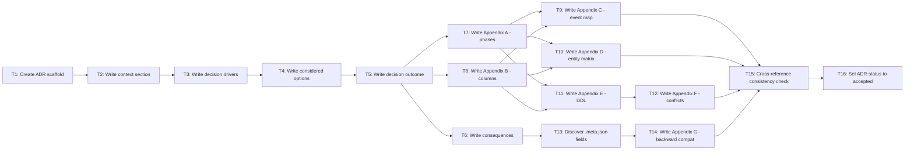

# Tasks: Status Taxonomy Design and Schema ADR

## Dependency Graph



## Execution Strategy

### Group 1: Foundation (sequential)
- T1: Create ADR scaffold
- T2: Write context and problem statement (depends on T1)

### Group 2: Core Content (sequential)
- T3: Write decision drivers section (depends on T2)
- T4: Write considered options section (depends on T3)
- T5: Write decision outcome section (depends on T4)

### Group 3: Consequences + Appendices A/B (parallel after T5)
- T6: Write consequences section (depends on T5)
- T7: Write Appendix A — workflow phase definitions (depends on T5)
- T8: Write Appendix B — kanban column definitions (depends on T5)

### Group 4: Appendices C/D/E + Field Discovery (parallel after T7, T8)
- T9: Write Appendix C — event-to-column transition map (depends on T7, T8)
- T10: Write Appendix D — entity type participation matrix (depends on T7, T8)
- T11: Write Appendix E — schema DDL (depends on T7, T8)
- T13: Discover all .meta.json fields via grep (depends on T6)

### Group 5: Appendices F/G (after dependencies)
- T12: Write Appendix F — conflict resolution scenarios (depends on T11)
- T14: Write Appendix G — backward compatibility map (depends on T13)

### Group 6: Finalization (sequential)
- T15: Cross-reference consistency check (depends on T9, T10, T12, T14)
- T16: Set ADR status to accepted (depends on T15)

---

## Task Details

### T1: Create ADR scaffold with MADR section headings

- **Why:** Plan Stage 1.1 — AC-1 requires MADR-format ADR
- **Depends on:** None
- **Blocks:** T2
- **Files:** `docs/features/004-status-taxonomy-design-and-sch/adr-004-status-taxonomy.md` (create)
- **Do:**
  1. Create file `adr-004-status-taxonomy.md`
  2. Add MADR heading structure:
     - `# ADR-004: Status Taxonomy and Dual-Dimension Schema`
     - `## Status` (leave as "proposed")
     - `## Context and Problem Statement`
     - `## Decision Drivers`
     - `## Considered Options`
     - `## Decision Outcome`
     - `## Consequences`
     - `### Positive Consequences`
     - `### Negative Consequences`
     - `## Appendices`
     - `### Appendix A: Workflow Phase Definitions`
     - `### Appendix B: Kanban Column Definitions`
     - `### Appendix C: Event-to-Column Transition Map`
     - `### Appendix D: Entity Type Participation Matrix`
     - `### Appendix E: Schema DDL`
     - `### Appendix F: Conflict Resolution Scenarios`
     - `### Appendix G: Backward Compatibility Map`
- **Test:** `grep -c "^##" adr-004-status-taxonomy.md` returns at least 7; `grep -c "^###" adr-004-status-taxonomy.md` returns at least 9
- **Done when:** File exists with all section headings listed above present

---

### T2: Write context and problem statement section

- **Why:** Plan Stage 1.2 — AC-1 requires context section
- **Depends on:** T1
- **Blocks:** T3
- **Files:** `adr-004-status-taxonomy.md` (edit)
- **Do:**
  1. Under `## Context and Problem Statement`, write 2-3 paragraphs describing:
     - Current model: single `status` field (planned/active/completed/abandoned) plus `lastCompletedPhase`
     - Limitation: no concept of kanban process state — where a work item sits in human-agent collaboration
     - Need: two orthogonal status dimensions (workflow phase and kanban column) coexisting on each entity
  2. Reference source: spec.md Problem Statement section
- **Test:** Section contains references to both `status` field and `lastCompletedPhase`; mentions dual-dimension need
- **Done when:** Context section present with current model description and problem framing

---

### T3: Write decision drivers section

- **Why:** Plan Stage 2.1 — AC-1 requires decision drivers
- **Depends on:** T2
- **Blocks:** T4
- **Files:** `adr-004-status-taxonomy.md` (edit)
- **Do:**
  1. Under `## Decision Drivers`, list at least 4 drivers as bullet points:
     - Spec requires complete enumeration of valid values for both dimensions (AC-2, AC-3)
     - Backward compatibility: existing `status` field and `.meta.json` state must map to new model (AC-7)
     - Simplicity: CHECK constraints preferred over reference tables for small, stable enum sets (TD-2)
     - Entity registry constraints: separate table avoids altering existing `entities` table (TD-1)
     - Per-entity-type participation rules needed (AC-5)
  2. Reference source: design.md TD-1 through TD-5
- **Test:** At least 4 bullet points; each references a spec AC or design TD
- **Done when:** Decision drivers section present with at least 4 drivers

---

### T4: Write considered options section

- **Why:** Plan Stage 2.2 — AC-1 requires considered options with pros/cons
- **Depends on:** T3
- **Blocks:** T5
- **Files:** `adr-004-status-taxonomy.md` (edit)
- **Do:**
  1. Under `## Considered Options`, document three options:
     - **Option 1: Single-dimension (status only)** — extend existing `status` field with more values. Pros: simple. Cons: conflates workflow progress with process state; no independent tracking.
     - **Option 2: Dual-dimension (workflow_phase + kanban_column)** — separate table with two orthogonal columns. Pros: clean separation, independent evolution, preserves existing API. Cons: requires JOIN, app-level enforcement for cross-table rules.
     - **Option 3: Hierarchical state machine** — full state machine with transition tables and guards. Pros: complete enforcement. Cons: overkill for current needs; couples schema to transition logic.
  2. Reference source: design.md TD-1
- **Test:** Exactly 3 options documented; each has pros and cons; Option 2 is identified as chosen
- **Done when:** Three options documented with pros/cons

---

### T5: Write decision outcome section

- **Why:** Plan Stage 2.3 — AC-1 requires decision outcome
- **Depends on:** T4
- **Blocks:** T6, T7, T8
- **Files:** `adr-004-status-taxonomy.md` (edit)
- **Do:**
  1. Under `## Decision Outcome`, state: "Chosen option: Dual-dimension model (Option 2)"
  2. Document the key aspects of the chosen approach:
     - Separate `workflow_phases` table with FK to `entities(type_id)`
     - `workflow_phase` is source of truth; `kanban_column` is derived/overridable view
     - One row per participating entity (current state snapshot)
     - CHECK constraints for enum enforcement
     - Application-level enforcement for cross-table constraints (feature 008)
  3. Reference source: design.md Architecture Overview and TD-1 through TD-5
- **Test:** Section mentions "Option 2" or "dual-dimension"; references workflow_phase as source of truth
- **Done when:** Decision outcome clearly stated with rationale referencing TDs

---

### T6: Write consequences section

- **Why:** Plan Stage 2.4 — AC-1 requires consequences
- **Depends on:** T5
- **Blocks:** T13
- **Files:** `adr-004-status-taxonomy.md` (edit)
- **Do:**
  1. Under `### Positive Consequences`, list at least 3:
     - Clean separation of workflow progress and process state
     - Independent schema evolution — `workflow_phases` can be extended without touching `entities`
     - Preserves existing entity registry API surface
     - Simple queries for kanban board (single table, indexed columns)
  2. Under `### Negative Consequences`, list at least 2:
     - Application-level enforcement needed for cross-table rules (entity type restrictions, conflict scenarios)
     - JOIN required for combined entity + workflow queries
     - No built-in history (deferred to feature 008 transition log)
  3. Reference source: design.md Risks & Mitigations
- **Test:** At least 3 positive and 2 negative consequences listed
- **Done when:** Both positive and negative consequence subsections populated

---

### T7: Write Appendix A — workflow phase definitions

- **Why:** Plan Stage 3.1 — AC-2 requires complete enumeration with definitions
- **Depends on:** T5
- **Blocks:** T9, T10, T11
- **Files:** `adr-004-status-taxonomy.md` (edit)
- **Do:**
  1. Under `### Appendix A: Workflow Phase Definitions`, create a table with columns: Phase, Definition
  2. Enumerate exactly 7 phases from design.md Component 3:
     - `brainstorm` — Exploring problem space and generating a PRD
     - `specify` — Writing precise requirements and acceptance criteria
     - `design` — Creating technical architecture and interface contracts
     - `create-plan` — Breaking design into ordered implementation steps
     - `create-tasks` — Decomposing plan into individual actionable tasks
     - `implement` — Writing code, tests, and executing tasks
     - `finish` — Final review, documentation, merge, and retrospective
  3. Add a note below the table: "`workflow_phase` is nullable — NULL means 'not started' (no sentinel value). SQLite CHECK constraint form: `CHECK(workflow_phase IN (...) OR workflow_phase IS NULL)`"
- **Test:** `grep -c '|' appendix_a_section` shows exactly 7 data rows (plus header); NULL semantics documented
- **Done when:** Table with exactly 7 phases, each with one-sentence definition; NULL handling stated

---

### T8: Write Appendix B — kanban column definitions

- **Why:** Plan Stage 3.2 — AC-3 requires complete enumeration with definitions and ownership
- **Depends on:** T5
- **Blocks:** T9, T10, T11
- **Files:** `adr-004-status-taxonomy.md` (edit)
- **Do:**
  1. Under `### Appendix B: Kanban Column Definitions`, create a table with columns: Column, Definition, Who Moves Cards Here
  2. Enumerate exactly 8 columns from design.md Component 4:
     - `backlog` — Work item identified but not yet prioritised for action — System (default) or Human
     - `prioritised` — Selected for upcoming work, awaiting start — Human
     - `wip` — Active work in progress by agent or human — Agent (on phase_start)
     - `agent_review` — Agent has dispatched a reviewer subagent — Agent (on reviewer_dispatch)
     - `human_review` — Awaiting human input or decision — Agent (on human_input_requested)
     - `blocked` — Cannot proceed due to missing prerequisite or error — Agent (on phase_blocked)
     - `documenting` — In documentation/wrap-up phase — Agent (on documentation_started)
     - `completed` — Work finished (completed normally or cancelled) — Agent (on feature_completed or feature_cancelled)
  3. Add a note: "These are DB-stored values (lowercase, underscore-separated). Display labels (e.g., 'WIP', 'Agent Review') are a UI concern (feature 019)."
- **Test:** Table has exactly 8 data rows; each row has definition and ownership; display label note present
- **Done when:** Table with exactly 8 columns, each with definition and ownership designation

---

### T9: Write Appendix C — event-to-column transition map

- **Why:** Plan Stage 3.3 — AC-4 requires complete event vocabulary mapped to kanban columns
- **Depends on:** T7, T8
- **Blocks:** T15
- **Files:** `adr-004-status-taxonomy.md` (edit)
- **Do:**
  1. Under `### Appendix C: Event-to-Column Transition Map`, create a table with columns: Event, Target kanban_column, Triggered By
  2. Enumerate exactly 10 events from spec AC-4:
     - `phase_start` → `wip` — Agent begins phase execution
     - `reviewer_dispatch` → `agent_review` — Agent spawns reviewer subagent
     - `human_input_requested` → `human_review` — AskUserQuestion invoked
     - `phase_complete` → `wip` (if next phase auto-starts) — Phase marked completed; does not apply to `finish` phase (finish completion triggers `feature_completed` instead). All phase transitions auto-start the next phase in sequence. No manual pause points exist in the current workflow
     - `phase_blocked` → `blocked` — Prerequisite missing or error
     - `phase_unblocked` → `wip` — Blocker resolved
     - `feature_cancelled` → `completed` — Feature abandoned
     - `feature_completed` → `completed` — finish-feature completed
     - `documentation_started` → `documenting` — finish-feature doc phase begins
     - `manual_override` → (any valid column) — Human drags card in UI
  3. Add a clarifying note: "Backward transitions (which populate `backward_transition_reason`) are triggered by the state engine (feature 008) and are not distinct kanban-column-changing events — the kanban column change follows the target phase's normal mapping."
  4. Add a note: "Finish phase completion triggers `feature_completed`, not `phase_complete`."
- **Test:** Table has exactly 10 data rows; all target columns exist in Appendix B; backward transition note present; finish phase note present
- **Done when:** 10 events listed with target columns and triggers; backward transition and finish phase notes present

---

### T10: Write Appendix D — entity type participation matrix

- **Why:** Plan Stage 3.4 — AC-5 requires participation matrix with explicit defaults
- **Depends on:** T7, T8
- **Blocks:** T15
- **Files:** `adr-004-status-taxonomy.md` (edit)
- **Do:**
  1. Under `### Appendix D: Entity Type Participation Matrix`, create a table with columns: Entity Type, Has workflow_phases Row?, workflow_phase Values, kanban_column Values
  2. Enumerate exactly 4 entity types from spec AC-5:
     - `feature` — Yes — All 7 phases + NULL — All 8 columns
     - `brainstorm` — Yes — NULL only — backlog, prioritised only
     - `backlog` — Yes — NULL only — backlog, prioritised only
     - `project` — No — N/A — N/A
  3. Add a note: "Per-entity-type kanban column restrictions are enforced by the state engine (feature 008) at the application level, NOT by DDL constraints. The DDL intentionally allows all 8 kanban_column values for all entity types."
- **Test:** Table has exactly 4 data rows; enforcement delegation to feature 008 stated
- **Done when:** 4 entity types documented with participation rules; enforcement note present

---

### T11: Write Appendix E — schema DDL

- **Why:** Plan Stage 3.5 — AC-6 requires complete DDL with columns, constraints, indexes, triggers
- **Depends on:** T7, T8
- **Blocks:** T12
- **Files:** `adr-004-status-taxonomy.md` (edit)
- **Do:**
  1. Under `### Appendix E: Schema DDL`, add a brief intro: "The following DDL defines the `workflow_phases` table as migration version 2 in the entity registry."
  2. Embed the complete DDL from design.md Interface 1 in a SQL code block:
     - `CREATE TABLE IF NOT EXISTS workflow_phases` with all 7 columns (type_id, workflow_phase, kanban_column, last_completed_phase, mode, backward_transition_reason, updated_at)
     - FK comment about ON DELETE RESTRICT
     - CHECK constraints for workflow_phase, kanban_column, last_completed_phase, mode
     - NOT NULL DEFAULT 'backlog' on kanban_column
     - NOT NULL on updated_at
     - `CREATE TRIGGER IF NOT EXISTS enforce_immutable_wp_type_id`
     - `CREATE INDEX IF NOT EXISTS idx_wp_kanban_column`
     - `CREATE INDEX IF NOT EXISTS idx_wp_workflow_phase`
  3. Copy DDL exactly from design.md Interface 1 — do not modify any values
  4. Add notes after the DDL:
     - "Per-phase timestamps (started, completed, iterations, reviewerNotes, skippedPhases) are NOT in this table — deferred to feature 008 transition log (Decision D-2)."
     - "The FK references `entities(type_id)` per current schema v1. If feature 001 (UUID migration) changes the PK before execution, the FK must be updated accordingly."
     - "`updated_at` uses UTC in ISO-8601 format."
- **Test:** DDL contains all 7 columns; 2 CREATE INDEX statements; 1 CREATE TRIGGER statement; CHECK constraint values match Appendix A (7 phases) and Appendix B (8 columns)
- **Done when:** Complete DDL embedded matching design.md Interface 1 exactly; all notes present

---

### T12: Write Appendix F — conflict resolution scenarios

- **Why:** Plan Stage 3.6 — AC-8 requires 5+ concrete conflict scenarios with resolutions
- **Depends on:** T11
- **Blocks:** T15
- **Files:** `adr-004-status-taxonomy.md` (edit)
- **Do:**
  1. Under `### Appendix F: Conflict Resolution Scenarios`, create a table with columns: #, Scenario, workflow_phase, kanban_column, Valid?, Resolution, Enforcement
  2. Enumerate exactly 6 scenarios from spec AC-8:
     - #1: Active work demoted to backlog — design / backlog — Valid — Human override, feature deprioritised mid-work — N/A
     - #2: Working on nothing — NULL / wip — Invalid — If kanban_column is wip/agent_review/human_review, workflow_phase must not be NULL for feature entities — Application-level (feature 008)
     - #3: Premature completion — implement / completed — Invalid — kanban_column=completed requires workflow_phase=finish OR feature_cancelled event (see scenario #6 for valid abandoned case) — Application-level (feature 008)
     - #4: Orphaned row — NULL / (missing) — Invalid — kanban_column has NOT NULL + DEFAULT 'backlog' — DDL-level
     - #5: Agent review without reviewer — design / agent_review — Valid — Transitional signal — N/A
     - #6: Distinguishing abandoned from completed — implement / completed — Valid — Abandoned inference: kanban_column=`completed` AND (workflow_phase IS NULL OR workflow_phase != `finish`) — Application-level (feature 008)
  3. Add a note: "Scenarios #2, #3, and #6 require application-level enforcement because SQLite CHECK constraints cannot reference other tables or event context."
- **Test:** Table has exactly 6 data rows; enforcement layer specified for each; scenario #3 cross-references #6; abandoned inference rule uses SQL-safe form
- **Done when:** 6 scenarios documented with enforcement layers; cross-reference between #3 and #6 present

---

### T13: Discover all .meta.json fields via grep

- **Why:** Plan Stage 3.7 pre-step — spec review caught missing fields twice; must enumerate mechanically
- **Depends on:** T6
- **Blocks:** T14
- **Files:** None (discovery step — output feeds T14)
- **Do:**
  1. Run grep to discover all distinct key paths in .meta.json files:
     ```bash
     grep -roh '"[a-zA-Z_]*":' docs/features/*/.meta.json docs/projects/*/.meta.json 2>/dev/null | sort -u
     ```
  2. Also extract nested keys from `phases` and `stages` sub-objects:
     ```bash
     cat docs/features/*/.meta.json | python3 -c "
     import json, sys
     def extract_keys(obj, prefix=''):
         for k, v in obj.items():
             path = f'{prefix}.{k}' if prefix else k
             print(path)
             if isinstance(v, dict):
                 extract_keys(v, path)
     for line in sys.stdin:
         try:
             extract_keys(json.loads(line))
         except: pass
     " 2>/dev/null | sort -u
     ```
  3. Record the complete field list — this becomes the authoritative input for T14
  4. Note: Project entity fields (e.g., `expected_lifetime`, `milestones`) are in scope for discovery but excluded from the backward compat table per AC-5 (projects don't participate in workflow_phases)
- **Test:** Field list includes at least: id, slug, status, created, mode, branch, project_id, module, depends_on_features, lastCompletedPhase, phases.*.started, phases.*.completed, backlog_source, brainstorm_source
- **Done when:** Complete field list extracted from real .meta.json files; ready for T14

---

### T14: Write Appendix G — backward compatibility map

- **Why:** Plan Stage 3.7 — AC-7 requires complete disposition of all .meta.json fields
- **Depends on:** T13
- **Blocks:** T15
- **Files:** `adr-004-status-taxonomy.md` (edit)
- **Do:**
  1. Under `### Appendix G: Backward Compatibility Map`, create a table with columns: .meta.json Field, Disposition, Target
  2. Using the field list from T13, enumerate every field with disposition from spec AC-7:
     - `id` — Stays in .meta.json — Display identifier
     - `slug` — Stays in .meta.json — Display identifier
     - `status` — Maps to kanban_column — See conversion table below
     - `created` — Already in entities table — `entities.created_at`
     - `completed` — Maps to workflow_phases — Via kanban_column=completed + updated_at
     - `mode` — Maps to workflow_phases — `workflow_phases.mode`
     - `branch` — Stays in .meta.json — Git concern, not workflow state
     - `project_id` — Already in entities table — Via parent_type_id
     - `module` — Already in entities metadata — `entities.metadata` JSON
     - `depends_on_features` — Already in entities metadata — `entities.metadata` JSON
     - `lastCompletedPhase` — Maps to workflow_phases — `workflow_phases.last_completed_phase`
     - `skippedPhases` — Deferred to feature 008 — Transition log
     - `phases.{name}.started` — Deferred to feature 008 — Per-phase timestamps
     - `phases.{name}.completed` — Deferred to feature 008 — Per-phase timestamps
     - `phases.{name}.iterations` — Deferred to feature 008 — Per-phase iteration count
     - `phases.{name}.reviewerNotes` — Deferred to feature 008 — Reviewer notes
     - `phases.{name}.taskReview.*` — Deferred to feature 008 — Task review sub-object
     - `phases.{name}.chainReview.*` — Deferred to feature 008 — Chain review sub-object
     - `phases.{name}.reviewIterations` — Deferred to feature 008 — Review iteration count
     - `phases.{name}.approved` — Deferred to feature 008 — Approval status
     - `phases.{name}.status` — Deferred to feature 008 — Phase-level status
     - `phases.design.stages.*` — Deferred to feature 008 — Design-specific sub-structure
     - `backlog_source` — Stays in .meta.json — Provenance metadata
     - `brainstorm_source` — Stays in .meta.json — Provenance metadata
     - `lastCompletedMilestone` — Stays in .meta.json — Project-level
     - `milestones` — Stays in .meta.json — Project-level
     - `features` — Stays in .meta.json — Project-level
  3. Add scope note: "This table covers feature and brainstorm entity .meta.json fields. Project entity fields (e.g., `expected_lifetime`, `milestones`) are excluded because projects do not participate in workflow_phases (AC-5)."
  4. Add status → kanban_column conversion table:
     - `planned` → `backlog` — Not yet started = backlog
     - `active` → `wip` — Active work (actual column refined by workflow events)
     - `completed` → `completed` — Terminal state
     - `abandoned` → `completed` — Terminal state, inferred as abandoned when kanban_column=completed AND (workflow_phase IS NULL OR workflow_phase != 'finish')
  5. Add note: "`active` → `wip` is the initial mapping. Once the state engine runs, the kanban column for active features is dynamically updated by workflow events."
- **Test:** Field count matches T13 discovery output (excluding project-only fields); every field has disposition; status mapping table has exactly 4 rows; project scope note present
- **Done when:** All discovered fields have explicit disposition; status conversion table present; scope note present

---

### T15: Cross-reference consistency check

- **Why:** Plan Stage 4.1 — multiple appendices reference each other; must verify internal consistency
- **Depends on:** T9, T10, T12, T14
- **Blocks:** T16
- **Files:** `adr-004-status-taxonomy.md` (edit — corrections only if needed)
- **Do:**
  1. Extract workflow_phase CHECK constraint values from Appendix E DDL
  2. Compare against Appendix A phase enumeration — must be identical set of 7
  3. Extract kanban_column CHECK constraint values from Appendix E DDL
  4. Compare against Appendix B column enumeration — must be identical set of 8
  5. Extract event target columns from Appendix C
  6. Verify each target column exists in Appendix B
  7. Extract workflow_phase and kanban_column values from Appendix F conflict scenarios
  8. Verify each value exists in the corresponding enumeration (Appendix A or B)
  9. Verify abandoned inference rule in Appendix F uses SQL-safe form: `(workflow_phase IS NULL OR workflow_phase != 'finish')`
  10. Fix any inconsistencies found
- **Test:** No orphan references; CHECK values match enumerations exactly; all event targets valid; all conflict scenario values valid
- **Done when:** All cross-references verified consistent; any fixes applied

---

### T16: Set ADR status to accepted

- **Why:** Plan Stage 4.2 — MADR convention requires explicit status
- **Depends on:** T15
- **Blocks:** None
- **Files:** `adr-004-status-taxonomy.md` (edit)
- **Do:**
  1. Change `## Status` section content from "proposed" to "Accepted"
  2. Add date: "Date: 2026-03-01"
  3. Add decision summary: "Dual-dimension status model with separate `workflow_phases` table"
- **Test:** Status section contains "Accepted" and date
- **Done when:** ADR status set to "Accepted" with date

---

## Summary

- **Total tasks:** 16
- **Parallel groups:** 6
- **Critical path:** T1 → T2 → T3 → T4 → T5 → T7 → T11 → T12 → T15 → T16 (10 tasks)
- **Max parallelism:** 4 (Group 4: T9, T10, T11, T13)
