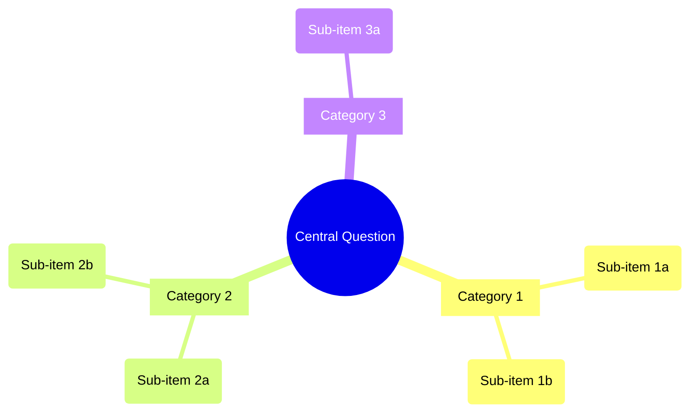

# Design: Structured Problem-Solving Framework

## Prior Art Research

### Codebase Patterns

| Pattern | Source | How It Applies |
|---|---|---|
| Skill + reference files | `root-cause-analysis/` (SKILL.md 116 lines + 3 refs) | Structural template for C1 skill. References linked inline with `[Name](references/file.md)` |
| Taxonomy table in reference | `causal-dag.md` (6-category checklist table) | Pattern for `problem-types.md` — table with Category/What/Examples columns |
| Domain-specific review criteria | `reviewing-artifacts/SKILL.md` (per-artifact checklists) | Pattern for type-specific reviewer criteria in C3 |
| Conditional capability loading | `detecting-kanban/SKILL.md` (check → yes/no → paths) | Pattern for BS-3 graceful degradation |
| Context via Task prompt | `design.md:277-311` (prompt includes full content) | Pattern for passing `Problem Type: {type}` to brainstorm-reviewer |
| Stage 6 dispatch | `brainstorming/SKILL.md:166-170` (Task → brainstorm-reviewer) | Exact insertion point for problem type context |
| PRD output template | `brainstorming/SKILL.md:252-349` (markdown template) | Insertion point for Status metadata and Structured Analysis section |
| Mermaid in skills | `root-cause-analysis/SKILL.md:12-19`, `causal-dag.md` | Precedent for inline Mermaid in skill output |

### External Research

| Finding | Source | Design Implication |
|---|---|---|
| Mermaid mindmap: indentation-based, shapes `((root))`, `[square]`, `(rounded)` | mermaid.js.org | Mind map syntax template in SKILL.md |
| SCQA: S→C→Q→A bridges into MECE workstreams | strategyu.co | SCQA produces the Question; decomposition breaks it down |
| Issue trees: 3-4 layers, 2-5 items/layer, MECE per layer | craftingcases.com | Decomposition depth/breadth constraints |
| MECE patterns: dichotomous, process-based, elemental, dynamic | oreateai.com | Type-specific decomposition method selection |
| Domain-adaptive review: CodeRabbit uses path-based criteria | docs.coderabbit.ai | Pattern: criteria lookup table keyed by type |

## Architecture Overview

```
┌─────────────────────────────────────────────────────────────┐
│ brainstorming/SKILL.md (modified)                           │
│                                                              │
│  Stage 1: CLARIFY                                           │
│   ├── Steps 1-5: Existing (unchanged)                       │
│   ├── Step 6: Problem Type Classification [NEW]             │
│   │   └── AskUserQuestion → user selects type               │
│   ├── Step 7: Optional Framework Loading [NEW]              │
│   │   ├── Read structured-problem-solving/SKILL.md          │
│   │   ├── Read relevant references                          │
│   │   ├── Apply SCQA framing                                │
│   │   ├── Run type-specific decomposition                   │
│   │   └── Generate inline Mermaid mindmap                   │
│   └── Step 8: Store Problem Type [NEW]                      │
│                                                              │
│  Stage 6: READINESS CHECK                                   │
│   └── Task prompt includes: Problem Type: {type} [MODIFIED] │
│                                                              │
│  PRD Output Format                                          │
│   ├── Status: + Problem Type line [MODIFIED]                │
│   └── + Structured Analysis section [NEW]                   │
└────────────┬────────────────────────────┬───────────────────┘
             │ reads                      │ dispatches
             ▼                            ▼
┌────────────────────────────┐  ┌─────────────────────────────┐
│ structured-problem-solving/│  │ brainstorm-reviewer.md      │
│ SKILL.md [NEW]             │  │ (modified)                  │
│  ├── Accept type           │  │                             │
│  ├── Apply SCQA            │  │  Parse: Problem Type: {x}   │
│  ├── Select decomposition  │  │  ├── Known type → table     │
│  ├── Generate mindmap      │  │  ├── Other/none → universal │
│  └── Output analysis       │  │  └── Absent → universal     │
│                             │  │                             │
│ references/                 │  │  Universal (5) + Type (3)   │
│  ├── problem-types.md      │  │  = up to 8 criteria checked │
│  ├── scqa-framing.md       │  └─────────────────────────────┘
│  ├── decomposition-methods │
│  └── review-criteria-by-   │
│      type.md               │
└────────────────────────────┘
```

### Data Flow

```
User input (Stage 1, Steps 1-5)
    │
    ▼
Step 6: AskUserQuestion → problem_type = "product/feature" | "Other: {text}" | "none"
    │
    ├── "none" → skip, proceed to Stage 2 unchanged
    │
    └── type selected →
        │
        ▼
    Step 7: Read SKILL.md + references
        │
        ├── SCQA framing (all types)
        │   output: { situation, complication, question, answer }
        │
        ├── Decomposition (type-specific)
        │   output: tree structure (text)
        │
        └── Mind map (from decomposition)
            output: ```mermaid mindmap ... ```
        │
        ▼
    Step 8: Write to PRD
        ├── Status: "- Problem Type: {type}"
        └── ## Structured Analysis section
        │
        ▼
    Stage 6: Dispatch brainstorm-reviewer
        prompt: "... Problem Type: {type} ..."
        │
        ▼
    Reviewer: lookup type → apply universal + type-specific criteria
```

## Problem Type Taxonomy

The 5 problem types, their decomposition methods, and reviewer criteria:

| Type | SCQA Focus | Decomposition Method | Review Criteria (3 per type) |
|---|---|---|---|
| **product/feature** | User experience gap | MECE: user segments, journeys, capabilities, metrics | Target users defined; User journey described; UX considerations noted |
| **technical/architecture** | System constraint or debt | Issue tree: component boundaries, dependencies, migration paths | Technical constraints identified; Component boundaries clear; Migration/compatibility noted |
| **financial/business** | Revenue/cost opportunity | MECE: revenue drivers, cost structure, risk factors, assumptions | Key assumptions quantified; Risk factors enumerated; Success metrics are financial |
| **research/scientific** | Knowledge gap | Hypothesis tree: testable claims at leaves, evidence requirements per branch | Hypothesis stated and testable; Methodology outlined; Falsifiability criteria defined |
| **creative/design** | Design space unexplored | Design space exploration: divergent options, convergent evaluation, inspiration mapping | Design space explored (>1 option); Aesthetic/experiential goals stated; Inspiration/references cited |

**"Other" (free text):** SCQA framing applied, generic issue tree used, universal review criteria only.
**"Skip":** No framework, no Structured Analysis section, type stored as "none".

## Components

### Component 1: `structured-problem-solving/SKILL.md`

**Purpose:** Orchestrate SCQA framing and type-specific decomposition. Invoked by brainstorming skill, not standalone.

**Naming note:** "structured-problem-solving" ends with the gerund "solving", consistent with the convention. The compound noun form is preferred over alternatives like "solving-problems" for readability.

**Frontmatter:**
```yaml
---
name: structured-problem-solving
description: "Applies SCQA framing and type-specific decomposition to problems. Use when brainstorming skill loads the structured problem-solving framework in Stage 1 Step 7."
---
```

**Structure (target: ~80-120 lines):**

```
# Structured Problem-Solving

## Input
- problem_type: string (from Step 6)
- problem_statement: string (from Step 1)
- context: { target_user, success_criteria, constraints, approaches }

## Process

### 1. SCQA Framing
[Reference: scqa-framing.md]
Apply to problem regardless of type.
Output the 4-part frame.

### 2. Type-Specific Decomposition
[Reference: problem-types.md]
[Reference: decomposition-methods.md]
Lookup type → select method → apply.

### 3. Mind Map Generation
Convert decomposition tree to Mermaid mindmap syntax.
Write as inline fenced code block.

## Output
Return structured analysis as markdown for PRD insertion:
- ### Problem Type
- ### SCQA Framing
- ### Decomposition
- ### Mind Map
```

**Key design decision:** SKILL.md is a thin orchestrator. All domain knowledge lives in reference files. This keeps SKILL.md well under 500 lines and makes it easy to add new types by editing references only.

### Component 2: Reference Files

#### `references/problem-types.md`

**Structure:** One section per type. Each section has exactly 4 sub-sections matching FR-3.

```markdown
# Problem Type Taxonomy

## product/feature

### Framing Approach
SCQA with user-centric Situation (current user experience) and Complication (what's broken/missing for users).

### Decomposition Method
MECE decomposition of solution space:
- User segments (who)
- User journeys (what flows)
- Technical capabilities (how)
- Success metrics (measuring what)

### PRD Sections
- Target Users (with personas if complex)
- User Journey (before/after)
- UX Considerations

### Review Criteria
- Target users defined
- User journey described
- UX considerations noted

## technical/architecture
{same 4-section pattern}

## financial/business
{same 4-section pattern}

## research/scientific
{same 4-section pattern}

## creative/design
{same 4-section pattern}
```

**Target size:** ~150-200 lines (5 types x ~30-40 lines each).

#### `references/scqa-framing.md`

**Structure:** Template + examples per type.

```markdown
# SCQA Framing Template

## Template
- **Situation:** {established context everyone agrees on}
- **Complication:** {what changed, what's broken, why action needed now}
- **Question:** {the specific question this analysis must answer}
- **Answer:** {the proposed direction/hypothesis}

## Guidance by Problem Type

### product/feature
- S: Current user experience and workflow
- C: What's broken, missing, or slow for users
- Q: How should we change the product to solve this?
- A: Proposed feature/change with rationale

### technical/architecture
{type-specific SCQA guidance}

### financial/business
{type-specific SCQA guidance}

### research/scientific
- S: Current state of knowledge
- C: What's unknown, contradictory, or unverified
- Q: What hypothesis should we test?
- A: Proposed research approach

### creative/design
{type-specific SCQA guidance}
```

**Target size:** ~80-100 lines.

#### `references/decomposition-methods.md`

**Structure:** Method per type with markdown tree examples.

```markdown
# Decomposition Methods

## MECE Decomposition (product/feature, financial/business)
Break the solution space into categories that are:
- **Mutually Exclusive:** No overlap between categories
- **Collectively Exhaustive:** No gaps in coverage

Tree format:
├── Category A
│   ├── Sub-item A1
│   └── Sub-item A2
└── Category B
    ├── Sub-item B1
    └── Sub-item B2

## Issue Tree (technical/architecture)
Diagnostic tree mapping "why" questions:
├── Why is X happening?
│   ├── Hypothesis 1: {testable claim}
│   └── Hypothesis 2: {testable claim}
└── Why does X matter?
    ├── Impact 1
    └── Impact 2

## Hypothesis Tree (research/scientific)
{with falsifiable leaf nodes}

## Design Space Exploration (creative/design)
{with divergent option mapping}

## Generic Issue Tree (for "Other" types)
{default when no specific method applies}
```

**Target size:** ~100-130 lines.

#### `references/review-criteria-by-type.md`

**Structure:** Lookup table matching the brainstorm-reviewer's criteria table.

```markdown
# Review Criteria by Problem Type

## Universal Criteria (always applied)
1. Problem clearly stated
2. Goals defined
3. Options explored
4. Direction chosen
5. Rationale documented

## Type-Specific Criteria

| Problem Type | Criterion 1 | Criterion 2 | Criterion 3 |
|---|---|---|---|
| product/feature | Target users defined | User journey described | UX considerations noted |
| technical/architecture | Technical constraints identified | Component boundaries clear | Migration/compatibility noted |
| financial/business | Key assumptions quantified | Risk factors enumerated | Success metrics are financial |
| research/scientific | Hypothesis stated and testable | Methodology outlined | Falsifiability criteria defined |
| creative/design | Design space explored (>1 option) | Aesthetic/experiential goals stated | Inspiration/references cited |

## Criteria Descriptions
{one paragraph per criterion explaining what "existence" means}
```

**Target size:** ~80-100 lines.

### Component 3: Brainstorming SKILL.md Modifications

**Files modified:** `plugins/iflow-dev/skills/brainstorming/SKILL.md`

**Change 1: Stage 1 CLARIFY — insert Steps 6-8 between exit condition (line 62) and the `---` separator before Stage 2 (line 64)**

The existing Stage 1 structure is:
```
### Stage 1: CLARIFY
  Goal:
  Rules:
  Required information to gather: (items 1-5)
  Exit condition: (line 62)
---                               ← line 64
### Stage 2: RESEARCH             ← line 66
```

Steps 6-8 are inserted as new sub-sections AFTER the exit condition line and BEFORE the `---` separator. The exit condition remains unchanged — it still triggers when the original 5 items are answered. Steps 6-8 always execute after, as an addendum:

```markdown
**Exit condition:** User confirms understanding is correct, OR you have answers to all 5 required items.

**After exit condition is satisfied, always run Steps 6-8 before proceeding to Stage 2:**

#### Step 6: Problem Type Classification

Present problem type options:

```
AskUserQuestion:
  questions: [{
    "question": "What type of problem is this?",
    "header": "Problem Type",
    "options": [
      {"label": "Product/Feature", "description": "User-facing product or feature design"},
      {"label": "Technical/Architecture", "description": "System design, refactoring, infrastructure"},
      {"label": "Financial/Business", "description": "Business model, pricing, financial analysis"},
      {"label": "Research/Scientific", "description": "Hypothesis testing, data analysis, experimentation"},
      {"label": "Creative/Design", "description": "Visual design, game design, creative exploration"},
      {"label": "Skip", "description": "No structured framework — proceed with standard brainstorm"}
    ],
    "multiSelect": false
  }]
```

**Handling "Other":** AskUserQuestion always provides a free-text "Other" option to the user. If the user selects "Other" and provides a custom string, treat it as a custom type. If the user simply types a clarification but intends one of the 5 types, map it to the closest type.

#### Step 7: Optional Framework Loading

**If user selected a named type (not "Skip"):**
1. Read skill file: `Read tool → ${CLAUDE_PLUGIN_ROOT}/skills/structured-problem-solving/SKILL.md`
   - `${CLAUDE_PLUGIN_ROOT}` resolves to the plugin's cache directory (e.g., `~/.claude/plugins/cache/my-local-plugins/iflow-dev/2.4.1-dev/`)
   - This is the same base directory the brainstorming skill itself runs from
   - **Novel pattern:** This is cross-skill reading. The brainstorming skill reads another skill's files at runtime. This works because both skills are in the same plugin and share the same `${CLAUDE_PLUGIN_ROOT}`.
2. If file not found: warn "Structured problem-solving skill not found, skipping framework" → skip to Step 8
3. Read reference files from same base: `${CLAUDE_PLUGIN_ROOT}/skills/structured-problem-solving/references/scqa-framing.md`, `references/problem-types.md`, `references/decomposition-methods.md`
4. If reference files missing: warn "Reference files not found, applying SCQA framing only"
5. Apply SCQA framing to the problem
6. Apply type-specific decomposition (or generic issue tree for "Other")
7. Generate inline Mermaid mind map from decomposition

**If user selected "Other" (free text):**
- Use the user's custom type description
- Apply SCQA framing (universal)
- Apply generic issue tree decomposition
- Store custom type string as-is

**If "Skip":**
- Set type to "none"
- Skip Steps 7 body entirely
- Proceed to Step 8

#### Step 8: Store Problem Type

Store the problem type for downstream use:
- Add `- Problem Type: {type}` to PRD Status section
- If "Skip" was selected: `- Problem Type: none`
- If "Other": `- Problem Type: {user's custom string}`
- If named type: `- Problem Type: product/feature` (lowercase as shown in taxonomy)
```

**Change 2: Stage 6 READINESS CHECK — modify dispatch prompt at line ~168**

Current:
```
- prompt: PRD file path + request for JSON response
```

New:
```
- prompt: |
    Review this brainstorm for readiness.

    PRD content: {full PRD content}
    Problem Type: {type from Step 8, or "none" if skipped/absent}

    Return JSON: { "approved": true/false, "issues": [...], "summary": "..." }
```

**Change 3: PRD Output Format — modify template at line ~258**

Add to Status section:
```markdown
- Problem Type: {type}
```

Add new section between Research Summary and Review History:
```markdown
## Structured Analysis

### Problem Type
{type} — {one-line rationale}

### SCQA Framing
- **Situation:** {current state}
- **Complication:** {what changed / what's wrong}
- **Question:** {the key question to answer}
- **Answer:** {proposed direction}

### Decomposition
{text tree}

### Mind Map
```mermaid
mindmap
  root(({Problem}))
    {branches from decomposition}
```
```

**Conditional:** Structured Analysis section is ONLY included when Problem Type is not "none". When "none", the PRD template is unchanged from current.

### Component 4: Brainstorm-Reviewer Agent Modifications

**File modified:** `plugins/iflow-dev/agents/brainstorm-reviewer.md`

**Change 1: Add Input section for problem type (after line 36)**

```markdown
## Input

You receive:
1. **Brainstorm file path or content** - The PRD to review
2. **Problem Type** - Optional. Appears in prompt as `Problem Type: {type}`. When present and not "none", apply type-specific criteria in addition to universal criteria.
```

**Change 2: Replace Brainstorm Checklist section (lines 66-74)**

The existing 5-item checklist becomes "Universal Criteria". A new "Type-Specific Criteria" table is added below it. The table has 4 columns: Problem Type, Check 1, Check 2, Check 3 — each check is a boolean existence test.

```markdown
## Brainstorm Checklist

### Universal Criteria (always checked)

- [ ] **Problem clearly stated** - What are we solving?
- [ ] **Goals defined** - What does success look like?
- [ ] **Options explored** - Were alternatives considered?
- [ ] **Direction chosen** - Is there a clear decision?
- [ ] **Rationale documented** - Why this approach?

### Type-Specific Criteria

When `Problem Type` is provided in the `## Context` section of the prompt and matches a known type, also check the matching row:

| Problem Type | Check 1 | Check 2 | Check 3 |
|---|---|---|---|
| product/feature | Target users defined | User journey described | UX considerations noted |
| technical/architecture | Technical constraints identified | Component boundaries clear | Migration/compatibility noted |
| financial/business | Key assumptions quantified | Risk factors enumerated | Success metrics are financial |
| research/scientific | Hypothesis stated and testable | Methodology outlined | Falsifiability criteria defined |
| creative/design | Design space explored (>1 option) | Aesthetic/experiential goals stated | Inspiration/references cited |

**When Problem Type is absent, "none", or an unrecognized custom string:** apply universal criteria only (backward compatible).

**Existence check, not correctness:** Each check verifies whether the relevant analysis EXISTS in the PRD, not whether it is correct or complete. For example, "Target users defined" passes if the PRD mentions target users, regardless of whether they are the right target users.
```

**Change 3: Update Review Process (lines 91-100)**

```markdown
## Review Process

1. **Read the brainstorm file** thoroughly
2. **Parse Problem Type** from prompt (if provided)
3. **Check universal criteria** (5 items) against the content
4. **If known problem type:** check the 3 type-specific criteria
5. **For each gap found:**
   - Is it a blocker (cannot create feature)?
   - Is it a warning (quality concern)?
   - Is it a note (nice improvement)?
6. **Assess overall:** Is this ready?
7. **Return structured feedback** with which criteria set was applied
```

## Technical Decisions

| Decision | Choice | Rationale | Alternatives Considered |
|---|---|---|---|
| TD-1: Mind map output | Inline Mermaid code block | No external tool dependency; renders in any markdown viewer that supports Mermaid | MCP tool for PNG rendering (rejected: creates hard dependency) |
| TD-2: Problem type storage | PRD Status metadata line | Simple, parseable, downstream-readable | Separate metadata file (over-engineered), JSON frontmatter (not standard in PRDs) |
| TD-3: Reviewer receives type | Via Task prompt text | Matches existing dispatch pattern (design.md:277-311); no agent file format changes needed | Agent reads PRD and parses type (fragile, could misparse) |
| TD-4: SKILL.md as thin orchestrator | Domain knowledge in references | Stays under 500 lines; new types added by editing references only | All content in SKILL.md (would exceed line limit) |
| TD-5: AskUserQuestion options | 6 options (5 types + Skip) | "Other" is built-in free text in AskUserQuestion; no need for explicit option | 7 options with explicit "Other" (redundant with built-in free text) |
| TD-6: Criteria lookup | Table in agent markdown | Simple, no code; reviewer reads table and applies matching row | External config file (over-engineered), conditional logic in prompt (fragile) |

## Risks and Mitigations

| Risk | Likelihood | Impact | Mitigation |
|---|---|---|---|
| SKILL.md exceeds 500-line budget | Low | Medium | Thin orchestrator pattern; all content in references |
| LLM generates invalid Mermaid mindmap syntax | Medium | Low | Include syntax examples in SKILL.md; text decomposition is always available as fallback |
| Reviewer ignores type-specific criteria | Low | Low | Criteria embedded directly in agent markdown; clear table format |
| Framework loading slows Stage 1 | Low | Low | Only 2-3 file reads; reference files are small (<200 lines each) |
| "Other" type produces poor decomposition | Medium | Low | SCQA framing still applies; generic issue tree provides reasonable structure |
| User confusion about type selection | Low | Low | Clear descriptions in AskUserQuestion options; "Skip" always available |

## Interfaces

### Interface 1: Brainstorming → Structured Problem-Solving Skill

**Trigger:** Step 7 reads SKILL.md via Read tool.

**Input context (available from Stage 1):**
- `problem_type`: string — user's selection from Step 6
- `problem_statement`: string — from Step 1 item 1
- `target_user`: string — from Step 1 item 2
- `success_criteria`: string — from Step 1 item 3
- `constraints`: string — from Step 1 item 4
- `approaches_considered`: string — from Step 1 item 5

**Output (written to PRD):**
```markdown
## Structured Analysis

### Problem Type
{type} — {rationale}

### SCQA Framing
- **Situation:** ...
- **Complication:** ...
- **Question:** ...
- **Answer:** ...

### Decomposition
{text tree using Unicode box-drawing characters}

### Mind Map
```mermaid
mindmap
  root(({question from SCQA}))
    [Branch 1]
      (Sub 1a)
      (Sub 1b)
    [Branch 2]
      (Sub 2a)
```
```

**Error handling:**
- SKILL.md not found → warn, skip framework, return empty
- Reference file missing → warn, apply SCQA only (hardcoded fallback in SKILL.md)

### Interface 2: Brainstorming → Brainstorm-Reviewer (modified dispatch)

**Current dispatch (Stage 6, line ~168):**
```
Task tool:
  subagent_type: iflow-dev:brainstorm-reviewer
  prompt: "{PRD file path} + request for JSON response"
```

**New dispatch — changes from file path to inline content + type context:**
```
Task tool:
  subagent_type: iflow-dev:brainstorm-reviewer
  prompt: |
    Review this brainstorm for promotion readiness.

    ## PRD Content
    {full PRD markdown content — read from file before dispatch}

    ## Context
    Problem Type: {type from Step 8, or "none" if skipped/absent}

    Return your assessment as JSON:
    {
      "approved": true/false,
      "issues": [...],
      "summary": "..."
    }
```

**Why change from file path to inline content:** The reviewer needs both the PRD content AND the problem type context. Passing content inline with the type header is simpler than passing a file path and expecting the reviewer to both read the file AND parse a separate metadata field. This matches the pattern used by the design command's dispatch (design.md:277-311) which passes full document content in the prompt.

**Contract:** Reviewer MUST parse `Problem Type:` line from the `## Context` section. If the line is absent, "none", or an unrecognized string: apply universal criteria only. If a recognized type (product/feature, technical/architecture, financial/business, research/scientific, creative/design): apply universal + type-specific criteria.

**Backward compatibility:** When the modified reviewer is invoked for a PRD created before this feature (no Problem Type in content, no `## Context` section in prompt), the reviewer will not find a `Problem Type:` line and will default to universal criteria only. This satisfies BS-2.

### Interface 3: PRD Format Contract

**Status section — new field:**
```markdown
## Status
- Created: {date}
- Last updated: {date}
- Status: Draft
- Problem Type: {type}    ← NEW (or "none")
```

**New section — Structured Analysis:**
- Position: between `## Research Summary` and `## Review History`
- Present ONLY when Problem Type is not "none"
- Contains 4 subsections: Problem Type, SCQA Framing, Decomposition, Mind Map

### Interface 4: Mermaid Mind Map Syntax Contract

The mind map uses Mermaid's `mindmap` diagram type with these conventions:



**Shape conventions:**
- `((text))` — root node (circle, the SCQA Question)
- `[text]` — top-level branches (square, MECE categories)
- `(text)` — leaf nodes (rounded, specific items)

**Depth:** 2-3 levels maximum for readability.

**Regeneration:** When user loops back via Stage 7 → Stage 1, the entire `## Structured Analysis` section is deleted and regenerated with updated content.

## File Change Summary

| File | Action | Lines Changed (est.) | Budget |
|---|---|---|---|
| `plugins/iflow-dev/skills/structured-problem-solving/SKILL.md` | Create | ~100 | <500 lines |
| `plugins/iflow-dev/skills/structured-problem-solving/references/problem-types.md` | Create | ~180 | n/a |
| `plugins/iflow-dev/skills/structured-problem-solving/references/scqa-framing.md` | Create | ~90 | n/a |
| `plugins/iflow-dev/skills/structured-problem-solving/references/decomposition-methods.md` | Create | ~120 | n/a |
| `plugins/iflow-dev/skills/structured-problem-solving/references/review-criteria-by-type.md` | Create | ~90 | n/a |
| `plugins/iflow-dev/skills/brainstorming/SKILL.md` | Modify | ~60 added, ~5 modified | Current: 399 lines → Est: ~460 lines (<500) |
| `plugins/iflow-dev/agents/brainstorm-reviewer.md` | Modify | ~30 added, ~15 modified | n/a |

**Total new files:** 5
**Total modified files:** 2
**Estimated total lines changed:** ~690

**Line budget check:** Brainstorming SKILL.md at 399 lines + ~60 lines for Steps 6-8 + ~15 lines for PRD format additions = ~474 lines. Under the 500-line limit with ~26 lines of headroom.
