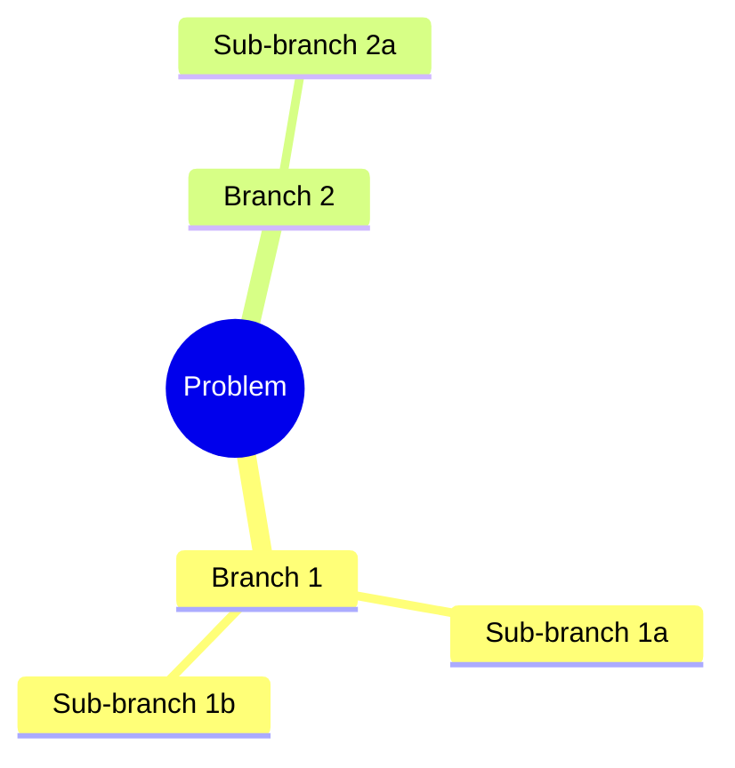

# Specification: Structured Problem-Solving Framework

## Overview

Add an optional structured-problem-solving skill and enhance the brainstorm-reviewer to support domain-adaptive review criteria. The brainstorming skill gains a problem type classification step in Stage 1 CLARIFY that optionally loads the framework. A Mermaid mind map visualizes the decomposition.

## Components

### C1: New Skill — `structured-problem-solving`

**Location:** `plugins/iflow-dev/skills/structured-problem-solving/`

**Structure:**
```
structured-problem-solving/
├── SKILL.md                          # Entry point (<500 lines)
└── references/
    ├── problem-types.md              # Taxonomy of 5+ problem types
    ├── scqa-framing.md               # SCQA template and examples
    ├── decomposition-methods.md      # MECE, issue trees, hypothesis trees
    └── review-criteria-by-type.md    # Domain-specific reviewer criteria
```

**SKILL.md responsibilities:**
1. Accept problem type (confirmed by user in Stage 1 CLARIFY)
2. Apply SCQA framing (default for all types)
3. Select and apply type-specific decomposition method
4. Generate Mermaid mind map of decomposition
5. Output structured analysis section for PRD

**Does NOT:**
- Replace or override any brainstorming stages
- Run independently — only invoked from brainstorming skill's Stage 1

### C2: Modified Skill — `brainstorming`

**Location:** `plugins/iflow-dev/skills/brainstorming/SKILL.md`

**Changes to Stage 1 CLARIFY only:**

After gathering the existing 5 required items (problem, target user, success criteria, constraints, approaches considered), add:

**Step 6: Problem Type Classification**
- Present problem type options via AskUserQuestion:
  - product/feature
  - technical/architecture
  - financial/business
  - research/scientific
  - creative/design
  - Other (free text)
  - Skip (no framework)

**Step 7: Optional Framework Loading**
- If user selected a type (not "Skip"):
  - Read `plugins/iflow-dev/skills/structured-problem-solving/SKILL.md` via Read tool
  - Read relevant reference files based on problem type (e.g., `references/problem-types.md`, `references/scqa-framing.md`)
  - Apply SCQA framing to the problem
  - Run type-specific decomposition
  - Generate Mermaid mind map as inline code block (see BS-5)
- If user selected "Other (free text)":
  - Prompt user to describe their problem type in one phrase via AskUserQuestion
  - Apply SCQA framing (universal default)
  - Use generic issue tree decomposition (no type-specific method)
  - Store the custom type string as-is in PRD metadata
- If "Skip": proceed unchanged

**Step 8: Store Problem Type**
- Add `- Problem Type: {type}` to PRD Status section (or `none` if skipped)

**Exit condition unchanged:** user confirms understanding is correct, OR all 5 original required items are answered. Steps 6-8 always execute after the original exit condition is satisfied but before Stage 2 begins.

**Changes to PRD Output Format:**
- Add `- Problem Type: {type}` to Status section
- Add `## Structured Analysis` section between Research Summary and Review History
- Structured Analysis contains: SCQA framing, decomposition tree (text), inline Mermaid mind map code block

### C3: Modified Agent — `brainstorm-reviewer`

**Location:** `plugins/iflow-dev/agents/brainstorm-reviewer.md`

**Current state:** 5 fixed checklist items, no domain awareness.

**New behavior:**

The reviewer receives problem type context in the prompt text (passed by the brainstorming skill when invoking the subagent in the Stage 6 READINESS CHECK). The brainstorming skill adds `Problem Type: {type}` to the prompt passed to the Task tool's `prompt` parameter when dispatching the brainstorm-reviewer subagent. It applies:

**Universal criteria (always checked):**
1. Problem clearly stated
2. Goals defined
3. Options explored
4. Direction chosen
5. Rationale documented

**Type-specific criteria (checked when problem type is provided and not "none"):**

| Problem Type | Additional Criteria |
|---|---|
| product/feature | Target users defined, user journey described, UX considerations noted |
| technical/architecture | Technical constraints identified, component boundaries clear, migration/compatibility noted |
| financial/business | Key assumptions quantified, risk factors enumerated, success metrics are financial |
| research/scientific | Hypothesis stated and testable, methodology outlined, falsifiability criteria defined |
| creative/design | Design space explored (>1 option), aesthetic/experiential goals stated, inspiration/references cited |

**When problem type is "none" or absent:** only universal criteria apply (backward compatible).

**When problem type is a custom string from "Other (free text)":** only universal criteria apply — no type-specific criteria are checked.

**Scope constraint preserved:** reviewer MUST NOT suggest new features or expand requirements. Type-specific criteria only check whether domain-relevant analysis EXISTS, not whether it's the RIGHT analysis.

### C4: PRD Format Changes

**Status section gains:**
```markdown
- Problem Type: product/feature  (or "none" if framework skipped)
```

**New section — Structured Analysis** (between Research Summary and Review History):
```markdown
## Structured Analysis

### Problem Type
{type} — {one-line description of why this type was selected}

### SCQA Framing
- **Situation:** {current state}
- **Complication:** {what changed / what's wrong}
- **Question:** {the key question to answer}
- **Answer:** {proposed direction}

### Decomposition
{Type-specific decomposition: MECE tree, issue tree, hypothesis tree, or design space}

### Mind Map

*or "Mind map generation skipped" if decomposition is trivial*
```

## Requirements Traceability

| Requirement | Component | Acceptance Criteria |
|---|---|---|
| FR-1 | C1 | Given the skill is created, when `plugins/iflow-dev/skills/structured-problem-solving/SKILL.md` is checked, then it exists with <500 lines AND `references/` contains 4 files (problem-types.md, scqa-framing.md, decomposition-methods.md, review-criteria-by-type.md) |
| FR-2 | C1 `references/problem-types.md` | Given problem-types.md is read, then it defines at least 5 types, each with sections for framing, decomposition, PRD sections, and review criteria |
| FR-3 | C1 `references/problem-types.md` | Given any single problem type entry, then it contains all 4 sub-items: (a) framing approach, (b) decomposition method, (c) PRD sections to add, (d) review criteria for brainstorm-reviewer |
| FR-4 | C2 Stage 1 Step 6 | Given Stage 1 CLARIFY has gathered the 5 required items, when Step 6 runs, then AskUserQuestion presents 7 options: 5 named types + "Other (free text)" + "Skip (no framework)" |
| FR-5 | C2 Stage 1 Steps 7-8 | Given user selected a problem type (not "Skip"), when Step 7 runs, then SKILL.md and relevant reference files are read via Read tool, SCQA framing is applied, and type-specific decomposition is generated — all within Stage 1 with no stage renumbering |
| FR-6 | C3 | Given the brainstorming skill dispatches the brainstorm-reviewer subagent, when the Task tool prompt is constructed, then it includes `Problem Type: {type}` AND the reviewer applies the matching type-specific criteria from the table |
| FR-7 | C4 | Given framework was used, when PRD is written, then Status section contains `- Problem Type: {type}` AND a `## Structured Analysis` section exists between Research Summary and Review History |
| FR-8 | C1 `references/scqa-framing.md` | Given any problem type is selected (including "Other"), when the framework runs, then SCQA framing (Situation/Complication/Question/Answer) is applied before type-specific decomposition |
| FR-9 | C2 Stage 1 Step 7 | Given decomposition is complete, when mind map is generated, then an inline Mermaid code block with `mindmap` syntax is written into the PRD's Structured Analysis section |
| NFR-1 | C1 | SKILL.md <500 lines; total skill <5,000 tokens |
| NFR-2 | C3 | Type-specific criteria are enumerated in a table, not open-ended prose |
| NFR-3 | C1 | No web dependencies; all frameworks in reference files |

## Behavioral Specifications

### BS-1: Framework is opt-in
- Stage 1 Step 6 includes "Skip (no framework)" option
- Selecting "Skip" results in standard brainstorm with no changes
- No framework-related content appears in PRD when skipped

### BS-2: Backward compatibility
- Brainstorming skill works identically when framework is skipped
- Brainstorm-reviewer applies universal criteria only when no problem type is provided
- Existing PRDs without problem type are reviewed with universal criteria

### BS-3: Graceful degradation
- If structured-problem-solving skill files not found: warn, skip framework, proceed with standard brainstorm
- Mind map is always generated as inline Mermaid code block (no external tool required). If `mcp__mermaid__generate_mermaid_diagram` is available, it MAY additionally render a PNG/SVG image
- If reference files missing: warn, apply SCQA framing only (hardcoded in SKILL.md), skip type-specific decomposition

### BS-4: Reviewer scope constraint
- Type-specific criteria check for EXISTENCE of domain analysis, not CORRECTNESS
- Example: for product/feature, check "are target users defined?" not "are these the right target users?"
- MUST NOT suggest new features or expand requirements (existing constraint preserved)

### BS-5: Mind map generation
- The brainstorming skill generates an inline Mermaid code block using `mindmap` syntax
- Output format: fenced code block with `mermaid` language tag (````mermaid ... ````), written directly into the PRD markdown
- No external tool dependency — the LLM generates the Mermaid syntax as text based on the decomposition tree
- If `mcp__mermaid__generate_mermaid_diagram` tool is available in the environment, it MAY be used to render a PNG/SVG as an enhancement, but this is optional and not required
- Embedded in PRD's Structured Analysis → Mind Map subsection
- Updated when decomposition changes during refinement loops (Stage 7 → Stage 1 loop): the entire Structured Analysis section including the mind map is regenerated

## Scope Boundaries

### In Scope
- New `structured-problem-solving` skill with SKILL.md + 4 reference files
- Stage 1 CLARIFY additions (Steps 6-8) in brainstorming skill
- Brainstorm-reviewer type-specific criteria table
- PRD format: Problem Type metadata + Structured Analysis section
- Mermaid mind map generation

### Out of Scope
- Changes to Stages 2-7 of brainstorming
- Changes to prd-reviewer
- Changes to any commands (brainstorm command is a thin wrapper, no changes needed)
- Custom user-defined problem types
- Multi-framework composition
- Changes to validate.sh (this feature adds markdown skills and agent edits; validate.sh already covers agent frontmatter format — no new validation rules are needed)

## Open Questions (Resolved)

| Question | Resolution |
|---|---|
| Taxonomy extensible or fixed? | Fixed for v1. 5 types + "Other" free text. |
| SCQA mandatory? | Yes — default framing for all types (FR-8). Type-specific decomposition comes after. |
| How reviewer gets problem type? | Via prompt text: `Problem Type: {type}` passed when invoking subagent (FR-6). |
| What happens with "Other" free text type? | SCQA framing applied (universal). Generic issue tree decomposition used. Custom type string stored as-is in PRD metadata. No type-specific review criteria applied — universal criteria only. |
| What if problem spans multiple types? | User picks primary type. Single framework applied. Out of scope for v1 (no multi-framework composition). |
| Can user load framework mid-brainstorm? | No — framework loading only happens in Stage 1 Step 7. If user skipped and wants framework later, they loop back to Stage 1 via Stage 7 "Refine Further" option. |
| Mind map rendering dependency? | None — inline Mermaid code block generated by LLM as text. Mermaid MCP tool is optional enhancement for PNG/SVG rendering. |
