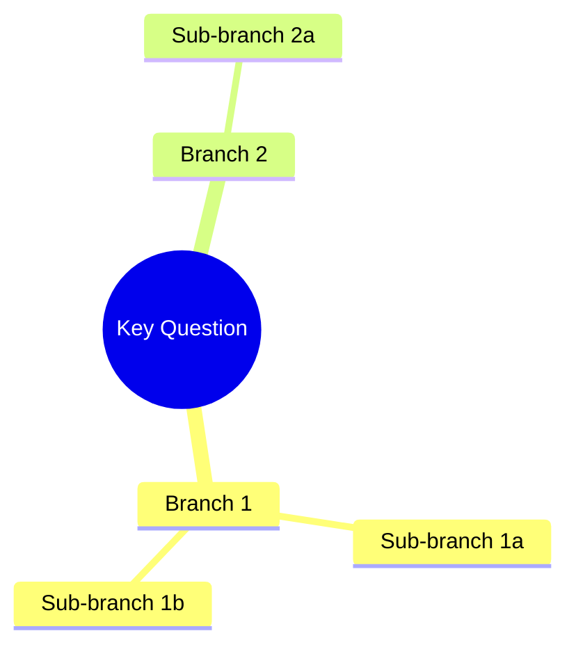

# Tasks: Structured Problem-Solving Framework

## Phase 1: Create Reference Files (parallel)

### Task 1.1: Create `references/problem-types.md`
**File:** `plugins/iflow-dev/skills/structured-problem-solving/references/problem-types.md`
**Action:** Create new (~180 lines)
**Plan step:** 1a
**Implements:** FR-2, FR-3

Create problem type taxonomy with 5 types. Each type has exactly 4 subsections:
1. `### Framing Approach` — SCQA focus for this type
2. `### Decomposition Method` — which method (MECE, issue tree, hypothesis tree, design space, generic)
3. `### PRD Sections` — domain-specific sections to add to Structured Analysis
4. `### Review Criteria` — 3 boolean existence checks (matching design taxonomy table)

Types to define:
- `## product/feature` — MECE decomposition, UX-focused criteria
- `## technical/architecture` — Issue tree, component boundary criteria
- `## financial/business` — MECE decomposition, quantified assumption criteria
- `## research/scientific` — Hypothesis tree, testability criteria
- `## creative/design` — Design space exploration, aesthetic/experiential criteria

**Source:** Design § Problem Type Taxonomy table + Component 2 § problem-types.md
**Done when:** File has 5 `## {type}` sections, each with 4 `### {subsection}` headings.

---

### Task 1.2: Create `references/scqa-framing.md`
**File:** `plugins/iflow-dev/skills/structured-problem-solving/references/scqa-framing.md`
**Action:** Create new (~90 lines)
**Plan step:** 1b
**Implements:** FR-8 (SCQA universal default), BS-3 (hardcoded fallback)

Create SCQA framing reference with:
- `## Template` — universal Situation/Complication/Question/Answer template with field descriptions
- `## Type-Specific Guidance` — 5 subsections showing how S/C/Q/A focus shifts per problem type
- Note: this template is the hardcoded fallback when other reference files are missing (BS-3)

**Source:** Design § Component 2 § scqa-framing.md
**Done when:** File has `## Template` section + 5 type-specific guidance subsections.

---

### Task 1.3: Create `references/decomposition-methods.md`
**File:** `plugins/iflow-dev/skills/structured-problem-solving/references/decomposition-methods.md`
**Action:** Create new (~120 lines)
**Plan step:** 1c
**Implements:** FR-5 (type-specific decomposition)

Create decomposition methods reference with 5 method sections:
- `## MECE Decomposition` — for product/feature, financial/business
- `## Issue Tree` — for technical/architecture
- `## Hypothesis Tree` — for research/scientific
- `## Design Space Exploration` — for creative/design
- `## Generic Issue Tree` — for "Other" types

Each method includes: description, tree format example, depth/breadth constraints (2-3 levels, 2-5 items per layer).

**Source:** Design § Component 2 § decomposition-methods.md + craftingcases.com constraints
**Done when:** File has 5 `## Method` sections, each with tree format example.

---

### Task 1.4: Create `references/review-criteria-by-type.md`
**File:** `plugins/iflow-dev/skills/structured-problem-solving/references/review-criteria-by-type.md`
**Action:** Create new (~90 lines)
**Plan step:** 1d
**Implements:** FR-6, NFR-2 (criteria table, not prose)

Create review criteria reference with:
- `## Universal Criteria` — 5 items (Problem clearly stated, Goals defined, Options explored, Direction chosen, Rationale documented)
- `## Type-Specific Criteria` — table with 4 columns: Problem Type, Check 1, Check 2, Check 3 — 5 rows matching spec C3 table
- `## Criteria Descriptions` — one paragraph per criterion explaining what "existence" means (not correctness)

Content must exactly match what goes into brainstorm-reviewer.md (Task 3.2). This file is the canonical source.

**Source:** Design § Component 2 + Spec § C3 criteria table
**Done when:** File has universal criteria list (5 items) + type-specific table (5 rows) + descriptions section.

---

## Phase 2: Create SKILL.md and Modify Reviewer (parallel)

### Task 2.1: Create structured-problem-solving SKILL.md
**File:** `plugins/iflow-dev/skills/structured-problem-solving/SKILL.md`
**Action:** Create new (~80-120 lines)
**Plan step:** 2
**Implements:** FR-1, FR-8, FR-9, NFR-1, NFR-3, BS-3
**Depends on:** Phase 1 (all reference files created)

Create SKILL.md with frontmatter and body:

**Frontmatter:**
```yaml
---
name: structured-problem-solving
description: "Applies SCQA framing and type-specific decomposition to problems. Use when brainstorming skill loads the structured problem-solving framework in Stage 1 Step 7."
---
```

**Body sections:**
1. `# Structured Problem-Solving` — purpose statement
2. `## Input` — problem_type, problem_statement, context (target_user, success_criteria, constraints, approaches)
3. `## Process` — 3 subsections:
   - `### 1. SCQA Framing` — link to `[scqa-framing.md](references/scqa-framing.md)`, apply universal template with type guidance
   - `### 2. Type-Specific Decomposition` — link to `[problem-types.md](references/problem-types.md)` and `[decomposition-methods.md](references/decomposition-methods.md)`, lookup type, select method, apply. For "Other": generic issue tree.
   - `### 3. Mind Map Generation` — convert decomposition to inline Mermaid `mindmap` syntax, shapes: `((root))` for question, `[square]` for categories, `(rounded)` for leaves, depth 2-3 levels max, output as fenced ` ```mermaid ` code block (no MCP tool dependency)
4. `## Output` — return `## Structured Analysis` section with 4 subsections: Problem Type, SCQA Framing, Decomposition, Mind Map
5. `## Graceful Degradation` — if reference files missing: apply SCQA framing only using hardcoded minimal template embedded here

**Constraints:**
- Must stay under 500 lines (target ~100)
- Must NOT be invocable standalone — only via brainstorming Stage 1 Step 7
- Domain knowledge lives in references, not SKILL.md
- Description must contain "Use when" and be >= 50 chars (validate.sh)

**Done when:** File < 500 lines, has valid frontmatter, references all 4 files, includes hardcoded SCQA fallback.

---

### Task 3.1: Replace brainstorm-reviewer Input section
**File:** `plugins/iflow-dev/agents/brainstorm-reviewer.md`
**Action:** Edit (replace lines 33-36)
**Plan step:** 3, Change 1
**Implements:** FR-6 (reviewer receives problem type via prompt)

Replace the existing Input section (lines 33-36):
```
## Input

You receive:
1. **Brainstorm file path** - The scratch file to review
```

With updated Input section:
```
## Input

You receive (via Task tool prompt):
1. **Brainstorm content** — full PRD markdown, passed inline in prompt
2. **Problem Type** (optional) — from `## Context` section of prompt. When present and not "none", apply type-specific criteria in addition to universal criteria.
```

**Important:** REPLACE, do not append (reviewer warning from phase-reviewer).

**Done when:** Input section has 2 items (brainstorm content + problem type).

---

### Task 3.2: Replace brainstorm-reviewer Checklist with split criteria
**File:** `plugins/iflow-dev/agents/brainstorm-reviewer.md`
**Action:** Edit (replace lines 66-74)
**Plan step:** 3, Change 2
**Implements:** FR-6, NFR-2, BS-2 (backward compat), BS-4 (existence check only)

Replace the existing Brainstorm Checklist (lines 66-74):
```
## Brainstorm Checklist

For a brainstorm to be ready for promotion, it needs:

- [ ] **Problem clearly stated** - What are we solving?
- [ ] **Goals defined** - What does success look like?
- [ ] **Options explored** - Were alternatives considered?
- [ ] **Direction chosen** - Is there a clear decision?
- [ ] **Rationale documented** - Why this approach?
```

With split criteria:
```
## Review Criteria

### Universal Criteria (always checked)

- [ ] **Problem clearly stated** — What are we solving?
- [ ] **Goals defined** — What does success look like?
- [ ] **Options explored** — Were alternatives considered?
- [ ] **Direction chosen** — Is there a clear decision?
- [ ] **Rationale documented** — Why this approach?

### Type-Specific Criteria (when Problem Type is present and not "none" or custom)

| Problem Type | Check 1 | Check 2 | Check 3 |
|---|---|---|---|
| product/feature | Target users defined | User journey described | UX considerations noted |
| technical/architecture | Technical constraints identified | Component boundaries clear | Migration/compatibility noted |
| financial/business | Key assumptions quantified | Risk factors enumerated | Success metrics are financial |
| research/scientific | Hypothesis stated and testable | Methodology outlined | Falsifiability criteria defined |
| creative/design | Design space explored (>1 option) | Aesthetic/experiential goals stated | Inspiration/references cited |

**When Problem Type is "none" or absent:** Universal criteria only (backward compatible).
**When Problem Type is a custom string (from "Other"):** Universal criteria only — no type-specific checks.
**Existence check only:** Check whether domain-relevant analysis EXISTS, not whether it's the RIGHT analysis (BS-4).
```

Content must exactly match `references/review-criteria-by-type.md` (Task 1.4) for the criteria table.

**Done when:** Section has universal checklist (5 items) + type-specific table (5 rows) + scope notes.

---

### Task 3.3: Update brainstorm-reviewer Review Process
**File:** `plugins/iflow-dev/agents/brainstorm-reviewer.md`
**Action:** Edit (replace lines 91-100)
**Plan step:** 3, Change 3
**Implements:** FR-6 (reviewer applies matching criteria)

Replace the existing Review Process (lines 91-100):
```
## Review Process

1. **Read the brainstorm file** thoroughly
2. **Check each checklist item** against the content
3. **For each gap found:**
   - Is it a blocker (cannot create feature)?
   - Is it a warning (quality concern)?
   - Is it a note (nice improvement)?
4. **Assess overall:** Is this ready?
5. **Return structured feedback**
```

With updated process:
```
## Review Process

1. **Read the brainstorm content** thoroughly (provided inline in prompt)
2. **Parse Problem Type** from `## Context` section (if provided)
3. **Check universal criteria** (5 items) against the content
4. **If known type:** Check 3 type-specific criteria from table above
5. **For each gap found:**
   - Is it a blocker (cannot create feature)?
   - Is it a warning (quality concern)?
   - Is it a note (nice improvement)?
6. **Assess overall:** Is this ready?
7. **Return structured feedback** including which criteria set was applied (universal only / universal + {type})
```

**Done when:** Process has 7 steps including Problem Type parsing and criteria set reporting.

---

## Phase 3: Modify Brainstorming SKILL.md

### Task 4.1: Insert Steps 6-8 into Stage 1 CLARIFY
**File:** `plugins/iflow-dev/skills/brainstorming/SKILL.md`
**Action:** Edit (insert after line 62, before line 64 `---`)
**Plan step:** 4, Change 1
**Implements:** FR-4 (problem type classification), FR-5 (framework loading), BS-1 (opt-in), BS-3 (graceful degradation), BS-5 (mind map)
**Depends on:** Tasks 2.1, 3.1-3.3

Insert ~60 lines after the exit condition line:
```
**Exit condition:** User confirms understanding is correct, OR you have answers to all 5 required items.
```

And before the `---` separator on line 64.

Content to insert (see plan Step 4 Change 1 for full detail):

```markdown

**After exit condition is satisfied, always run Steps 6-8 before proceeding to Stage 2:**

#### Step 6: Problem Type Classification

Present problem type options via AskUserQuestion:
```
AskUserQuestion:
  questions: [{
    "question": "What type of problem is this?",
    "header": "Problem Type",
    "options": [
      {"label": "Product/Feature", "description": "User-facing product or feature design"},
      {"label": "Technical/Architecture", "description": "System design, infrastructure, or technical debt"},
      {"label": "Financial/Business", "description": "Business model, pricing, or financial analysis"},
      {"label": "Research/Scientific", "description": "Hypothesis-driven investigation or experiment"},
      {"label": "Creative/Design", "description": "Visual, UX, or creative exploration"},
      {"label": "Skip", "description": "No framework — proceed with standard brainstorm"}
    ],
    "multiSelect": false
  }]
```

(User sees 7 options: 6 above + built-in "Other" for free text.)

#### Step 7: Optional Framework Loading

**If user selected a named type (not "Skip"):**
1. Derive sibling skill path: replace `skills/brainstorming` in Base directory with `skills/structured-problem-solving`
2. Read `{derived path}/SKILL.md` via Read tool
3. If file not found: warn "Structured problem-solving skill not found, skipping framework" → skip to Step 8
4. Read reference files as directed by SKILL.md
5. Apply SCQA framing to the problem
6. Apply type-specific decomposition (or generic issue tree for "Other")
7. Generate inline Mermaid mind map from decomposition
8. Write `## Structured Analysis` section to PRD (between Research Summary and Review History)

**If user selected "Other" (free text):**
- Apply SCQA framing (universal) + generic issue tree decomposition
- Store custom type string as-is

**If "Skip":** Set type to "none", skip Step 7 body entirely.

**Loop-back behavior:** If `## Structured Analysis` already exists in the PRD (from a previous Stage 7 → Stage 1 loop), delete it entirely before re-running Steps 6-8. Do NOT duplicate.

#### Step 8: Store Problem Type
- Add `- Problem Type: {type}` to PRD Status section (or `none` if skipped)
```

**Estimate:** ~55-65 lines inserted.
**Cross-skill Read (plan Step 0b):** Step 7's path derivation (replace `skills/brainstorming` with `skills/structured-problem-solving` in Base directory) is an unproven pattern. If it fails at runtime, the graceful degradation path (warn + skip framework) handles it. Document any findings.
**Done when:** Steps 6-8 appear after exit condition, before `---` separator. Step 6 has AskUserQuestion with 6 options. Step 7 has cross-skill Read instructions with graceful degradation. Step 8 stores type in Status.

---

### Task 4.2: Modify Stage 6 READINESS CHECK dispatch
**File:** `plugins/iflow-dev/skills/brainstorming/SKILL.md`
**Action:** Edit (replace line 169)
**Plan step:** 4, Change 2
**Implements:** FR-6 (prompt includes Problem Type)
**Depends on:** Tasks 3.1-3.3 (reviewer input format must be known)

Find the exact text (including leading `- `):
```
- prompt: PRD file path + request for JSON response
```

Replace with inline prompt that sends full content + Problem Type:
```
- prompt: |
    Review this brainstorm for promotion readiness.

    ## PRD Content
    {read PRD file and paste full markdown content here}

    ## Context
    Problem Type: {type from Step 8, or "none" if skipped/absent}

    Return your assessment as JSON:
    { "approved": true/false, "issues": [...], "summary": "..." }
```

**Done when:** Stage 6 dispatch sends inline PRD content + `Problem Type:` context line, not file path.

---

### Task 4.3: Add Problem Type to PRD Output Format Status section
**File:** `plugins/iflow-dev/skills/brainstorming/SKILL.md`
**Action:** Edit (modify within PRD Output Format fenced code block, around line 258-261)
**Plan step:** 4, Change 3 (part 1)
**Implements:** FR-7 (Status contains Problem Type)

In the Status section template inside the fenced code block:
```markdown
## Status
- Created: {date}
- Last updated: {date}
- Status: Draft
```

Add `- Problem Type: {type}` line:
```markdown
## Status
- Created: {date}
- Last updated: {date}
- Status: Draft
- Problem Type: {type or "none" if skipped}
```

**Done when:** Status section template includes Problem Type line.

---

### Task 4.4: Add Structured Analysis section to PRD Output Format
**File:** `plugins/iflow-dev/skills/brainstorming/SKILL.md`
**Action:** Edit (insert within PRD Output Format fenced code block, between Research Summary and Review History)
**Plan step:** 4, Change 3 (part 2)
**Implements:** FR-7 (Structured Analysis section exists), FR-9 (inline Mermaid mindmap)

Find the section break between `## Research Summary` and `## Review History` inside the fenced code block.

Insert conditional `## Structured Analysis` section template:
```markdown
## Structured Analysis
*(Only included when Problem Type is not "none")*

### Problem Type
{type} — {one-line description of why this type was selected}

### SCQA Framing
- **Situation:** {current state}
- **Complication:** {what changed / what's wrong}
- **Question:** {the key question to answer}
- **Answer:** {proposed direction}

### Decomposition
{Type-specific decomposition tree (text)}

### Mind Map

```

**Estimate:** ~15 lines added.
**Done when:** Structured Analysis template exists between Research Summary and Review History sections within the fenced code block.

---

## Phase 4: Verification

### Task 5.1: Verify line budgets
**Action:** Count lines
**Plan step:** 5a
**Depends on:** All Phase 2 and 3 tasks

Count actual lines:
- `plugins/iflow-dev/skills/structured-problem-solving/SKILL.md` — must be < 500 lines
- `plugins/iflow-dev/skills/brainstorming/SKILL.md` — must be < 500 lines (critical: design estimated ~474)

**If brainstorming SKILL.md exceeds 490 lines, apply trim plan:**
1. Compress AskUserQuestion JSON example in Step 6 (~10 lines saved)
2. Compress Step 7 numbered list to concise paragraph (~15 lines saved)
3. Last resort: extract Structured Analysis PRD template to new reference file

**Done when:** Both SKILL.md files are under 500 lines.

---

### Task 5.2: Verify cross-references and cross-skill Read
**Action:** Verify file paths resolve
**Plan step:** 5b + 0b (runtime verification)
**Depends on:** Task 5.1

1. Verify all 4 reference file paths resolve from structured-problem-solving/SKILL.md (check inline markdown links)
2. Verify brainstorm-reviewer criteria table content matches review-criteria-by-type.md exactly (same 5 rows, same 3 criteria per row — diff the tables)
3. Verify PRD Output Format changes are within the fenced code block (reviewer suggestion)
4. Verify cross-skill Read path derivation is documented in Step 7 (plan Step 0b: replace `skills/brainstorming` with `skills/structured-problem-solving` in Base directory path)

**Done when:** All references resolve, criteria tables match, edits are within fences, cross-skill Read mechanism documented.

---

### Task 5.3: Verify backward compatibility
**Action:** Spot-check
**Plan step:** 5c
**Depends on:** Task 5.2

Verify 3 backward-compat scenarios:
1. Brainstorm-reviewer with no Problem Type in prompt → only universal criteria mentioned in process
2. PRD without Problem Type in Status → no Structured Analysis section expected
3. "Skip" selection → type "none", no framework content appears

**Done when:** All 3 scenarios have correct handling in the code.

---

### Task 6.1: Run validate.sh
**Action:** Execute `./validate.sh`
**Plan step:** 6a
**Depends on:** Task 5.3

Run validation. Expect 0 errors, 0 warnings. Key checks:
- structured-problem-solving/SKILL.md: description >= 50 chars, contains "Use when", < 500 lines
- brainstorming/SKILL.md: < 500 lines
- brainstorm-reviewer.md: has model, color, example blocks in frontmatter

**Done when:** `./validate.sh` reports 0 errors, 0 warnings.

---

### Task 6.2: Verify file structure
**Action:** List files
**Plan step:** 6b
**Depends on:** Task 6.1

Verify expected file structure:
```
plugins/iflow-dev/skills/structured-problem-solving/
├── SKILL.md                           (new, <500 lines)
└── references/
    ├── problem-types.md               (new)
    ├── scqa-framing.md                (new)
    ├── decomposition-methods.md       (new)
    └── review-criteria-by-type.md     (new)

plugins/iflow-dev/skills/brainstorming/
└── SKILL.md                           (modified, <500 lines)

plugins/iflow-dev/agents/
└── brainstorm-reviewer.md             (modified)
```

Total: 5 new files, 2 modified files.

**Done when:** All 7 files exist in expected locations.

---

### Task 6.3: Spot-check key behaviors
**Action:** Read and verify
**Plan step:** 6c
**Depends on:** Task 6.2

Verify 5 key behaviors in final files:
1. Steps 6-8 appear after exit condition, before Stage 2 separator in brainstorming/SKILL.md
2. Explicit "delete existing Structured Analysis" instruction present for loop-back
3. "Other" handling: SCQA + generic issue tree, universal review criteria only
4. "Skip" handling: type "none", no framework content, no Structured Analysis
5. Stage 6 dispatch sends inline PRD content + `Problem Type:` line, not file path

**Done when:** All 5 behaviors verified correct.

---

## Task Summary

| Phase | Tasks | Parallelizable |
|---|---|---|
| Phase 1: Reference Files | 1.1, 1.2, 1.3, 1.4 | Yes (all 4 parallel) |
| Phase 2: SKILL.md + Reviewer | 2.1, 3.1, 3.2, 3.3 | 2.1 parallel with 3.1-3.3 |
| Phase 3: Brainstorming Mods | 4.1, 4.2, 4.3, 4.4 | Sequential within brainstorming file |
| Phase 4: Verification | 5.1, 5.2, 5.3, 6.1, 6.2, 6.3 | Sequential |

**Total:** 18 tasks across 4 phases, 2 parallel groups.
