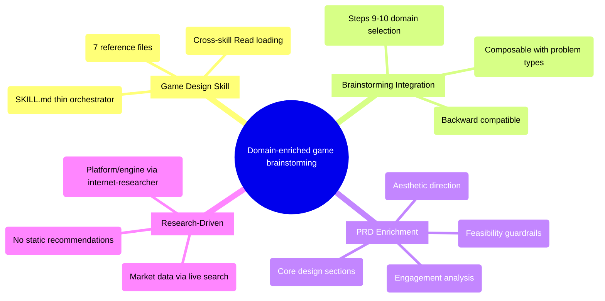

# PRD: Game Design Skill for Brainstorming

## Status
- Created: 2026-02-07
- Last updated: 2026-02-07
- Status: Draft
- Problem Type: creative/design

## Problem Statement
The iflow brainstorming workflow produces domain-agnostic PRDs. When a solo indie developer brainstorms a game idea, the process lacks game design frameworks (core loops, MDA, engagement mechanics), monetization awareness, aesthetic direction guidance, and platform evaluation criteria. This results in PRDs that miss critical dimensions needed to evaluate whether a game concept is sticky and financially viable.

### Evidence
- Current brainstorming skill has no domain-specific knowledge loading mechanism — Evidence: plugins/iflow-dev/skills/brainstorming/SKILL.md
- structured-problem-solving provides method frameworks (SCQA, MECE) but no domain knowledge — Evidence: plugins/iflow-dev/skills/structured-problem-solving/SKILL.md
- User input: needs game design frameworks, engines, platforms, economy, engagement, artistic direction — Evidence: User input

## Goals
1. Provide game design domain knowledge during brainstorming so PRDs for game concepts cover all critical design dimensions
2. Keep platform/engine recommendations research-driven (not static lists) so advice stays current
3. Include aesthetic direction guidance (art, music, game feel) as a first-class design dimension
4. Serve as advisory guardrails for monetization and market viability (reality check, not business plan)
5. Follow thin orchestrator pattern for extensibility to future domain skills

## Success Criteria
- [ ] Game brainstorm PRD contains sections: Game Design Overview, Engagement & Retention, Aesthetic Direction, Feasibility & Viability
- [ ] Each game section cites at least one reference framework (e.g., MDA, Bartle's, hook model)
- [ ] Platform/engine data in PRD comes from Stage 2 internet-researcher, not from static reference content
- [ ] Monetization section flags risks and assumptions without prescribing a specific pricing strategy
- [ ] Art/music/style articulated as structured design dimensions with genre-appropriate vocabulary
- [ ] Existing brainstorming behavior unchanged when no domain is selected (backward compatible)

## User Stories

### Story 1: Game Idea Brainstorming
**As a** solo indie developer
**I want** game design frameworks loaded during brainstorming
**So that** my game concept PRD covers core loop, engagement, monetization, and aesthetic direction without me having to remember all the dimensions

**Acceptance criteria:**
- PRD contains sections: Game Design Overview, Engagement & Retention, Aesthetic Direction, Feasibility & Viability
- Each section references a named framework (e.g., MDA for mechanics, Bartle's for player types)
- Stage 2 research includes platform/engine data specific to this game concept

### Story 2: Monetization Reality Check
**As a** solo indie developer
**I want** monetization models presented as advisory guardrails
**So that** I don't fall too in love with an idea that has no viable business model, but I'm not constrained to follow a prescribed model

**Acceptance criteria:**
- Monetization section flags risks and assumptions
- Does not dictate pricing strategy
- Presents common models as options to consider, not requirements

### Story 3: Aesthetic Direction
**As a** solo indie developer who isn't an artist or musician
**I want** structured guidance on art style, music, and game feel
**So that** I can articulate an aesthetic vision even though visual/audio design isn't my expertise

**Acceptance criteria:**
- Reference framework covers art styles, audio design, and game feel dimensions
- Helps me describe a mood/direction, not produce art assets
- Ties aesthetic choices back to genre and target audience

## Use Cases

### UC-1: Brainstorm a New Game Concept
**Actors:** Solo indie developer using iflow
**Preconditions:** Brainstorming Stage 1 complete, problem type selected
**Flow:**
1. After Steps 6-8 (problem type), Step 9 asks "Does this problem have a specialized domain?"
2. User selects "Game Design"
3. System loads game-design skill via cross-skill Read
4. Skill reads reference files (design frameworks, engagement, aesthetic, monetization, market, tech evaluation, review criteria)
5. Skill produces game-enriched PRD sections (Core Design, Engagement Analysis, Aesthetic Direction, Feasibility Assessment)
6. Stage 2 research agents search for current platform/engine/market data specific to this concept
7. PRD draft includes both domain framework sections and live research findings
**Postconditions:** PRD has game-specific design dimensions filled in
**Edge cases:**
- Game-design skill not found → warn and proceed with standard brainstorm
- User selects "None" for domain → no domain enrichment, standard flow

### UC-2: Domain Skill Not Installed
**Actors:** User without game-design skill installed
**Preconditions:** Step 9 asks about domain
**Flow:**
1. User selects "Game Design" but skill files don't exist
2. System warns: "Game design skill not found, proceeding without domain enrichment"
3. Brainstorming continues with standard flow
**Postconditions:** PRD is standard (no game sections), no errors
**Edge cases:**
- Partial skill (SKILL.md exists but some references missing) → load what's available, warn about missing files

## Edge Cases & Error Handling
| Scenario | Expected Behavior | Rationale |
|----------|-------------------|-----------|
| Domain skill not found | Warn and continue standard brainstorm | Graceful degradation, same as structured-problem-solving |
| Some reference files missing | Load available files, warn about missing | Partial domain knowledge better than none |
| User selects domain + problem type | Both load — method (SCQA) and domain (game design) | Orthogonal dimensions, no conflict |
| User selects "None" for domain | Skip Steps 9-10 entirely | Backward compatible |
| Brainstorming SKILL.md exceeds 500 lines after adding Steps 9-10 | Trim or extract to sub-process | Line budget constraint must be respected |

## Constraints

### Behavioral Constraints (Must NOT do)
- Must NOT prescribe a specific engine, platform, or tech stack — Rationale: platform landscape changes rapidly; recommendations must come from live research per game concept
- Must NOT prescribe a monetization strategy — Rationale: monetization is advisory guardrail, not a business plan; user may have different insights
- Must NOT produce art assets or music — Rationale: aesthetic direction is about articulating vision, not production
- Must NOT solution technical architecture — Rationale: PRD is about what/why, not how; technical feasibility is a sanity check only

### Technical Constraints
- SKILL.md must be <120 lines (thin orchestrator pattern) — Evidence: patterns.md, Feature #018
- Reference files ~100-160 lines each — Evidence: heuristics.md, Feature #018
- Brainstorming SKILL.md currently at 482/500 lines — Evidence: .meta.json Feature #018
- Cross-skill Read mechanism required for loading — Evidence: design.md Feature #018
- AskUserQuestion limited to 4 options per question — Evidence: tool schema validation

## Requirements

### Functional
- FR-1: game-design SKILL.md orchestrates loading of reference files and producing game-enriched PRD sections
- FR-2: Reference file `design-frameworks.md` covers MDA framework, core loop design, Bartle's player taxonomy, progression systems, and genre-mechanic mappings
- FR-3: Reference file `monetization-models.md` covers F2P, premium, hybrid models with risk/viability indicators (advisory only)
- FR-4: Reference file `tech-evaluation-criteria.md` provides evaluation dimensions for engines/platforms (NOT a static list of engines). These dimensions inform FR-11's internet-researcher queries — the researcher uses these criteria to evaluate current options per game concept.
- FR-5: Reference file `engagement-retention.md` covers hook models, progression mechanics, social features, daily engagement patterns, and retention frameworks
- FR-6: Reference file `market-analysis.md` provides competitor analysis frameworks and market sizing approach (reality-check guardrail)
- FR-7: Reference file `aesthetic-direction.md` covers art style taxonomies, audio design dimensions, game feel/juice, and mood-to-genre mappings
- FR-8: Reference file `review-criteria.md` provides domain-specific checks for brainstorm-reviewer (e.g., "core loop defined?", "monetization risks stated?")
- FR-9: Brainstorming SKILL.md gains Steps 9-10 for domain selection and loading after existing Steps 6-8
- FR-10: brainstorm-reviewer accepts optional domain review criteria from Stage 6 dispatch context
- FR-11: Platform/engine recommendations produced by internet-researcher at Stage 2, not from static reference content
- FR-12: PRD output format gains a `## Game Design Analysis` section (placed between Structured Analysis and Review History) when game-design domain is active, containing subsections: `### Game Design Overview` (MDA, core loop, genre-mechanic mapping), `### Engagement & Retention` (hook model, progression, social features), `### Aesthetic Direction` (art style, audio, game feel/juice), `### Feasibility & Viability` (monetization guardrails, market reality check, platform considerations from Stage 2 research)

### Non-Functional
- NFR-1: game-design SKILL.md <120 lines
- NFR-2: Each reference file <160 lines
- NFR-3: Brainstorming SKILL.md stays under 500 lines after Steps 9-10 addition
- NFR-4: No new agents required — existing agents handle game domain research
- NFR-5: Backward compatible — no domain selected = existing behavior unchanged

## Non-Goals
Strategic decisions about what this feature will NOT aim to achieve.

- Full Game Design Document (GDD) generation — Rationale: PRD is about requirements and goals, not production documentation. GDD is a downstream artifact.
- Technical architecture or engine selection — Rationale: PRD focuses on what/why; solutioning happens in design phase
- Art asset production or music composition — Rationale: skill provides direction frameworks, not creative output
- Team planning or project management — Rationale: out of scope for brainstorming phase

## Out of Scope (This Release)
Items excluded from current scope but may be considered later.

- Additional domain skills (fintech, healthcare, etc.) — Future consideration: same pattern can be replicated once game-design proves the domain skill concept
- Game-specific research agents (e.g., game-market-researcher) — Future consideration: if internet-researcher proves insufficient for game market data
- GDD template generation — Future consideration: could be a downstream skill invoked during design phase
- Multiplayer/networking feasibility assessment — Future consideration: adds complexity, v1 focuses on single-player and simple multiplayer
- Multi-domain composition (e.g., Game Design + Healthcare) — Future consideration: single domain per brainstorm is sufficient for v1; composition pattern can be designed if demand emerges

## Research Summary

### Internet Research
- MDA Framework (Mechanics-Dynamics-Aesthetics) remains foundational for game design analysis — Source: gamedesignskills.com/game-design/mda/
- Core loop design follows 3-layer model: Core Gameplay → Meta Game → Content Strategy — Source: meshy.ai/blog/game-loop
- Bartle's Player Taxonomy: Achievers, Explorers, Socializers, Killers (extended 8-type model adds implicit/explicit axis) — Source: juegostudio.com/blog/types-of-gamers
- Progression systems: vertical (numbers increase) vs horizontal (new abilities/characters); nested loops create engagement — Source: gamedesignskills.com/game-design/core-loops-in-gameplay/
- Indie monetization: Premium still dominant (60.12% revenue), F2P lowers barrier, subscription rising 21.6% annually — Source: medium.com/design-bootcamp/entering-indie-games-in-2025
- Platform economics: Epic 88% rev share (100% first $1M), Steam 70% (89% revenue in top 10% titles), mobile 51.42% market ($92.6B) — Source: medium.com/design-bootcamp/entering-indie-games-in-2025
- Retention benchmarks: Day 1 ~24%, Day 7 10-20%, Day 30 2.5-5%; community-driven retention (Discord/Reddit) essential — Source: nudgenow.com/blogs/mobile-game-retention-benchmarks-industry
- Game feel/"juice" is critical for indie games — responsive input, particle effects, screen shake, sound feedback — Source: wardrome.com/game-feel-the-secret-sauce
- Art style: pixel art renaissance ($3.8B market), players reward uniqueness over fidelity — Source: thinkgamerz.com/retro-art-revival-pixel-low-poly-trend-2025/
- Audio design "half the experience" but often neglected; tools: Wwise (72% 5-star), Audacity (free), ElevenLabs (AI) — Source: indiegamebusiness.com/indie-game-sound-design/
- Engine landscape 2025-2026: Godot best for 2D/indie (free, open-source), Unity for mobile/cross-platform, Unreal for high-end 3D — Source: dev.to/philipjohnbasile
- Indie market sizing: $4.85B (2025) → $10.83B (2031) at 14.32% CAGR — Source: mordorintelligence.com/industry-reports/indie-game-market
- Indie success factors: niche targeting, TikTok/Discord community, simpler accessible mechanics, meme culture alignment — Source: medium.com/design-bootcamp/entering-indie-games-in-2025

### Codebase Analysis
- structured-problem-solving follows thin orchestrator pattern: SKILL.md (115 lines) + 4 reference files — Location: plugins/iflow-dev/skills/structured-problem-solving/
- Cross-skill Read mechanism: derive sibling path by replacing skill name in Base directory — Location: brainstorming/SKILL.md:91
- Brainstorming SKILL.md at 482/500 lines — 18 lines headroom for Steps 9-10 — Location: plugins/iflow-dev/skills/brainstorming/SKILL.md
- Stage 6 dispatch passes "Problem Type: {type}" to brainstorm-reviewer in ## Context section — Location: brainstorming/SKILL.md:213-226
- brainstorm-reviewer accepts type-specific criteria via lookup table (5 types x 3 checks) — Location: agents/brainstorm-reviewer.md:79-89
- No existing game-related content in codebase — this would be first domain skill — Location: Grep search
- Graceful degradation pattern: warn and apply fallback if files missing — Location: structured-problem-solving/SKILL.md:104-115

### Existing Capabilities
- structured-problem-solving: Provides SCQA + decomposition method (composable with game-design domain) — How it relates: orthogonal dimension, both can be active simultaneously
- internet-researcher: Already capable of game market/platform research at Stage 2 — How it relates: no new agent needed for live recommendations
- brainstorm-reviewer: Already supports type-specific criteria extension — How it relates: domain criteria can be added via same mechanism
- Thin Orchestrator + Reference Files pattern: Established in Feature #018, ready to replicate — How it relates: exact pattern for game-design skill

## Structured Analysis

### Problem Type
creative/design — This is a creative exploration of how to structure game design knowledge for optimal brainstorming output, with multiple viable design directions to evaluate.

### SCQA Framing
- **Situation:** The iflow brainstorming workflow produces domain-agnostic PRDs using structured problem-solving (SCQA + decomposition). Domain-specific knowledge is not available during ideation.
- **Complication:** A solo indie developer brainstorming a game idea gets no guidance on core loops, engagement mechanics, monetization viability, aesthetic direction, or platform suitability — critical dimensions for evaluating game concepts.
- **Question:** What design direction best serves the goal of domain-enriched brainstorming for game concepts?
- **Answer:** A thin orchestrator skill (game-design) with ~7 reference files providing evaluation frameworks, loaded as a new "domain dimension" in brainstorming Stage 1.

### Decomposition
```
What design direction best serves domain-enriched game brainstorming?
├── Option A: Monolithic game-design skill
│   ├── Strength: Self-contained, no brainstorming modifications needed
│   └── Risk: Duplicates brainstorming flow, can't compose with problem types
├── Option B: Domain dimension (thin orchestrator + reference files)
│   ├── Strength: Composable with existing problem types, extensible to future domains
│   └── Risk: Requires brainstorming SKILL.md modification (line budget impact)
├── Option C: Game-specific agents only (no skill)
│   ├── Strength: No skill changes, agents provide knowledge on demand
│   └── Risk: No structured framework, knowledge is ad-hoc per brainstorm session
└── Evaluation Criteria
    ├── Aesthetic fit: follows thin orchestrator pattern established in 018
    ├── Functional fit: enriches PRDs without replacing existing flow
    └── Extensibility: future domains can follow same pattern
```

### Mind Map


## Review History

### Review 1 (2026-02-07)
**Reviewer:** prd-reviewer (Stage 4)
**Decision:** Not approved — 4 blockers, 3 warnings, 2 suggestions

**Findings:**
- [blocker] Line budget (482/500) has no concrete resolution plan (at: Constraints/Open Questions)
- [blocker] Cross-skill Read mechanism unverified for game-design skill (at: Technical Constraints)
- [blocker] Review criteria delivery format unspecified — how do domain criteria reach brainstorm-reviewer? (at: FR-10)
- [blocker] PRD section placement underspecified — no template showing game-specific sections (at: FR-12)
- [warning] Evidence inconsistency in some research citations (at: Research Summary)
- [warning] FR-4/FR-11 ownership unclear — who provides dimensions vs who uses them? (at: Requirements)
- [warning] Story 1 acceptance criteria vague — not verifiable (at: User Stories)
- [suggestion] Multi-domain non-goal is scope padding — move to Out of Scope (at: Non-Goals)
- [suggestion] Success Criteria mixes implementation constraints with outcomes (at: Success Criteria)

**Corrections Applied:**
- Success Criteria rewritten to be outcome-focused with specific section names — Reason: blocker on verifiability
- Story 1 acceptance criteria made verifiable with named frameworks and section references — Reason: warning on vagueness
- Line budget Open Question updated with concrete 3-step resolution plan (fit, trim, extract) — Reason: blocker on no resolution
- Cross-skill Read added as resolved Open Question with proven pattern reference — Reason: blocker on verification
- Review criteria delivery format specified with exact inline format and criteria list — Reason: blocker on unspecified format
- FR-12 expanded with concrete section template (Game Design Analysis with 4 subsections) — Reason: blocker on missing template
- FR-4 clarified to show handoff to FR-11 (dimensions inform researcher queries) — Reason: warning on ownership
- Multi-domain moved from Non-Goals to Out of Scope — Reason: suggestion on scope categorization

## Open Questions
- **Line budget:** Steps 9-10 estimated ~15-18 lines. With 18 lines headroom (482/500), budget is tight but feasible. Concrete plan: (a) Steps 9-10 are a simple AskUserQuestion + cross-skill Read dispatch — ~15 lines of structured content, (b) if over budget, trim existing comment lines or compress whitespace in Steps 6-8, (c) worst case: extract domain loading to a shared `domain-loading` skill that brainstorming delegates to (same as structured-problem-solving delegation). — Resolved: feasible within budget, with fallback extraction plan.
- **Domain review criteria delivery:** Stage 6 dispatch adds `Domain: game-design` and inline criteria list to `## Context` section (same pattern as `Problem Type: {type}`). Format: `Domain Review Criteria:\n- Core loop defined?\n- Monetization risks stated?\n- Aesthetic direction articulated?\n- Engagement hooks identified?`. Reviewer parses these as additional checks alongside type-specific criteria. — Resolved: inline, consistent with existing pattern.
- **PRD section placement:** Game-specific sections are ADDITIONAL to Structured Analysis (not a replacement). Placed between Structured Analysis and Review History. Template: `## Game Design Analysis` with subsections `### Game Design Overview`, `### Engagement & Retention`, `### Aesthetic Direction`, `### Feasibility & Viability`. Each subsection references its source framework. — Resolved: additional section after Structured Analysis.
- **Cross-skill Read mechanism:** Proven for structured-problem-solving (Feature #018). Same mechanism applies for game-design — derive sibling path by replacing `skills/brainstorming` with `skills/game-design` in Base directory. If Read fails, warn and skip domain enrichment (graceful degradation). — Resolved: proven pattern, same fallback.

## Next Steps
Ready for /iflow-dev:create-feature to begin implementation.
