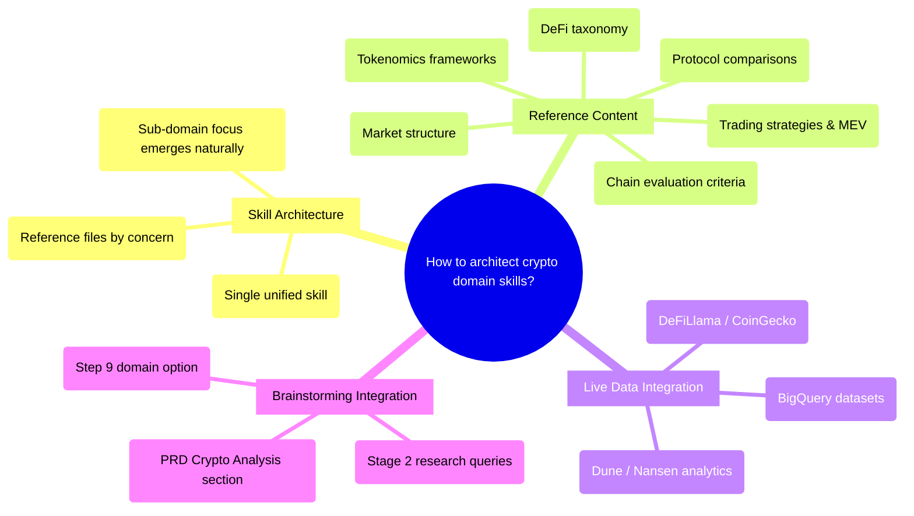

# PRD: Crypto Domain Skills for Brainstorming

## Status
- Created: 2026-02-08
- Last updated: 2026-02-08
- Status: Draft
- Problem Type: multi-domain/crypto (varies by sub-domain)

## Problem Statement
When brainstorming crypto ideas — whether DeFi protocols, trading strategies, tokenomic designs, or on-chain products — the PRDs lack crypto-specific nuance. Protocol trade-offs, tokenomics models, MEV strategies, consensus mechanism comparisons, and market microstructure considerations are easily missed. The game-design domain skill proves the enrichment pattern works, but crypto has unique challenges: it spans multiple problem types (financial, technical, product), needs live data integration, and covers sub-domains that may be too distinct to unify.

### Evidence
- No crypto-related content exists in the codebase — Evidence: grep search across entire codebase returned zero crypto domain knowledge
- Game-design skill successfully enriches PRDs with domain-specific analysis — Evidence: plugins/iflow-dev/skills/game-design/SKILL.md:1-103
- Backlog items 00010 ("add quant trader and researcher team") and 00011 ("add crypto team") request this capability — Evidence: docs/backlog.md
- Brainstorming SKILL.md at 484/500 lines limits how many domain-specific blocks can be added inline — Evidence: plugins/iflow-dev/skills/brainstorming/SKILL.md:484

## Goals
1. Provide crypto-domain enrichment during brainstorming that captures protocol nuances, tokenomics trade-offs, and market dynamics
2. Cover three sub-domains: quant research (investment/strategy), HFT/EVM (algorithms/exploitation), and tokenomic design (business models)
3. Guide Stage 2 internet research toward crypto-specific data sources (BigQuery, on-chain APIs, DeFiLlama) for evidence-backed PRDs
4. Domain selection is optional — selecting "None" in Step 9 skips crypto enrichment entirely

## Success Criteria
- [ ] Crypto domain skill exists following the thin orchestrator + reference files pattern
- [ ] Reference files cover protocols, tokenomics, DeFi patterns, MEV taxonomy, quant strategies, and market structure
- [ ] Brainstorming Step 9 offers crypto as a domain option
- [ ] Stage 2 internet-researcher receives crypto-specific research context including live data source guidance
- [ ] Brainstorm-reviewer validates crypto domain criteria as warnings
- [ ] Selecting "None" in Step 9 skips crypto enrichment (domain selection is optional)
- [ ] PRD output includes conditional Crypto Analysis section when domain is active

## User Stories

### Story 1: Crypto Idea Enrichment
**As a** solo crypto builder **I want** domain-specific analysis applied to my brainstormed crypto ideas **So that** PRDs capture protocol trade-offs, tokenomics considerations, and market dynamics I might miss

**Acceptance criteria:**
- Brainstorming Step 9 shows "Crypto/Web3" option alongside "Game Design" and "None"
- Selecting it loads crypto frameworks and applies them to the concept
- PRD gains a "Crypto Analysis" section with structured sub-sections

### Story 2: Quant Research Ideation
**As an** investment researcher **I want** frameworks for evaluating trading strategies, arbitrage opportunities, and risk models **So that** brainstormed quant ideas are grounded in established strategy patterns and risk awareness

**Acceptance criteria:**
- Reference files cover quant strategy taxonomy (HFT, pairs trading, arbitrage, market making, momentum, mean reversion)
- MEV taxonomy included (front-running, sandwich, arbitrage, liquidation)
- Risk frameworks and factor models referenced

### Story 3: Tokenomic Design Validation
**As a** crypto builder **I want** tokenomics design frameworks applied to my token concepts **So that** I consider distribution, governance, utility, and economic sustainability before building

**Acceptance criteria:**
- Reference files cover token utility models, distribution strategies, governance patterns
- Monetization/sustainability analysis with risk flags (like game-design's monetization file)
- Protocol comparison dimensions (L1/L2, EVM/non-EVM, consensus mechanisms)

### Story 4: Live Data Integration
**As a** researcher **I want** Stage 2 internet research to be guided toward crypto-specific data sources **So that** PRDs reference current market data, TVL, protocol metrics, and on-chain analytics

**Acceptance criteria:**
- Stage 2 query enhancement directs internet-researcher to BigQuery datasets, DeFiLlama, CoinGecko, Dune Analytics
- Tech evaluation dimensions guide platform/chain research
- Market data is research-driven (not static in reference files)

## Use Cases

### UC-1: DeFi Protocol Brainstorm
**Actors:** Solo crypto builder | **Preconditions:** Brainstorming session active, Stage 1 complete
**Flow:** 1. User selects "Crypto/Web3" in Step 9 2. Crypto skill loads reference files 3. Applies tokenomics, DeFi protocol, and market frameworks to concept 4. Holds analysis in memory (two-phase write) 5. Stage 2 research includes crypto-specific queries 6. Stage 3 writes Crypto Analysis to PRD
**Postconditions:** PRD contains Crypto Analysis section with protocol design, tokenomics, market context
**Edge cases:** If user's idea is pure quant (no protocol design), tokenomics subsection may be sparse — that's OK

### UC-2: MEV/HFT Strategy Brainstorm
**Actors:** Investment researcher | **Preconditions:** Same as UC-1
**Flow:** Same flow but MEV taxonomy, EVM mechanics, and algorithm pattern references are most relevant
**Postconditions:** PRD contains Crypto Analysis with strategy classification, risk assessment, technical feasibility
**Edge cases:** HFT-specific content may overlap with quant research — reference files should cross-reference

## Edge Cases & Error Handling
| Scenario | Expected Behavior | Rationale |
|----------|-------------------|-----------|
| User selects Crypto but idea isn't crypto-related | Apply frameworks anyway — user chose intentionally | Don't second-guess domain selection |
| Reference file missing | Warn and skip that file's analysis, continue with available refs | Per-file graceful degradation (game-design pattern) |
| All reference files missing | Warn "No reference files found, skipping domain enrichment" and STOP | Game-design pattern |
| BigQuery/live data unavailable | Internet-researcher handles gracefully — returns what's available | Stage 2 already has fallback behavior |
| Brainstorming SKILL.md exceeds 500 lines after modification | Must extract domain loading to generic pattern or trim further | Line budget is a hard constraint |

## Constraints

### Behavioral Constraints (Must NOT do)
- Must NOT recommend specific tokens, coins, or investment positions — Rationale: Legal liability, rapidly changing market
- Must NOT include specific price predictions or financial advice — Rationale: Same as above
- Must NOT hardcode specific protocol names as recommendations — Rationale: Protocols change rapidly; use evaluation dimensions instead (same as game-design's no-engine-names constraint)
- Must NOT present any strategy as guaranteed profitable — Rationale: All strategies carry risk

### Technical Constraints
- Brainstorming SKILL.md line budget: currently 484/500, only 16 lines headroom — Evidence: plugins/iflow-dev/skills/brainstorming/SKILL.md
- SKILL.md must be <120 lines (NFR from game-design precedent) — Evidence: docs/features/019-game-design-skill/spec.md
- Reference files must be <160 lines each — Evidence: Same spec
- Domain skill pattern: thin orchestrator + reference files, invoked inline by brainstorming Step 10 — Evidence: plugins/iflow-dev/skills/game-design/SKILL.md
- Brainstorm-reviewer has hardcoded game-design criteria lookup table — Evidence: plugins/iflow-dev/agents/brainstorm-reviewer.md:118-123

## Requirements

### Functional
- FR-1: Create crypto-analysis domain skill at plugins/iflow-dev/skills/crypto-analysis/ following game-design pattern
- FR-2: SKILL.md references all reference files, defines Input/Process/Output/Graceful Degradation
- FR-3: Reference files cover: protocol comparison dimensions, DeFi taxonomy, tokenomics frameworks, quant strategy patterns, MEV classification, market structure, risk frameworks
- FR-4: Tech evaluation file provides chain/protocol evaluation dimensions as questions (no specific recommendations)
- FR-5: Monetization/sustainability file presents token economic models with risk indicators (advisory only)
- FR-6: Review-criteria.md defines domain-specific criteria for brainstorm-reviewer validation, including: (1) Protocol context defined? — subsection `### Protocol & Chain Context`, keywords: `protocol`, `chain`, `L1`, `L2`, `EVM`; (2) Tokenomics risks stated? — subsection `### Tokenomics & Sustainability`, keywords: `tokenomics`, `token`, `distribution`, `governance`, `supply`; (3) Market dynamics assessed? — subsection `### Market & Strategy Context`, keywords: `market`, `TVL`, `liquidity`, `volume`, `strategy`; (4) Risk framework applied? — subsection `### Risk Assessment`, keywords: `risk`, `MEV`, `exploit`, `regulatory`, `audit`
- FR-7: Brainstorming SKILL.md Step 9 gains "Crypto/Web3" option
- FR-8: Brainstorming SKILL.md Step 10 gains crypto-analysis path derivation and loading
- FR-9: Stage 2 query enhancement adds crypto-specific research prompts (BigQuery, DeFiLlama, on-chain data guidance)
- FR-10: PRD Output Format gains conditional "## Crypto Analysis" section with subsections: `### Protocol & Chain Context` (chain selection rationale, consensus trade-offs, EVM/non-EVM considerations), `### Tokenomics & Sustainability` (token utility model, distribution strategy, governance pattern, economic sustainability risk flags), `### Market & Strategy Context` (market positioning, competitive landscape, TVL/liquidity considerations, strategy classification), `### Risk Assessment` (MEV exposure, smart contract risks, regulatory considerations, market risks)
- FR-11: Brainstorm-reviewer gains crypto domain criteria parsing
- FR-12: Stage 6 dispatch forwards crypto domain review criteria

### Non-Functional
- NFR-1: crypto-analysis SKILL.md <120 lines
- NFR-2: Each reference file <160 lines
- NFR-3: Brainstorming SKILL.md remains <=500 lines after modifications
- NFR-4: No new agents created (domain skills don't need agents)
- NFR-5: Domain selection optional — "None" path skips enrichment, absent crypto domain in reviewer uses universal+type criteria only

## Non-Goals
- Creating standalone crypto research agents — Rationale: Scope is brainstorm enrichment only (user confirmed). Standalone agents could be a future backlog item.
- Real-time price feeds or live trading integration — Rationale: Brainstorming is about ideation, not execution. Live data comes through internet-researcher during Stage 2.
- Smart contract code generation or auditing — Rationale: Out of scope for brainstorming; would be a separate tool/agent.
- Replacing human crypto expertise — Rationale: Framework provides structure and prompts; expert judgment still required.

## Out of Scope (This Release)
- MCP server for BigQuery/on-chain data — Future consideration: Could add dedicated MCP server later for richer data access beyond what internet-researcher provides
- Additional domain skills (fintech, healthcare, etc.) — Future consideration: Each is a separate feature following the same domain skill pattern
- Domain-loading extraction to generic pattern — Future consideration: When 3+ domains exist, extract Steps 9-10 to be data-driven rather than per-domain hardcoded blocks. Current approach adds per-domain blocks (~5-8 lines each).
- Sub-domain selection within crypto — Future consideration: Could add a second AskUserQuestion to select quant/HFT/tokenomics focus, but initial version applies all three

## Research Summary

### Internet Research
- Messari 2026 defines 7 crypto sectors: Cryptomoney, TradFi, Chains, DeFi, AI x Crypto, DePIN, Consumer Apps — Source: https://onekey.so/blog/ecosystem/messari-2026-research-trends-across-seven-crypto-sectors/
- CCAF formal DeFi taxonomy: trading, lending, asset management, blockchain interoperability — Source: https://ccaf.io/defi/taxonomy
- MEV taxonomy (arxiv): front-running, back-running, sandwich, arbitrage, liquidation, time-bandit — Source: https://arxiv.org/html/2411.03327v1
- 16+ blockchain MCP servers exist (Web3 MCP, EVM MCP, CoinGecko, Cryo MCP, etc.) — Source: https://github.com/royyannick/awesome-blockchain-mcps
- BigQuery hosts 25+ blockchain datasets (Ethereum, Bitcoin, Polygon, Solana, etc.) updated daily — Source: https://github.com/blockchain-etl/public-datasets
- DeFiLlama: open API, no token required, tracks TVL/prices/volumes/fees across all major protocols — Source: https://dev.to/stablecoinstrategist/how-developers-can-leverage-defillama-for-real-time-defi-analytics-56be
- Tokenomics frameworks: Token Utility Canvas (Outlier Ventures), morphological framework (ScienceDirect), CadCAD simulation — Source: https://www.sciencedirect.com/science/article/pii/S2096720922000094
- Quant strategies: HFT, pairs trading, cross-exchange arbitrage, market making, momentum, mean reversion — Source: https://digiqt.com/blog/algo-trading-for-quant/
- Protocol comparison dimensions: L1/L2, EVM/non-EVM, PoW/PoS/PoH, optimistic/ZK rollups, modular/monolithic — Source: https://faisalkhan.com/knowledge-center/industry-perspective-commentary/evm-vs-non-evm-and-blockchain-layer-models-a-complete-guide-for-beginners/
- MarketVector provides institutional-grade 3-tier digital asset classification (GICS-equivalent for crypto) — Source: https://www.marketvector.com/indexes/digital-assets/taxonomy
- ESMA published formal MEV risk analysis (July 2025) — regulatory relevance growing — Source: https://www.esma.europa.eu/

### Codebase Analysis
- Game-design skill pattern: SKILL.md (103 lines) + 7 reference files (53-108 lines each) — Location: plugins/iflow-dev/skills/game-design/
- Brainstorming SKILL.md at 484/500 lines — only 16 lines headroom — Location: plugins/iflow-dev/skills/brainstorming/SKILL.md:484
- Brainstorm-reviewer has hardcoded game-design criteria table — Location: plugins/iflow-dev/agents/brainstorm-reviewer.md:118-123
- No existing crypto content in codebase — Location: grep search
- Backlog items 00010 and 00011 request crypto/quant capabilities — Location: docs/backlog.md
- Skills auto-discover from directory — no plugin.json modification needed — Location: plugins/iflow-dev/.claude-plugin/plugin.json
- Feature 019 design doc confirms: "Adding a domain = adding an AskUserQuestion option + a new skill folder" — Location: docs/features/019-game-design-skill/design.md

### Existing Capabilities
- game-design skill — How it relates: exact template pattern to follow for crypto domain skill
- structured-problem-solving skill — How it relates: "financial/business" problem type with MECE decomposition naturally complements crypto brainstorming
- brainstorm-reviewer — How it relates: already supports domain criteria parsing, needs crypto-specific criteria added
- internet-researcher — How it relates: handles Stage 2 live data fetching, needs crypto-specific query enhancement

## Structured Analysis
### Problem Type
multi-domain/crypto — The crypto domain spans financial (quant/investment), technical (HFT/EVM), and product (tokenomics) problem types, requiring a flexible structure.

### SCQA Framing
- **Situation:** The iflow brainstorming workflow supports domain-specific enrichment via domain skills (currently game-design). You're a solo crypto builder and investment researcher working across quant research, HFT/EVM algorithms, and tokenomic design.
- **Complication:** Brainstormed crypto ideas lack domain nuance — protocol trade-offs, tokenomics models, DeFi patterns, MEV strategies, market microstructure. The three sub-domains are distinct enough to question whether they should be unified or separate, and live data integration adds complexity beyond static reference files.
- **Question:** How should we architect crypto domain skill(s) to provide comprehensive, nuanced crypto enrichment during brainstorming while fitting the existing domain skill pattern?
- **Answer:** Create a single unified crypto-analysis domain skill with reference files organized by sub-domain concern (not by the three user directions), since all three directions share foundational concepts (protocols, tokenomics, market structure). Live data comes through Stage 2 research enhancement, not MCP servers.

### Decomposition
```
How should we architect crypto domain skills?
├── Skill Architecture (DECISION: single unified skill)
│   ├── Single skill covers all 3 directions via shared reference files
│   ├── Reference files organized by concern (protocols, tokenomics, strategies, market)
│   └── Sub-domain focus emerges from which frameworks are most relevant to the concept
├── Reference Content Scope (~7-8 files)
│   ├── Protocol comparison dimensions (L1/L2, EVM/non-EVM, consensus, rollups)
│   ├── DeFi protocol taxonomy (trading, lending, asset mgmt, interoperability)
│   ├── Tokenomics frameworks (utility models, distribution, governance, sustainability)
│   ├── Trading strategy patterns (quant strategies, MEV taxonomy, risk models)
│   ├── Market structure & data sources (TVL, volume, on-chain analytics dimensions)
│   ├── Chain/platform evaluation criteria (questions, not recommendations)
│   └── Review criteria for brainstorm-reviewer
├── Live Data Integration (via Stage 2 enhancement)
│   ├── BigQuery blockchain datasets guidance
│   ├── DeFiLlama/CoinGecko API pointers
│   ├── On-chain analytics platforms (Dune, Nansen, Flipside)
│   └── Research queries for current market data
└── Brainstorming Integration (~5-8 lines in SKILL.md)
    ├── Step 9: Add "Crypto/Web3" option
    ├── Step 10: Add crypto-analysis path derivation
    ├── Stage 2: Add crypto-specific research prompts
    ├── PRD format: Add conditional Crypto Analysis section
    └── Stage 6: Forward crypto domain criteria
```

### Mind Map


## Review History

### Review 1 (2026-02-08)
**Findings:**
- [blocker] "Backward compatibility" language contradicts CLAUDE.md's "No backward compatibility" principle (at: Goal 4, SC-6, NFR-5)
- [blocker] FR-6 lacks concrete crypto review criteria specification — brainstorm-reviewer needs subsection headers and keywords (at: FR-6)
- [warning] Goal 3 says "Integrate live data sources" but implementation is guidance to internet-researcher, not direct integration (at: Goal 3)
- [warning] FR-10 missing output template subsections — reviewer can't validate completeness without defined structure (at: FR-10)
- [warning] Open Questions 1 and 4 already answered in Out of Scope — contradictory (at: Open Questions)
- [false-positive] Reviewer flagged "FR-1 through FR-12 listed as summary range" — actual PRD has all 12 FRs individually specified (at: FR section)
- [false-positive] Reviewer flagged "User stories lack acceptance criteria" — all 4 stories have explicit acceptance criteria (at: User Stories)
- [false-positive] Reviewer flagged "Missing Use Cases section" — UC-1 and UC-2 are present (at: Use Cases)

**Corrections Applied:**
- Reworded Goal 4 from "Maintain backward compatibility" to "Domain selection is optional" — aligns with CLAUDE.md
- Reworded Goal 3 from "Integrate" to "Guide toward" — accurately describes the approach
- Updated SC-6 and NFR-5 to use "optional" instead of "backward compatible"
- Expanded FR-6 with concrete crypto criteria: 4 criteria with subsection headers and keywords
- Expanded FR-10 with Crypto Analysis output template subsections
- Removed Open Questions 1 and 4 (already resolved in Out of Scope)
- False positives noted but no changes needed — PRD content was correct

## Open Questions
- How many reference files? Game-design has 7 at ~643 total lines. Crypto may need 7-8 given the breadth of the domain.
- Should the three sub-domains (quant, HFT/EVM, tokenomics) be selectable within the crypto skill (a second AskUserQuestion), or should all frameworks apply universally? (Deferred to Out of Scope for this release — initial version applies all three.)

## Next Steps
Ready for /iflow-dev:create-feature to begin implementation.
