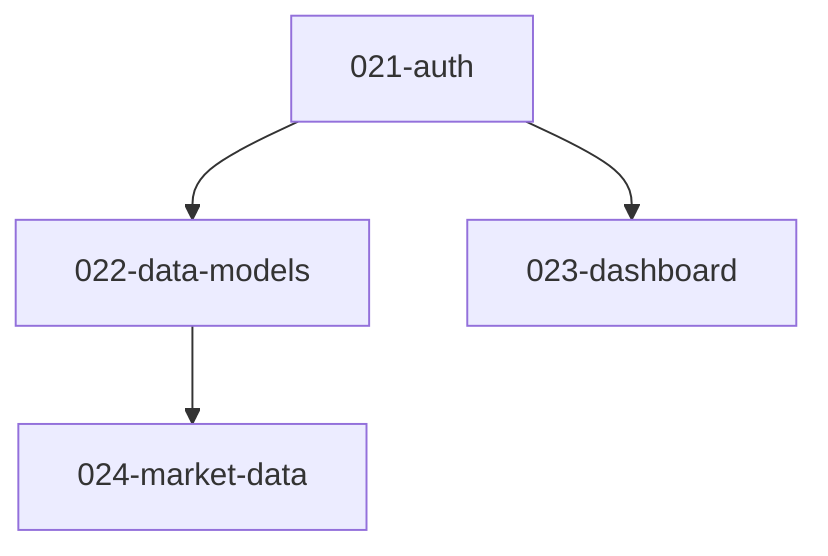

# Design: Project-Level Workflow Foundation

## Prior Art Research

### Codebase Patterns

| Pattern | Location | Relevance |
|---------|----------|-----------|
| Brainstorm Stage 7 AskUserQuestion | `brainstorming/SKILL.md:274-336` | Insertion point for "Promote to Project" option |
| create-feature command flow | `commands/create-feature.md` | Template for create-project: ID derivation, slug, .meta.json, branch, mode |
| workflow-transitions validateAndSetup | `skills/workflow-transitions/SKILL.md:10-99` | 4-step procedure; needs new Step 5 for context injection |
| workflow-state schema | `skills/workflow-state/SKILL.md:183-301` | Schema docs need new fields + planned status |
| Agent YAML frontmatter + JSON output | `agents/spec-reviewer.md`, `agents/prd-reviewer.md` | Pattern for new decomposer/reviewer agents |
| Review-fix cycle | `commands/specify.md` (Stage 1 loop) | Pattern for decomposition reviewer cycle |
| Mermaid dependency graph | `skills/breaking-down-tasks/SKILL.md:94-174` | Reusable for roadmap.md feature DAG |
| validate.sh feature metadata | `validate.sh:479-528` | Required fields check at line 483; needs planned status handling |
| session-start.sh Python block | `hooks/session-start.sh:22-48` | Scans for active features; needs planned status exclusion + project context |
| show-status 3 sections | `commands/show-status.md` | Needs project grouping section |
| list-features simple table | `commands/list-features.md` | Needs planned features + project column |
| Decomposing skill (domain pattern) | `skills/brainstorming/SKILL.md:108-143` (Step 9-10) | Domain skill loading pattern reusable for decomposing skill invocation |

### External Solutions

| Finding | Source | Adoption |
|---------|--------|----------|
| POSIX `tsort` command | coreutils | **Adopted.** Zero-dependency topological sort. Pipe adjacency pairs, get ordered output. Available on macOS and Linux. |
| `toposort` npm package | npm | **Rejected.** Adds JS dependency; `tsort` is simpler. |
| Decomposer-Solver-Orchestrator pattern | LangGraph | **Adopted structure.** decomposer agent → reviewer agent → orchestrating skill. |
| Intelligent Goal Decomposition (IGD) | AI research | **Adopted principle.** Five-stage: analysis → decomposition → validation → refinement → execution. Maps to our: PRD analysis → decomposer → reviewer → user approval → feature creation. |
| Claude Structured Outputs | Anthropic docs | **Noted.** JSON output reliability for agent responses. Our existing pattern (JSON in prompt + parse) works. |
| SPIDR framework (story splitting) | Humanizing Work | **Noted.** Spike/Path/Interface/Data/Rule splitting. Useful as prompt guidance for decomposer. |
| Vertical story splitting | Industry standard | **Adopted.** Each decomposed feature should be a vertical slice, not a horizontal layer. |
| Mermaid `graph TD` for DAGs | mermaid.js | **Adopted.** Consistent with existing tasks.md dependency graphs. |

---

## Architecture Overview

### System Context

```
User
  │
  ├─ /brainstorm → Stage 7 scale detection → "Promote to Project"
  │                                              │
  │                                              ▼
  ├─ /create-project ─────────────────────► Project Creation
  │                                              │
  │                                              ▼
  │                                        Decomposition
  │                                      (decomposer + reviewer cycle)
  │                                              │
  │                                              ▼
  │                                        Feature Creation
  │                                      (planned status, linked)
  │                                              │
  │                                              ▼
  ├─ /specify on planned feature ──────► Planned→Active Transition
  │                                              │
  │                                              ▼
  │                                    Existing feature pipeline
  │                                    (with project context injection)
  │
  ├─ /show-status ─────────────────► Project grouping display
  └─ /list-features ───────────────► Planned features display
```

### Component Inventory

This design introduces 6 new components and modifies 8 existing ones:

**New Components:**

| # | Component | Type | Purpose |
|---|-----------|------|---------|
| 1 | `create-project` | command | Create project directory, invoke decomposition |
| 2 | `decomposing` | skill | Orchestrate decomposition flow |
| 3 | `project-decomposer` | agent | Generate module/feature breakdown from PRD |
| 4 | `project-decomposition-reviewer` | agent | Skeptically review decomposition quality |
| 5 | Project `.meta.json` | data | Project metadata (id, status, milestones, features) |
| 6 | `roadmap.md` | artifact | Dependency graph + execution order |

**Modified Components:**

| # | Component | Type | Change |
|---|-----------|------|--------|
| 7 | `brainstorming` | skill | Stage 7 scale detection + "Promote to Project" option |
| 8 | `workflow-transitions` | skill | New Step 5: project context injection |
| 9 | `workflow-state` | skill | New fields, planned status, planned→active transition |
| 10 | `show-status` | command | Project grouping section |
| 11 | `list-features` | command | Planned features + project column |
| 12 | `session-start` | hook | Planned status exclusion + project name display |
| 13 | `validate.sh` | script | Nullable mode/branch for planned features |
| 14 | Feature `.meta.json` | data | New fields: project_id, module, depends_on_features |

---

## Components

### C1: create-project Command

**Responsibility:** Create project directory structure and invoke decomposition.

**Location:** `plugins/iflow-dev/commands/create-project.md`

**Invocation paths:**
1. Auto-invoked from brainstorm Stage 7 when user selects "Promote to Project"
2. Standalone: `/create-project --prd={path}`

**Flow:**

```
1. Determine project ID (next available P-prefixed 3-digit ID)
2. Derive slug from PRD title
3. Prompt expected_lifetime via AskUserQuestion
4. Create docs/projects/{id}-{slug}/ directory
5. Write project .meta.json (milestones=[], features=[])
6. Copy PRD to project directory as prd.md
7. Invoke decomposing skill
```

**ID derivation:** Scan `docs/projects/` for existing `P{NNN}-*` directories, extract highest NNN, increment. If no projects exist, start at P001.

**Design decision:** Mirrors `create-feature` command pattern but uses P-prefix namespace and different directory (`docs/projects/` vs `docs/features/`). No git branch is created for the project itself — branches are per-feature.

### C2: decomposing Skill

**Responsibility:** Orchestrate the full decomposition pipeline: decomposer → reviewer cycle → cycle detection → topological sort → name mapping → milestone grouping → user approval.

**Location:** `plugins/iflow-dev/skills/decomposing/SKILL.md`

**Token budget note:** The SKILL.md must stay under 500 lines / 5,000 tokens (per CLAUDE.md). The orchestration flow should use concise step descriptions. Heavy logic (cycle detection DFS, tsort invocation, roadmap template generation) is implemented by the LLM at runtime following the step descriptions — not spelled out verbatim in SKILL.md. Feature directory creation and roadmap generation are documented as sub-procedures referenced from the main flow.

**Flow:**

```
                    ┌─────────────────┐
                    │  Invoke         │
                    │  Decomposer     │
                    │  Agent          │
                    └────────┬────────┘
                             │
                    ┌────────▼────────┐
                    │  Invoke         │◄──── Revise on rejection
                    │  Reviewer       │      (max 3 iterations)
                    │  Agent          │
                    └────────┬────────┘
                             │ approved
                    ┌────────▼────────┐
                    │  Name → ID-Slug │
                    │  Mapping        │
                    │  (assign IDs,   │
                    │   remap deps)   │
                    └────────┬────────┘
                             │
                    ┌────────▼────────┐
                    │  Cycle          │ If cycles found:
                    │  Detection      │ → display cycle path
                    │  (adjacency     │   using ID-slugs
                    │   list scan)    │ → send to user approval
                    └────────┬────────┘   as "blocked" info
                             │ no cycles
                    ┌────────▼────────┐
                    │  Topological    │
                    │  Sort           │
                    │  (POSIX tsort   │
                    │   on ID-slugs)  │
                    └────────┬────────┘
                             │
                    ┌────────▼────────┐
                    │  User Approval  │◄──── Refine
                    │  Gate           │      (max 3 iterations;
                    │  (AskUser)      │       each triggers fresh
                    └────────┬────────┘       reviewer cycle)
                             │ approved
                    ┌────────▼────────┐
                    │  Create Feature │
                    │  Directories    │
                    │  (planned)      │
                    └────────┬────────┘
                             │
                    ┌────────▼────────┐
                    │  Generate       │
                    │  roadmap.md     │
                    └────────┬────────┘
                             │
                    ┌────────▼────────┐
                    │  Update Project │
                    │  .meta.json     │
                    └─────────────────┘
```

**Feature ID assignment:** The Name→ID-Slug mapping step scans `docs/features/` for the highest existing `{NNN}-*` directory, then assigns sequential IDs starting from NNN+1. Same approach as create-feature ID derivation. All decomposed features receive contiguous IDs in a single batch.

**Pipeline ordering rationale:** Name→ID-Slug mapping happens immediately after reviewer approval, BEFORE cycle detection and topological sort. This ensures cycle detection displays cycle paths using ID-slugs (which the user will see in feature directories), and tsort operates on the final ID-slug identifiers. The decomposer outputs human-readable names; the mapping step assigns sequential IDs and remaps all `depends_on` references from names to `{id}-{slug}` format.

**Iteration budgets (independent):**
- Reviewer-decomposer cycle: max 3 iterations per decomposition attempt
- User refinement: max 3 iterations. Each refinement triggers a fresh reviewer cycle.

**User refinement feedback flow:** When the user selects "Refine" at the approval gate, AskUserQuestion provides an "Other" free-text option (built-in to AskUserQuestion). The user's text is captured as `refinement_feedback`. On refinement:
1. The decomposer agent receives: original PRD + previous decomposition JSON + user feedback text
2. The decomposer prompt includes: "Previous decomposition (to revise):\n{previous_json}\n\nUser feedback:\n{refinement_feedback}\n\nRevise the decomposition to address the feedback."
3. The revised decomposition enters a fresh reviewer cycle (up to 3 reviewer iterations)
4. After the reviewer approves (or max iterations), the user approval gate is re-presented

**Cycle detection algorithm:** Build adjacency list from `depends_on` arrays. DFS with 3 states (unvisited, in-progress, visited). If back-edge found, trace cycle path. Block approval with descriptive message. Present at user approval gate so user can refine.

**Topological sort implementation:** Convert dependency graph to `tsort` input format (pairs of edges). Include self-edges for isolated nodes (features with no dependencies and no dependents) to ensure they appear in the output. Pipe through `tsort`. Parse output as execution order. Fallback: if `tsort` unavailable, use LLM-based ordering with explicit instruction to produce valid topological order.

```bash
# Generate tsort input from depends_on edges
# For each feature F that depends on D: echo "D F"
# For isolated nodes (no deps, no dependents): echo "F F" (self-edge)
printf "021-auth 022-data-models\n021-auth 021-auth\n022-data-models 022-data-models\n023-dashboard 023-dashboard\n" | tsort
# Output: 021-auth 023-dashboard 022-data-models (valid execution order)
```

**Isolated node handling:** `tsort` only processes nodes that appear in edge pairs. Features with empty `depends_on` arrays AND that no other feature depends on would be silently dropped. The decomposing skill adds self-edges (`echo "F F"`) for every feature to guarantee all nodes appear in the output. `tsort` handles self-edges correctly (they don't create cycles).

**Design decision — tsort vs LLM ordering:** Use `tsort` as primary (deterministic, zero dependency, O(V+E)). LLM ordering is the fallback only if `tsort` command is not available. This addresses the spec's feasibility note about evaluating programmatic alternatives to LLM topological sort.

**Design decision — Vertical slicing:** The decomposer prompt must instruct the LLM to produce vertical feature slices (each feature delivers end-to-end value) rather than horizontal layers (e.g., "all database models" as one feature). This follows industry best practice from SPIDR framework.

### C3: project-decomposer Agent

**Responsibility:** Given a PRD, produce structured JSON decomposition of modules, features, dependencies, and milestones.

**Location:** `plugins/iflow-dev/agents/project-decomposer.md`

**Input:** Full PRD markdown + expected_lifetime from project `.meta.json`

**Output schema (complete):**
```json
{
  "modules": [
    {
      "name": "Authentication",
      "description": "User auth and session management",
      "features": [
        {
          "name": "User registration and login",
          "description": "Email/password auth with JWT tokens",
          "depends_on": [],
          "complexity": "Low|Medium|High"
        }
      ]
    }
  ],
  "cross_cutting": ["Error handling patterns", "API response format"],
  "suggested_milestones": [
    {
      "name": "Foundation",
      "features": ["User registration and login", "Core data models"],
      "rationale": "Required by all other features"
    }
  ]
}
```

**Schema field details:**
- `modules[].name` (string): Human-readable module name; used as `module` field in feature `.meta.json`
- `modules[].description` (string): Brief module purpose
- `modules[].features[].name` (string): Human-readable feature name; mapped to `{id}-{slug}` by the decomposing skill after approval
- `modules[].features[].description` (string): Feature scope summary; stored in feature directory for reference
- `modules[].features[].depends_on` (string[]): Array of feature names (not IDs — names are remapped to `{id}-{slug}` by the decomposing skill)
- `modules[].features[].complexity` (string): One of "Low", "Medium", "High"; calibrated to expected_lifetime
- `cross_cutting` (string[]): Concerns that span multiple modules (informational, not features)
- `suggested_milestones[].name` (string): Milestone label
- `suggested_milestones[].features` (string[]): Feature names (not IDs) grouped into this milestone
- `suggested_milestones[].rationale` (string): Why these features are grouped

**Downstream consumers parse this output as follows:**
1. **Name→ID-Slug mapping** reads `modules[].features[].name` and `depends_on` to assign IDs and remap references
2. **Cycle detection** reads the remapped `depends_on` arrays (now using `{id}-{slug}` format)
3. **tsort** receives edge pairs derived from the remapped `depends_on`
4. **Feature creation** uses `name`, `description`, `module`, remapped `depends_on`, and `complexity`
5. **Roadmap generation** uses the full structure including `milestones` and `cross_cutting`

**Prompt guidance includes:**
- 100% coverage rule: every PRD requirement must map to at least one feature
- Vertical slicing: each feature should deliver end-to-end value
- Complexity calibration: shorter expected_lifetime → simpler decomposition
- Module boundaries: align with functional domains, no god-modules
- Dependency minimization: prefer independent features over tightly coupled ones

### C4: project-decomposition-reviewer Agent

**Responsibility:** Skeptically evaluate decomposition quality against 5 criteria.

**Location:** `plugins/iflow-dev/agents/project-decomposition-reviewer.md`

**Input:** Decomposition JSON + original PRD + expected_lifetime

**Output schema (complete):**
```json
{
  "approved": true,
  "issues": [
    {
      "criterion": "organisational_cohesion",
      "description": "Module 'Core' is a catch-all with 5 features spanning auth and data",
      "severity": "blocker|warning"
    }
  ],
  "criteria_evaluated": [
    "organisational_cohesion",
    "engineering_best_practices",
    "goal_alignment",
    "lifetime_appropriate_complexity",
    "coverage"
  ]
}
```

**Schema field details:**
- `approved` (boolean): `true` if decomposition passes all criteria; `false` if any blocker exists
- `issues[].criterion` (string): Which of the 5 criteria this issue relates to (must be one of the values in `criteria_evaluated`)
- `issues[].description` (string): Human-readable issue description
- `issues[].severity` (string): "blocker" = must fix before approval; "warning" = noted but not blocking
- `criteria_evaluated` (string[]): Always contains all 5 criteria names, confirming the reviewer evaluated each one

**5 Evaluation Criteria:**
1. **Organisational cohesion** — Module boundaries align with functional domains
2. **Engineering best practices** — Dependencies flow one direction, no god-modules, no circular deps
3. **Goal alignment** — Decomposition serves PRD goals without premature generalisation
4. **Lifetime-appropriate complexity** — Complexity calibrated to expected_lifetime
5. **100% coverage** — Every PRD requirement maps to at least one feature

**Design decision:** Follows the same agent pattern as spec-reviewer and design-reviewer. YAML frontmatter + system prompt + JSON output. Same iteration behavior (iteration 3 = pragmatic approval).

### C5: Project .meta.json Schema

**Responsibility:** Store project-level metadata.

**Location:** `docs/projects/P{NNN}-{slug}/.meta.json`

**Schema:**
```json
{
  "id": "P001",
  "slug": "crypto-tracker",
  "status": "active",
  "expected_lifetime": "1-year",
  "created": "2026-02-10T11:40:52Z",
  "completed": null,
  "brainstorm_source": "docs/brainstorms/20260210-114052-crypto-tracker.prd.md",
  "milestones": [],
  "features": [],
  "lastCompletedMilestone": null
}
```

**Status values:** `active`, `completed`, `abandoned`

**Lifecycle:**
- Created by `create-project` command (milestones=[], features=[])
- Updated by `decomposing` skill (milestones populated, features populated)
- Feature list contains `{id}-{slug}` strings matching feature directories

### C6: roadmap.md Artifact

**Responsibility:** Human-readable project roadmap with dependency visualization and execution order.

**Location:** `docs/projects/P{NNN}-{slug}/roadmap.md`

**Template:**
```markdown
# Roadmap: {Project Name}

## Dependency Graph



## Execution Order

1. **021-auth** — User registration and login (no dependencies)
2. **022-data-models** — Core data models (depends on: 021-auth)
3. **023-dashboard** — Dashboard views (depends on: 021-auth)
4. **024-market-data** — Market data integration (depends on: 022-data-models)

## Milestones

### M1: Foundation
- 021-auth
- 022-data-models

### M2: User Experience
- 023-dashboard
- 024-market-data

## Cross-Cutting Concerns

- Error handling patterns
- API response format
```

**Mermaid arrow semantics:** `A --> B` means "A must be completed before B can start" (A precedes B). This is the "prerequisite" direction, consistent with the execution order below the graph. A label `<!-- Arrow: prerequisite (A before B) -->` is included as a comment in the template.

**Design decision — plain markdown:** No YAML front-matter. This artifact is injected as markdown context into LLM prompts. Mermaid syntax is the machine-parseable representation. Consistent with spec's explicit divergence note (FR-3).

### C7: Brainstorming Skill Modification (Scale Detection)

**Responsibility:** Detect project-scale PRDs at Stage 7 and offer "Promote to Project" option.

**Location:** `plugins/iflow-dev/skills/brainstorming/SKILL.md` — Stage 7 modification

**Current state (for planner reference):** The existing Stage 7 AskUserQuestion in `brainstorming/SKILL.md:279-293` (PASSED/SKIPPED) has options: "Promote to Feature", "Refine Further", "Save and Exit". The BLOCKED variant at lines 297-310 has: "Address Issues", "Promote Anyway", "Save and Exit".

**Change:** Before presenting the Stage 7 AskUserQuestion, insert a scale detection step:

1. Analyze PRD content against 6 closed signals (spec FR-1)
2. Count matching signals
3. If 3+ signals match AND readiness status is PASSED or SKIPPED:
   - Add "Promote to Project (recommended)" as first option
   - Keep existing options: "Promote to Feature", "Refine Further", "Save and Exit"
4. If 3+ signals match AND readiness status is BLOCKED:
   - No change to BLOCKED options (Address Issues, Promote Anyway, Save and Exit)
5. If < 3 signals: no change (existing behavior)

**Scale detection implementation:** The LLM is already analyzing the PRD at this stage. The detection is a structured prompt asking the LLM to evaluate the 6 signals and return a count. This is not a separate agent call — it's inline analysis during Stage 7, similar to how Stage 6 evaluates readiness.

**Mode prompt bypass:** When user selects "Promote to Project", the brainstorm Stage 7 Step 3 mode selection prompt is SKIPPED. Projects have no mode — modes are per-feature, set during planned→active transition. Instead, `create-project` is invoked directly with `--prd={path}`. The existing Step 3 mode prompt only applies to the "Promote to Feature" path.

**Design decision — inline vs agent:** Scale detection is simple signal counting against known criteria. An agent would be over-engineering. The brainstorming skill's LLM already has full PRD context at Stage 7.

### C8: workflow-transitions Modification (Context Injection)

**Responsibility:** Inject project context into phase commands when feature has project_id.

**Location:** `plugins/iflow-dev/skills/workflow-transitions/SKILL.md` — new Step 5

**Change:** After Step 4 (Mark Phase Started), add Step 5:

```
### Step 5: Inject Project Context (conditional)

If feature .meta.json has `project_id`:

1. Resolve project directory: glob `docs/projects/{project_id}-*/`
2. If directory not found: warn "Project artifacts missing for {project_id}, proceeding without project context" → skip Step 5
3. Read `{project_dir}/prd.md` → store as project_prd
4. Read `{project_dir}/roadmap.md` → store as project_roadmap (if not found: warn, set empty)
5. For each feature_ref in `depends_on_features`:
   a. Resolve feature directory: glob `docs/features/{feature_ref}/`
   b. Read feature .meta.json, check status == "completed"
   c. If completed: read spec.md and design.md
   d. Store as dependency_context[]
6. Format as markdown:
   ## Project Context
   ### Project PRD
   {project_prd}
   ### Roadmap
   {project_roadmap}
   ### Completed Dependency: {feature_ref}
   #### Spec
   {spec content}
   #### Design
   {design content}
7. Prepend to phase input context

If feature .meta.json has no `project_id`: skip Step 5 entirely.
```

**Design decision — graceful degradation:** Each read operation can fail independently. Missing project dir → skip all. Missing roadmap → warn, include PRD only. Missing dependency artifacts → skip that dependency. This ensures partial project state never blocks feature work.

### C9: workflow-state Modification

**Responsibility:** Document new fields and planned status in schema; handle planned→active transition.

**Location:** `plugins/iflow-dev/skills/workflow-state/SKILL.md`

**Schema additions to Core Fields table:**

| Field | Type | Description |
|-------|------|-------------|
| project_id | string/null | P-prefixed project ID (e.g., "P001") if feature belongs to a project |
| module | string/null | Module name within project |
| depends_on_features | array/null | Array of `{id}-{slug}` feature references this feature depends on |

**Status values table addition:**

| Status | Meaning | Terminal? |
|--------|---------|-----------|
| planned | Created by decomposition, not yet started | No |

**Planned status rules:**
- `mode` and `branch` are `null` when `status` is `planned`
- Transitions to `active` when user starts working (via any first phase command)
- `planned` features are NOT returned by `find_active_feature` in session-start

**Planned→active transition logic (in validateTransition):**
When `status` is `planned`:
1. Detect planned status before normal transition validation
2. Prompt: "Start working on {id}-{slug}? This will set it to active and create a branch." (AskUserQuestion with "Yes"/"Cancel")
3. If "Cancel": stop execution
4. Prompt: mode selection (Standard/Full) (AskUserQuestion)
5. Check single-active-feature constraint: scan `docs/features/` for any `.meta.json` with `status: "active"`. If found:
   ```
   AskUserQuestion:
     questions: [{
       "question": "Feature {active-id}-{active-slug} is already active. Activate {id}-{slug} anyway?",
       "header": "Active Feature",
       "options": [
         {"label": "Continue", "description": "Activate alongside existing active feature"},
         {"label": "Cancel", "description": "Keep {id}-{slug} as planned"}
       ],
       "multiSelect": false
     }]
   ```
   If "Cancel": stop execution
6. Update .meta.json: `status` → `"active"`, `mode` → selected, `branch` → `"feature/{id}-{slug}"`, `lastCompletedPhase` → `"brainstorm"`
7. Create git branch: `git checkout -b feature/{id}-{slug}`
8. Continue with normal phase execution

**Brainstorm-skip suppression mechanism:** Step 4 sets `lastCompletedPhase` to `"brainstorm"`. This makes `currentIndex = 0` (brainstorm is index 0 in the sequence). When the user runs `/specify` (index 1), `validateTransition` computes `targetIndex(1) == currentIndex(0) + 1`, which is a normal forward transition — no skip warning. This is the correct semantic: the project PRD serves as the brainstorm artifact, so the brainstorm phase is effectively "completed" for this feature. No code changes to `validateTransition` are needed — the existing logic handles it correctly once `lastCompletedPhase` is set.

**Targeting planned features:** Users must use the explicit `--feature` argument to target a planned feature: `/specify --feature=023-data-models`. Without `--feature`, the specify command scans for `status: "active"` features only (unchanged behavior). This is intentional — the planned→active transition is triggered by explicitly choosing a feature to start. The `show-status` command's Section 1.5 lists all project features with their status, making planned features discoverable. The `list-features` command also shows planned features.

### C10: show-status Modification

**Responsibility:** Display project grouping when features have project_id.

**Location:** `plugins/iflow-dev/commands/show-status.md`

**Changes:**

1. **New Section 1.5 (Project Features):** Between Section 1 (Current Context) and Section 2 (Open Features), add a conditional section:

   If any feature (any status) has a `project_id`:
   1. Group features by project_id
   2. For each project:
      a. Resolve project directory via glob
      b. Read project .meta.json for slug
      c. Display project heading with feature list (all statuses: planned, active, completed, abandoned)

2. **Modify Section 2 filter:** Change Section 2 scan to:
   ```
   status NOT IN ('completed') AND (project_id IS NULL OR project_id field ABSENT)
   ```
   Both conditions must hold simultaneously: the feature must not be completed AND must not be project-linked. This means Section 2 shows standalone features that are active or abandoned (but not completed). All project-linked features (regardless of status) appear exclusively in Section 1.5. Standalone abandoned features remain visible in Section 2 — this matches current behavior where abandoned features appear in the open features list.

**Display format:**
```
## Project: P001-crypto-tracker
- 021-auth (active, phase: design)
- 022-data-models (planned)
- 023-dashboard (planned)
- 024-market-data (completed)

## Open Features
041  search-feature    implement    feature/41-search-feature
```

**Design decision:** Section 1.5 shows ALL project features (including completed/abandoned) for project progress visibility. Section 2 is reserved for standalone features only. This eliminates duplication and gives projects a complete picture. Phase 2's dashboard replaces this with milestone progress tables.

### C11: list-features Modification

**Responsibility:** Include planned features and show project affiliation.

**Location:** `plugins/iflow-dev/commands/list-features.md`

**Change:**
- Include features with `status: "planned"` in scan (currently only active)
- Add "Project" column to table
- Show `planned` in Phase column for planned features

**Display format:**
```
Active Features:

ID   Name              Phase        Branch                          Project    Last Activity
───  ────              ─────        ──────                          ───────    ─────────────
42   user-auth         design       feature/42-user-auth            P001       2 hours ago
43   data-models       planned      —                               P001       1 day ago
41   search-feature    implement    feature/41-search-feature       —          30 min ago
```

### C12: session-start Hook Modification

**Responsibility:** Exclude planned features from active detection; show project name when active feature has project_id.

**Location:** `plugins/iflow-dev/hooks/session-start.sh`

**Changes:**

1. **Planned exclusion:** Already handled — the Python block at line 38 only matches `status == 'active'`, so planned features are automatically excluded.

2. **Project context:** After parsing feature metadata, if feature has `project_id`:
   a. Resolve project directory via glob `docs/projects/{project_id}-*/`
   b. Read project .meta.json for slug
   c. Add to context message: `"Project: {project_id}-{slug}"`

**Implementation:** Add to `parse_feature_meta` function: read and output `project_id` field. In `build_context`, if project_id is non-null, resolve project dir and extract slug.

3. **Available commands update:** Add `/create-project` to the available commands line (line 179) so users discover the standalone project creation path.

### C13: validate.sh Modification

**Responsibility:** Allow nullable mode/branch for planned features.

**Location:** `validate.sh` — line 483 area

**Change:** Replace the simple required fields check with status-aware validation:

```python
required_always = ['id', 'status', 'created']
required_if_not_planned = ['mode', 'branch']
# Note: 'slug' validation is handled separately below (slug or name accepted, name deprecated)

status = meta.get('status')

# Always required
for field in required_always:
    if field not in meta:
        errors.append(f'Missing required field: {field}')

# Required unless planned
if status != 'planned':
    for field in required_if_not_planned:
        if field not in meta or meta[field] is None:
            errors.append(f'Missing required field: {field} (required for status={status})')
else:
    # Planned features: mode and branch should be null
    for field in required_if_not_planned:
        if field in meta and meta[field] is not None:
            warnings.append(f"Field '{field}' should be null for planned features")
```

**Design decision — bidirectional:** Validates both directions: non-null required for active/completed/abandoned, null expected for planned. This catches misconfigured features in both directions.

### C14: Feature .meta.json Extensions

**Responsibility:** Store project linkage in feature metadata.

**New optional fields added to existing schema:**

```json
{
  "project_id": "P001",
  "module": "Authentication",
  "depends_on_features": ["021-auth", "022-data-models"]
}
```

All three fields are optional and absent for standalone features. When absent, all consumers skip project-related logic (no behavior change for existing features).

**Planned feature prd.md:** Planned features created by decomposition do NOT get a local `prd.md` file. The project-level PRD at `docs/projects/P{NNN}-{slug}/prd.md` serves this role, delivered via context injection (workflow-transitions Step 5). This avoids duplicating the PRD across every feature directory. When `lastCompletedPhase` is set to `"brainstorm"` during planned→active transition, the specify phase does not expect a local prd.md — it receives the project PRD through the `## Project Context` section.

**PRD in reviewer prompts:** Phase commands (specify, design, create-plan, etc.) read local `prd.md` to populate the `{content of prd.md}` slot in reviewer prompts. For project features with no local `prd.md`, the project PRD is already in the LLM's context window via Step 5 injection. The phase command's reviewer prompt should instruct the LLM: "Use the project PRD from the '## Project Context' section above when no local prd.md exists." This is an LLM instruction, not programmatic text parsing — consistent with how skills operate. If neither local prd.md nor project context exists, use `"None — feature created without brainstorm"` as before.

---

## Technical Decisions

### TD-1: tsort for Topological Sort

**Decision:** Use POSIX `tsort` command for dependency ordering.

**Rationale:** Zero dependencies, reproducible output on the same platform, O(V+E) complexity, available on both macOS and Linux. The graph size is small (5-20 features) so performance is irrelevant — correctness and simplicity matter.

**Note on ordering stability:** POSIX `tsort` guarantees a valid topological ordering but not a unique one — when multiple valid orderings exist, different implementations (BSD on macOS vs. GNU on Linux) may produce different results. Since this is private solo-dev tooling running on a single platform, this is acceptable. The roadmap.md execution order may differ if run on a different OS, but any valid topological order is correct for the purpose of sequencing features.

**Alternative considered:** LLM-based ordering. Rejected as primary because non-deterministic. Retained as fallback if `tsort` is unavailable.

**Implementation:** The decomposing skill generates edge pairs from `depends_on` arrays, pipes them through `tsort`, and parses the output.

### TD-2: Inline Scale Detection (not a separate agent)

**Decision:** Scale detection runs as inline LLM analysis in brainstorm Stage 7, not as a separate agent.

**Rationale:** The brainstorming LLM already has full PRD context at Stage 7. Launching a separate agent adds latency and complexity for simple signal counting. The 6 signals are closed and well-defined — no research or tool use needed.

### TD-3: Decomposer Agent (not inline skill logic)

**Decision:** Decomposition uses a dedicated agent, not inline skill logic.

**Rationale:** Decomposition is a complex, creative task requiring focused LLM attention with a specific system prompt. The agent pattern isolates the decomposer's personality (creative, thorough) from the orchestrating skill's personality (procedural, validation-focused). Same reasoning as using separate reviewer agents.

### TD-4: Project Directory Separate from Features

**Decision:** Projects live in `docs/projects/`, features in `docs/features/`.

**Rationale:** Projects are metadata containers, not workflow entities. They don't go through phases. Mixing them in `docs/features/` would confuse the existing feature scanning logic (session-start, show-status, list-features, validate.sh).

### TD-5: Planned Status with Nullable Fields

**Decision:** `status: "planned"` features have `mode: null` and `branch: null`.

**Rationale:** Planned features don't have a workflow mode or branch until the user starts working on them. Making these nullable for planned status is cleaner than using sentinel values ("none", "unset"). The validate.sh change to handle nulls is minimal.

### TD-6: Glob-Based Directory Resolution

**Decision:** Resolve project directories via glob `docs/projects/{project_id}-*/` rather than storing the full path.

**Rationale:** Feature .meta.json stores only `project_id` (e.g., "P001"). The slug could theoretically change. Glob resolution is consistent with how feature directories are referenced elsewhere and avoids path coupling.

---

## Risks

### R1: LLM Decomposition Quality

**Risk:** LLM may produce poor module boundaries, miss requirements, or create impractical dependency graphs.

**Mitigation:** Three-layer defense:
1. Reviewer agent challenges decomposition quality (max 3 iterations)
2. Cycle detection catches invalid dependency graphs programmatically
3. User approval gate allows refinement (max 3 iterations)

**Severity:** Medium. If all defenses fail, user can cancel and manually create features.

### R2: tsort Availability

**Risk:** `tsort` may not be available in some environments.

**Mitigation:** Check `command -v tsort` before use. If unavailable, fall back to LLM-based ordering with explicit topological sort instructions. Log warning about non-deterministic fallback.

**Severity:** Low. `tsort` is part of POSIX coreutils, available on macOS and Linux by default.

### R3: Context Window Pressure

**Risk:** For large projects (15-20 features), injecting full project PRD + roadmap + completed dependency artifacts may consume significant context window.

**Mitigation:** Phase 1 accepts full injection (spec notes ~30% threshold). Monitor in practice. If problematic, Phase 2 can add summarization or selective injection.

**Severity:** Low for Phase 1 (5-20 features, manageable size).

### R4: validate.sh Backward Compatibility

**Risk:** Changing required fields logic could break validation for existing features.

**Mitigation:** The change is additive: existing features with `status: "active"` still require all current fields. Only `status: "planned"` gets the nullable exemption. Existing features never have `status: "planned"`.

**Severity:** Low.

### R5: Session-Start Performance

**Risk:** Adding project directory resolution to session-start hook could increase startup latency.

**Mitigation:** The additional work is one glob + one JSON parse — negligible compared to existing feature scanning. Only runs when active feature has project_id.

**Severity:** Low.

---

## Interfaces

### I1: create-project Command Interface

**Invocation:**
```
/create-project --prd={path}          # standalone
# or auto-invoked from brainstorm Stage 7
```

**Inputs:**
- `prd_path` (string): Path to PRD file
- `expected_lifetime` (string): User selection from AskUserQuestion — one of: "3-months", "6-months", "1-year", "2-years"

**Outputs:**
- Created `docs/projects/P{NNN}-{slug}/` directory
- Written `.meta.json` and `prd.md`
- Invoked decomposing skill (continuation, not return)

**Error conditions:**
- PRD file not found → error message, stop
- `docs/projects/` directory doesn't exist → create it
- PRD copy verification fails → error message, stop

**Contract:**
```
precondition: prd_path points to existing, non-empty file
postcondition: docs/projects/P{NNN}-{slug}/.meta.json exists with valid schema
postcondition: docs/projects/P{NNN}-{slug}/prd.md exists with PRD content
side_effect: decomposing skill invoked
```

### I2: decomposing Skill Interface

**Invocation:** Called by create-project command after directory creation.

**Inputs:**
- `project_dir` (string): Path to project directory (e.g., `docs/projects/P001-crypto-tracker/`)
- `prd_content` (string): Full PRD markdown
- `expected_lifetime` (string): From project .meta.json

**Outputs:**
- Created feature directories in `docs/features/` with planned .meta.json
- Written `roadmap.md` in project directory
- Updated project .meta.json with milestones and features arrays

**Internal flow outputs:**
- Decomposer agent → decomposition JSON
- Reviewer agent → approval JSON
- Cycle detection → pass/fail with cycle path
- tsort → execution order array
- Name mapping → id-slug mapping table
- User approval → approved/refined/cancelled

**User approval gate AskUserQuestion:**
```
AskUserQuestion:
  questions: [{
    "question": "Decomposition: {N} modules, {M} features. How to proceed?",
    "header": "Decomposition",
    "options": [
      {"label": "Approve", "description": "Create features and roadmap"},
      {"label": "Cancel", "description": "Save PRD without project features"}
    ],
    "multiSelect": false
  }]
```
User selects "Other" (built-in free-text) to provide refinement feedback. The "Other" text is captured as `refinement_feedback` and sent to the decomposer for revision. After 3 refinements, only "Approve" and "Cancel" remain.

**Partial failure handling:** Feature directory creation is sequential. If creation fails partway (e.g., 2 of 5 created), the already-created directories are left in place (not rolled back). The project `.meta.json` `features` array is updated incrementally — each successfully created feature is appended to the array as it is created, so after partial failure the array reflects only the features that were actually created. The `milestones` and `roadmap.md` are written only after all features are created successfully. On failure, the error is displayed and the user can retry or manually clean up. Rationale: partial creation is a recoverable state (user can delete dirs), and rollback logic adds complexity without value for this solo-dev tool.

**Error conditions:**
- Decomposer returns invalid JSON → retry once, then present raw output to user
- Reviewer returns invalid JSON → retry once, then treat as approved with warning
- Cycle detected → present at user approval gate with cycle path displayed
- tsort unavailable → fall back to LLM ordering
- User cancels → stop, project dir remains with .meta.json and prd.md but no features/roadmap
- Partial feature creation failure → leave created dirs, display error, stop

**Contract:**
```
precondition: project_dir exists with .meta.json and prd.md
postcondition (approved): feature dirs created, roadmap.md written, project .meta.json updated
postcondition (cancelled): no feature dirs created, no roadmap.md, project .meta.json unchanged
invariant: no feature has status other than "planned" after decomposition
invariant: all created features reference this project's ID
```

### I3: project-decomposer Agent Interface

**Invocation:** Task tool call from decomposing skill.

**Input prompt template:**
```
Decompose this PRD into modules and features.

## PRD
{prd_content}

## Constraints
- Expected lifetime: {expected_lifetime}
- Each feature must be a vertical slice (end-to-end value)
- 100% coverage: every PRD requirement maps to at least one feature
- Minimize cross-feature dependencies
- Module boundaries should align with functional domains
- Complexity should match expected lifetime ({shorter → simpler})

## Output Format
Return JSON:
{decomposition output schema}
```

**Output:** JSON matching decomposition output schema (spec FR-3)

**Error conditions:**
- Non-JSON response → error, decomposing skill retries
- Missing required fields → error, decomposing skill retries

### I4: project-decomposition-reviewer Agent Interface

**Invocation:** Task tool call from decomposing skill.

**Input prompt template:**
```
Review this decomposition for quality.

## Original PRD
{prd_content}

## Decomposition
{decomposition_json}

## Project Context
Expected lifetime: {expected_lifetime}

## Evaluation Criteria
1. Organisational cohesion
2. Engineering best practices (no circular deps, no god-modules)
3. Goal alignment (serves PRD, no premature generalisation)
4. Lifetime-appropriate complexity
5. 100% coverage

## Iteration
This is iteration {n} of 3.

Return JSON:
{reviewer output schema}
```

**Output:** JSON matching reviewer output schema (spec FR-3)

**Error conditions:**
- Non-JSON response → error, decomposing skill retries
- Missing `approved` field → treat as not approved

### I5: Brainstorming Stage 7 Scale Detection Interface

**Invocation:** Inline in brainstorm Stage 7, before AskUserQuestion.

**Input:** PRD content (already in context)

**Scale detection prompt (inline, not agent):**
```
Analyze this PRD for project-scale signals. For each signal, respond YES or NO:

1. Multiple entity types: Does the PRD describe 3+ distinct data entities with separate CRUD lifecycles?
2. Multiple functional areas: Does the PRD require 3+ distinct functional capabilities?
3. Multiple API surfaces: Does the PRD need 2+ API types or 3+ distinct API endpoint groups?
4. Cross-cutting concerns: Does the PRD mention capabilities spanning multiple functional areas?
5. Multiple UI sections: Does the PRD describe 3+ distinct user-facing views/pages/screens?
6. External integrations: Does the PRD require 2+ external service integrations?

Count: {total YES signals}/6
Recommend project: {YES if count >= 3, NO otherwise}
```

**Output:** Signal count and recommendation. Used to determine AskUserQuestion options.

**Error conditions:** None — this is inline LLM reasoning, not a tool call.

### I6: workflow-transitions Step 5 Interface

**Invocation:** Called within validateAndSetup, after Step 4.

**Input:**
- Feature `.meta.json` (already read in Step 1)

**Processing:**
```
if feature.project_id is null or absent:
    return  # skip, no project context

project_dir = glob("docs/projects/{feature.project_id}-*/")
if not project_dir:
    warn("Project artifacts missing for {feature.project_id}")
    return

project_context = ""

# Read project PRD
prd = read(project_dir + "/prd.md")
if prd:
    project_context += "## Project Context\n### Project PRD\n" + prd

# Read roadmap
roadmap = read(project_dir + "/roadmap.md")
if roadmap:
    project_context += "\n### Roadmap\n" + roadmap

# Read completed dependency artifacts
for dep_ref in feature.depends_on_features or []:
    dep_dir = glob("docs/features/{dep_ref}/")
    if not dep_dir:
        continue
    dep_meta = read(dep_dir + "/.meta.json")
    if dep_meta.status != "completed":
        continue
    spec = read(dep_dir + "/spec.md")
    design = read(dep_dir + "/design.md")
    if spec or design:
        project_context += "\n### Completed Dependency: " + dep_ref
        if spec:
            project_context += "\n#### Spec\n" + spec
        if design:
            project_context += "\n#### Design\n" + design

# Prepend to phase input
prepend_context(project_context)
```

**Output:** Project context string prepended to phase input.

**Error conditions:** Each read operation can fail independently. Failures produce warnings, not errors. The feature workflow continues regardless.

### I7: workflow-state Planned→Active Transition Interface

**Invocation:** Within validateTransition, when target feature has `status: "planned"`.

**Processing:**
```
if feature.status == "planned":
    # Step 1: Confirm start
    ask("Start working on {id}-{slug}?", options: ["Yes", "Cancel"])
    if "Cancel": stop

    # Step 2: Select mode
    ask("Select workflow mode:", options: ["Standard", "Full"])

    # Step 3: Check single-active constraint
    active_features = scan_for_active_features()
    if active_features:
        ask("{active} is already active. Continue?", options: ["Continue", "Cancel"])

    # Step 4: Update metadata
    feature.status = "active"
    feature.mode = selected_mode
    feature.branch = "feature/{id}-{slug}"
    feature.lastCompletedPhase = "brainstorm"  # suppresses skip warning

    # Step 5: Create branch
    git checkout -b feature/{id}-{slug}

    # Step 6: Continue with normal phase execution
```

**Contract:**
```
precondition: feature.status == "planned"
postcondition: feature.status == "active", feature.mode != null, feature.branch != null
postcondition: git branch exists
side_effect: .meta.json updated
```

### I8: validate.sh Planned Feature Validation Interface

**Input:** Feature `.meta.json` file path

**Validation rules:**
```
For all features:
  - Required: id, status, created
  - slug or name required (name deprecated → error if name present without slug)

For status != "planned":
  - Required non-null: mode, branch
  - Status consistency checks (existing)

For status == "planned":
  - mode should be null (warn if not)
  - branch should be null (warn if not)
  - completed should be null (error if not)
```

---

## Data Flow

### Flow 1: Brainstorm → Project → Features

```
brainstorm Stage 7
    │ scale detection: 3+ signals
    ▼
AskUserQuestion: "Promote to Project"
    │ user selects
    ▼
create-project command
    │ create dir, write .meta.json + prd.md
    ▼
decomposing skill
    │ decomposer agent → reviewer cycle → approval
    ▼
Feature directories created (planned)
    │ roadmap.md written
    ▼
Project .meta.json updated (features + milestones)
```

### Flow 2: Planned Feature → Active Feature → Phase Execution

```
User runs /specify on planned feature
    │
    ▼
workflow-state detects status: planned
    │ AskUserQuestion: confirm + mode selection
    ▼
Transition: planned → active
    │ set mode, branch, create git branch
    ▼
workflow-transitions validateAndSetup
    │ Step 1-4: normal validation
    │ Step 5: inject project context (PRD + roadmap + deps)
    ▼
Phase execution with project context
```

### Flow 3: Context Injection for Project Features

```
Phase command invoked (specify/design/create-plan/create-tasks/implement)
    │
    ▼
validateAndSetup Step 5
    │ check project_id
    ▼
Resolve project dir: glob docs/projects/{project_id}-*/
    │
    ├─► Read prd.md
    ├─► Read roadmap.md
    └─► For each depends_on_features with status=completed:
            ├─► Read spec.md
            └─► Read design.md
    │
    ▼
Prepend "## Project Context" to phase input
```

---

## Component Interaction Matrix

Shows which components interact and how:

| Producer → Consumer | Data | Mechanism |
|---------------------|------|-----------|
| brainstorm → create-project | PRD path, mode | Skill invocation with --prd arg |
| create-project → decomposing | project_dir, prd_content, expected_lifetime | Continuation (inline invocation) |
| decomposing → project-decomposer | PRD + lifetime | Task agent dispatch |
| decomposing → project-decomposition-reviewer | Decomposition JSON + PRD + lifetime | Task agent dispatch |
| decomposing → feature .meta.json | planned feature metadata | File write |
| decomposing → roadmap.md | Dependency graph + execution order | File write |
| decomposing → project .meta.json | features[] + milestones[] | File update |
| workflow-state → workflow-transitions | Transition validation result | Function call (conceptual) |
| workflow-transitions Step 5 → phase commands | Project context markdown | Context prepend |
| feature .meta.json → validate.sh | Status + nullable fields | File read |
| feature .meta.json → session-start | project_id for display | File read |
| feature .meta.json → show-status | project_id for grouping | File read |
| feature .meta.json → list-features | project_id for column | File read |
| workflow-state (C9) → docs/features/*/.meta.json | active status scan for single-active constraint | File glob + read |
