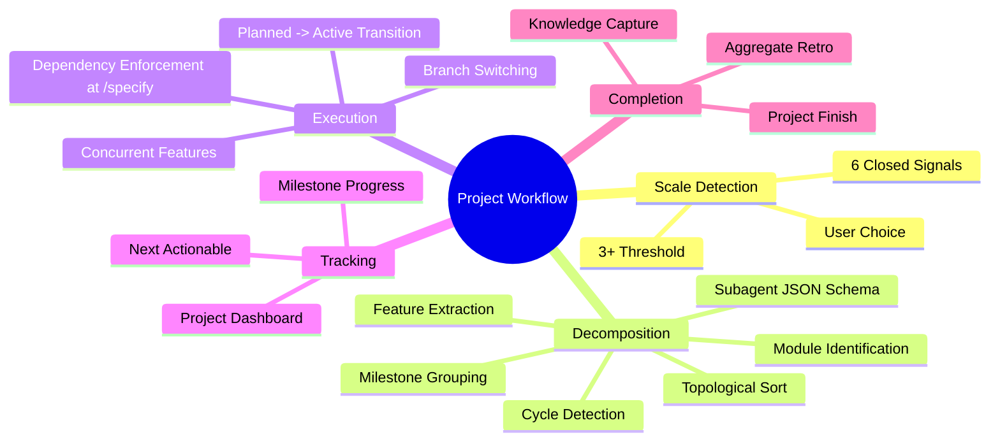

# PRD: Project-Level Workflow for Multi-Module Delivery

## Status
- Created: 2026-02-10
- Last updated: 2026-02-10
- Status: Draft
- Problem Type: Architecture / Process Gap

## Problem Statement

The iflow-dev workflow excels at single-feature development (brainstorm -> specify -> design -> plan -> tasks -> implement -> finish) but cannot handle full project delivery where a product vision decomposes into multiple modules with interdependent features. A solo developer building a multi-module product (e.g., a SaaS app with auth, billing, dashboard) has no way to decompose the project, track cross-feature dependencies, sequence feature execution, or see aggregate progress. The result is that larger projects must be manually decomposed outside the workflow, losing the methodical rigor that makes iflow-dev valuable for individual features.

### Evidence
- **Codebase analysis:** `.meta.json` has no fields for `project_id`, `module`, `depends_on_features`, or any grouping mechanism — Location: `plugins/iflow-dev/skills/workflow-state/SKILL.md:183-270`
- **Codebase analysis:** `create-feature` command warns if an active feature exists, implying one-at-a-time design — Location: `plugins/iflow-dev/commands/create-feature.md:14-33`
- **Codebase analysis:** `session-start` hook surfaces only ONE active feature using `sort by mtime, take first` — Location: `plugins/iflow-dev/hooks/session-start.sh`
- **Codebase analysis:** `show-status` displays a flat list of features with no grouping, dependency visualization, or milestone tracking — Location: `plugins/iflow-dev/commands/show-status.md`
- **Codebase analysis:** Backlog has zero items about scaling the workflow to multi-feature projects — Location: `docs/backlog.md`
- **Internet research:** WBS best practices require hierarchical decomposition with the 100% rule (total WBS must capture all deliverables). We adopt the deliverable-based decomposition principle: Project -> Modules -> Features -> Tasks — Source: Wikipedia/WBS
- **Internet research:** Linear's hierarchy (Initiative -> Project -> Milestone -> Issue) validates our three-level model (Project -> Milestone -> Feature). We simplify by omitting the Initiative level since this is solo-dev tooling — Source: linear.app/docs/conceptual-model
- **Internet research:** LangGraph Plan-and-Execute pattern (planner -> task DAG -> executor -> replanning) maps to our decomposition flow: analyze PRD (planner), produce roadmap DAG (task list), execute features (executor), update roadmap when new info emerges (replanning) — Source: langchain-ai.github.io/langgraph

## Goals

1. **Add a project layer above features** — Enable decomposing a product vision into modules and features, with dependency tracking and intelligent sequencing
2. **Auto-detect project scale at brainstorm exit** — Brainstorm remains the universal entry point; scale detection determines whether to route to single-feature or project workflow
3. **Support concurrent independent features** — Features on independent modules can progress in parallel; dependent features are sequenced automatically
4. **AI-driven decomposition with approval gates** — Subagents do the heavy lifting (decomposition, dependency analysis, sequencing); user approves at key gates
5. **Extend, don't replace** — Each feature within a project still runs through the existing feature pipeline (specify -> design -> plan -> tasks -> implement -> finish)

## Success Criteria

- [ ] Given a PRD with 4+ distinct entity types and references to 3+ separate functional areas, scale detection presents the "Promote to Project" option in brainstorm Stage 7
- [ ] Given a PRD with only 1 functional area, scale detection does NOT trigger (no false positive)
- [ ] Decomposition produces a `roadmap.md` containing a mermaid dependency graph and a topologically-sorted execution order
- [ ] Given a feature with `project_id` set, running `/specify` produces the same spec.md structure as a feature without `project_id`
- [ ] Given two features with no `depends_on_features` relationship, both can have `status: active` simultaneously and phase commands present a feature picker via AskUserQuestion
- [ ] Given Feature B with `depends_on_features: ["021-auth"]`, running `/specify` on Feature B while 021-auth is not `status: completed` shows a blocking warning
- [ ] `show-status` displays project section with milestone progress (X/Y features complete) and next actionable features when a project is active
- [ ] `validate.sh` passes with 0 errors, 0 warnings after all changes
- [ ] When running `/specify` on a feature with `project_id`, the project PRD and roadmap are read and available as context to the specify skill
- [ ] When running `/design` on a feature with completed dependencies, the dependency features' `spec.md` and `design.md` are read as context
- [ ] Features without `project_id` (standalone features) behave identically to current workflow

## User Stories

### Story 1: Project Initiation from Brainstorm
**As a** solo developer **I want** to brainstorm a product idea and have the system detect it requires multiple features **so that** I get a structured decomposition instead of trying to cram everything into one feature.
**Acceptance criteria:**
- Brainstorm Stage 7 offers "Promote to Project" when scale detection identifies 3+ of the defined signals (see FR-1 for closed signal list)
- Both "Promote to Feature" and "Promote to Project" are shown; user picks one
- If scale detection doesn't trigger, only "Promote to Feature" is shown (no project noise for small work)
- User confirms project promotion via AskUserQuestion

### Story 2: Project Decomposition
**As a** solo developer **I want** the system to break my project PRD into modules and features with dependencies **so that** I have a clear roadmap without manual decomposition.
**Acceptance criteria:**
- Decomposition subagent receives the full PRD text and returns structured JSON (see FR-3 for schema)
- Result produces a `roadmap.md` with modules, features, dependencies, and execution order
- User reviews decomposition via AskUserQuestion approval gate showing module/feature summary
- On approval, features are created in `docs/features/` with `status: planned` and `project_id` set
- On rejection, decomposition refines (max 3 iterations)

### Story 3: Concurrent Feature Development
**As a** solo developer **I want** to work on multiple independent features simultaneously **so that** I can context-switch between modules without finishing one first.
**Acceptance criteria:**
- Multiple features can have `status: active` simultaneously
- Phase commands present a feature picker (AskUserQuestion with dynamic options listing active features) when multiple are active
- Session-start hook shows project context with all active features listed
- Context-switching requires clean working tree on current branch; system prompts to commit or stash before switching

### Story 4: Dependency-Aware Sequencing
**As a** solo developer **I want** the system to prevent me from starting a feature that depends on an unfinished feature **so that** I don't build on unstable foundations.
**Acceptance criteria:**
- Features with unmet `depends_on_features` show as "blocked" in `show-status`
- Running `/specify` (the first phase command) on a blocked feature shows a warning explaining which features must complete first, with option to proceed anyway (override recorded in `.meta.json`)
- When a feature finishes (`/finish`), the finish command scans all project features for `depends_on_features` references and logs unblock notification

### Story 5: Project Dashboard
**As a** solo developer **I want** a project-level status view showing overall progress, milestone completion, and the dependency graph **so that** I can see the big picture.
**Acceptance criteria:**
- `show-status` includes a project section when a project is active
- Shows: milestone progress (X/Y features complete), critical path, next actionable features
- Mermaid dependency graph of features

### Story 6: Project Completion
**As a** solo developer **I want** to finish a project (or milestone) with a coordinated retro and merge **so that** the project has closure and learnings are captured.
**Acceptance criteria:**
- `/finish-project` runs after all features in scope are complete or explicitly abandoned
- Project-level retrospective synthesizes learnings across feature retros
- Clean project state (all features completed/abandoned, all branches merged)

## Use Cases

### UC-1: Brainstorm-to-Project Flow
**Actors:** Developer | **Preconditions:** No active project
**Flow:**
1. Developer runs `/brainstorm "Build a crypto portfolio tracker"`
2. Brainstorm runs 7 stages, produces comprehensive PRD
3. At Stage 7, scale detection analyzes PRD against the signal checklist (FR-1)
4. PRD matches 4 signals: multiple entity types (User, Portfolio, Asset, Transaction), multiple functional areas (auth, portfolio management, market data, dashboard), multiple API surfaces (REST + WebSocket), cross-cutting concerns (auth spans all modules)
5. System presents AskUserQuestion with options: "Promote to Project (recommended)", "Promote to Feature", "Refine Further", "Save and Exit"
6. Developer selects "Promote to Project"
7. System creates `docs/projects/P001-crypto-tracker/` with `.meta.json` and `prd.md`
8. Decomposition subagent receives full PRD, returns structured JSON with modules and features
9. System presents decomposition summary for approval via AskUserQuestion: "4 modules, 12 features identified. Review details?"
10. Developer approves
11. System produces `roadmap.md` with dependency graph and execution order
12. System creates 12 feature entries in `docs/features/` with `status: planned`, `project_id: "P001"`, `module`, and `depends_on_features` set
**Postconditions:** Project exists with roadmap, features created with `status: planned` and sequenced
**Edge cases:**
- PRD is borderline (could be 1 large feature or 2-3 small ones) -> System shows both options; user decides
- Developer rejects decomposition -> Refine loop (max 3 iterations)
- Scale detection false positive (user knows it's really one feature) -> User picks "Promote to Feature", proceeds normally

### UC-2: Working on Next Feature in Project
**Actors:** Developer | **Preconditions:** Project active, some features complete
**Flow:**
1. Developer runs `/show-status`
2. Dashboard shows project progress, highlights next actionable features (unblocked, `status: planned`)
3. Developer picks a feature to work on via AskUserQuestion
4. System changes feature status from `planned` to `active`, creates feature branch
5. Feature enters existing pipeline (specify -> design -> plan -> tasks -> implement -> finish)
6. On feature finish, system scans project features for `depends_on_features` containing this feature's ID and logs unblock
7. Dashboard updates with new progress
**Postconditions:** Feature complete, dependent features unblocked
**Edge cases:**
- All remaining features are blocked -> Show blocking chain, suggest resolving blocker first
- Developer wants to work on a blocked feature -> Warn but allow override with recorded skip in `.meta.json`

### UC-3: Concurrent Feature Work
**Actors:** Developer | **Preconditions:** Project has 2+ unblocked features
**Flow:**
1. Developer starts Feature A (specify phase), on branch `feature/021-auth`
2. Developer wants to context-switch to Feature B (different module)
3. System checks working tree is clean; if not, prompts to commit or stash
4. Developer switches to Feature B branch `feature/022-dashboard`
5. Phase commands present feature picker via AskUserQuestion when multiple features are active
6. Developer finishes Feature B first
7. Developer returns to Feature A, continues from where they left off (phase state preserved in `.meta.json`)
**Postconditions:** Both features progress independently on separate branches
**Edge cases:**
- Uncommitted changes on current branch -> System prompts: "Commit changes before switching?" (AskUserQuestion)
- Developer loses track of active features -> `show-status` shows all with phases and branches

## Edge Cases & Error Handling

| Scenario | Expected Behavior | Rationale |
|----------|-------------------|-----------|
| PRD is ambiguous scale (could be 1 or N features) | Show both "Promote to Feature" and "Promote to Project" options; user decides | User knows their scope better; don't force project overhead on small work |
| Scale detection false negative (large project not detected) | User can manually create a project via `/create-project` command | Detection is a convenience, not a gate; manual path always available |
| Scale detection false positive (small project flagged) | User picks "Promote to Feature" instead; no harm done | Both options always available when detection triggers |
| Circular dependency detected in decomposition | Block approval, highlight cycle in output, require resolution before approval | Circular deps make topological sort impossible |
| All project features complete but one was abandoned | Allow project finish with abandoned feature noted in retro | Partial delivery is valid; abandonment should be documented |
| User runs `/brainstorm` while project is active | Allow it (brainstorms are independent); project context shown for reference | Brainstorming should never be blocked |
| Project has 20+ features | Auto-group into milestones of 5-8 features based on dependency layers | Large flat lists are unmanageable; milestones provide intermediate goals |
| Feature finishes but dependent feature's spec conflicts | Warning shown when starting the dependent feature's specify phase | Changes during development can invalidate downstream assumptions |

## Constraints

### Behavioral Constraints (Must NOT do)
- Must NOT replace or break the existing single-feature workflow — Rationale: It works well and is the proven foundation
- Must NOT force project mode on small work — Rationale: Overhead of project decomposition isn't justified for 1-2 feature work
- Must NOT auto-create features without user approval — Rationale: AI-driven decomposition needs human validation at the gate
- Must NOT allow features to skip phases just because they're in a project — Rationale: Each feature needs the same rigor regardless of context
- Must NOT introduce team/multi-user concepts — Rationale: This is solo-dev tooling; multi-user adds complexity without value

### Technical Constraints
- Must use existing plugin component types (skills, agents, commands, hooks) — Evidence: Component authoring guide
- Skills must be < 500 lines, < 5,000 tokens — Evidence: CLAUDE.md quick reference
- Must use `iflow-dev:` prefix in dev plugin — Evidence: CLAUDE.md edit rules
- Must use AskUserQuestion for all interactive choices — Evidence: CLAUDE.md user input standards
- `.meta.json` schema is open-ended (no JSON Schema enforcement) — Evidence: Feature 005 has 7 fields, Feature 020 has full phase tracking; backward-compatible additions work

## Requirements

### Functional

#### Phase 1: Foundation (MVP)

- **FR-1: Scale Detection** — At brainstorm Stage 7, analyze PRD for project-scale signals. Closed signal list:
  1. **Multiple entity types** — PRD describes 3+ distinct data entities with separate CRUD lifecycles
  2. **Multiple functional areas** — PRD requires 3+ distinct functional capabilities (e.g., auth, billing, reporting)
  3. **Multiple API surfaces** — PRD needs 2+ API types (REST, WebSocket, GraphQL) or 3+ distinct API endpoint groups
  4. **Cross-cutting concerns** — PRD mentions capabilities that span multiple functional areas (auth, logging, permissions)
  5. **Multiple UI sections** — PRD describes 3+ distinct user-facing views/pages/screens
  6. **External integrations** — PRD requires 2+ external service integrations

  Detection threshold: 3+ signals = recommend project route. Present both "Promote to Project" and "Promote to Feature" via AskUserQuestion. If <3 signals, show only "Promote to Feature" (current behavior). LLM-based detection is inherently fuzzy; false positives are handled by user choosing "Promote to Feature" instead, false negatives by manual `/create-project` command.

- **FR-2: Project Creation** — Create `docs/projects/{id}-{slug}/` with `.meta.json` and `prd.md`.

  **Project ID namespace:** Separate from features, prefixed with `P`. Format: `P001`, `P002`, etc. Rationale: Avoids collision with feature IDs; clear visual distinction in status output.

  **Project `.meta.json` schema:**
  ```json
  {
    "id": "P001",
    "slug": "crypto-tracker",
    "status": "active",
    "created": "2026-02-10T11:40:52Z",
    "completed": null,
    "brainstorm_source": "docs/brainstorms/20260210-114052-project-level-workflow.prd.md",
    "milestones": [
      {
        "id": "M1",
        "name": "Foundation",
        "status": "active",
        "features": ["021-auth", "022-data-models"]
      }
    ],
    "features": ["021-auth", "022-data-models", "023-dashboard", "024-market-data"],
    "lastCompletedMilestone": null
  }
  ```

- **FR-3: Project Decomposition** — AI-driven decomposition of project PRD into modules and features.

  **Subagent input:** Full PRD text (markdown string).

  **Subagent output schema:**
  ```json
  {
    "modules": [
      {
        "name": "Authentication",
        "description": "User auth and session management",
        "features": [
          {
            "name": "User registration and login",
            "description": "Email/password auth with JWT tokens",
            "depends_on": [],
            "complexity": "Medium"
          }
        ]
      }
    ],
    "cross_cutting": ["Error handling patterns", "API response format"],
    "suggested_milestones": [
      {
        "name": "Foundation",
        "features": ["User registration and login", "Core data models"],
        "rationale": "Required by all other features"
      }
    ]
  }
  ```

  **Dependency graph data structure:** Adjacency list stored in `roadmap.md` as both mermaid diagram and structured YAML front-matter for machine parsing.

  **Approval gate:** AskUserQuestion showing:
  - Option 1: "Approve decomposition ({N} modules, {M} features)"
  - Option 2: "Refine (describe what to change)"
  - Option 3: "Cancel (save PRD without project creation)"

- **FR-4: Feature-Project Linking** — Feature `.meta.json` gains optional fields: `project_id` (string, e.g., "P001"), `module` (string), `depends_on_features` (string array of feature id-slugs). Features created from decomposition are created with `status: planned` (not `active`), bypassing the active-feature-exists check. Features transition to `status: active` when the developer explicitly starts working on them.

- **FR-4b: Project Context Injection** — When a feature has `project_id` set, all downstream phase commands (specify, design, create-plan, create-tasks, implement) automatically read and inject the project's shared artifacts as context:
  - **Project PRD** (`docs/projects/{id}-{slug}/prd.md`) — The original project vision, injected so each feature's spec/design stays aligned with the whole
  - **Roadmap** (`docs/projects/{id}-{slug}/roadmap.md`) — Module structure, feature dependencies, and execution order, so the feature's plan/design accounts for cross-feature interfaces
  - **Completed sibling feature artifacts** — When designing/planning a feature, read `spec.md` and `design.md` of completed dependency features (those in `depends_on_features`) for interface contracts and shared patterns

  This ensures each feature's workflow has full project context without the developer manually referencing project docs. The `workflow-transitions` skill's `validateAndSetup` procedure is the injection point — when it detects `project_id` in the feature's `.meta.json`, it reads and prepends project context to the phase's input.

#### Phase 2: Execution Support

- **FR-5: Concurrent Feature Support** — Allow multiple `status: active` features within a project. Phase commands present a feature picker (AskUserQuestion with dynamic options listing each active feature's ID, name, and current phase) when multiple are active. Session-start hook shows project summary with all active features listed. Branch switching requires clean working tree; system prompts to commit before switching via AskUserQuestion.

- **FR-6: Dependency Enforcement** — Enforcement point: the `/specify` command (first phase after feature creation). When running `/specify` on a feature with `depends_on_features`, check each dependency's status. If any dependency is not `status: completed`, show warning via AskUserQuestion: "Feature {X} depends on {Y} which is not complete. Start anyway? (override recorded)". On `/finish`, scan all features in the same project for `depends_on_features` containing the finished feature's id-slug. No automatic status changes; log a notification message ("Feature {Y} is now unblocked").

- **FR-7: Project Dashboard** — `show-status` includes project section when any feature has a `project_id`. Shows: project name, milestone progress table (milestone name, features complete/total), list of next actionable features (unblocked + planned), and critical path (longest dependency chain).

#### Phase 3: Completion

- **FR-8: Project Finish** — `/finish-project` command: verify all features are `completed` or `abandoned`, run project-level retrospective (synthesize across feature retros using subagent), update project `.meta.json` status to `completed`.

- **FR-9a: Show Roadmap** — `/show-roadmap` command displays the project's dependency graph and milestone progress in a readable format.
- **FR-9b: Re-sequence Feature** — Ability to update a feature's `depends_on_features` and regenerate execution order. Deferred to Phase 3.
- **FR-9c: Manage Milestones** — Ability to move features between milestones or create new milestones. Deferred to Phase 3.

### Non-Functional

- **NFR-1: Behavioral Compatibility** — Features without `project_id` behave identically to current workflow. Phase commands, session-start hook, and show-status are modified to support multi-feature context but fall back to current single-feature behavior when no project exists. This is a behavioral-preserving extension, not a no-change guarantee.
- **NFR-2: Subagent Utilization** — Decomposition, dependency analysis, and project-level reviews should use subagents for parallel processing.
- **NFR-3: Incremental Delivery** — This PRD is itself project-scale and should be decomposed into sequenced features:
  - **Feature A (Foundation):** FR-1 (scale detection) + FR-2 (project creation) + FR-3 (decomposition) + FR-4 (feature-project linking) + FR-4b (project context injection). This delivers the core loop: brainstorm -> detect -> decompose -> roadmap, with project context flowing into each feature's workflow.
  - **Feature B (Execution):** FR-5 (concurrent features) + FR-6 (dependency enforcement) + FR-7 (project dashboard). Depends on Feature A.
  - **Feature C (Completion):** FR-8 (project finish) + FR-9a/b/c (roadmap commands). Depends on Feature B.
- **NFR-4: Validation** — `validate.sh` passes with 0 errors after all changes. New components follow naming conventions and size limits.

## Non-Goals

- **Multi-user/team coordination** — Rationale: This is solo-dev tooling. Team features (assignments, handoffs, permissions) add complexity without value for the target user.
- **Integration with external project management tools** (Jira, Linear, GitHub Projects) — Rationale: The value is in the AI-driven workflow, not tool integration. Can be added later.
- **Automated feature implementation without human oversight** — Rationale: AI-driven with approval gates, not fully autonomous. Human judgment at decomposition and milestone gates.
- **Feature flags or deployment orchestration** — Rationale: This is a development workflow tool, not a deployment tool. Feature flags are an implementation concern handled per-feature.

## Out of Scope (This Release)

- **Project templates** (e.g., "SaaS starter", "CLI tool") — Future consideration: Could accelerate decomposition with pre-built module structures
- **Cross-project dependencies** — Future consideration: When multiple projects exist, they might share modules
- **Time-based milestones** (deadlines, sprints) — Future consideration: Could add calendar-based scheduling later; current design uses dependency-based ordering only
- **Project-level architecture document** (single shared `architecture.md`) — Future consideration: A formal shared architecture doc. Current MVP injects the project PRD + roadmap + completed sibling artifacts as context instead, which provides architectural alignment without a separate document.
- **Automated conflict detection** between concurrent features — Future consideration: Could analyze file overlap between feature designs and warn proactively. Listed in UC-3 edge cases as aspirational; not implemented in this release.

## Research Summary

### Internet Research
- **WBS (Work Breakdown Structure):** We adopt the deliverable-based decomposition principle (decompose by deliverable, not activity) and the 100% rule (decomposition must capture all PRD requirements). This shapes our decomposition subagent's mandate: every PRD requirement must map to a feature — Source: Wikipedia/WBS
- **Linear's data model:** Validates our three-level hierarchy (Project -> Milestone -> Feature). We simplify by omitting Initiative level (solo-dev) and Cycle/Sprint concepts (dependency-based ordering, not time-based) — Source: linear.app/docs/conceptual-model
- **LangGraph Plan-and-Execute:** Maps to our decomposition flow: PRD analysis (planner), roadmap DAG (task list), feature execution (executor), roadmap update on new info (replanning). We adopt the replanning pattern for when feature design reveals new dependencies — Source: langchain-ai.github.io/langgraph
- **CrewAI Flows:** `@start`, `@listen`, `@router`, `@human_feedback` pattern maps to our state machine: project creation (start), feature completion triggers (listen), scale detection routing (router), decomposition approval (human_feedback) — Source: docs.crewai.com
- **Topological sort (Kahn's algorithm):** Produces valid execution orderings for feature DAGs in O(V+E). We use this to determine which features can run in parallel (in-degree zero) vs. must be sequential — Source: Wikipedia
- **2026 strategic decomposition:** Four-phase pattern (upfront planning, atomic breakdown, incremental integration, automated gates) validates our approach of thorough decomposition before feature execution begins — Source: keywordsstudios.com

### Codebase Analysis
- Feature `.meta.json` schema is open-ended, backward-compatible additions are safe — Location: `docs/features/005-make-specs-executable/.meta.json` vs `docs/features/020-crypto-domain-skills/.meta.json`
- Brainstorm Stage 7 AskUserQuestion is the natural insertion point for scale detection — Location: `plugins/iflow-dev/skills/brainstorming/SKILL.md:274-336`
- `create-feature` already allows override to create new while active exists — Location: `plugins/iflow-dev/commands/create-feature.md:14-33`
- `show-status` already lists multiple open features in a table — Location: `plugins/iflow-dev/commands/show-status.md`
- Parallel subagent dispatch is well-established (brainstorm Stage 2, design Stage 0) — Location: `plugins/iflow-dev/skills/brainstorming/SKILL.md:146-172`
- `workflow-transitions` provides reusable validateAndSetup/commitAndComplete procedures — Location: `plugins/iflow-dev/skills/workflow-transitions/SKILL.md`
- Secretary agent has extensible workflow pattern recognition table — Location: `plugins/iflow-dev/agents/secretary.md`

### Existing Capabilities
- `structured-problem-solving` provides MECE decomposition — could inform project-to-feature decomposition
- `breaking-down-tasks` models dependency graphs, parallel groups, critical paths — pattern reusable at feature level
- `reviewing-artifacts` has quality checklists — extensible for project-level artifacts
- `detecting-kanban` provides external tracking integration point
- Knowledge bank "Parallel Subagent Delegation" pattern directly informs concurrent feature orchestration

## Structured Analysis

### Problem Type
Architecture / Process Gap — The current system has a well-functioning inner loop (feature development) but lacks an outer loop (project orchestration) needed for larger-scale work.

### SCQA Framing
- **Situation:** iflow-dev provides a rigorous, AI-driven workflow for developing individual features through brainstorm -> specify -> design -> plan -> tasks -> implement -> finish.
- **Complication:** When a solo developer needs to build a full product (multiple modules, interdependent features), they must manually decompose the project outside the workflow, losing the methodical rigor that makes iflow-dev valuable. There's no way to track cross-feature dependencies, sequence features, or see project-level progress.
- **Question:** How can we extend iflow-dev to handle project-scale work while preserving the proven single-feature workflow as the execution engine?
- **Answer:** Add a project layer above features: scale detection at brainstorm exit routes to project creation, AI-driven decomposition breaks the project into modules and sequenced features, each feature runs through the existing pipeline, and a project dashboard provides the big-picture view.

### Decomposition

```
Project-Level Workflow
+-- Scale Detection (at brainstorm exit)
|   +-- 6 closed signals (entities, areas, APIs, cross-cutting, UI, integrations)
|   +-- Threshold: 3+ signals = recommend project
|   +-- User confirmation (both options always available)
+-- Project Creation
|   +-- Project metadata (P-prefixed ID, .meta.json)
|   +-- PRD storage
+-- Decomposition Engine
|   +-- Subagent input: full PRD markdown
|   +-- Subagent output: structured JSON (modules, features, deps, milestones)
|   +-- Dependency validation (cycle detection)
|   +-- Topological sort for execution order
|   +-- Milestone auto-grouping by dependency layers
|   +-- Approval gate (AskUserQuestion, max 3 iterations)
+-- Roadmap Artifact
|   +-- Mermaid dependency graph
|   +-- YAML front-matter for machine parsing
|   +-- Milestone definitions
|   +-- Execution order
+-- Feature-Project Integration
|   +-- .meta.json extensions (project_id, module, depends_on_features)
|   +-- Features created with status: planned (not active)
|   +-- Dependency enforcement at /specify
|   +-- Concurrent feature support with branch management
+-- Project Dashboard
|   +-- show-status extension (project section)
|   +-- Milestone progress table
|   +-- Next actionable features
+-- Project Finish
    +-- All-features-complete check
    +-- Project-level retrospective (subagent synthesis)
    +-- Status finalization
```

### Mind Map



## Phased Implementation Plan

This PRD is itself project-scale. It should be implemented as 3 sequenced features:

| Phase | Feature | Requirements | Depends On |
|-------|---------|-------------|------------|
| 1 | Foundation | FR-1, FR-2, FR-3, FR-4, FR-4b | None |
| 2 | Execution Support | FR-5, FR-6, FR-7 | Phase 1 |
| 3 | Completion | FR-8, FR-9a/b/c | Phase 2 |

**Phase 1 MVP delivers:** Brainstorm a project -> scale detection -> decomposition -> roadmap.md -> features created with project linking. Each feature's downstream workflow (specify, design, plan, tasks, implement) automatically receives the project PRD, roadmap, and completed sibling artifacts as context. Developer works features one-at-a-time through existing pipeline, with full project awareness.

**Phase 2 adds:** Concurrent features, dependency blocking/unblocking, project dashboard in show-status.

**Phase 3 adds:** Project finish, roadmap commands, milestone management.

## Review History

### Review 1 (Stage 4 — PRD Reviewer)
**4 blockers resolved:**
1. Scale detection vagueness -> Defined closed list of 6 signals with concrete detection heuristics (FR-1)
2. Concurrent features branch management under-specified -> Specified clean-working-tree requirement, commit-before-switch prompt, branch switching mechanism (Story 3, UC-3)
3. Decomposition engine lacked specification -> Defined subagent input/output JSON schemas, dependency graph data structure, approval gate AskUserQuestion layout (FR-3)
4. Scope too large for single feature -> Acknowledged this is project-scale; added Phased Implementation Plan with 3 sequenced features (NFR-3)

**6 warnings resolved:**
1. Feature creation during decomposition -> Features created with `status: planned`, bypassing active-feature check (FR-4)
2. Stage 7 AskUserQuestion options unclear -> Specified: both options shown when detection triggers, only feature option when not (Story 1, FR-1)
3. UC-3 "merge conflict at design phase" aspirational -> Moved to Out of Scope with acknowledgment
4. Open questions reduced -> Resolved project ID namespace (P-prefix) and milestone generation (auto-generated from dependency layers)
5. Success criteria not testable -> Rewritten as Given/When/Then assertions
6. NFR-1 contradictory -> Reworded as "behavioral-preserving extension" acknowledging modifications while preserving behavior
7. FR-6 enforcement point ambiguous -> Specified: `/specify` is the enforcement point; finish logs unblock notification
8. FR-9 bundled -> Split into FR-9a, FR-9b, FR-9c with Phase 3 deferral
9. Research summary decorative -> Each reference now explains what specific pattern we adopt and why

## Open Questions

- When a feature's design reveals new dependencies not in the original decomposition, how should the roadmap update? (Deferred: Phase 2 can address this once basic dependency tracking works)
- Should there be a shared "project architecture" document that all features reference, or is per-feature design sufficient? (Listed in Out of Scope; revisit after Phase 1 experience)

## Next Steps

Ready for review. If approved, promote to project (this PRD is itself project-scale per the Phased Implementation Plan) or promote to feature (implement Phase 1 only as a single feature).
