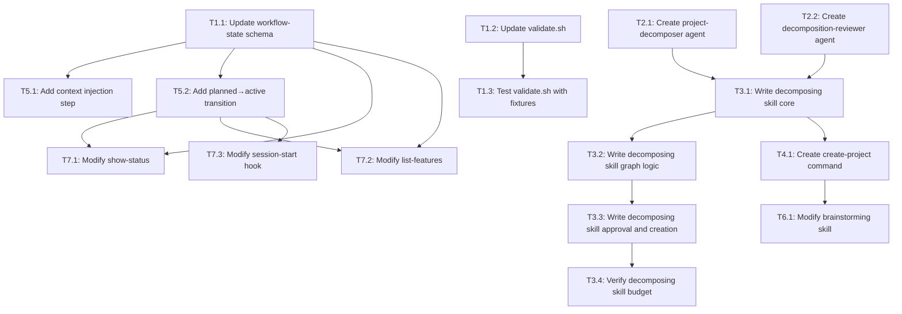

# Tasks: Project-Level Workflow Foundation

## Dependency Graph



## Execution Strategy

### Parallel Group 1 (No dependencies - all 4 tasks run simultaneously)
- Task 1.1: Update workflow-state schema documentation with new fields and planned status
- Task 1.2: Update validate.sh for planned features with nullable mode/branch
- Task 2.1: Create project-decomposer agent file
- Task 2.2: Create project-decomposition-reviewer agent file

### Parallel Group 2 (After Group 1 completes — each task depends on specific Group 1 tasks, not all of them)
- Task 1.3: Test validate.sh with planned feature fixtures (needs: 1.2)
- Task 3.1: Write decomposing skill core — agent dispatch + reviewer cycle (needs: 2.1, 2.2)
- Task 5.1: Add project context injection Step 5 to workflow-transitions (needs: 1.1)
- Task 5.2: Add planned→active transition logic to workflow-state (needs: 1.1)

### Parallel Group 3 (After Group 2 completes)
- Task 3.2: Write decomposing skill graph logic — name mapping + cycle detection + tsort (needs: 3.1)
- Task 4.1: Create create-project command (needs: 3.1)
- Task 7.1: Modify show-status for project grouping (needs: 1.1, 5.2)
- Task 7.2: Modify list-features for planned features + project column (needs: 1.1, 5.2)
- Task 7.3: Modify session-start hook for project display (needs: 5.2)

### Parallel Group 4 (After Group 3 completes)
- Task 3.3: Write decomposing skill approval gate + feature creation + roadmap (needs: 3.2)
- Task 6.1: Modify brainstorming skill for scale detection (needs: 4.1)

### Sequential Group 5 (After Group 4 completes)
- Task 3.4: Verify decomposing skill line/token budget (needs: 3.3)

## Task Details

### Phase 1: Schema & Validation Foundation

#### Task 1.1: Update workflow-state schema documentation with new fields and planned status
- **Why:** Implements Plan Step 1.1 / Design C9
- **Depends on:** None (can start immediately)
- **Blocks:** Task 5.1, Task 5.2, Task 7.1, Task 7.2
- **Files:** `plugins/iflow-dev/skills/workflow-state/SKILL.md`
- **Do:**
  1. Read `plugins/iflow-dev/skills/workflow-state/SKILL.md`
  2. Locate the State Schema / Core Fields table section
  3. Add three new rows to the Core Fields table:
     - `project_id` | string/null | P-prefixed project ID (e.g., "P001") if feature belongs to a project
     - `module` | string/null | Module name within project
     - `depends_on_features` | array/null | Array of `{id}-{slug}` feature references this feature depends on
  4. Locate the Status Values table
  5. Add row: `planned` | Created by decomposition, not yet started | No
  6. Add a note below the Status Values table: "When `status` is `planned`, `mode` and `branch` are `null`. These fields are set when the feature transitions to `active`."
- **Test:** Read SKILL.md, confirm new fields appear in Core Fields table and `planned` appears in Status Values table. Run `./validate.sh` — must pass.
- **Done when:** SKILL.md contains all 3 new fields in Core Fields table AND `planned` in Status Values table AND `./validate.sh` passes

#### Task 1.2: Update validate.sh for planned features with nullable mode/branch
- **Why:** Implements Plan Step 1.2 / Design C13
- **Depends on:** None (can start immediately)
- **Blocks:** Task 1.3
- **Files:** `validate.sh`
- **Do:**
  1. Read `validate.sh` and locate the required fields section around line 479-528
  2. Find the `required = ['id', 'mode', 'status', 'created', 'branch']` check (or equivalent)
  3. Replace with status-aware validation using design C13's logic:
     - Always required: `id`, `status`, `created`
     - Required if status != `planned`: `mode`, `branch` (must be non-null)
     - If status == `planned`: `mode` and `branch` should be null (warn if not), `completed` must be null (error if not)
  4. Preserve existing slug/name validation unchanged
  5. Preserve existing status consistency checks
  6. Use `\` escaping for inner quotes, consistent with existing pattern (see line 504)
- **Test:** Run `./validate.sh` on existing features — must pass with 0 errors, 0 warnings
- **Done when:** validate.sh has status-aware required fields logic AND passes on all existing features

#### Task 1.3: Test validate.sh with planned feature fixtures
- **Why:** Implements Plan Step 1.2 verification / Design C13
- **Depends on:** Task 1.2
- **Blocks:** None
- **Files:** `validate.sh`, `docs/features/999-test-planned-valid/.meta.json`, `docs/features/998-test-planned-invalid/.meta.json`
- **Do:**
  1. Create `docs/features/999-test-planned-valid/.meta.json` with: `{"id":"999","slug":"test-planned-valid","status":"planned","created":"2026-01-01T00:00:00Z","mode":null,"branch":null}`
  2. Run `./validate.sh` — must pass (positive case: planned with null mode/branch)
  3. Create `docs/features/998-test-planned-invalid/.meta.json` with: `{"id":"998","slug":"test-planned-invalid","status":"active","created":"2026-01-01T00:00:00Z","mode":null,"branch":null}`
  4. Run `./validate.sh` — must report errors for missing mode/branch (negative case: active with null mode/branch)
  5. **Cleanup (always run, even if steps 2-4 fail):** Delete both test fixtures: `rm -rf docs/features/999-test-planned-valid docs/features/998-test-planned-invalid`
  6. Confirm cleanup: `ls docs/features/999-* docs/features/998-*` returns "No such file or directory"
  7. Run `./validate.sh` one final time — must pass with 0 errors
- **Test:** Steps 2 and 4 above are the test themselves. Step 5 cleanup must run regardless of pass/fail to avoid polluting docs/features/. **Verification order:** Run step 6 (confirm cleanup) BEFORE step 7 (final validate.sh). This ensures fixtures are gone before the final validation — otherwise validate.sh would see and fail on the invalid fixture.
- **Done when:** Positive case passes, negative case reports errors, fixtures cleaned up (verified by step 6), final validate.sh passes (step 7)

### Phase 2: New Agents

#### Task 2.1: Create project-decomposer agent file
- **Why:** Implements Plan Step 2.1 / Design C3
- **Depends on:** None (can start immediately)
- **Blocks:** Task 3.1
- **Files:** `plugins/iflow-dev/agents/project-decomposer.md` (new)
- **Do:**
  1. Read `plugins/iflow-dev/agents/spec-reviewer.md` as structural template for YAML frontmatter format
  2. Create `plugins/iflow-dev/agents/project-decomposer.md` with YAML frontmatter:
     - name: `project-decomposer`
     - description: Generates module/feature breakdown from PRD
     - tools: `Read` (for PRD content if path provided)
  3. Write system prompt that instructs the LLM to:
     - Accept full PRD markdown + expected_lifetime
     - Produce JSON matching decomposition output schema from design C3 (modules[], cross_cutting[], suggested_milestones[])
     - Follow vertical slicing principle (each feature = end-to-end value)
     - Apply 100% coverage rule (every PRD requirement maps to a feature)
     - Calibrate complexity to expected_lifetime
     - Minimize cross-feature dependencies
     - Align module boundaries with functional domains
  4. Include the complete output JSON schema in the prompt
- **Test:** Run `./validate.sh` — must pass (frontmatter checks). Read agent, confirm prompt covers all 5 decomposer guidelines from design C3.
- **Done when:** Agent file exists with valid YAML frontmatter AND system prompt contains 100% coverage rule, vertical slicing, complexity calibration, module boundary alignment, dependency minimization AND `./validate.sh` passes

#### Task 2.2: Create project-decomposition-reviewer agent file
- **Why:** Implements Plan Step 2.2 / Design C4
- **Depends on:** None (can start immediately)
- **Blocks:** Task 3.1
- **Files:** `plugins/iflow-dev/agents/project-decomposition-reviewer.md` (new)
- **Do:**
  1. Read `plugins/iflow-dev/agents/spec-reviewer.md` as structural template for YAML frontmatter and review-cycle conventions
  2. Create `plugins/iflow-dev/agents/project-decomposition-reviewer.md` with YAML frontmatter:
     - name: `project-decomposition-reviewer`
     - description: Skeptically reviews decomposition quality against 5 criteria
     - tools: none (pure analysis)
  3. Write system prompt that instructs the LLM to:
     - Accept decomposition JSON + original PRD + expected_lifetime + iteration number
     - Evaluate against 5 criteria: organisational cohesion, engineering best practices, goal alignment, lifetime-appropriate complexity, 100% coverage
     - Return JSON with `approved` (bool), `issues[]` (criterion, description, severity), `criteria_evaluated[]`
     - Be skeptical on iterations 1-2, pragmatic on iteration 3
     - Flag over-engineering relative to expected_lifetime
  4. Include the complete reviewer output JSON schema in the prompt
- **Test:** Run `./validate.sh` — must pass. Read agent, confirm prompt contains all 5 evaluation criteria.
- **Done when:** Agent file exists with valid YAML frontmatter AND system prompt contains all 5 evaluation criteria AND reviewer output schema AND `./validate.sh` passes

### Phase 3: Decomposing Skill

#### Task 3.1: Write decomposing skill core — agent dispatch and reviewer cycle
- **Why:** Implements Plan Step 3.1 (steps 1-4) / Design C2
- **Depends on:** Task 2.1, Task 2.2
- **Blocks:** Task 3.2, Task 4.1
- **Files:** `plugins/iflow-dev/skills/decomposing/SKILL.md` (new)
- **Do:**
  1. Create `plugins/iflow-dev/skills/decomposing/` directory
  2. Create `plugins/iflow-dev/skills/decomposing/SKILL.md` with YAML frontmatter:
     - name: `decomposing`
     - description: Orchestrates project decomposition — decomposer + reviewer cycle, dependency graph, user approval, feature creation
  3. Write prerequisite section: expects project_dir, prd_content, expected_lifetime as inputs
  4. Write Step 1: Invoke project-decomposer agent via Task tool (input: PRD + expected_lifetime). Include input prompt template from design I3.
  5. Write Step 2: Parse JSON response. If invalid JSON: retry once with error message, then present raw output to user.
  6. Write Step 3: Invoke project-decomposition-reviewer agent via Task tool (input: decomposition + PRD + lifetime + iteration). Include input prompt template from design I4.
  7. Write Step 4: Review-fix cycle — if rejected, send issues back to decomposer (max 3 iterations). If approved: proceed to Step 5. If max iterations without approval: note concerns, proceed.
  8. Use terse numbered-step format throughout to stay within token budget
  9. **Agent name verification:** Task tool calls in the SKILL.md must reference exact agent names from Tasks 2.1 and 2.2 — `project-decomposer` (not `project-decomposition`) and `project-decomposition-reviewer` (not `decomposition-reviewer`). Cross-check: the `subagent_type` values in each Task tool call must be `iflow-dev:project-decomposer` and `iflow-dev:project-decomposition-reviewer` respectively.
- **Test:** Run `./validate.sh` — must pass (skill recognized). Read SKILL.md, confirm steps 1-4 are present. Grep for agent names: `project-decomposer` and `project-decomposition-reviewer` both appear.
- **Done when:** SKILL.md exists with frontmatter AND steps 1-4 (decomposer dispatch, JSON parse, reviewer dispatch, review-fix cycle) are documented AND agent names match Tasks 2.1/2.2 AND `./validate.sh` passes

#### Task 3.2: Write decomposing skill graph logic — name mapping, cycle detection, tsort
- **Why:** Implements Plan Step 3.1 (steps 5-7) / Design C2
- **Depends on:** Task 3.1
- **Blocks:** Task 3.3
- **Files:** `plugins/iflow-dev/skills/decomposing/SKILL.md` (modify)
- **Do:**
  1. Read current SKILL.md (from Task 3.1)
  2. Append Step 5: Name→ID-Slug mapping
     - Scan `docs/features/` for highest ID, assign sequential IDs
     - Derive slugs using same sanitization as create-feature (lowercase, hyphens, max 30 chars)
     - Remap `depends_on` from names to `{id}-{slug}` format
  3. Append Step 6: Cycle detection
     - Document as LLM instruction (not executable code): "Build adjacency list from `depends_on` arrays. For each node, track 3 states: unvisited, in-progress, visited. Walk each unvisited node depth-first. If you encounter an in-progress node, a cycle exists — trace the path back and report it."
     - The LLM performs this reasoning at runtime on the small graph (5-20 nodes). No Python/bash code in the SKILL.md — this is a reasoning step, not a programmatic implementation.
     - If cycle found: display as "Circular dependency detected: A → B → A"
     - Block approval with descriptive message, present at user approval gate
  4. Append Step 7: Topological sort
     - Generate tsort input: for each dependency edge `echo "D F"`, for isolated nodes `echo "F F"` (self-edge)
     - Pipe through `tsort`, parse output as execution order
     - Fallback: if `command -v tsort` fails, use LLM-based ordering with explicit topological sort instruction
- **Test:** Read SKILL.md, confirm steps 5-7 are present with name mapping, cycle detection (DFS), and tsort logic.
- **Done when:** SKILL.md contains steps 5-7 covering name→ID mapping, DFS cycle detection, and POSIX tsort with LLM fallback

#### Task 3.3: Write decomposing skill approval gate, feature creation, and roadmap
- **Why:** Implements Plan Step 3.1 (steps 8-11) / Design C2
- **Depends on:** Task 3.2
- **Blocks:** Task 3.4
- **Files:** `plugins/iflow-dev/skills/decomposing/SKILL.md` (modify)
- **Do:**
  1. Read current SKILL.md (from Task 3.2)
  2. Append Step 8: User approval gate
     - AskUserQuestion with explicit options: `[{"label": "Approve", "description": "Create features and roadmap"}, {"label": "Cancel", "description": "Save PRD without project features"}]`. The user can select "Other" (built-in to AskUserQuestion, NOT added as an explicit option) to provide free-text refinement feedback. Capture this text as `refinement_feedback`.
     - Max 3 refinement iterations; each triggers fresh reviewer cycle (back to Step 1 with previous decomposition + user feedback)
     - After 3 refinements: only Approve and Cancel remain (no further "Other" refinements)
     - If cycle detected: present cycle path at approval gate
  3. Append Step 9: Create feature directories
     - For each feature: create `docs/features/{id}-{slug}/.meta.json` with planned status, project_id, module, depends_on_features, mode=null, branch=null, lastCompletedPhase=null, phases={}
  4. Append Step 10: Generate roadmap.md
     - Write to project directory using template from design C6
     - Mermaid dependency graph with all features as nodes and dependency edges
     - Topologically-sorted execution order
     - Milestone groupings from suggested_milestones
     - Cross-cutting concerns section
     - Include mermaid arrow semantics comment
  5. Append Step 11: Update project .meta.json
     - Add features[] array (all `{id}-{slug}` strings)
     - Add milestones[] array (from suggested_milestones, with feature refs remapped to ID-slugs)
  6. Add error handling section: partial feature creation leaves created dirs in place, project .meta.json updated incrementally
- **Test:** Read SKILL.md, confirm steps 8-11 are present. Confirm user approval gate uses AskUserQuestion format.
- **Done when:** SKILL.md contains steps 8-11 covering user approval, feature dir creation, roadmap.md generation, and project .meta.json update

#### Task 3.4: Verify decomposing skill line and token budget
- **Why:** Implements Plan Step 3.1 verification / Risk R1
- **Depends on:** Task 3.3
- **Blocks:** None
- **Files:** `plugins/iflow-dev/skills/decomposing/SKILL.md` (possibly modify)
- **Do:**
  1. Run `wc -l plugins/iflow-dev/skills/decomposing/SKILL.md` — must be < 500 lines
  2. Run `wc -c plugins/iflow-dev/skills/decomposing/SKILL.md` and divide by 4 — must be < 5,000 tokens
  3. If over budget, apply fixes in priority order (re-check after each):
     a. Extract roadmap.md template to `plugins/iflow-dev/skills/decomposing/roadmap-template.md` and replace inline template with "See roadmap-template.md" reference
     b. Compress steps 5-7 (graph logic) into terse bullet format
     c. Remove redundant error handling prose (keep only the error table)
     d. If still over: merge steps 9+11 (feature creation + project update) into a single step
  4. Run `./validate.sh` — must pass
- **Test:** `wc -l` < 500, `wc -c` / 4 < 5000, `./validate.sh` passes
- **Done when:** SKILL.md is under 500 lines AND under ~5,000 tokens AND `./validate.sh` passes

### Phase 4: Create-Project Command

#### Task 4.1: Create create-project command file
- **Why:** Implements Plan Step 4.1 / Design C1
- **Depends on:** Task 3.1 (decomposing skill must exist for command to reference it)
- **Blocks:** Task 6.1
- **Files:** `plugins/iflow-dev/commands/create-project.md` (new)
- **Do:**
  1. Read `plugins/iflow-dev/commands/create-feature.md` as structural template for command frontmatter and flow patterns
  2. Create `plugins/iflow-dev/commands/create-project.md` with YAML frontmatter:
     - name: `create-project`
     - description: Create a project and invoke decomposition
     - argument-hint: `--prd={path}`
  3. Write command flow (10 steps from plan):
     1. Accept `--prd={path}` argument (or receive from brainstorm)
     2. Validate PRD file exists and is non-empty
     3. Derive project ID: scan `docs/projects/` for highest `P{NNN}-*`, increment (start P001 if none)
     4. Derive slug from PRD title (lowercase, hyphens, max 30 chars)
     5. Prompt expected_lifetime via AskUserQuestion with exact options: `[{"label": "3-months", "description": "Short-lived project"}, {"label": "6-months", "description": "Medium-term project"}, {"label": "1-year (Recommended)", "description": "Standard project lifetime"}, {"label": "2-years", "description": "Long-lived project"}]`
     6. Create `docs/projects/` if not exists
     7. Create `docs/projects/P{NNN}-{slug}/` directory
     8. Write project `.meta.json` (id, slug, status=active, expected_lifetime, created, completed=null, brainstorm_source, milestones=[], features=[], lastCompletedMilestone=null)
     9. Copy PRD content to `docs/projects/P{NNN}-{slug}/prd.md`
     10. Invoke decomposing skill as inline continuation (not subprocess): pass project_dir, prd_content, expected_lifetime as context variables, then instruct the LLM to follow the decomposing skill
  4. Add error handling: PRD not found → error, stop; PRD copy verification fails → error, stop
- **Test:** Run `./validate.sh` — must pass (command recognized). Read command, confirm all 10 steps present and AskUserQuestion used for expected_lifetime.
- **Done when:** Command file exists with valid frontmatter AND 10-step flow AND AskUserQuestion for expected_lifetime AND `./validate.sh` passes

### Phase 5: Workflow Modifications

#### Task 5.1: Add project context injection Step 5 to workflow-transitions
- **Why:** Implements Plan Step 5.1 / Design C8
- **Depends on:** Task 1.1
- **Blocks:** None
- **Files:** `plugins/iflow-dev/skills/workflow-transitions/SKILL.md` (modify)
- **Do:**
  1. Read `plugins/iflow-dev/skills/workflow-transitions/SKILL.md`
  2. Locate Step 4 "Mark Phase Started" in validateAndSetup
  3. After Step 4, add new Step 5 "Inject Project Context (conditional)":
     1. Check if feature `.meta.json` has `project_id` — if null/absent, skip Step 5
     2. Resolve project directory via glob `docs/projects/{project_id}-*/`
     3. If directory not found: warn "Project artifacts missing for {project_id}, proceeding without project context", skip
     4. Read `{project_dir}/prd.md` → store as project_prd
     5. Read `{project_dir}/roadmap.md` → store as project_roadmap (if not found: warn, set empty)
     6. For each feature in `depends_on_features`: check if completed, read spec.md and design.md
     7. Format as markdown with `## Project Context` heading, subheadings for PRD, Roadmap, each dependency
     8. Prepend to phase input context
  4. At the end of the Step 5 documentation, add a `#### Reviewer Prompt Instruction` note (nested under Step 5, so it's clearly part of context injection): "When constructing reviewer prompts and the feature has no local prd.md, use the project PRD from the `## Project Context` section above. If neither local prd.md nor project context exists, use `None — feature created without brainstorm` as the PRD slot value."
- **Test:** Read SKILL.md, confirm Step 5 is present and conditional on project_id. Confirm the `#### Reviewer Prompt Instruction` note exists at the end of Step 5. `./validate.sh` passes.
- **Done when:** workflow-transitions SKILL.md has Step 5 "Inject Project Context" with all 8 sub-steps AND `#### Reviewer Prompt Instruction` note at end of Step 5 AND `./validate.sh` passes

#### Task 5.2: Add planned→active transition logic to workflow-state
- **Why:** Implements Plan Step 5.2 / Design C9
- **Depends on:** Task 1.1
- **Blocks:** Task 7.1, Task 7.2, Task 7.3
- **Files:** `plugins/iflow-dev/skills/workflow-state/SKILL.md` (modify)
- **Do:**
  1. Read `plugins/iflow-dev/skills/workflow-state/SKILL.md`
  2. Locate `validateTransition` function definition at line ~72
  3. Insert new planned→active transition logic BEFORE the existing hard blocks at line 74:
     1. Detect `status: "planned"` before normal transition validation
     2. AskUserQuestion: "Start working on {id}-{slug}?" (Yes/Cancel)
     3. If Cancel: stop
     4. AskUserQuestion: mode selection (Standard/Full)
     5. Single-active-feature check: scan for active features, warn if found (AskUserQuestion Continue/Cancel)
     6. Update .meta.json: status→active, mode→selected, branch→"feature/{id}-{slug}", lastCompletedPhase→"brainstorm"
     7. Create git branch: `git checkout -b feature/{id}-{slug}`
     8. Continue normal phase execution
  4. Add note about brainstorm-skip suppression: `lastCompletedPhase` set to `"brainstorm"` makes specify a normal forward transition. Verified: phase sequence at line 82 has `"brainstorm"` at index 0.
  5. Add state consistency note: `phases.brainstorm` entry intentionally absent — project PRD serves as brainstorm artifact. `validateAndSetup` Step 3 checks `phases.{targetPhase}.started`, not `phases.brainstorm`.
  6. Add note about targeting planned features with `--feature` argument — existing argument-hint fields already support this, no command modifications needed.
- **Test:** Read SKILL.md, confirm planned→active flow has all 8 steps. `./validate.sh` passes.
- **Done when:** workflow-state SKILL.md has planned→active transition logic with 8 steps AND notes about brainstorm-skip and state consistency AND `./validate.sh` passes

### Phase 6: Brainstorming Modification

#### Task 6.1: Modify brainstorming skill for scale detection and Promote to Project option
- **Why:** Implements Plan Step 6.1 / Design C7
- **Depends on:** Task 4.1 (create-project command must exist)
- **Blocks:** None
- **Files:** `plugins/iflow-dev/skills/brainstorming/SKILL.md` (modify)
- **Do:**
  1. Read `plugins/iflow-dev/skills/brainstorming/SKILL.md`
  2. Locate Stage 7 section (around line 274-336)
  3. Before the existing Stage 7 AskUserQuestion, insert inline scale detection step:
     - Analyze PRD against 6 closed signals:
       1. Multiple entity types (3+ distinct data entities with separate CRUD lifecycles)
       2. Multiple functional areas (3+ distinct functional capabilities)
       3. Multiple API surfaces (2+ API types or 3+ distinct endpoint groups)
       4. Cross-cutting concerns (capabilities spanning multiple functional areas)
       5. Multiple UI sections (3+ distinct user-facing views/pages/screens)
       6. External integrations (2+ external service integrations)
     - Count matches. Threshold: 3+ signals = recommend project
  4. Modify the PASSED/SKIPPED AskUserQuestion (lines ~279-293):
     - If 3+ signals: add "Promote to Project (recommended)" as first option
     - Keep existing: "Promote to Feature", "Refine Further", "Save and Exit"
  5. Do NOT modify the BLOCKED AskUserQuestion (lines ~297-310)
  6. Add handler for "Promote to Project": skip mode prompt (Step 3), invoke `/create-project --prd={path}` directly
  7. Document mode prompt bypass: projects have no mode, modes are per-feature set during planned→active
- **Test:** Read SKILL.md, confirm 6 signals listed, threshold documented, both PASSED/SKIPPED and BLOCKED paths handled correctly. `./validate.sh` passes.
- **Done when:** SKILL.md has inline scale detection with 6 signals AND "Promote to Project" option in PASSED/SKIPPED AskUserQuestion AND mode bypass documented AND `./validate.sh` passes

### Phase 7: Peripheral Component Modifications

#### Task 7.1: Modify show-status command for project feature grouping
- **Why:** Implements Plan Step 7.1 / Design C10
- **Depends on:** Task 1.1, Task 5.2
- **Blocks:** None
- **Files:** `plugins/iflow-dev/commands/show-status.md` (modify)
- **Do:**
  1. Read `plugins/iflow-dev/commands/show-status.md`
  2. Insert new `## Section 1.5: Project Features` between line 16 (end of Section 1) and line 17 (`## Section 2: Open Features`). Content:
     ```markdown
     ## Section 1.5: Project Features

     Scan `docs/features/` for folders containing `.meta.json` where `project_id` is present and non-null.

     If any project-linked features found:
     1. Group features by `project_id`
     2. For each project_id:
        a. Resolve project directory via glob `docs/projects/{project_id}-*/`
        b. Read project `.meta.json` to get slug
        c. Display heading: `## Project: {project_id}-{slug}`
        d. List all features for that project as bullets: `- {id}-{slug} ({status}[, phase: {phase}])` — include ALL statuses (planned, active, completed, abandoned)

     If no project-linked features, omit this section entirely.
     ```
  3. Modify Section 2 (line 19, currently `Scan docs/features/ for folders containing .meta.json where status is NOT "completed".`):
     - Replace with: `Scan docs/features/ for folders containing .meta.json where status is NOT "completed" AND project_id is either absent or null. This excludes project-linked features (shown in Section 1.5) and completed standalone features.`
  4. Update the Display Format section (lines 38-74) to include a sample project section between Current Context and Open Features:
     ```
     ## Project: P001-crypto-tracker
     - 021-auth (active, phase: design)
     - 022-data-models (planned)
     - 023-dashboard (planned)
     ```
- **Test:** Read command, confirm Section 1.5 exists between Sections 1 and 2 with project grouping logic. Confirm Section 2 filter excludes project-linked features. `./validate.sh` passes.
- **Done when:** show-status.md has Section 1.5 with project grouping between Sections 1 and 2 AND Section 2 filter excludes project-linked features AND display format includes sample AND `./validate.sh` passes

#### Task 7.2: Modify list-features command for planned features and project column
- **Why:** Implements Plan Step 7.2 / Design C11
- **Depends on:** Task 1.1, Task 5.2
- **Blocks:** None
- **Files:** `plugins/iflow-dev/commands/list-features.md` (modify)
- **Do:**
  1. Read `plugins/iflow-dev/commands/list-features.md`
  2. In the `## Gather Features` section (line 9), step 3 (line 13, `Determine status from artifacts and metadata`): add "Include features with `status: "planned"` in addition to active features"
  3. In `## For Each Feature` section (line 16), add bullet: `- Project (from .meta.json project_id, or "—" if absent/null)`
  4. In `## Display` section (line 24), replace the table header (line 28) with:
     ```
     ID   Name              Phase        Branch                          Project    Last Activity
     ───  ────              ─────        ──────                          ───────    ─────────────
     ```
  5. Add example rows after line 31 to show planned features:
     ```
     43   data-models       planned      —                               P001       1 day ago
     ```
  6. For planned features: show `planned` in Phase column, `—` in Branch column (since branch is null)
- **Test:** Read command, confirm: (a) scan includes planned features, (b) table has Project column between Branch and Last Activity, (c) planned features show `planned` phase and `—` branch. `./validate.sh` passes.
- **Done when:** list-features.md scan includes planned features AND table has 6 columns (ID, Name, Phase, Branch, Project, Last Activity) AND planned row example present AND `./validate.sh` passes

#### Task 7.3: Modify session-start hook for project context display
- **Why:** Implements Plan Step 7.3 / Design C12
- **Depends on:** Task 5.2
- **Blocks:** None
- **Files:** `plugins/iflow-dev/hooks/session-start.sh` (modify)
- **Do:**
  1. Read `plugins/iflow-dev/hooks/session-start.sh`
  2. At line 38 (`if status == 'active':`): add comment on preceding line: `# Note: planned features are excluded here — only active features are surfaced`
  3. In `parse_feature_meta` function, after line 73 (`print(meta.get('branch', ''))`): add new line `print(meta.get('project_id', ''))` — this becomes the 5th output line. The function now outputs: line 1=id, line 2=slug, line 3=mode, line 4=branch, line 5=project_id.
  4. In `build_context` function, after line 154 (`branch=$(echo "$meta_output" | sed -n '4p')`): add new line `project_id=$(echo "$meta_output" | sed -n '5p')` to read the 5th output line.
  5. In `build_context`, after line 159 (`context+="Current phase: ${phase}\n"`): insert project context block. **Style note:** The inline Python follows the same pattern as `parse_feature_meta` (lines 58-75) — a `python3 -c "..."` heredoc-style string using `import os, json, glob`, reading `.meta.json`, and printing a single value. Match that exact style: 4-space indent inside the Python string, `2>/dev/null` stderr suppression, `local` variable declaration before assignment.
     ```bash
     # Show project affiliation if present
     if [[ -n "$project_id" ]]; then
         local project_slug
         project_slug=$(python3 -c "
     import os, json, glob
     dirs = glob.glob('${PROJECT_ROOT}/docs/projects/${project_id}-*/')
     if dirs:
         with open(os.path.join(dirs[0], '.meta.json')) as f:
             print(json.load(f).get('slug', 'unknown'))
     else:
         print('unknown')
     " 2>/dev/null)
         context+="Project: ${project_id}-${project_slug}\n"
     fi
     ```
  6. On line 179 (`context+="\nAvailable commands: /brainstorm → ..."`): add `/create-project` after `/create-feature as alternative)`. New text: `"... /finish (/create-feature, /create-project as alternatives)"`
  7. **Callers note:** `parse_feature_meta` is only called from `build_context` at line 147 (verified — no other callers). The cascading change is fully contained within session-start.sh.
- **Test:** Read hook, confirm: (a) parse_feature_meta has 5 print statements (lines 70-74 after edit), (b) build_context reads 5 lines via sed (lines 151-155 after edit), (c) project_id block inserts after phase line, (d) `/create-project` in available commands. `./validate.sh` passes. Existing features without project_id output empty 5th line — no regression (empty string in bash if-check evaluates as false, block skipped).
- **Done when:** session-start.sh parse_feature_meta outputs 5 lines AND build_context reads project_id as 5th line AND displays "Project: {id}-{slug}" when present AND `/create-project` in available commands AND `./validate.sh` passes

## Summary

- Total tasks: 16
- Parallel groups: 5
- Critical path: T2.1 → T3.1 → T3.2 → T3.3 → T3.4
- Max parallelism: 5 (Group 3)
