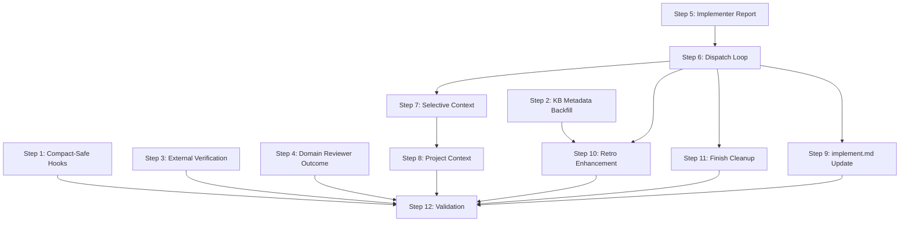

# Plan: Context and Review Hardening

## Overview

14 files across 10 design components, organized into 12 steps across 4 phases. Independent changes (Phase 1) run first since they touch separate files. The implementing SKILL.md rewrite (Phase 2) is built incrementally: dispatch loop → selective context → project context. Downstream consumers (Phase 3) follow once the implementing skill is stable. Validation closes (Phase 4).

**Verification approach:** All changes modify LLM prompt text in markdown files — not executable code. Traditional TDD does not apply. Instead, each step has explicit "Done when" criteria verified during Step 12 through code review and structural checks. Steps 6-8 (the core algorithmic logic) additionally include inline verification sub-steps against real feature data.

## Dependency Graph



## Phase 1: Independent Changes (No Dependencies)

Steps 1-5 touch separate files and have no cross-dependencies. Can be executed in any order.

### Step 1: Remove `compact` from SessionStart Hook Matchers

**Component:** C10 (Compact-Safe Hook Matchers)
**Why:** Compact events re-inject hook context and defeat compaction (PRD Problem #7). Trivial string change, zero risk — start here.
**File:** `plugins/iflow-dev/hooks/hooks.json`
**Depends on:** None
**Covers:** SC-15, AC-19

1. Read `hooks.json` (lines 1-72)
2. For each of the 4 SessionStart entries (lines 5, 14, 23, 32):
   - Change `"matcher": "startup|resume|clear|compact"` to `"matcher": "startup|resume|clear"`
3. Verify: 4 replacements made, no other matchers affected (PreToolUse Bash matcher, yolo-guard `.*` matcher, Stop hook — all unchanged)

**Done when:** All 4 SessionStart matchers match `startup|resume|clear` only; PreToolUse and Stop hooks unchanged.

### Step 2: Backfill Knowledge Bank Entry Metadata

**Component:** C9 (Knowledge Bank Metadata)
**Why:** Metadata must exist before Step 10c (KB validation) can read/update it. Independent of other steps — early completion unblocks Step 10.
**Files:** `docs/knowledge-bank/anti-patterns.md`, `docs/knowledge-bank/heuristics.md`
**Depends on:** None
**Covers:** SC-12, AC-15

**anti-patterns.md (8 entries):**

1. Read `anti-patterns.md`
2. For each `### Anti-Pattern:` entry with `- Observed in: Feature #NNN` format (7 of 8 entries):
   - Extract feature number NNN from the `Observed in:` line
   - Append after the last existing metadata line in that entry:
     ```
     - Last observed: Feature #NNN
     - Observation count: 1
     ```
3. For the entry `### Anti-Pattern: Relative Paths in Hooks` (which has non-numeric provenance "Observed in: Plugin cache staleness bug"):
   - Append:
     ```
     - Last observed: Feature #008 (approximate — original provenance was non-numeric)
     - Observation count: 1
     ```

**heuristics.md (7 entries):**

4. Read `heuristics.md`
5. For each `### ` entry with `- Source: Feature #NNN`:
   - Extract feature number NNN from the `Source:` line
   - Append after existing metadata (do NOT rename `Source` to `Observed in` — heuristics use `Source` consistently):
     ```
     - Last observed: Feature #NNN
     - Observation count: 1
     ```

**Done when:** All 15 real entries across both files have `Last observed` and `Observation count` fields. Entries inside `<!-- -->` HTML comment blocks are templates, not real entries — skip them. Count: 8 anti-patterns + 7 heuristics = 15 total. Existing fields (`Observed in`, `Source`, `Cost`, `Confidence`) unchanged.

**Scope note:** `patterns.md` (19 entries) is deliberately excluded from the metadata backfill and validation lifecycle. Patterns are positive guidance ("approaches that worked well") — they don't compound harm if stale the way anti-patterns and wrong heuristics do. An unused pattern is benign; an unchallenged wrong anti-pattern actively misleads. If patterns.md validation is later desired, it can be added as a follow-up without affecting this feature.

### Step 3: Add External Verification to Post-Planning Reviewers

**Component:** C8 (External Verification)
**Why:** Post-planning reviewers can't catch shared incorrect assumptions in the artifact chain (PRD Problem #5). Independent of other steps — separate agent files.
**Files:** `plugins/iflow-dev/agents/security-reviewer.md`, `plugins/iflow-dev/agents/implementation-reviewer.md`
**Depends on:** None
**Covers:** SC-10, SC-11, AC-13, AC-14

**security-reviewer.md:**

1. Read `security-reviewer.md` (lines 1-106)
2. Update frontmatter tools line (line 5):
   - From: `tools: [Read, Glob, Grep]`
   - To: `tools: [Read, Glob, Grep, WebSearch, mcp__context7__resolve-library-id, mcp__context7__query-docs]`
3. Insert after `## What You Check` section (after line 62, before `## Output Format`):
   ```markdown
   ## Independent Verification
   MUST verify at least 1 security-relevant claim via WebSearch or Context7 if present.
   Include verification result in output:
   - "Verified: {claim} via {source}"
   - OR "Unable to verify independently - flagged for human review"

   If code is pure internal logic with no external security claims:
   - Note "No external security claims to verify" in summary
   - Proceed without forced verification

   ## Tool Fallback
   If Context7 tools are unavailable:
   1. Use WebSearch as fallback for security claim verification
   2. If both unavailable, flag claims as "Unable to verify — external tools unavailable"
   3. Do NOT block approval solely due to tool unavailability — note it in summary
   4. Include tool availability status in review output
   ```

**implementation-reviewer.md:**

4. Read `implementation-reviewer.md` (lines 1-262)
5. Update frontmatter tools line (line 5):
   - From: `tools: [Read, Glob, Grep]`
   - To: `tools: [Read, Glob, Grep, WebSearch, mcp__context7__resolve-library-id, mcp__context7__query-docs]`
6. Insert after `## Critical Rule` section (after line 45, before `## Input`):
   ```markdown
   ## Independent Verification
   MUST verify at least 1 library/API usage claim via Context7 or WebSearch if present.
   Include verification result in output:
   - "Verified: {claim} via {source}"
   - OR "Unable to verify independently - flagged for human review"

   If implementation is pure internal logic with no external library/API claims:
   - Note "No external claims to verify" in summary
   - Proceed without forced verification

   ## Tool Fallback
   If Context7 tools are unavailable:
   1. Use WebSearch as fallback for library/API claim verification
   2. If both unavailable, flag claims as "Unable to verify — external tools unavailable"
   3. Do NOT block approval solely due to tool unavailability — note it in summary
   4. Include tool availability status in review output
   ```

**Precedent:** spec-reviewer.md already lists WebSearch + Context7 tools and has been used in production since Feature #017 without tool availability issues. The Tool Fallback section handles unavailability gracefully — matching the proven spec-reviewer pattern.

**Done when:** Both agents have WebSearch + Context7 tools in frontmatter; both have Independent Verification and Tool Fallback sections; existing content unchanged.

### Step 4: Add Domain Reviewer Outcome Block to Phase-Reviewer Prompts

**Component:** C7 (Domain Reviewer Outcome Block)
**Why:** Phase-reviewer is blind to domain reviewer failures (PRD Problem #4). Independent — touches only phase-reviewer prompt templates in 4 separate command files.
**Files:** `plugins/iflow-dev/commands/specify.md`, `plugins/iflow-dev/commands/design.md`, `plugins/iflow-dev/commands/create-plan.md`, `plugins/iflow-dev/commands/create-tasks.md`
**Depends on:** None
**Covers:** SC-9, AC-11, AC-12

For each of the 4 command files, the change is identical in pattern: insert a `## Domain Reviewer Outcome` block into the phase-reviewer prompt template, immediately before `## Next Phase Expectations`.

**Verified insertion anchors:** `## Next Phase Expectations` confirmed at specify.md:116, design.md:312, create-plan.md:88, create-tasks.md:134. Each file has this exact heading text.

**specify.md (Stage 2 phase-reviewer prompt):**

1. Read `specify.md`, locate Stage 2 phase-reviewer prompt (lines ~110-128)
2. Insert between `## Spec (what you're reviewing)` (line 113) and `## Next Phase Expectations` (line 116):
   ```markdown
   ## Domain Reviewer Outcome
   - Reviewer: spec-reviewer
   - Result: {APPROVED at iteration {n}/{max} | FAILED at iteration cap ({max}/{max})}
   - Unresolved issues: {list of remaining blocker/warning descriptions, or "none"}
   ```

**design.md (Stage 4 phase-reviewer prompt):**

3. Read `design.md`, locate Stage 4 phase-reviewer prompt (lines ~303-324)
4. Insert between `## Design (what you're reviewing)` (line 309) and `## Next Phase Expectations` (line 312):
   ```markdown
   ## Domain Reviewer Outcome
   - Reviewer: design-reviewer
   - Result: {APPROVED at iteration {n}/{max} | FAILED at iteration cap ({max}/{max})}
   - Unresolved issues: {list of remaining blocker/warning descriptions, or "none"}
   ```

**create-plan.md (Stage 2 phase-reviewer prompt):**

5. Read `create-plan.md`, locate Stage 2 phase-reviewer prompt (lines ~76-95)
6. Insert between `## Plan (what you're reviewing)` (line 85) and `## Next Phase Expectations` (line 88):
   ```markdown
   ## Domain Reviewer Outcome
   - Reviewer: plan-reviewer
   - Result: {APPROVED at iteration {n}/{max} | FAILED at iteration cap ({max}/{max})}
   - Unresolved issues: {list of remaining blocker/warning descriptions, or "none"}
   ```

**create-tasks.md (Stage 2 phase-reviewer prompt):**

7. Read `create-tasks.md`, locate Stage 2 phase-reviewer prompt (lines ~119-146)
8. Insert between `## Tasks (what you're reviewing)` (line 131) and `## Next Phase Expectations` (line 134):
   ```markdown
   ## Domain Reviewer Outcome
   - Reviewer: task-reviewer
   - Result: {APPROVED at iteration {n}/{max} | FAILED at iteration cap ({max}/{max})}
   - Unresolved issues: {list of remaining blocker/warning descriptions, or "none"}
   ```

**Data flow:** The orchestrating command already parses the domain reviewer's JSON response (`approved`, `issues[]`) and retains the iteration count. Construct the block from these in-context variables — no additional file reads needed. Variable persistence is guaranteed because both Stage 1 (domain reviewer) and Stage 2 (phase-reviewer) execute sequentially within the same LLM conversational turn — the orchestrating agent naturally retains all prior-stage variables in its working context.

**Done when:** All 4 phase-reviewer prompts include `## Domain Reviewer Outcome` between the last artifact section and `## Next Phase Expectations`.

### Step 5: Extend Implementer Agent Report Format

**Component:** C4 (Implementation Decision Log — implementer.md part)
**Why:** The implementing skill dispatch loop (Step 6) needs the agent to produce Decisions/Deviations fields for the implementation log. Must land before Step 6.
**File:** `plugins/iflow-dev/agents/implementer.md`
**Depends on:** None
**Blocks:** Step 6 (dispatch loop needs the agent to produce these fields)
**Covers:** SC-4 (partial), AC-5 (partial)

1. Read `implementer.md`
2. Add a done-criteria check instruction to `## Your Job` section (after line 38, before the numbered list), so the agent can skip already-completed tasks:
   ```markdown
   **Before implementing, check if the task's done criteria are already met** (e.g., files already exist, tests already pass). If so, report "Task already complete" with files already present, and skip implementation.
   ```
3. Update the Report Format section to add two new fields:
   - From:
     ```markdown
     ## Report Format

     When done, report:
     - What you implemented
     - What you tested and test results
     - Files changed
     - Self-review findings (if any)
     - Any issues or concerns
     ```
   - To:
     ```markdown
     ## Report Format

     When done, report:
     - What you implemented
     - What you tested and test results
     - Files changed
     - Decisions: implementation choices with rationale (or "none")
     - Deviations: changes from plan/design with reason (or "none")
     - Self-review findings (if any)
     - Any issues or concerns
     ```

**Done when:** Report Format section includes Decisions and Deviations fields; agent has done-criteria check instruction before implementing.

---

## Phase 2: Implementing SKILL.md Rewrite (Sequential, Incremental)

The implementing skill rewrite is the largest change. Built incrementally: Step 6 establishes the dispatch loop structure, Step 7 adds selective context loading, Step 8 adds project context injection. Each step extends the previous — they must be sequential because they all modify `implementing/SKILL.md`.

**Line budget note:** The current implementing SKILL.md is 126 lines, of which ~75 are replaced (Process + Task Selection). The rewrite adds the dispatch loop (~60 lines), selective context (~50 lines), and project context (~40 lines), for an estimated ~175-200 lines total. Well within the 500-line budget. If it exceeds 250 lines, extract to `references/` subdirectory following the Thin Orchestrator pattern (knowledge-bank patterns.md). **Extraction candidates:** (1) heading extraction algorithm (design pseudocode is ~25 lines), (2) project context loading steps (design Component 3 is ~15 lines of procedural logic). Both are self-contained and referenceable without breaking the orchestration flow.

### Step 6: Per-Task Dispatch Loop — Foundation

**Component:** C1 (Per-Task Dispatch Loop), C4 (implementing SKILL.md part — log append)
**Why:** Foundation for all implementation context changes (PRD Problems #1-3). All subsequent steps (7, 8, 9, 10, 11) depend on this dispatch loop. Must follow Step 5 so the implementer agent already has the new report format.
**File:** `plugins/iflow-dev/skills/implementing/SKILL.md`
**Depends on:** Step 5 (implementer agent knows what to report)
**Blocks:** Steps 7, 8, 9, 10, 11
**Covers:** SC-1, SC-4, AC-1, AC-5, AC-20, AC-21

**Rollback strategy:** This is a major rewrite. The feature branch preserves the pre-rewrite state via prior commits. If the rewrite fails validation or breaks behavior, revert with `git checkout -- plugins/iflow-dev/skills/implementing/SKILL.md` and re-approach.

This is a major rewrite of the skill. Replace the Process and Task Selection sections; preserve all other sections.

**Sections to REPLACE** (use heading names as primary anchors, line numbers as secondary guidance):
- `## Process` with Phases 1-5 (~lines 28-91) — replaced by new per-task dispatch loop
- `## Task Selection` (~lines 93-103) — replaced by "dispatches ALL tasks in order" note

**Sections to PRESERVE** (unchanged):
- Frontmatter (~lines 1-4)
- `## Prerequisites` (~lines 10-13)
- `## Related Skills` (~lines 15-19)
- `## Read Feature Context` (~lines 20-27)
- `## Commit Pattern` (~lines 104-110) — adjust: "after all tasks dispatched" instead of current "After completing each task" (line 106); commit granularity unchanged
- `## Error Handling` (~lines 112-119) — extend: add dispatch failure (AC-20: log, ask retry/skip) and malformed report (AC-21: partial log, proceed) handlers
- `## Completion` (~lines 121-126) — update: report N tasks completed/M skipped instead of phase completion

**New structure:**

1. Preserve frontmatter (lines 1-4) and Prerequisites section (lines 10-13)
2. Rewrite Process section with per-task dispatch loop:

```
## Process

### Step 1: Read Task List

1. Read tasks.md from feature directory
2. Parse all task headings using regex: /^(#{3,4})\s+Task\s+(\d+(?:\.\d+)*):?\s*(.+)$/
3. For each match, extract:
   - Task number (string, e.g., "1.1")
   - Task title
   - Task body (from heading through next same-or-higher-level heading, or EOF)
   - **Why:** or **Source:** field value (if present)
   - **Done when:** criteria (if present)
4. If no task headings found: log error, surface to user, STOP

### Step 2: Per-Task Dispatch Loop

For each task (in document order, top to bottom):

a. **Prepare context** — (initially: load full artifacts)
   - spec.md: always in full
   - design.md: full (selective loading added in next step)
   - plan.md: full (selective loading added in next step)
   - prd.md: extract ## Problem Statement and ## Goals sections only

b. **Dispatch implementer agent:**
   Task tool call:
     subagent_type: iflow-dev:implementer
     prompt: task description, done criteria, context artifacts

c. **Collect report** — extract from agent's text response:
   - Files changed, Decisions, Deviations, Concerns
   - Use substring match (case-insensitive) for field headers
   - Missing fields default to "none" for decisions/deviations/concerns

d. **Append implementation-log.md entry:**
   ## Task {number}: {title}
   - **Files changed:** {from report}
   - **Decisions:** {from report, or "none"}
   - **Deviations:** {from report, or "none"}
   - **Concerns:** {from report, or "none"}
   (Create file with # Implementation Log header if doesn't exist)

e. **Error handling:**
   - If dispatch fails (AC-20): log error, ask user retry/skip via AskUserQuestion
   - If report malformed (AC-21): write partial log entry with available fields, proceed

f. **Proceed to next task**

### Step 3: Return Results

After all tasks dispatched:
- Report summary: N tasks completed, M skipped/blocked
- Return deduplicated files changed list to implement.md
- implementation-log.md is on disk for retro to read later
```

3. Remove old Phase 2-5 sections (TDD phases become implementer agent's internal workflow per task dispatch — already defined in implementer.md)
4. Update Task Selection section to note: "Dispatches ALL tasks in document order. Implementer agent per-task checks done criteria."
5. Preserve Commit Pattern and Error Handling sections (adjusted for per-task context)

**Key design decision referenced:** TD-1 — explicit per-task Task tool dispatch with fresh context window per task. The TDD phases (Interface → RED-GREEN → REFACTOR) are the implementer agent's internal workflow, not the orchestrating skill's phases.

**Done when:** implementing SKILL.md has explicit per-task dispatch loop; each task gets its own Task tool call to implementer agent; reports collected sequentially; implementation-log.md appended per task.

### Step 7: Add Selective Context Loading

**Component:** C2 (Selective Context Loading)
**Why:** Reduces token overload by loading only referenced sections (PRD Problem #1). Extends Step 6's context preparation — must follow the dispatch loop foundation.
**File:** `plugins/iflow-dev/skills/implementing/SKILL.md` (extend Step 2.a from Step 6)
**Depends on:** Step 6 (loop structure must exist)
**Blocks:** Step 8
**Covers:** SC-2, SC-3, AC-2, AC-3, AC-4

Extend the context preparation step (Step 2.a) in the implementing skill to parse traceability fields and extract scoped sections.

1. Add traceability parsing logic to Step 2.a:
   ```
   a. **Prepare context:**
      i. Parse task's **Why:** or **Source:** field
      ii. If field present:
          - Split on comma, trim each reference
          - For each reference, apply regexes:
            Plan ref: /Plan (?:Step )?(\w+\.\w+)/i → plan identifier
            Design ref: /Design (?:Component )?(\w+[-\w]*)/i → design identifier
            Spec ref: /Spec (\w+\.\w+)/i → informational only
          - For each plan identifier: extract section from plan.md
            (substring heading match → prefix fallback → full if no match)
          - For each design identifier: extract section from design.md
            (substring heading match → full if no match)
      iii. If field absent or unparseable: load full artifacts, log warning
      iv. Heading extraction: find first heading containing identifier as substring,
          extract through next same-level heading (or EOF)
      v. Prefix fallback: if "1A.1" not found, try "1A"
   ```

2. Add the heading extraction algorithm (from Design Interface 2):
   ```
   extractSection(markdown, identifier):
     Find headings → match identifier substring → extract to next same-level heading
   extractSectionWithFallback(markdown, identifier):
     Try exact → try prefix (remove after last '.') → return null
   ```

3. Context assembly:
   - spec.md: always full
   - design.md: scoped sections joined (or full if any extraction failed)
   - plan.md: scoped sections joined (or full if any extraction failed)
   - prd.md: Problem Statement + Goals sections only

**Known fallback scenarios:** Feature 018 (§ separator — regex won't match → full loading), Feature 020 (no traceability fields → full loading), Features 002-016 (pre-template → full loading).

**Inline verification (after writing Step 7 content):**
1. Read Feature 021's tasks.md — find a task with `**Why:** Implements Plan Step 1.1 / Design C9`
2. Manually trace: regex extracts Plan identifier "1.1" and Design identifier "C9"
3. Check Feature 021's plan.md for a heading containing "1.1" — confirm substring match works
4. Check Feature 021's design.md for a heading containing "C9" — confirm substring match works
5. Check Feature 018's tasks.md — confirm `§` separator format does NOT match regexes → triggers full loading fallback

**Done when:** Tasks with Why/Source fields receive only referenced sections from design.md and plan.md; tasks without traceability fields fall back to full artifact loading with logged warning; spec.md always full; inline verification passes for Features 021 and 018.

### Step 8: Add Project Context Injection

**Component:** C3 (Project Context Injection)
**Why:** Strategic context lost by implementation time (PRD Problem #3). Extends context preparation from Steps 6-7. Placed after Step 7 because both modify the same context block in implementing SKILL.md.
**File:** `plugins/iflow-dev/skills/implementing/SKILL.md` (extend Step 2 from Steps 6-7)
**Depends on:** Step 7 (context preparation is where project context is added)
**Covers:** SC-7, SC-8, AC-9, AC-10

Add project context loading logic to the per-task context preparation step.

1. Add conditional project context block to Step 2, after artifact scoping:
   ```
   vi. **Project context** (if applicable):
       - Check .meta.json for project_id field
       - If absent/null: skip entirely (AC-10)
       - If present:
         a. Glob docs/projects/{project_id}-*/
         b. Read project prd.md → extract ## Problem Statement and ## Goals
         c. Summarize to 2-3 bullet points (~100 tokens)
         d. Read feature .meta.json depends_on_features list
         e. For each: glob docs/features/{ref}-*/, read .meta.json status
         f. Categorize: completed[], in-progress[], blocked[]
         g. Read project roadmap.md → find milestone containing this feature
         h. Format block (~200-500 tokens):
            ## Project Context
            **Project:** {name} | **This feature:** {feature name}
            **Project goals:** {2-3 bullets}
            **Feature dependencies:** completed: X, Y | in-progress: Z
            **Priority signal:** {milestone name, or "not on roadmap"}
         i. If block > ~500 tokens: truncate dependency details to counts
       - Prepend block to task prompt
   ```

2. Handle missing project infrastructure gracefully:
   - Project directory not found: log warning, skip
   - roadmap.md missing: omit priority signal
   - depends_on_features absent: omit dependency section

**Field names verified:** Feature 021 design defines `project_id` (string/null) and `depends_on_features` (array/null) in .meta.json.

**Done when:** Project-linked features get ~200-500 token context block prepended to each task; non-project features skip injection without error; graceful degradation when project artifacts missing. **Note:** Verification is code-path review only — no live projects exist in the codebase yet. First project-linked feature must manually confirm correct behavior (deferred behavioral verification per AC-9).

---

## Phase 3: Downstream Consumers

These steps consume formats established in Phase 2 or depend on the implementing skill changes being complete.

### Step 9: Update implement.md Step 4

**Component:** C1 (implement.md part)
**Why:** implement.md's Step 4 currently lists TDD sub-phases that are now the implementer agent's internal workflow. Must reference the updated implementing skill. Follows Step 6 because the skill rewrite must be stable.
**File:** `plugins/iflow-dev/commands/implement.md`
**Depends on:** Step 6 (implementing skill rewrite must be complete)
**Covers:** AC-1 (supports)

1. Read `implement.md` (lines 38-54, Step 4)
2. Update Step 4 to reference the updated implementing skill without duplicating its internals:
   - Current Step 4 lists sub-steps a-e (Deploy subagents, Interface Phase, RED-GREEN, REFACTOR, Return)
   - Replace all 5 sub-steps with a single instruction referencing the implementing skill:
     ```markdown
     ### 4. Implementation Phase

     Execute the implementing skill which:
     - Parses tasks.md for all task headings
     - Dispatches implementer agent per task with scoped context
     - Collects structured reports (files changed, decisions, deviations, concerns)
     - Appends per-task entries to implementation-log.md
     - Returns aggregate summary (files changed, completion status)
     ```
3. The TDD phases (Interface, RED-GREEN, REFACTOR) are the implementer agent's internal workflow — they don't need to be listed in implement.md's Step 4.
4. Fix iterations (Step 6d) continue to use full artifact context — no change needed there.

**Done when:** implement.md Step 4 references implementing skill's per-task dispatch without duplicating internals; Steps 5-6 (simplification, review) unchanged.

### Step 10: Enhance Retro Skill with Implementation Log and KB Validation

**Component:** C5 (Retro Context Enhancement)
**Why:** Retro needs implementation-log.md as data source (PRD Problem #2) and knowledge bank needs validation lifecycle (PRD Problem #6). Depends on Step 6 (impl-log format must exist) and Step 2 (KB metadata format must exist for validation).
**File:** `plugins/iflow-dev/skills/retrospecting/SKILL.md`
**Depends on:** Step 2 (metadata format must exist for validation), Step 6 (impl-log format defined)
**Covers:** SC-5, SC-13, SC-14, AC-6, AC-8, AC-16, AC-17, AC-18

Three additions to the retro skill. **Sub-step dependencies:** 10a depends on Step 6 only (impl-log format); 10b depends on Step 6 only; 10c depends on both Steps 2 and 6. Sub-steps 10a and 10b can land independently if 10c proves harder than expected.

**10a. Add Step 1c — Implementation Log (between Review History and Git Summary):**

1. Read `retrospecting/SKILL.md` (lines 1-213)
2. Insert new step 1c after step 1b (Review History):
   ```markdown
   **c. Implementation Log** — Read `implementation-log.md`:
   - If file exists: capture full content
   - If file doesn't exist: note "No implementation log available"
   ```
3. Rename existing steps c-e to d-f:
   - c → d (Git Summary)
   - d → e (Artifact Stats)
   - e → f (AORTA Framework)
   Also scan for any internal cross-references to step letters within retrospecting/SKILL.md (e.g., "Step 1c", "from step c") and update them to match the new lettering.

**10b. Update Step 2 dispatch prompt — Add implementation-log section:**

4. In the retro-facilitator dispatch prompt (Step 2), add `### Implementation Log` section to the context bundle between Review History and Git Summary:
   ```markdown
   ### Implementation Log
   {implementation-log.md content, or "No implementation log available"}
   ```

**10c. Add Step 4b — Knowledge Bank Validation:**

5. After Step 4 (which appends new entries from retro-facilitator's `act` section), add Step 4b:
   ```markdown
   ### Step 4b: Validate Knowledge Bank (Pre-Existing Entries)

   Validation is performed by the main orchestrating agent (not a sub-agent dispatch).
   Only validates pre-existing entries — entries just added in Step 4a are excluded.

   a. Read ALL entries from anti-patterns.md and heuristics.md (~15 entries total)
   b. Identify which are pre-existing (compare against retro-facilitator's act.anti_patterns and act.heuristics output — anything not in those lists is pre-existing)
   c. For each pre-existing entry, determine relevance to this feature:
      - RELEVANT if: entry's domain overlaps with this feature's git diff files OR implementation-log decisions/deviations OR review-history issues
      - NOT RELEVANT: skip (no update)
   d. For each relevant entry, evaluate accuracy:
      - CONFIRMED: feature experience aligns → Update "Last observed: Feature #{id}", increment "Observation count"
      - CONTRADICTED: feature experience contradicts → Append "- Challenged: Feature #{id} — {specific contradiction}"
   e. Staleness check (mechanical):
      - For each entry, extract feature number from "Last observed: Feature #{NNN}"
      - Glob docs/features/ directories, extract numeric prefix from each name (pattern: /^(\d+)-/), count those with numeric ID > NNN
      - If count >= 10: flag with "⚠️ STALE" marker
      - Surface stale entries to user via AskUserQuestion:
        "The following entries haven't been observed in 10+ features: {list}. Keep, update, or retire?"
      - Retire: delete entry, note in retro.md "Retired: {name} — {reason}"
      - Keep: remove stale marker, update Last observed to current feature
      - Update: user provides new text, modify in-place, reset Observation count to 1
   ```

6. Update the entry template in Step 4 to include new metadata fields:
   ```markdown
   ### {Type}: {Name}
   {Text}
   - Observed in: {provenance}
   - Confidence: {confidence}
   - Last observed: Feature #{NNN}
   - Observation count: 1
   ```
   Note: Use `Observed in:` for anti-patterns.md, `Source:` for heuristics.md (per-file consistency).

**Context overflow fallback for 10c:** If KB validation causes context issues during first retro run (detected by: agent errors, truncated output, or failure to complete staleness check), defer 10c to a follow-up feature and ship 10a+10b only. The validation is additive — its absence doesn't break any other functionality.

**Done when:** Retro reads implementation-log.md as Step 1c; retro-facilitator receives impl-log in context bundle; Step 4b validates pre-existing KB entries with confirm/challenge/stale logic; entry template includes metadata.

### Step 11: Add Implementation Log Cleanup to Finish

**Component:** C6 (Implementation Log Cleanup)
**Why:** implementation-log.md must be deleted after retro reads it, matching .review-history.md lifecycle. Trivial change but depends on Step 6 defining the log format.
**File:** `plugins/iflow-dev/commands/finish.md`
**Depends on:** Step 6 (log format must be defined)
**Covers:** SC-6, AC-7

1. Read `finish.md` (lines 266-288, Phase 6)
2. In Step 6b, immediately after the `.review-history.md` deletion line (line 287):
   - Add:
     ```markdown
     ### Step 6b-2: Delete implementation-log.md

     ```bash
     rm docs/features/{id}-{slug}/implementation-log.md 2>/dev/null || true
     ```
     ```
   - Or more naturally, extend Step 6b to include both deletions together.

**Done when:** finish.md Phase 6 deletes implementation-log.md alongside .review-history.md.

---

## Phase 4: Validation

### Step 12: Run Validation Suite and Verify

**Covers:** SC-16

1. Run `./validate.sh` — expect 0 errors
2. **Structural checks** (automated by validate.sh): SKILL.md line count, frontmatter format, agent tool declarations
3. **Behavioral verification** (code review, since changes are prompt text not executable code):
   - SC-1: implementing SKILL.md has per-task dispatch loop
   - SC-2: Selective context loading logic present with heading extraction
   - SC-3: Fallback to full loading on missing/unparseable traceability
   - SC-4: implementation-log.md entry written per task with 4 fields
   - SC-5: retrospecting SKILL.md Step 1c reads implementation-log.md
   - SC-6: finish.md deletes implementation-log.md
   - SC-7: Project context code path exists (deferred behavioral verification)
   - SC-8: Non-project features skip injection
   - SC-9: 4 phase-reviewer prompts include Domain Reviewer Outcome
   - SC-10: security-reviewer has WebSearch + Context7 + verification instruction
   - SC-11: implementation-reviewer has WebSearch + Context7 + verification instruction
   - SC-12: All KB entries have Last observed + Observation count
   - SC-13: retro Step 4b validates entries
   - SC-14: Staleness check with 10+ features threshold
   - SC-15: SessionStart matchers exclude compact
   - SC-16: validate.sh passes
4. **Edge case spot-checks** (verify specific scenarios in the prompt text):
   - Regex patterns in implementing SKILL.md handle: `Plan 3.2`, `Plan Step 1A.1`, `Design Component Auth-Module`, `Design C9`, `Spec C4.1`
   - Fallback path exists for: missing Why/Source field, unmatched heading, unparseable format
   - Non-numeric provenance entry ("Plugin cache staleness bug") has `Feature #008 (approximate)` in Last observed
   - implementation-log.md creation (first task) vs append (subsequent tasks) both handled
   - patterns.md excluded from KB validation (only anti-patterns.md and heuristics.md)

**Documentation note:** No skills/commands/agents are added or removed in this feature, so README/README_FOR_DEV sync is not required. Hookify docs-sync warnings (if any) can be ignored.

---

## Critical Path

```
Step 5 (implementer report) → Step 6 (dispatch loop) → Step 7 (selective context)
→ Step 8 (project context) → Step 12 (validation)
```

Steps 1-4 are independent and can be done in parallel or any order. Step 10 (retro) depends on both Steps 2 and 6. Step 11 (finish cleanup) depends on Step 6.

## Risk Mitigations

| Risk | Mitigation | Plan Step |
|------|------------|-----------|
| R-1: Heading extraction false positives | First match + prefix fallback + full loading fallback | Step 7 |
| R-2: Implementer ignores new fields | Partial log entry with available fields (AC-21) | Step 6 |
| R-3: KB validation quality | First retro run calibration (SC-13) | Step 10 |
| R-4: Phase-reviewer ignores outcome | Informational only; monitor first features | Step 4 |
| R-5: External tools unavailable | Tool Fallback sections matching spec-reviewer pattern | Step 3 |

## File Change Summary

| Step | File | Change Type |
|------|------|-------------|
| 1 | hooks.json | 4 string replacements |
| 2 | anti-patterns.md | Add 2 lines per entry (8 entries) |
| 2 | heuristics.md | Add 2 lines per entry (7 entries) |
| 3 | security-reviewer.md | Frontmatter + 2 new sections |
| 3 | implementation-reviewer.md | Frontmatter + 2 new sections |
| 4 | specify.md | Insert block in prompt template |
| 4 | design.md | Insert block in prompt template |
| 4 | create-plan.md | Insert block in prompt template |
| 4 | create-tasks.md | Insert block in prompt template |
| 5 | implementer.md | Extend Report Format section |
| 6 | implementing/SKILL.md | Major rewrite |
| 7 | implementing/SKILL.md | Extend context preparation |
| 8 | implementing/SKILL.md | Extend context preparation |
| 9 | implement.md | Update Step 4 references |
| 10 | retrospecting/SKILL.md | Add Step 1c + Step 4b + template update |
| 11 | finish.md | Add cleanup line |
