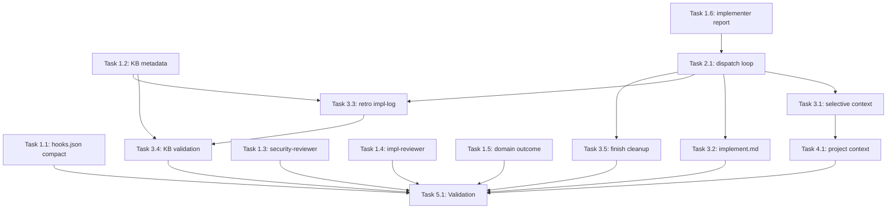

# Tasks: Context and Review Hardening

## Dependency Graph



## Execution Strategy

### Parallel Group 1 (No dependencies - can start immediately)
- Task 1.1: Remove compact from SessionStart hook matchers
- Task 1.2: Backfill knowledge bank entry metadata
- Task 1.3: Add external verification to security-reviewer
- Task 1.4: Add external verification to implementation-reviewer
- Task 1.5: Add Domain Reviewer Outcome block to 4 command files
- Task 1.6: Extend implementer agent report format

### Sequential Group 2 (After Task 1.6)
- Task 2.1: Rewrite implementing SKILL.md with per-task dispatch loop (needs: 1.6)

### Parallel Group 3 (After Task 2.1)
- Task 3.1: Add selective context loading to implementing SKILL.md (needs: 2.1)
- Task 3.2: Update implement.md Step 4 reference (needs: 2.1)
- Task 3.3: Add implementation-log reading to retro skill (needs: 1.2, 2.1)
- Task 3.4: Add KB validation to retro skill (needs: 1.2, 3.3)
- Task 3.5: Add implementation-log cleanup to finish.md (needs: 2.1)

### Sequential Group 4 (After Task 3.1)
- Task 4.1: Add project context injection to implementing SKILL.md (needs: 3.1)

### Sequential Group 5 (After all tasks)
- Task 5.1: Run validation suite and verify all changes (needs: all prior tasks)

## Task Details

### Phase 1: Independent Changes

#### Task 1.1: Remove compact from SessionStart hook matchers
- **Why:** Implements Plan Step 1 / Design Component C10
- **Depends on:** None (can start immediately)
- **Blocks:** Task 5.1
- **Files:** `plugins/iflow-dev/hooks/hooks.json`
- **Do:**
  1. Read `plugins/iflow-dev/hooks/hooks.json`
  2. Locate the 4 SessionStart entries at lines 5, 14, 23, 32
  3. For each, change `"matcher": "startup|resume|clear|compact"` to `"matcher": "startup|resume|clear"`
  4. Verify no other matchers were affected (PreToolUse Bash matcher at line 41, yolo-guard `.*` matcher at line 52, Stop hook at line 61 — all must remain unchanged)
- **Test:** `grep -c '"startup|resume|clear"' plugins/iflow-dev/hooks/hooks.json` returns 4; `grep -c 'compact' plugins/iflow-dev/hooks/hooks.json` returns 0
- **Done when:** All 4 SessionStart matchers match `startup|resume|clear` only; PreToolUse and Stop hooks unchanged

#### Task 1.2: Backfill knowledge bank entry metadata
- **Why:** Implements Plan Step 2 / Design Component C9
- **Depends on:** None (can start immediately)
- **Blocks:** Task 3.3, Task 3.4
- **Files:** `docs/knowledge-bank/anti-patterns.md`, `docs/knowledge-bank/heuristics.md`
- **Do:**
  1. Read `docs/knowledge-bank/anti-patterns.md`
  2. For each of the 8 real `### Anti-Pattern:` entries (skip entries inside `<!-- -->` HTML comment blocks):
     - For the 7 entries with `- Observed in: Feature #NNN`: append `- Last observed: Feature #NNN` and `- Observation count: 1` after the last existing metadata line
     - For `### Anti-Pattern: Relative Paths in Hooks` (non-numeric provenance "Plugin cache staleness bug"): append `- Last observed: Feature #008 (approximate — original provenance was non-numeric)` and `- Observation count: 1`
  3. Read `docs/knowledge-bank/heuristics.md`
  4. For each of the 7 real `###` entries (skip HTML comment template):
     - Extract feature number from `- Source: Feature #NNN` line
     - Append `- Last observed: Feature #NNN` and `- Observation count: 1` after existing metadata
     - Do NOT rename `Source` to `Observed in` — heuristics use `Source` consistently
  5. Verify existing fields (`Observed in`, `Source`, `Cost`, `Confidence`) are unchanged
- **Test:** Count `Last observed:` lines: `grep -c 'Last observed' docs/knowledge-bank/anti-patterns.md` returns 8; `grep -c 'Last observed' docs/knowledge-bank/heuristics.md` returns 7
- **Done when:** All 15 real entries have `Last observed` and `Observation count` fields; existing fields unchanged; HTML comment templates untouched

#### Task 1.3: Add external verification to security-reviewer agent
- **Why:** Implements Plan Step 3 / Design Component C8
- **Depends on:** None (can start immediately)
- **Blocks:** Task 5.1
- **Files:** `plugins/iflow-dev/agents/security-reviewer.md`
- **Do:**
  1. Read `plugins/iflow-dev/agents/security-reviewer.md`
  2. Update frontmatter tools line (line 5) from `tools: [Read, Glob, Grep]` to `tools: [Read, Glob, Grep, WebSearch, mcp__context7__resolve-library-id, mcp__context7__query-docs]`
  3. Insert between the last checklist item of `## What You Check` (line 62) and `## Output Format` (line 64), preserving blank separator lines:
     - `## Independent Verification` section with "MUST verify at least 1 security-relevant claim" instruction, verification output format, and "no external security claims" edge case
     - `## Tool Fallback` section with Context7/WebSearch fallback chain and "do NOT block approval solely due to tool unavailability" instruction
  4. Verify existing sections (`## What You Check`, `## Output Format`, `## Approval Rules`, `## What You MUST NOT Do`) unchanged
- **Test:** `grep 'WebSearch' plugins/iflow-dev/agents/security-reviewer.md` returns matches in frontmatter and verification section; `grep '## Independent Verification' plugins/iflow-dev/agents/security-reviewer.md` returns 1 match
- **Done when:** security-reviewer.md has WebSearch + Context7 in frontmatter tools; has Independent Verification and Tool Fallback sections; existing content unchanged

#### Task 1.4: Add external verification to implementation-reviewer agent
- **Why:** Implements Plan Step 3 / Design Component C8
- **Depends on:** None (can start immediately)
- **Blocks:** Task 5.1
- **Files:** `plugins/iflow-dev/agents/implementation-reviewer.md`
- **Do:**
  1. Read `plugins/iflow-dev/agents/implementation-reviewer.md`
  2. Update frontmatter tools line (line 5) from `tools: [Read, Glob, Grep]` to `tools: [Read, Glob, Grep, WebSearch, mcp__context7__resolve-library-id, mcp__context7__query-docs]`
  3. Insert after `## Critical Rule` section (after line 45, before `## Input` at line 47):
     - `## Independent Verification` section with "MUST verify at least 1 library/API usage claim" instruction, verification output format, and "no external claims" edge case
     - `## Tool Fallback` section matching security-reviewer pattern
  4. Verify existing sections (`## Critical Rule`, `## Input`, `## Output`) unchanged
- **Test:** `grep 'WebSearch' plugins/iflow-dev/agents/implementation-reviewer.md` returns matches; `grep '## Independent Verification' plugins/iflow-dev/agents/implementation-reviewer.md` returns 1 match
- **Done when:** implementation-reviewer.md has WebSearch + Context7 in frontmatter tools; has Independent Verification and Tool Fallback sections; existing content unchanged

#### Task 1.5: Add Domain Reviewer Outcome block to 4 phase-reviewer prompts
- **Why:** Implements Plan Step 4 / Design Component C7
- **Depends on:** None (can start immediately)
- **Blocks:** Task 5.1
- **Files:** `plugins/iflow-dev/commands/specify.md`, `plugins/iflow-dev/commands/design.md`, `plugins/iflow-dev/commands/create-plan.md`, `plugins/iflow-dev/commands/create-tasks.md`
- **Do:**
  1. For each file, locate the phase-reviewer prompt template and insert a `## Domain Reviewer Outcome` block immediately before `## Next Phase Expectations`:
     - **specify.md:** Insert between `## Spec (what you're reviewing)` (line 113) and `## Next Phase Expectations` (line 116). Block uses `Reviewer: spec-reviewer`
     - **design.md:** Insert between `## Design (what you're reviewing)` (line 309) and `## Next Phase Expectations` (line 312). Block uses `Reviewer: design-reviewer`
     - **create-plan.md:** Insert between `## Plan (what you're reviewing)` (line 85) and `## Next Phase Expectations` (line 88). Block uses `Reviewer: plan-reviewer`
     - **create-tasks.md:** Insert between `## Tasks (what you're reviewing)` (line 131) and `## Next Phase Expectations` (line 134). Block uses `Reviewer: task-reviewer`
  2. Each block follows this template:
     ```
     ## Domain Reviewer Outcome
     - Reviewer: {reviewer-name}
     - Result: {APPROVED at iteration {n}/{max} | FAILED at iteration cap ({max}/{max})}
     - Unresolved issues: {list of remaining blocker/warning descriptions, or "none"}
     ```
  3. The block values are constructed from in-context variables: the Stage 1 loop already parses the domain reviewer's JSON response (`approved`, `issues[]`) to decide pass/fail, and the loop counter tracks iteration count and max (5). Reference these directly when constructing the block text — no additional file reads needed.
- **Test:** `grep -c '## Domain Reviewer Outcome' plugins/iflow-dev/commands/specify.md plugins/iflow-dev/commands/design.md plugins/iflow-dev/commands/create-plan.md plugins/iflow-dev/commands/create-tasks.md` returns 1 per file (4 total)
- **Done when:** All 4 phase-reviewer prompts include `## Domain Reviewer Outcome` between the last artifact section and `## Next Phase Expectations`

#### Task 1.6: Extend implementer agent report format
- **Why:** Implements Plan Step 5 / Design Component C4
- **Depends on:** None (can start immediately)
- **Blocks:** Task 2.1
- **Files:** `plugins/iflow-dev/agents/implementer.md`
- **Do:**
  1. Read `plugins/iflow-dev/agents/implementer.md`
  2. In `## Your Job` section, insert between the `## Your Job` heading (line 36) and the numbered list starting at line 38 (`1. **Implement**`):
     ```
     **Before implementing, check if the task's done criteria are already met** (e.g., files already exist, tests already pass). If so, report "Task already complete" with files already present, and skip implementation.
     ```
  3. In `## Report Format` section (lines 75-82), add two new fields after `- Files changed` (line 80) and before `- Self-review findings` (line 81):
     - `- Decisions: implementation choices with rationale (or "none")`
     - `- Deviations: changes from plan/design with reason (or "none")`
  4. Verify existing report fields unchanged (What you implemented, What you tested, Files changed, Self-review findings, Any issues or concerns)
- **Test:** `grep 'Decisions' plugins/iflow-dev/agents/implementer.md` returns match in Report Format; `grep 'done criteria' plugins/iflow-dev/agents/implementer.md` returns match in Your Job
- **Done when:** Report Format section includes Decisions and Deviations fields; done-criteria check instruction present before implementation steps

### Phase 2: Implementing SKILL.md Rewrite

#### Task 2.1: Rewrite implementing SKILL.md with per-task dispatch loop
- **Why:** Implements Plan Step 6 / Design Components C1, C4
- **Depends on:** Task 1.6
- **Blocks:** Task 3.1, Task 3.2, Task 3.3, Task 3.5
- **Files:** `plugins/iflow-dev/skills/implementing/SKILL.md`
- **Do:**
  1. Read `plugins/iflow-dev/skills/implementing/SKILL.md` (126 lines)
  2. **REPLACE** these sections (use heading names as primary anchors):
     - `## Process` with Phases 1-5 (~lines 28-91)
     - `## Task Selection` (~lines 93-103)
  3. Write new `## Process` section with 3 steps:
     - **Step 1: Read Task List** — read tasks.md, parse headings with regex `/^(#{3,4})\s+Task\s+(\d+(?:\.\d+)*):?\s*(.+)$/`, extract task number/title/body/Why field/Done criteria, error if no tasks found
     - **Step 2: Per-Task Dispatch Loop** — for each task in document order: (a) prepare context (full artifacts initially), (b) dispatch implementer agent via Task tool, (c) collect report and extract fields via case-insensitive substring match, (d) append implementation-log.md entry (create with `# Implementation Log` header if first task), (e) handle dispatch failure (AC-20: log, AskUserQuestion retry/skip) and malformed report (AC-21: partial entry, proceed), (f) next task
     - **Step 3: Return Results** — report N completed/M skipped, return deduplicated files changed list
  4. **PRESERVE** these sections (adjust as noted):
     - Frontmatter, Prerequisites, Related Skills, Read Feature Context — unchanged
     - `## Commit Pattern` — change "After completing each task" to "after all tasks dispatched"
     - `## Error Handling` — extend with dispatch failure (AC-20) and malformed report (AC-21) handlers
     - `## Completion` — update to report N tasks completed/M skipped
  5. Verify line count is within budget (~175-200 lines, under 250 extraction threshold). If over 250, extract heading extraction algorithm or project context loading to `references/` subdirectory per plan's extraction candidates.
- **Test:** `grep 'Per-Task Dispatch' plugins/iflow-dev/skills/implementing/SKILL.md` returns match; `grep 'implementation-log.md' plugins/iflow-dev/skills/implementing/SKILL.md` returns match; run `./validate.sh` for structural checks
- **Done when:** implementing SKILL.md has explicit per-task dispatch loop with Task tool calls to implementer agent; reports collected sequentially; implementation-log.md appended per task; Commit Pattern, Error Handling, Completion sections adjusted; line count under 250

### Phase 3: Downstream Consumers

#### Task 3.1: Add selective context loading to implementing SKILL.md
- **Why:** Implements Plan Step 7 / Design Component C2
- **Depends on:** Task 2.1
- **Blocks:** Task 4.1
- **Files:** `plugins/iflow-dev/skills/implementing/SKILL.md`
- **Do:**
  1. Read `plugins/iflow-dev/skills/implementing/SKILL.md` (as rewritten by Task 2.1)
  2. Extend Step 2.a (context preparation) with traceability parsing:
     - Parse task's `**Why:**` or `**Source:**` field value
     - If present: split on comma, trim each reference, apply regexes:
       - Plan: `/Plan (?:Step )?(\w+\.\w+)/i` → plan identifier
       - Design: `/Design (?:Component )?(\w+[-\w]*)/i` → design identifier
       - Spec: `/Spec (\w+\.\w+)/i` → informational only
     - For each plan identifier: extract section from plan.md (substring heading match → prefix fallback → full if no match)
     - For each design identifier: extract section from design.md (substring heading match → full if no match)
     - If field absent or unparseable: load full artifacts, log warning
  3. Add heading extraction algorithm:
     - `extractSection(markdown, identifier)`: find first heading containing identifier as substring, extract through next same-level heading or EOF
     - `extractSectionWithFallback(markdown, identifier)`: try exact, then prefix (remove after last `.`), return null if neither matches
  4. Update context assembly: spec.md always full, design.md/plan.md scoped (or full on extraction failure), prd.md Problem Statement + Goals only
  5. **Inline verification:** Read Feature 021's tasks.md — find `**Why:** Implements Plan Step 1.1 / Design C9` — verify regex extracts plan identifier "1.1" and design identifier "C9". Read Feature 018's tasks.md — confirm `§` separator format (e.g., `Design § Component 2 § scqa-framing.md`) does NOT match Plan/Design regexes, triggering full-loading fallback.
- **Test:** Verify SKILL.md contains regex patterns, heading extraction algorithm, and fallback logic; inline verification passes for Features 021 and 018
- **Done when:** Tasks with Why/Source fields receive scoped sections; fallback to full loading on missing/unparseable traceability; spec.md always full; inline verification passes

#### Task 3.2: Update implement.md Step 4 reference
- **Why:** Implements Plan Step 9 / Design Component C1
- **Depends on:** Task 2.1
- **Blocks:** Task 5.1
- **Files:** `plugins/iflow-dev/commands/implement.md`
- **Do:**
  1. Read `plugins/iflow-dev/commands/implement.md` (lines 38-54, Step 4)
  2. Replace current Step 4's 5 sub-steps (a: Deploy subagents, b: Interface Phase, c: RED-GREEN, d: REFACTOR, e: Return) with a single instruction:
     ```
     ### 4. Implementation Phase

     Execute the implementing skill which:
     - Parses tasks.md for all task headings
     - Dispatches implementer agent per task with scoped context
     - Collects structured reports (files changed, decisions, deviations, concerns)
     - Appends per-task entries to implementation-log.md
     - Returns aggregate summary (files changed, completion status)
     ```
  3. Verify Steps 5 (code simplification) and 6 (review phase) are unchanged
  4. Verify Step 6d (fix iterations) still uses full artifact context — no change needed
- **Test:** `grep 'implementing skill' plugins/iflow-dev/commands/implement.md` returns match in Step 4; `grep -c 'Interface Phase\|RED-GREEN\|REFACTOR' plugins/iflow-dev/commands/implement.md` returns 0 in Step 4 area
- **Done when:** implement.md Step 4 references implementing skill's per-task dispatch; Steps 5-6 unchanged

#### Task 3.3: Add implementation-log reading to retro skill
- **Why:** Implements Plan Step 10a+10b / Design Component C5
- **Depends on:** Task 1.2, Task 2.1
- **Blocks:** Task 3.4
- **Files:** `plugins/iflow-dev/skills/retrospecting/SKILL.md`
- **Do:**
  1. Read `plugins/iflow-dev/skills/retrospecting/SKILL.md` (lines 1-213)
  2. **Step 1c insertion:** After Step 1b (Review History), insert new step:
     ```
     **c. Implementation Log** — Read `implementation-log.md`:
     - If file exists: capture full content
     - If file doesn't exist: note "No implementation log available"
     ```
  3. Re-letter existing Step 1 sub-steps: c→d (Git Summary), d→e (Artifact Stats), e→f (AORTA Framework). The Step 2 dispatch prompt uses `###` headings (e.g., `### Git Summary`) not letter references, so only the Step 1 sub-step labels need re-lettering. Also scan for any internal cross-references to step letters and update them.
  4. **Step 2 prompt update:** In the retro-facilitator dispatch prompt, add `### Implementation Log` section to context bundle between Review History and Git Summary:
     ```
     ### Implementation Log
     {implementation-log.md content, or "No implementation log available"}
     ```
  5. Update the entry template in Step 4 to include metadata fields:
     ```
     - Last observed: Feature #{NNN}
     - Observation count: 1
     ```
     Use `Observed in:` for anti-patterns.md, `Source:` for heuristics.md
- **Test:** `grep 'Implementation Log' plugins/iflow-dev/skills/retrospecting/SKILL.md` returns matches in Step 1c and Step 2 prompt; `grep 'Last observed' plugins/iflow-dev/skills/retrospecting/SKILL.md` returns match in entry template
- **Done when:** Retro reads implementation-log.md as Step 1c; retro-facilitator receives impl-log in context bundle; entry template includes Last observed and Observation count metadata

#### Task 3.4: Add knowledge bank validation to retro skill
- **Why:** Implements Plan Step 10c / Design Component C5
- **Depends on:** Task 1.2, Task 3.3
- **Blocks:** Task 5.1
- **Files:** `plugins/iflow-dev/skills/retrospecting/SKILL.md`
- **Do:**
  1. Read `plugins/iflow-dev/skills/retrospecting/SKILL.md` (as modified by Task 3.3)
  2. After the existing Step 4 (KB entry writing — implicitly becomes Step 4a), add Step 4b. No need to rename the existing Step 4 heading since Step 4b references "entries just added in Step 4a" which makes the implicit naming clear:
     ```
     ### Step 4b: Validate Knowledge Bank (Pre-Existing Entries)
     ```
  3. Step 4b content:
     - **a.** Read ALL entries from anti-patterns.md and heuristics.md (~15 entries)
     - **b.** Identify pre-existing entries (exclude entries just added in Step 4a by comparing against retro-facilitator's act output)
     - **c.** For each pre-existing entry, determine relevance (domain overlaps with git diff, impl-log, or review-history)
     - **d.** For relevant entries: CONFIRMED → update Last observed + increment Observation count; CONTRADICTED → append `- Challenged: Feature #{id} — {contradiction}`
     - **e.** Staleness check: extract feature number from "Last observed", glob `docs/features/` directories, extract numeric prefix (pattern: `/^(\d+)-/`), count those > NNN. If count >= 10: flag `STALE`, surface via AskUserQuestion for keep/update/retire
  4. Note: Validation performed by main orchestrating agent, not sub-agent dispatch. Only validates anti-patterns.md and heuristics.md (not patterns.md)
- **Test:** `grep 'Step 4b' plugins/iflow-dev/skills/retrospecting/SKILL.md` returns match; `grep 'Staleness\|STALE\|AskUserQuestion' plugins/iflow-dev/skills/retrospecting/SKILL.md` returns matches
- **Done when:** Step 4b validates pre-existing KB entries with confirm/challenge/stale logic; staleness check uses glob count with 10+ threshold; retire/keep/update actions specified

#### Task 3.5: Add implementation-log cleanup to finish.md
- **Why:** Implements Plan Step 11 / Design Component C6
- **Depends on:** Task 2.1
- **Blocks:** Task 5.1
- **Files:** `plugins/iflow-dev/commands/finish.md`
- **Do:**
  1. Read `plugins/iflow-dev/commands/finish.md` (lines 266-288, Phase 6)
  2. In Step 6b, immediately after the `.review-history.md` deletion line (line 287), add implementation-log.md deletion:
     ```bash
     rm docs/features/{id}-{slug}/implementation-log.md 2>/dev/null || true
     ```
  3. Alternatively, extend Step 6b to list both deletions together for clarity
  4. Verify other Phase 6 steps (branch deletion, status update) unchanged
- **Test:** `grep 'implementation-log.md' plugins/iflow-dev/commands/finish.md` returns match in Phase 6
- **Done when:** finish.md Phase 6 deletes implementation-log.md alongside .review-history.md

### Phase 4: Project Context Extension

#### Task 4.1: Add project context injection to implementing SKILL.md
- **Why:** Implements Plan Step 8 / Design Component C3
- **Depends on:** Task 3.1
- **Blocks:** Task 5.1
- **Files:** `plugins/iflow-dev/skills/implementing/SKILL.md`
- **Do:**
  1. Read `plugins/iflow-dev/skills/implementing/SKILL.md` (as extended by Tasks 2.1 and 3.1)
  2. Add conditional project context block to Step 2, after artifact scoping (as step `vi`):
     - Check `.meta.json` for `project_id` field
     - If absent/null: skip entirely (AC-10 — no error)
     - If present:
       a. Glob `docs/projects/{project_id}-*/`
       b. Read project prd.md → extract `## Problem Statement` and `## Goals`
       c. Summarize to 2-3 bullet points (~100 tokens)
       d. Read feature `.meta.json` `depends_on_features` list
       e. For each: glob `docs/features/{ref}-*/`, read `.meta.json` status
       f. Categorize: completed[], in-progress[], blocked[]
       g. Read project `roadmap.md` → find milestone containing this feature
       h. Format `## Project Context` block (~200-500 tokens)
       i. If block > ~500 tokens: truncate dependency details to counts
     - Prepend block to task prompt
  3. Handle missing infrastructure: project dir not found → skip; roadmap.md missing → omit priority; depends_on_features absent → omit dependencies
  4. Verify line count still under budget (250-line extraction threshold)
- **Test:** `grep 'project_id' plugins/iflow-dev/skills/implementing/SKILL.md` returns match; `grep 'Project Context' plugins/iflow-dev/skills/implementing/SKILL.md` returns match; run `./validate.sh`
- **Done when:** Project-linked features get ~200-500 token context block; non-project features skip without error; graceful degradation for missing project artifacts; line count under 250

### Phase 5: Validation

#### Task 5.1: Run validation suite and verify all changes
- **Why:** Implements Plan Step 12 / SC-16
- **Depends on:** All prior tasks
- **Blocks:** None
- **Files:** All 14 modified files
- **Do:**
  1. Run `./validate.sh` — expect 0 errors
  2. **Behavioral verification** (code review for each SC):
     - SC-1: implementing SKILL.md has per-task dispatch loop
     - SC-2: Selective context loading with heading extraction present
     - SC-3: Fallback to full loading on missing/unparseable traceability
     - SC-4: implementation-log.md entry written per task with 4 fields
     - SC-5: retrospecting SKILL.md Step 1c reads implementation-log.md
     - SC-6: finish.md deletes implementation-log.md
     - SC-7: Project context code path exists (deferred behavioral verification)
     - SC-8: Non-project features skip injection
     - SC-9: 4 phase-reviewer prompts include Domain Reviewer Outcome
     - SC-10: security-reviewer has WebSearch + Context7 + verification
     - SC-11: implementation-reviewer has WebSearch + Context7 + verification
     - SC-12: All 15 KB entries have Last observed + Observation count
     - SC-13: retro Step 4b validates entries
     - SC-14: Staleness check with 10+ features threshold
     - SC-15: SessionStart matchers exclude compact
     - SC-16: validate.sh passes
  3. **Edge case spot-checks:**
     - Regex patterns handle: `Plan 3.2`, `Plan Step 1A.1`, `Design Component Auth-Module`, `Design C9`, `Spec C4.1`
     - Fallback paths exist for: missing Why/Source, unmatched heading, unparseable format
     - Non-numeric provenance entry has `Feature #008 (approximate)` in Last observed
     - implementation-log.md creation (first task) vs append (subsequent tasks) both handled
     - patterns.md excluded from KB validation
- **Test:** `./validate.sh` returns 0 errors; all 16 SC verified by code review
- **Done when:** `./validate.sh` passes with 0 errors; all 16 SC confirmed via code review; edge case spot-checks pass

## Summary

- Total tasks: 14
- Parallel groups: 5
- Critical path: Task 1.6 → Task 2.1 → Task 3.1 → Task 4.1 → Task 5.1
- Max parallelism: 6 (Group 1)
