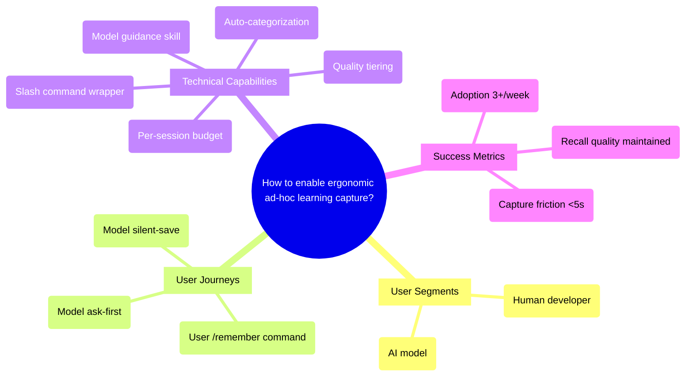

# PRD: Manual Learning Command (`/remember`)

## Status
- Created: 2026-02-21
- Last updated: 2026-02-21
- Status: Draft
- Problem Type: Product/Feature
- Archetype: exploring-an-idea

## Problem Statement
Valuable mid-session learnings -- user corrections, discovered quirks, anti-patterns, system-specific knowledge, and frequently recurring errors -- are lost because no ergonomic mechanism exists to capture them when they occur. Learnings are currently only persisted during retrospectives at feature completion, creating a temporal gap where insights decay or are forgotten.

### Evidence
- Codebase: The retrospecting skill (Step 4a) is the only structured learning capture path, tied to the `/finish` lifecycle -- Evidence: `plugins/iflow-dev/skills/retrospecting/SKILL.md:191-221`
- Codebase: An MCP `store_memory` tool exists (shipped in Feature #024) but lacks discoverability -- no slash command, no session-start promotion, no model-initiated guidance -- Evidence: `plugins/iflow-dev/mcp/memory_server.py:244-281`
- Industry: ChatGPT evolved from manual Custom Instructions to hybrid auto+manual memory, calling it "a more user friendly experience while still allowing users the ultimate say in what is being stored" -- Evidence: [OpenAI Help Center](https://help.openai.com/en/articles/8983136-what-is-memory)
- Industry: Enterprise KM research shows systems requiring explicit categorization during capture see adoption rates plummet -- Evidence: [FireOak Strategies](https://fireoakstrategies.com/blog/ways-to-incorporate-knowledge-capture-fireoak/)
- Industry: Windsurf supports four activation modes including "Model Decision" (natural language trigger) for dual user/model invocation -- Evidence: [Windsurf Docs](https://docs.windsurf.com/windsurf/cascade/memories)

## Goals
1. Enable ad-hoc learning capture during any session by both user and model
2. Minimize friction so capture takes <5 seconds of user attention
3. Ensure captured learnings actually surface in relevant future sessions via existing retrieval pipeline
4. Prevent database pollution from low-quality model-initiated captures

## Success Criteria
- [ ] User can invoke `/remember <learning>` and have it persisted in <5 seconds wall time
- [ ] Model can invoke learning capture mid-session (configurable: ask-first or silent)
- [ ] Session-captured learnings surface in future sessions via existing semantic injection pipeline
- [ ] Session-capture entries represent no more than 40% of injected entries at session start (proxy for signal-to-noise quality)
- [ ] Adoption: at least 3 manual captures per week in active use. Measured via: `SELECT COUNT(*) FROM entries WHERE source='session-capture' AND created_at > date('now', '-7 days')`

## User Stories
### Story 1: User Captures a Learning
**As a** developer **I want** to quickly save an insight I just discovered **So that** future sessions benefit from this knowledge without waiting for a retrospective
**Acceptance criteria:**
- Single slash command with free-text argument
- Automatic categorization (patterns/anti-patterns/heuristics) inferred from content
- Confirmation message with entry name and category shown to user

### Story 2: Model Captures a Learning (Ask-First)
**As a** developer **I want** the model to propose saving a learning when it discovers something valuable **So that** I can approve/reject before it's persisted
**Acceptance criteria:**
- Model uses the existing MCP `store_memory` tool after proposing the learning
- User sees what will be saved and can approve or reject
- Rejected learnings are not persisted

### Story 3: Model Captures a Learning (Silent)
**As a** developer who trusts autonomous capture **I want** the model to save learnings silently **So that** I'm not interrupted during flow state
**Acceptance criteria:**
- Configurable via `memory_model_capture_mode` in `iflow-dev.local.md`
- Options: `ask-first` (default), `silent`, `off`
- Silent mode shows a brief inline notification (not a blocking prompt)

### Story 4: User Reviews Captured Learnings
**As a** developer **I want** to search and review what has been captured **So that** I can verify quality and delete low-value entries
**Acceptance criteria:**
- MCP `search_memory` tool already exists for querying
- Future: UI for browsing/deleting (out of scope for this release)

## Use Cases
### UC-1: Quick Capture During Debugging
**Actors:** Developer | **Preconditions:** Active session, developer discovers a non-obvious behavior
**Flow:** 1. Developer types `/remember always suppress stderr in hook subprocesses to prevent JSON corruption` 2. Command infers category (heuristics), generates name, calls `store_memory` 3. Confirmation: "Stored: Suppress stderr in hook subprocesses (heuristics)"
**Postconditions:** Entry exists in memory.db with source='session-capture', embedding generated
**Edge cases:** If description is too short (<10 chars) → prompt for more detail

### UC-2: Model-Initiated Capture After User Correction
**Actors:** AI Model | **Preconditions:** User corrected the model's approach or pointed out a mistake
**Flow:** 1. Model detects a correction pattern in conversation 2. Model formulates a learning entry 3. If ask-first mode: model presents entry to user for approval 4. On approval: model calls MCP `store_memory` 5. Confirmation shown inline
**Postconditions:** Correction captured as anti-pattern or heuristic
**Edge cases:** User rejects → learning discarded, no retry for same insight in this session

### UC-3: Model-Initiated Capture After Discovery
**Actors:** AI Model | **Preconditions:** Model discovers a useful pattern, system quirk, or API behavior during task execution
**Flow:** 1. Model identifies an insight worth persisting 2. If silent mode: calls `store_memory` directly, shows brief notification 3. If ask-first mode: proposes entry to user first
**Postconditions:** Discovery persisted with appropriate category and keywords
**Edge cases:** Per-session budget exceeded (max 5 silent captures) → switch to ask-first for remainder

## Edge Cases & Error Handling
| Scenario | Expected Behavior | Rationale |
|----------|-------------------|-----------|
| Empty or very short input (<10 chars) | Prompt user for more detail | Too short for meaningful embedding |
| Category cannot be inferred | Default to "heuristics" | Safest catch-all category |
| Embedding provider unavailable | Store without embedding, mark as pending | Non-blocking; backfill processes pending later |
| Duplicate content (same description hash) | Upsert: increment observation_count | Existing dedup behavior via content_hash |
| MCP server not running | Fall back to writer CLI invocation: 1. Attempt MCP `store_memory` call. 2. If unavailable, invoke `semantic_memory.writer` CLI via bash. 3. On either success, show confirmation. | Graceful degradation |
| Per-session silent capture budget (5) exceeded | Switch to ask-first for rest of session | Prevents model overuse |

## Constraints
### Behavioral Constraints (Must NOT do)
- Must NOT bypass the existing content_hash deduplication — Rationale: prevents database bloat from near-identical entries
- Must NOT allow silent mode by default — Rationale: user must explicitly opt in to autonomous capture; trust must be earned
- Must NOT add new categories beyond anti-patterns/patterns/heuristics — Rationale: existing ranking and injection pipeline is calibrated for 3 categories with balanced selection

### Technical Constraints
- Must use existing semantic_memory DB and writer infrastructure — Evidence: `plugins/iflow-dev/hooks/lib/semantic_memory/`
- Must use MCP `store_memory` as the write mechanism, extending its API as needed (additive, backward-compatible changes only) — Evidence: `plugins/iflow-dev/mcp/memory_server.py`
- Categories fixed to: anti-patterns, patterns, heuristics — Evidence: `plugins/iflow-dev/hooks/lib/semantic_memory/__init__.py:8`
- Valid source values fixed to: retro, session-capture, manual, import — Evidence: `database.py` schema CHECK constraint

## Requirements
### Functional
- FR-1: `/remember <free-text>` slash command that infers category, generates name, and calls `store_memory`. The model generates a concise name (<60 chars) from the free-text input, uses the full input as the description, and generates reasoning explaining why this learning matters.
- FR-2: Auto-categorization of free-text input into anti-patterns/patterns/heuristics. The model executing the `/remember` command infers the category from the free-text argument as part of its normal response generation -- no separate LLM call or keyword heuristic needed. This is consistent with how `add-to-backlog` works (model processes command directly).
- FR-3: Configurable model-initiated capture mode (`ask-first`/`silent`/`off`) via `iflow-dev.local.md`
- FR-4: Per-session silent capture budget (default: 5, configurable via `memory_silent_capture_budget` in `iflow-dev.local.md`) to prevent database pollution. Enforcement: the model tracks the count in its conversational context -- pragmatic for initial release, no infrastructure needed
- FR-5: Skill/instruction that guides the model on WHEN to capture learnings. Trigger patterns: (1) User explicitly corrects model behavior ("No, do it this way"), (2) Model discovers unexpected system behavior during task execution, (3) Same error encountered twice in one session, (4) User shares a preference or convention not previously recorded, (5) A workaround is found for a known issue
- FR-6: Session-start hint promoting `/remember` and `store_memory` availability
- FR-7: Quality tiering: session-capture entries start with `confidence: low` and `source: session-capture` to differentiate from retro-vetted entries in ranking. Implementation: add optional `confidence` parameter to `store_memory` MCP tool (default: `medium`, preserving backward compatibility). The `/remember` command passes `confidence=low`.

### Non-Functional
- NFR-1: End-to-end capture latency <3 seconds (command invocation to confirmation)
- NFR-2: No breaking changes to existing semantic_memory schema (additive only)
- NFR-3: Works whether MCP server is running or not (fallback to writer CLI)

## Non-Goals
- Building a UI for browsing/editing memory entries — Rationale: MCP `search_memory` covers basic querying; full UI is a separate feature
- Automatic capture without any user/model trigger — Rationale: fully autonomous extraction adds complexity and noise without clear signal
- Expanding the category taxonomy — Rationale: three categories are sufficient and the ranking engine is calibrated for them
- Real-time dedup detection during capture — Rationale: content_hash already handles exact dedup; near-dedup requires embedding comparison which adds latency

## Out of Scope (This Release)
- Negative feedback mechanism (marking injected entries as "not useful") — Future: would improve ranking quality over time
- Near-duplicate detection via embedding similarity — Future: could merge or flag semantically similar entries
- Cross-session capture rate analytics — Future: track capture frequency and recall usefulness
- Retrospective auto-promotion of session-captures to higher confidence — Future: retro could review and upgrade session-capture entries
- Near-duplicate detection between session-capture and retro entries — Acknowledged: the retro skill may create a separate higher-confidence entry for the same insight; this is acceptable as the retro entry will naturally rank higher (confidence=medium vs confidence=low)

## Research Summary
### Internet Research
- ChatGPT uses hybrid approach: explicit "Remember this" commands + background classifiers for automatic extraction — Source: [OpenAI Help Center](https://help.openai.com/en/articles/8983136-what-is-memory)
- Windsurf supports 4 activation modes: Manual, Always On, Model Decision, Glob pattern — enabling dual user/model invocation — Source: [Windsurf Docs](https://docs.windsurf.com/windsurf/cascade/memories)
- Copilot Memory is fully automated (model-deduced, no manual creation), with 28-day auto-expiry — Source: [GitHub Copilot Docs](https://docs.github.com/en/copilot/concepts/agents/copilot-memory)
- Letta/MemGPT identifies three memory tiers: Core (in-context), Recall (history), Archival (vector DB) with autonomous agent management — Source: [Letta Blog](https://www.letta.com/blog/agent-memory)
- CLI UX best practices: <100ms response, progressive disclosure, multiple input methods, order-independent args — Source: [clig.dev](https://clig.dev/)
- Enterprise KM systems requiring explicit categorization see low adoption — Source: [FireOak Strategies](https://fireoakstrategies.com/blog/ways-to-incorporate-knowledge-capture-fireoak/)
- A-MEM and Memory-R1 show dynamic RL-tuned memory outperforms static pipelines — Source: [Emergent Mind](https://www.emergentmind.com/topics/memory-mechanisms-in-llm-based-agents)
- Design pattern comparison: MemGPT (autonomous), OpenAI (hybrid), Claude (manual), Toolkits (custom) — Source: [Serokell Blog](https://serokell.io/blog/design-patterns-for-long-term-memory-in-llm-powered-architectures)

### Codebase Analysis
- Semantic memory DB: 18-column SQLite with FTS5, content_hash dedup, embedding vectors — Location: `plugins/iflow-dev/hooks/lib/semantic_memory/database.py:15-135`
- Writer CLI: upsert with auto-embedding, batch pending processing — Location: `plugins/iflow-dev/hooks/lib/semantic_memory/writer.py`
- MCP memory server: `store_memory` + `search_memory` tools, source='session-capture' — Location: `plugins/iflow-dev/mcp/memory_server.py`
- Ranking engine: 0.5*vector + 0.2*keyword + 0.3*prominence, category-balanced selection — Location: `plugins/iflow-dev/hooks/lib/semantic_memory/ranking.py`
- Scope: no explicit scope column; `source_project` field tracks origin project — Location: `plugins/iflow-dev/hooks/lib/semantic_memory/database.py`
- Categories: frozenset `{'anti-patterns', 'patterns', 'heuristics'}` — Location: `plugins/iflow-dev/hooks/lib/semantic_memory/__init__.py:8`
- Session-start injection: hybrid retrieval with context signals from git/feature/files — Location: `plugins/iflow-dev/hooks/lib/semantic_memory/injector.py`

### Existing Capabilities
- **MCP `store_memory` tool:** Already provides the write path with embedding + keyword generation — covers 80-90% of the stated need but lacks ergonomic invocation and model guidance
- **Retrospecting skill:** Structured learning capture tied to `/finish` lifecycle — the only high-quality write path currently
- **add-to-backlog command:** Reference pattern for lightweight capture (append to markdown, no validation) — demonstrates the simplest command pattern
- **Session-start injection:** Existing retrieval pipeline surfaces stored learnings automatically — no changes needed for recall

## Structured Analysis

### Problem Type
Product/Feature — This is a user-facing command and model-invocable mechanism for capturing learnings into an existing memory subsystem.

### SCQA Framing
- **Situation:** The iflow-dev plugin has a semantic memory subsystem that stores learnings with embeddings and injects them into future sessions. An MCP `store_memory` tool exists for mid-session writes.
- **Complication:** The MCP tool lacks discoverability and ergonomic invocation. No slash command exists. No guidance tells the model when to self-initiate captures. No quality controls differentiate ad-hoc session-captures from retro-vetted entries.
- **Question:** How should we enable ergonomic, quality-controlled ad-hoc learning capture during any session, by both user and model?
- **Answer:** Create a `/remember` slash command as an ergonomic wrapper around `store_memory`, add model-initiated capture guidance with configurable confirmation behavior, and implement quality tiering + per-session budgets to prevent database pollution.

### Decomposition
```
How to enable ergonomic ad-hoc learning capture?
├── User Segments (who captures)
│   ├── Human developer (explicit /remember invocation)
│   └── AI model (self-triggered based on guidance skill)
├── User Journeys (capture flows)
│   ├── User-triggered: /remember <text> → auto-categorize → store → confirm
│   ├── Model ask-first: detect insight → propose → user approves → store
│   └── Model silent: detect insight → store → brief notification
├── Technical Capabilities (how it works)
│   ├── Slash command (thin wrapper calling MCP store_memory)
│   ├── Auto-categorization (infer category from free-text)
│   ├── Model guidance skill (when/how to capture)
│   ├── Quality tiering (session-capture starts at low confidence)
│   └── Per-session budget (max 5 silent captures)
└── Success Metrics
    ├── Capture friction (<5s user attention, <3s wall time)
    ├── Recall quality (no signal-to-noise degradation)
    └── Adoption (3+ manual captures per week)
```

### Mind Map


## Strategic Analysis

### Pre-mortem
- **Core Finding:** The most likely failure mode is that model-initiated captures flood the database with low-quality entries that dilute retrieval precision, while user-initiated captures never reach the <5s friction target because structuring a learning mid-task breaks flow state.
- **Analysis:** The ranking engine (0.5*vector + 0.2*keyword + 0.3*prominence) was calibrated for ~51 curated retrospective entries. Session-capture entries with `observation_count: 1` and `confidence: medium` get a recency boost that lets them outrank older but more valuable retro entries. Without rate limiting, the model in "silent mode" could generate hundreds of entries across sessions, compressing vector similarity scores into a narrow band where quality differences become indistinguishable. Meanwhile, the real friction for human users is not the tool execution time but the 30-60 seconds of cognitive context-switching to formulate a structured learning. The cascade failure: low manual adoption → over-reliance on model capture → degraded signal-to-noise → reduced trust → further reduced adoption.
- **Key Risks:**
  - Signal-to-noise degradation (HIGH likelihood, HIGH impact): fresh session-captures outrank established entries via recency boost
  - Model overuse without rate limiting (HIGH likelihood, MEDIUM impact): no feedback signal to calibrate capture frequency
  - Description-only content hashing (MEDIUM): same insight with varied phrasing creates near-duplicates
  - No negative feedback loop (MEDIUM likelihood, HIGH impact): no way to mark injected entries as "not useful"
- **Recommendation:** Implement quality tiering (session-captures start at `confidence: low`) and per-session capture budgets before scaling capture volume. This addresses the highest-likelihood failure mode at the infrastructure level.
- **Evidence Quality:** strong

### Opportunity-cost
- **Core Finding:** The MCP `store_memory` tool already provides 80-90% of the stated capability. The incremental value of a `/remember` command is marginal ergonomic improvement at the cost of new code, tests, and dual-interface confusion.
- **Analysis:** The existing MCP server exposes `store_memory` with the exact same fields the proposed command would use. The three user journeys (user-triggered, model ask-first, model silent) are all achievable through the existing MCP tool today. A zero-code experiment -- adding a session-start context line promoting `store_memory` and a CLAUDE.md instruction for model-initiated capture -- could validate whether friction is in the invocation mechanism or in awareness/habit, before committing to new code. The cost of doing nothing is genuinely low: the full capture pipeline already exists. Meanwhile, having both `/remember` and `store_memory` creates dual-interface confusion about which to use.
- **Key Risks:**
  - Dual-interface confusion: both paths write to the same DB with the same schema
  - No usage data: Feature #024 shipped recently with zero evidence of underuse
  - Configuration sprawl: ask-first vs silent mode needs to apply to the MCP tool regardless
  - Development opportunity cost: time better spent on semantic search quality tuning
- **Recommendation:** Run a zero-code experiment first (session-start hint + CLAUDE.md instruction promoting `store_memory`). If capture rate remains low after 2 weeks, build the command wrapper with data justifying it.
- **Evidence Quality:** strong

## Options Evaluated

### Option 1: Zero-Code Experiment (Promote Existing MCP Tool)
- **Description:** Add session-start hint and CLAUDE.md instruction promoting `store_memory` usage. Add model guidance skill for when to capture. No new command code.
- **Pros:** Zero development cost, tests hypothesis that friction is awareness not tooling, no dual-interface risk
- **Cons:** No ergonomic improvement for user invocation (still requires natural language), no auto-categorization, no per-session budget enforcement
- **Evidence:** Opportunity-cost advisor recommends this as minimum experiment — Evidence: Advisory analysis

### Option 2: Slash Command Wrapper + Quality Controls (Recommended)
- **Description:** Build `/remember` as a thin slash command that auto-categorizes input and calls `store_memory`. Add quality tiering (session-captures start at low confidence), per-session budget, and model guidance skill. Add `memory_model_capture_mode` config.
- **Pros:** Ergonomic user invocation, auto-categorization reduces friction, quality controls prevent pollution, configurable model behavior
- **Cons:** New command to maintain, some overlap with MCP tool, requires auto-categorization logic
- **Evidence:** ChatGPT's "Remember this" + Windsurf's dual-invocation model show hybrid approaches succeed — Evidence: [OpenAI](https://help.openai.com/en/articles/8983136-what-is-memory), [Windsurf](https://docs.windsurf.com/windsurf/cascade/memories)

### Option 3: Full Autonomous Capture System
- **Description:** Build background classifier that automatically extracts learnings from conversation (like ChatGPT's auto-memory). No user action needed.
- **Pros:** Maximum capture rate, zero friction for user
- **Cons:** High complexity, high noise risk, privacy concerns, hard to debug, MemGPT/A-MEM research shows this needs RL tuning
- **Evidence:** Copilot's fully automated approach requires 28-day auto-expiry to manage noise — Evidence: [GitHub Docs](https://docs.github.com/en/copilot/concepts/agents/copilot-memory)

## Decision Matrix
| Criterion | Weight | Option 1 (Zero-Code) | Option 2 (Command + Controls) | Option 3 (Full Auto) |
|-----------|--------|----------------------|-------------------------------|---------------------|
| Low friction | 5 | 2 (natural language only) | 4 (slash command + auto-categorize) | 5 (zero friction) |
| Quality control | 5 | 1 (no budget/tiering) | 4 (budget + tiering + config) | 2 (noise risk) |
| Development cost | 3 | 5 (zero code) | 3 (moderate) | 1 (very high) |
| Recall quality | 5 | 3 (no quality signals) | 4 (confidence tiering) | 2 (pollution risk) |
| Adoption risk | 4 | 3 (awareness only) | 4 (ergonomic + guided) | 3 (trust concerns) |
| **Weighted Total** | | **58** | **85** | **57** |

## Review History
### Review 0 (2026-02-21)
**Findings:**
- [blocker] FR-7 (confidence: low) contradicts technical constraint to use existing store_memory as-is (store_memory lacks confidence parameter)
- [blocker] OQ-1 (auto-categorization mechanism) unresolved — blocks FR-1 and FR-2
- [blocker] OQ-4 (zero-code experiment vs build) unresolved — scope ambiguity between opportunity-cost advisor and decision matrix
- [warning] Success Criterion 4 (signal-to-noise) not practically measurable
- [warning] Success Criterion 5 (adoption) has no measurement mechanism
- [warning] FR-5 (model guidance) underspecified — no trigger patterns defined
- [warning] FR-4 (per-session budget) has no enforcement mechanism defined
- [warning] MCP fallback control flow not specified in edge case
- [warning] Decision matrix arithmetic error (84 should be 85)

**Corrections Applied:**
- Technical constraint reworded to allow additive, backward-compatible store_memory extensions — addresses FR-7 blocker
- FR-7 updated with implementation detail: optional confidence parameter added to store_memory
- FR-2 updated: model infers category during command execution, no separate LLM call needed — resolves OQ-1
- OQ-4 resolved: proceed directly with Option 2, rationale documented — resolves scope ambiguity
- Success Criterion 4 replaced with measurable proxy: session-capture <= 40% of injected entries
- Success Criterion 5 updated with SQL query for measurement
- FR-5 expanded with 5 specific trigger patterns
- FR-4 updated with enforcement mechanism (model context tracking) and configurability
- MCP fallback edge case expanded with step-by-step control flow
- Decision matrix total corrected to 85
- FR-1 updated with name generation and reasoning specification
- Out-of-scope section expanded with retro/session-capture interaction acknowledgment
- All open questions resolved and marked as struck-through

## Open Questions
- ~~OQ-1: Resolved. Auto-categorization uses the model's own inference during command execution -- no separate LLM call or keyword heuristic. See FR-2.~~
- ~~OQ-2: Resolved. Yes, configurable via `memory_silent_capture_budget` in `iflow-dev.local.md`, default 5. See FR-4.~~
- ~~OQ-3: Resolved. No explicit `--category` flag for initial release. Per cited evidence (FireOak Strategies), explicit categorization reduces adoption. Add if requested.~~
- ~~OQ-4: Resolved. Proceed directly with Option 2. Rationale: the opportunity-cost advisor's zero-code experiment is sound but the user explicitly requested a command. The decision matrix favors Option 2 (score 85 vs 58). Option 2 subsumes Option 1's benefits (session-start hint is included as FR-6). Quality controls (FR-4, FR-7) address the pre-mortem's database pollution concern.~~

## Next Steps
Ready for /iflow-dev:create-feature to begin implementation.
