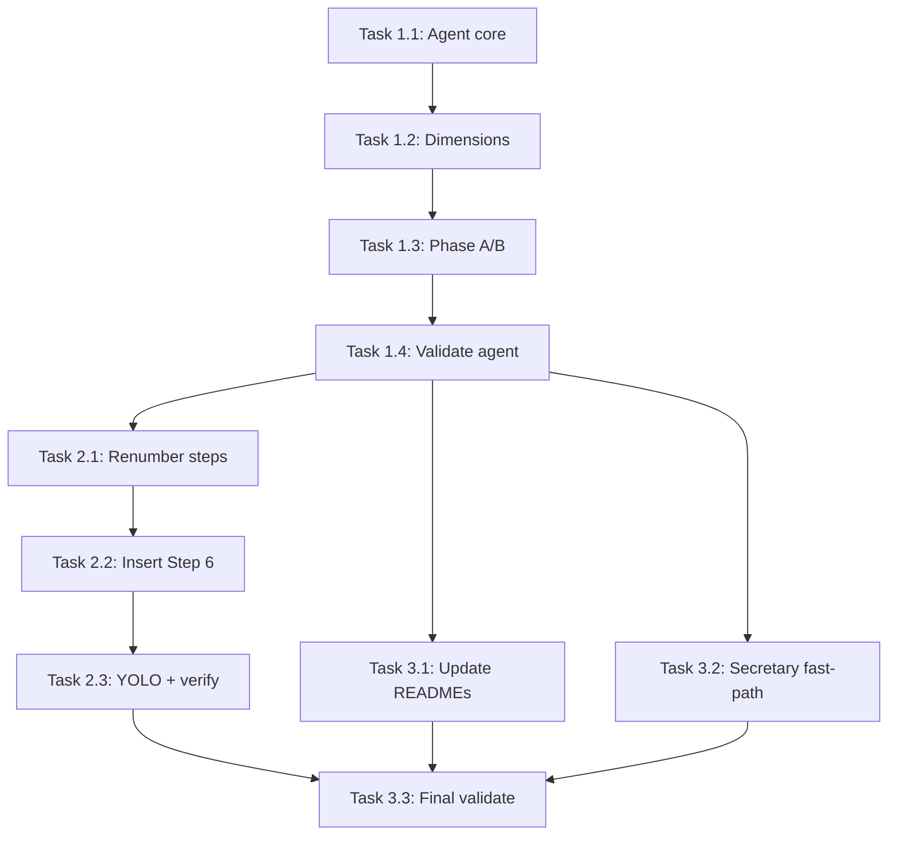

# Tasks: Test Deepening Agent

## Dependency Graph



## Execution Strategy

**Note:** Tasks 1.1-1.3 are single-file sequential edits that individually may take 20-30 minutes due to markdown content density (~345 lines total across 3 tasks). Further splitting would create artificial boundaries within one file — the current breakdown by responsibility (structure → dimensions → phases) is the natural decomposition.

### Parallel Group 1 (No dependencies)
- Task 1.1: Create agent file with frontmatter, examples, and core sections

### Parallel Group 2 (After 1.1)
- Task 1.2: Add six dimension checklists to agent file (needs: 1.1)

### Parallel Group 3 (After 1.2)
- Task 1.3: Add Phase A/B instructions and output schemas (needs: 1.2)

### Parallel Group 4 (After 1.3)
- Task 1.4: Validate agent file with validate.sh (needs: 1.3)

### Parallel Group 5 (After 1.4)
- Task 2.1: Renumber Steps 6-8 to 7-9 in implement.md (needs: 1.4)
- Task 3.1: Update agent counts and tables in three README files (needs: 1.4)
- Task 3.2: Add secretary fast-path entry (needs: 1.4)

### Parallel Group 6 (After 2.1)
- Task 2.2: Insert new Step 6 Test Deepening Phase (needs: 2.1)

### Parallel Group 7 (After 2.2)
- Task 2.3: Add YOLO clarification and verify renumbering (needs: 2.2)

### Sequential Final (After all)
- Task 3.3: Run final validate.sh regression check (needs: 2.3, 3.1, 3.2)

## Task Details

### Phase 1: Agent File (Plan Step 1 / Design C1)

#### Task 1.1: Create test-deepener agent file with frontmatter, examples, and core sections
- **Why:** Plan Step 1 / Design C1 — core agent definition. All other deliverables reference this agent.
- **Depends on:** None
- **Blocks:** Task 1.2
- **Files:** `plugins/iflow-dev/agents/test-deepener.md` (new)
- **Do:**
  1. Create `plugins/iflow-dev/agents/test-deepener.md`
  2. Write frontmatter with 5 fields in canonical order:
     ```yaml
     ---
     name: test-deepener
     description: Systematically deepens test coverage after TDD scaffolding with spec-driven adversarial testing across six dimensions. Use when (1) implement command dispatches test deepening phase, (2) user says 'deepen tests', (3) user says 'add edge case tests', (4) user says 'test deepening'.
     model: opus
     tools: [Read, Write, Edit, Bash, Glob, Grep]
     color: green
     ---
     ```
  3. Add 2-3 `<example>` blocks following the pattern in `plugins/iflow-dev/agents/code-simplifier.md`:
     - Example 1: implement command dispatches test deepening phase
     - Example 2: user says "deepen tests" or "add edge case tests"
     - Example 3: user says "test deepening" for a feature
  4. Add `# Test Deepener` heading
  5. Add `## Structured Adversarial Protocol` section with the three-step protocol (per design TD-1):
     - Step 1 **Anticipate:** Before writing each test, state what could go wrong with the implementation for this scenario
     - Step 2 **Challenge:** Ask "If the implementation has a bug here, would this test catch it?"
     - Step 3 **Verify:** After writing, apply mutation operators — would swapping `>` to `>=` make this test pass when it shouldn't?
     - Include framing context: "You are a skeptical QA engineer. Your job is to find what the implementation gets wrong, not to confirm what it gets right. Every test you write should be one that *could* fail."
  6. Add `## Spec-Is-Oracle Directive` section: "If the implementation and spec disagree, the spec is correct — write the test to match the spec, and report the divergence."
  7. Add `## Test Writing Rules` section with:
     - Descriptive naming requirement: test names must describe expected behavior in plain English (e.g., `test_rejects_negative_quantities` not `test_quantity_check`)
     - Given/When/Then structural comment format (with example)
     - Soft budget: 15-30 tests per feature, re-prioritize above 40
     - `derived_from` requirement: every test must have a non-empty `derived_from` field tracing to a spec criterion, design contract, or testing dimension
  8. Add `## What You MUST NOT Do` section:
     - Do NOT rewrite tests to match implementation when assertions fail — report as spec divergences
     - Do NOT read implementation files during Phase A
     - Do NOT generate tests without `derived_from` traceability
     - Do NOT exceed 40 tests without re-prioritizing to highest-risk per dimension
  9. Add `## Limitation Acknowledgment` section: "Safeguards 2-6 above are prompt-level heuristics with unknown enforcement strength. The two-phase dispatch (separate Phase A and Phase B calls) is the only architectural guarantee against implementation mirroring."
- **Test:** Verify these exact section headings exist via Grep: `## Structured Adversarial Protocol`, `## Spec-Is-Oracle Directive`, `## Test Writing Rules`, `## What You MUST NOT Do`, `## Limitation Acknowledgment`. Verify frontmatter: first and last frontmatter lines are `---`, all 5 fields present (name, description, model, tools, color).
- **Done when:** File exists. Grep for each of these 5 headings returns exactly one match each: `## Structured Adversarial Protocol`, `## Spec-Is-Oracle Directive`, `## Test Writing Rules`, `## What You MUST NOT Do`, `## Limitation Acknowledgment`. Frontmatter has all 5 fields. At least 2 `<example>` blocks present.

#### Task 1.2: Add six testing dimension checklists to agent file
- **Why:** Plan Step 1 / Spec AC-3 — six dimensions with applicability guards are core to the agent.
- **Depends on:** Task 1.1
- **Blocks:** Task 1.3
- **Files:** `plugins/iflow-dev/agents/test-deepener.md` (modify)
- **Do:**
  1. Add `## Testing Dimensions` heading after the Limitation Acknowledgment section
  2. Add `### Dimension 1: Spec-Driven BDD Scenarios` with:
     - Applicability guard: "Always applicable — every feature has acceptance criteria"
     - Method: Each acceptance criterion becomes Given/When/Then scenarios
     - Given/When/Then structural comment example (Python format from PRD section "Dimension 1")
     - Unique Example Rule: each test must demonstrate a distinct behavior, not merely vary data
  3. Add `### Dimension 2: Boundary Value & Equivalence Partitioning` with:
     - Applicability guard: "When functions have numeric, bounded-string, or collection parameters. Skip for pure orchestration code with no parametric inputs."
     - BVA canonical set: `{min-1, min, min+1, typical, max-1, max, max+1}`
     - Checklist (4 items): numeric ranges, string lengths, collections, optional/nullable
  4. Add `### Dimension 3: Adversarial / Negative Testing` with:
     - Applicability guard: "When the feature exposes public interfaces or processes user-facing input. Skip for internal refactors with no new API surface."
     - Eight heuristics table (from spec/PRD): Never/Always, Zero/One/Many, Beginning/Middle/End, CRUD completeness, Follow the Data, Some/None/All, Starve, Interrupt
     - Additional negative categories: wrong data type, logically invalid but syntactically correct, state transition violations
  5. Add `### Dimension 4: Error Propagation & Failure Modes` with:
     - Applicability guard: "When design.md documents error contracts or functions have explicit error paths. Skip when the feature is purely additive with no failure modes."
     - Three-item checklist: each error path tested, upstream failures simulated, error responses match contracts
  6. Add `### Dimension 5: Mutation Testing Mindset` with:
     - Applicability guard: "Always applicable — every function should be behaviorally pinned"
     - Five mutation operators table: arithmetic swap, boundary shift, logic inversion, line deletion, return value mutation
     - Behavioral pinning check: specific value assertions, both sides of branches, at least one boundary per comparison
  **Checkpoint after Dimension 3:** Grep for `### Dimension 1:`, `### Dimension 2:`, `### Dimension 3:` — verify 3 matches. If any missing, fix before continuing to Dimensions 4-6.
  7. Add `### Dimension 6: Performance Contracts` with:
     - Applicability guard: "Only when the spec explicitly defines performance requirements. Report N/A if no performance SLAs in spec."
     - Percentile-based SLA pattern: `p50 < Xms, p95 < Yms, p99 < Zms`
     - Types: micro-benchmarks, SLA assertions, memory bounds, regression baselines
- **Test:** Grep for each of these 6 exact headings returns one match each: `### Dimension 1: Spec-Driven BDD Scenarios`, `### Dimension 2: Boundary Value & Equivalence Partitioning`, `### Dimension 3: Adversarial / Negative Testing`, `### Dimension 4: Error Propagation & Failure Modes`, `### Dimension 5: Mutation Testing Mindset`, `### Dimension 6: Performance Contracts`. Grep for `Applicability:` or `applicability` returns at least 6 matches.
- **Done when:** All 6 dimension headings present (exact text above). Each has applicability guard text. Dim 2 contains `min-1, min, min+1` (BVA set). Dim 3 contains `Never/Always` and `Zero/One/Many` (heuristic table). Dim 5 contains `Arithmetic swap` and `Boundary shift` (operator table). Dim 6 contains `p50` or `p95` (percentile pattern).

#### Task 1.3: Add Phase A and Phase B instructions with output schemas to agent file
- **Why:** Plan Step 1 / Spec FR-2, FR-3, AC-7 — both phase instructions and output schemas required.
- **Depends on:** Task 1.2
- **Blocks:** Task 1.4
- **Files:** `plugins/iflow-dev/agents/test-deepener.md` (modify)
- **Do:**
  1. Add `## Phase A: Outline Generation` section after the Testing Dimensions sections with:
     - What you receive: spec, design, tasks, PRD goals
     - What you MUST NOT do: "Do NOT read implementation files. Do NOT use Glob/Grep to find source code. You will receive implementation access in Phase B."
     - Instructions: Apply all applicable dimensions, generate Given/When/Then outlines, assess each dimension's applicability
     - Output JSON schema (from spec FR-2):
       ```json
       {
         "outlines": [
           {
             "dimension": "bdd_scenarios | boundary_values | adversarial | error_propagation | mutation_mindset | performance_contracts",
             "scenario_name": "test_rejects_negative_quantities",
             "given": "...",
             "when": "...",
             "then": "...",
             "derived_from": "spec:AC-3 (input validation)"
           }
         ],
         "dimensions_assessed": {
           "bdd_scenarios": "applicable",
           "boundary_values": "applicable",
           "adversarial": "N/A — {reason}",
           "error_propagation": "applicable",
           "mutation_mindset": "applicable",
           "performance_contracts": "N/A — {reason}"
         }
       }
       ```
     - Validation rules: outlines must be non-empty, every outline must have non-empty `derived_from`, all six dimension keys in `dimensions_assessed`, N/A dimensions must include reason
  2. Add `## Phase B: Executable Test Writing` section with:
     - What you receive: Phase A outlines JSON, files-changed list
     - Step-by-step process:
       1. Read existing test files for changed code — identify test framework, assertion patterns, file organization conventions
       2. Skip outlines already covered by existing TDD tests
       3. Write executable tests using project's native test framework (match existing patterns exactly)
       4. Use Given/When/Then as structural comments within tests
       5. Use descriptive test names (behavior in plain English)
       6. Run tests scoped to newly created/modified test files (file-level targeting first, fall back to containing directory if needed — log fallback reason in summary)
       7. Fix compilation/syntax errors internally (max 3 attempts)
       8. Report assertion failures as spec divergences (do NOT rewrite to match implementation)
     - Error handling: if no TDD tests found, check project config files (package.json, pyproject.toml, Cargo.toml) for framework; if still not found, report error
     - Output JSON schema (from spec FR-3):
       ```json
       {
         "tests_added": [...],
         "dimensions_covered": {...},
         "existing_tests_reviewed": 12,
         "duplicates_skipped": 3,
         "spec_divergences": [],
         "all_tests_pass": true,
         "summary": "Added N tests across M files."
       }
       ```
     - Spec divergence entry schema: `spec_criterion`, `expected`, `actual`, `failing_test`
     - Validation rules: `derived_from` non-empty in tests_added, all six dimension keys, `all_tests_pass` true only when `spec_divergences` empty AND all tests compile and pass
- **Test:** Both Phase A and Phase B sections exist with output JSON schemas.
- **Done when:** Phase A section has input list, prohibition, output schema with validation rules. Phase B section has step-by-step process (8 steps), error handling, output schema with validation rules, spec divergence schema.

#### Task 1.4: Validate agent file with validate.sh and verify line count
- **Why:** Plan Step 1 verification / AC-1, AC-9 — catch frontmatter issues early, ensure under 500 lines.
- **Depends on:** Task 1.3
- **Blocks:** Task 2.1, Task 3.1, Task 3.2
- **Files:** `plugins/iflow-dev/agents/test-deepener.md` (verify only)
- **Do:**
  1. Run `./validate.sh` and verify no errors for test-deepener agent
  2. Run `wc -l plugins/iflow-dev/agents/test-deepener.md` and verify under 500 lines (AC-9)
  3. If over 450 lines: extract dimension checklists to `plugins/iflow-dev/agents/references/test-deepener-dimensions.md` (create `references/` directory if needed), add Read instruction at start of each phase in agent prompt
  4. Verify all six dimensions present with applicability guards (AC-3)
  5. Verify both phase instructions and output schemas present (AC-7)
  6. Verify adversarial protocol, spec-is-oracle, descriptive naming, soft budget present (AC-4)
  7. **If validate.sh fails:** Read error output to identify which frontmatter field or structure rule is violated. Fix the specific issue in the agent file, then re-run validate.sh.
  8. **If line count exceeds 500:** Extract the six dimension checklists (longest sections) to `plugins/iflow-dev/agents/references/test-deepener-dimensions.md`. Add `Read plugins/iflow-dev/agents/references/test-deepener-dimensions.md before proceeding` instruction at the start of Phase A and Phase B sections. Re-check line count.
- **Test:** `./validate.sh` exits 0. `wc -l plugins/iflow-dev/agents/test-deepener.md` output < 500.
- **Done when:** validate.sh passes with no errors. File is under 500 lines. All AC-1, AC-3, AC-4, AC-7, AC-9 checks pass. If extraction was needed, references file exists and agent file contains Read instructions.

### Phase 2: Implement Command Update (Plan Step 2 / Design C2)

#### Task 2.1: Renumber Steps 6-8 to 7-9 in implement.md using cross-reference table
- **Why:** Plan Step 2 / AC-6 — all 12 cross-references must be updated for step renumbering.
- **Depends on:** Task 1.4
- **Blocks:** Task 2.2
- **Files:** `plugins/iflow-dev/commands/implement.md` (modify)
- **Do:**
  1. Before editing, run Grep to locate all 12 cross-reference targets (verify they exist at expected locations):
     - `### 6. Review Phase (Automated Iteration Loop)`
     - `**6a. Implementation Review (4-Level Validation):**`
     - `**6b. Code Quality Review:**`
     - `**6c. Security Review:**`
     - `**6d. Automated Iteration Logic:**`
     - `### 6e. Capture Review Learnings (Automatic)`
     - `Proceed to step 7` (in 6d, IF all PASS)
     - `proceed to step 7` (in 6d, Force approve)
     - `Loop back to step 6a` (in 6d, Else)
     - `### 7. Update State on Completion`
     - `### 8. Completion Message`
     - `return to Step 6 (3-reviewer loop)` (in Completion Message)
  2. Apply all 12 renumbering edits using the Edit tool (one edit per cross-reference):

     | Old (verbatim) | New (verbatim) |
     |---|---|
     | `### 6. Review Phase (Automated Iteration Loop)` | `### 7. Review Phase (Automated Iteration Loop)` |
     | `**6a. Implementation Review (4-Level Validation):**` | `**7a. Implementation Review (4-Level Validation):**` |
     | `**6b. Code Quality Review:**` | `**7b. Code Quality Review:**` |
     | `**6c. Security Review:**` | `**7c. Security Review:**` |
     | `**6d. Automated Iteration Logic:**` | `**7d. Automated Iteration Logic:**` |
     | `### 6e. Capture Review Learnings (Automatic)` | `### 7e. Capture Review Learnings (Automatic)` |
     | `Proceed to step 7` (in 6d, IF all PASS) | `Proceed to step 8` |
     | `proceed to step 7` (in 6d, Force approve) | `proceed to step 8` |
     | `Loop back to step 6a` (in 6d, Else) | `Loop back to step 7a` |
     | `### 7. Update State on Completion` | `### 8. Update State on Completion` |
     | `### 8. Completion Message` | `### 9. Completion Message` |
     | `return to Step 6 (3-reviewer loop)` | `return to Step 7 (3-reviewer loop)` |

  3. After editing, run Grep to verify no remaining old references:
     - Grep for `6a`, `6b`, `6c`, `6d`, `6e` — all matches should be zero at this point (Step 6 Test Deepening section does not exist until Task 2.2, so any match here is a missed renaming)
     - No remaining `### 7. Update State` or `### 8. Completion Message` references
- **Test:** Grep for old step numbers shows zero matches outside the new Step 6 section (which doesn't exist yet, so zero matches total).
- **Done when:** All 12 cross-references updated. Grep verification confirms no old references remain.

#### Task 2.2: Insert new Step 6 Test Deepening Phase in implement.md
- **Why:** Plan Step 2 / AC-2, AC-5 — new Step 6 with two-phase dispatch and divergence control flow.
- **Depends on:** Task 2.1
- **Blocks:** Task 2.3
- **Files:** `plugins/iflow-dev/commands/implement.md` (modify)
- **Do:**
  1. Read `docs/features/026-test-deepening-agent/design.md` sections I6 (divergence control flow) and I7 (files-changed union assembly) for exact pseudocode to adapt into implement.md
  2. Insert new `### 6. Test Deepening Phase` section between the end of `### 5. Code Simplification Phase` and the start of `### 7. Review Phase (Automated Iteration Loop)` (now renumbered)
  3. Write Phase A dispatch template (following the Step 5 dispatch pattern in implement.md):
     ```
     Task tool call:
       description: "Generate test outlines from spec"
       subagent_type: iflow-dev:test-deepener
       prompt: |
         PHASE A: Generate test outlines from specifications only.
         Do NOT read implementation files. Do NOT use Glob/Grep to find source code.
         You will receive implementation access in Phase B.

         Feature: {feature name from .meta.json slug}

         ## Spec (acceptance criteria — your primary test oracle)
         {content of spec.md}

         ## Design (error handling contracts, performance constraints)
         {content of design.md}

         ## Tasks (what was supposed to be built)
         {content of tasks.md}

         ## PRD Goals
         {Problem Statement + Goals sections from prd.md}

         Generate Given/When/Then test outlines for all applicable dimensions.
         Return as structured JSON with dimension, scenario name, given/when/then text,
         and derived_from reference to spec criterion.
     ```
  4. Add Phase A validation: if outlines are empty, log warning "Test deepening Phase A returned no outlines — skipping test deepening" and proceed to Step 7
  5. Add files-changed union assembly instructions (see design I7 "Files-Changed Union Assembly" and Architecture > Files-Changed Union Assembly for the exact pseudocode and compaction fallback logic to copy into implement.md):
     - implementation_files from Step 4 aggregate (already in orchestrator context)
     - simplification_files from Step 5 output (extract file paths, strip `:line` suffix)
     - Deduplicate and sort the union
     - Fallback: if context was compacted, parse `implementation-log.md` for file paths
  6. Write Phase B dispatch template:
     ```
     Task tool call:
       description: "Write and verify deepened tests"
       subagent_type: iflow-dev:test-deepener
       prompt: |
         PHASE B: Write executable test code from these outlines.

         Feature: {feature name}

         ## Test Outlines (from Phase A)
         {Phase A JSON output — the full outlines array}

         ## Files Changed (implementation + simplification)
         {deduplicated file list}

         Step 1: Read existing test files for changed code to identify the test
         framework, assertion patterns, and file organization conventions. Match
         these exactly when writing new tests.

         Step 2: Skip scenarios already covered by existing TDD tests.

         Step 3: Write executable tests, run the suite, and report.
     ```
  7. Add divergence control flow (design I6):
     - If `spec_divergences` is empty: proceed to Step 7
     - If non-empty AND YOLO mode OFF: AskUserQuestion with 3 options:
       - "Fix implementation": dispatch implementer with spec_divergences as issues (prompt includes spec_criterion as requirement, expected as target, actual as bug, failing_test as evidence), then re-run Phase B only (max 2 re-runs; if divergences persist after 2 cycles, escalate with only "Accept implementation" and "Review manually")
       - "Accept implementation": for each divergence, delete the test function identified by `failing_test`, then re-run test suite once, proceed to Step 7
       - "Review manually": stop execution
     - If non-empty AND YOLO mode ON: auto-select "Fix implementation" if re-run count < 2; STOP execution if re-run count >= 2
  8. Add error handling: if Phase A or Phase B agent dispatch fails, log error and proceed to Step 7
- **Test:** New Step 6 section exists between Step 5 and Step 7. Phase A dispatch does NOT include files-changed. Phase B dispatch includes Phase A outlines AND files-changed.
- **Done when:** Step 6 contains all of: (1) Phase A dispatch with spec-only context and no files-changed (AC-2), (2) Phase A empty-outlines guard, (3) files-changed union assembly, (4) Phase B dispatch with Phase A outlines AND files-changed (AC-2), (5) divergence control flow with 3 AskUserQuestion options and max 2 Phase-B-only re-runs (Phase B only per design TD-5 — intentional deviation from spec AC-5, rationale in design.md), (6) YOLO handling: auto-fix first, stop after max re-runs (AC-5), (7) error handling for dispatch failures → proceed to Step 7.

#### Task 2.3: Add YOLO Mode Overrides clarification and verify all implement.md changes
- **Why:** Plan Step 2 / AC-6 verification + YOLO clarification per plan requirement.
- **Depends on:** Task 2.2
- **Blocks:** Task 3.3
- **Files:** `plugins/iflow-dev/commands/implement.md` (modify + verify)
- **Do:**
  1. Insert a one-line clarification as the first sentence after the `## YOLO Mode Overrides` heading, before the existing bullet list (no text replaced):
     `Note: The circuit breaker below applies to the Review Phase (Step 7), not the Test Deepening Phase (Step 6).`
  2. Run comprehensive Grep verification:
     - Grep for `step 6` (case-insensitive) — matches should only appear within the new `### 6. Test Deepening Phase` section
     - Grep for `6a`, `6b`, `6c`, `6d`, `6e` — should have zero matches (all renumbered to 7x)
     - Grep for `### 7. Review Phase` — should exist exactly once
     - Grep for `### 8. Update State` — should exist exactly once
     - Grep for `### 9. Completion Message` — should exist exactly once
     - Grep for `step 7` in the review loop logic — should reference "proceed to step 8" and "Loop back to step 7a" correctly
  3. If any verification fails, fix the issue before marking task complete
- **Test:** All Grep verifications pass. YOLO clarification line is present.
- **Done when:** YOLO clarification inserted. All Grep checks confirm correct renumbering. No stale references to old step numbers.

### Phase 3: Documentation (Plan Steps 3-4 / Design C3, C4)

#### Task 3.1: Update agent counts and tables in three README files
- **Why:** Plan Step 3 / AC-8 — documentation sync for new agent.
- **Depends on:** Task 1.4
- **Blocks:** Task 3.3
- **Files:** `README.md`, `README_FOR_DEV.md`, `plugins/iflow-dev/README.md` (modify all three)
- **Do:**
  1. **`plugins/iflow-dev/README.md`:**
     - Change `| Agents | 28 |` to `| Agents | 29 |` in the component count table
     - Add `| test-deepener | Systematically deepens test coverage with spec-driven adversarial testing |` row to the agent table in alphabetical order (verify via `ls plugins/iflow-dev/agents/*.md | sort` — test-deepener sorts after task-reviewer)
  2. **`README.md`:**
     - Add `| test-deepener | Systematically deepens test coverage after TDD scaffolding with spec-driven adversarial testing |` row to the Workers sub-table (after `code-simplifier`)
  3. **`README_FOR_DEV.md`:**
     - Change `**Workers (5):**` to `**Workers (6):**`
     - Add `- \`test-deepener\` — Systematically deepens test coverage after TDD scaffolding with spec-driven adversarial testing` bullet under Workers section (after `code-simplifier` bullet)
  4. Verify: count files in `plugins/iflow-dev/agents/` directory to confirm actual count matches documented count
- **Test:** Grep for `test-deepener` in all three README files returns matches. Agent count in `plugins/iflow-dev/README.md` is 29.
- **Done when:** All three files updated. Agent count matches actual file count in agents/ directory. test-deepener appears in Workers category in all tables.

#### Task 3.2: Add secretary fast-path entry in secretary.md
- **Why:** Plan Step 4 / AC-8 — route test-deepening requests to the new agent.
- **Depends on:** Task 1.4
- **Blocks:** Task 3.3
- **Files:** `plugins/iflow-dev/agents/secretary.md` (modify)
- **Do:**
  1. Read the existing Specialist Fast-Path table in `plugins/iflow-dev/agents/secretary.md`
  2. Add a new row after the last existing entry (after the `"explore"` row), matching the exact table format:
     ```
     | "deepen tests" / "add edge case tests" / "test deepening" | iflow-dev:test-deepener | 95% |
     ```
  3. Verify the new row matches the column alignment and separator style of existing rows
- **Test:** Grep for `test-deepener` in secretary.md returns a match in the fast-path table.
- **Done when:** Fast-path entry exists with "deepen tests" / "add edge case tests" / "test deepening" patterns at 95% confidence. Format matches existing entries.

#### Task 3.3: Run final validate.sh regression check
- **Why:** Plan Testing Strategy — final regression check after all changes.
- **Depends on:** Task 2.3, Task 3.1, Task 3.2
- **Blocks:** None
- **Files:** All modified files (verify only)
- **Do:**
  1. Run `./validate.sh` and verify no errors
  2. Run `wc -l plugins/iflow-dev/agents/test-deepener.md` — confirm under 500 lines
  3. Verify agent count: `ls plugins/iflow-dev/agents/*.md | wc -l` matches the count in `plugins/iflow-dev/README.md`
  4. Quick smoke check: Grep for all step headings `### [1-9]\.` in implement.md to verify sequential numbering 1-9
- **Test:** validate.sh exits 0. Agent file under 500 lines. Agent count matches.
- **Done when:** All verification checks pass. Feature is ready for review phase.

## Summary

- Total tasks: 10
- Parallel groups: 8 (mostly sequential due to single-file dependencies)
- Critical path: Task 1.1 → 1.2 → 1.3 → 1.4 → 2.1 → 2.2 → 2.3 → 3.3
- Max parallelism: 3 (Tasks 2.1, 3.1, 3.2 in Group 5)
