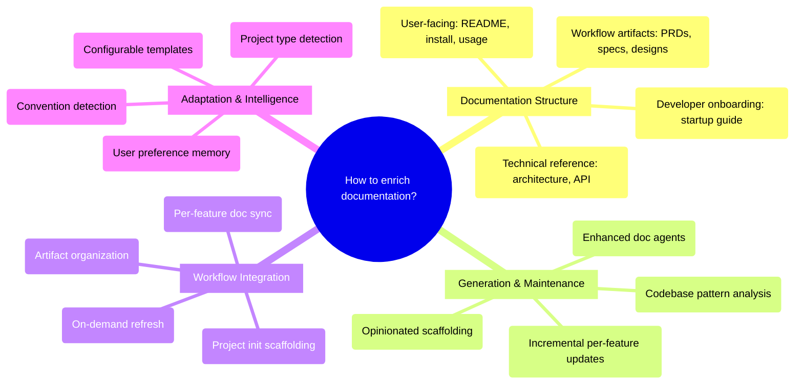

# PRD: Enriched Documentation Phase

## Status
- Created: 2026-02-25
- Last updated: 2026-02-25
- Status: Draft
- Problem Type: Product/Feature
- Archetype: building-something-new

## Problem Statement
The current documentation phase in the iflow workflow only handles README updates and CHANGELOG entries via the updating-docs skill and documentation agents. There is no structured, opinionated documentation system that covers user-facing guides, developer onboarding, or technical architecture docs. Projects end up with scattered or missing documentation that doesn't serve the three key audiences: end users, onboarding developers, and existing technical contributors.

### Evidence
- Codebase: `updating-docs` skill (`plugins/iflow/skills/updating-docs/SKILL.md`) is scoped to README drift detection and CHANGELOG entries only — Evidence: Codebase analysis
- Codebase: `documentation-researcher` agent already classifies docs as `user-facing` vs `technical` and has a `technical_changes` output field, but this classification is not wired to a structured output directory — Evidence: Codebase analysis
- Codebase: `documentation-writer` agent mentions "Review and update technical documents to accurately reflect the latest implementation and be easily readable for engineer onboarding" but produces no structured onboarding doc — Evidence: Codebase analysis
- Industry: The Diataxis framework (tutorials, how-to guides, reference, explanation) is the dominant documentation taxonomy, adopted by Django, NumPy, and Gatsby — Evidence: https://diataxis.fr/
- User input: User explicitly requested three documentation tiers (user-facing, developer onboarding, technical reference) — Evidence: User input

## Goals
1. Establish an opinionated default documentation structure that works across project types
2. Auto-generate and maintain user-facing docs (what it does, install/setup, usage)
3. Auto-generate and maintain a developer onboarding/startup guide
4. Auto-generate and maintain technical docs (architecture, data flow, modules, interfaces, API)
5. Preserve exploration/planning docs already created by the workflow (PRDs, specs, designs, plans)
6. Detect and adapt to project-specific patterns, conventions, and user preferences

## Success Criteria
- [ ] Documentation phase produces a complete, structured docs directory with all enabled doc tiers (default: all three)
- [ ] Initial scaffolding is opinionated (predefined structure) but adapts based on codebase analysis
- [ ] Existing workflow artifacts (PRDs, specs, designs) are discoverable from the docs structure via an index page linking to their current locations under `{iflow_artifacts_root}/features/`
- [ ] Documentation-researcher drift detection covers all three doc tiers — after each feature completion, the researcher reports drift entries for any tier where content contradicts the current codebase. Validated via YAML frontmatter metadata (last-updated, source-feature) on generated docs
- [ ] On-demand `/iflow:generate-docs` command produces docs for any existing project without requiring a feature workflow
- [ ] Project-type detection uses existing taxonomy (Plugin, API, CLI, General) and adapts doc templates per type

## User Stories

### Story 1: End User Reads Project Docs
**As an** end user **I want** to find a clear, concise guide on what the project does, how to install it, and how to use it **So that** I can adopt the tool without reading source code.
**Acceptance criteria:**
- `docs/user-guide/` contains README overview, installation guide, and usage guide
- Each doc is self-contained and doesn't require reading other docs first
- Install guide includes all prerequisites and environment setup steps

### Story 2: New Developer Onboards Quickly
**As a** new developer joining the project **I want** a startup guide that walks me through setting up the development environment and making my first contribution **So that** I can be productive within hours, not days.
**Acceptance criteria:**
- `docs/dev-guide/` contains a startup guide with environment setup, build commands, test commands, and architecture overview
- Guide documents all prerequisites and setup steps needed from a fresh checkout, with no assumed local state
- Contribution workflow is documented (branching, PR process, CI expectations)

### Story 3: Existing Developer Finds Technical Reference
**As an** existing developer **I want** up-to-date architecture docs, module descriptions, interface definitions, and API docs **So that** I can understand system structure without reading every source file.
**Acceptance criteria:**
- `docs/technical/` contains architecture overview, module map, data flow diagrams, interface contracts, and API reference
- Architecture doc includes ADRs (Architecture Decision Records) extracted from design.md artifacts
- Docs are updated automatically when features are completed

### Story 4: Workflow User Gets Docs Automatically
**As an** iflow workflow user **I want** documentation to be generated and updated as part of the normal feature workflow **So that** I don't have to remember to write docs separately.
**Acceptance criteria:**
- `finish-feature` and `wrap-up` commands trigger documentation generation
- Only docs affected by the feature's changes are updated (not full regeneration)
- Existing manual edits to docs are preserved (not overwritten by generation)

## Use Cases

### UC-1: First-Time Documentation Scaffolding
**Actors:** Developer using iflow | **Preconditions:** Project has no `docs/` structure
**Flow:**
1. Developer runs `/iflow:generate-docs` or completes first feature via `finish-feature`
2. System detects project type (library/app/service/plugin) via codebase analysis
3. System scaffolds opinionated three-tier docs directory structure
4. System populates initial content by analyzing existing README, code, and config files
5. System preserves any existing docs by incorporating them into the new structure
**Postconditions:** `docs/` directory contains user-guide/, dev-guide/, technical/ subdirectories with initial content
**Edge cases:** Project already has a custom `docs/` structure — system detects and adapts rather than overwriting

### UC-2: Per-Feature Documentation Update
**Actors:** Developer completing a feature | **Preconditions:** Docs structure exists, feature has spec.md/design.md/plan.md artifacts
**Flow:**
1. Developer runs `finish-feature` or `wrap-up`
2. Documentation-researcher analyzes which docs are affected by the feature's changes
3. Documentation-writer updates affected docs with new content from feature artifacts
4. ADRs are extracted from design.md Technical Decisions section into `docs/technical/decisions/`
5. Changes are committed alongside other wrap-up changes
**Postconditions:** All three doc tiers reflect the completed feature's changes
**Edge cases:** Feature only affects internal code with no user-facing changes — user-guide tier is skipped

### UC-3: On-Demand Documentation Generation
**Actors:** Developer on existing project | **Preconditions:** Project exists with code but scattered/missing docs
**Flow:**
1. Developer runs `/iflow:generate-docs`
2. System performs full codebase analysis (project type, modules, entry points, config)
3. System generates all three tiers from codebase analysis
4. System presents generated docs for review before committing
**Postconditions:** Complete docs structure generated from existing codebase
**Edge cases:** Large monorepo — system scopes to current directory or user-specified root

## Edge Cases & Error Handling
| Scenario | Expected Behavior | Rationale |
|----------|-------------------|-----------|
| Project already has custom docs/ structure | Detect existing layout, map to tiers, fill gaps only | Avoid destroying existing work |
| No package.json/setup.py/Cargo.toml found | Fall back to generic project type, skip install guide specifics | Not all projects have standard manifests |
| design.md has no Technical Decisions section | Skip ADR extraction, log warning | ADRs are additive, not required |
| User manually edited a generated doc | Preserve manual edits via section markers, only update generated sections | Respect user customizations |
| Feature changes only internal code | Skip user-guide tier update, still update technical tier | Internal refactors affect architecture docs |
| Multiple features completed without doc sync | Full regeneration on next trigger catches up | Incremental updates are best-effort |
| design.md Technical Decisions entry missing some fields (e.g., no Alternatives Considered) | Generate ADR with available fields; use placeholder text for missing fields (e.g., "Not documented in design phase") | Partial ADRs are better than none; placeholders signal gaps |

## Section Marker Specification

Generated docs use HTML comment markers to distinguish auto-generated sections from manual content:

```markdown
<!-- AUTO-GENERATED: START - source: {feature-id or "codebase-analysis"} -->
{generated content here}
<!-- AUTO-GENERATED: END -->

{any user-written content here is preserved}
```

Rules:
- Content outside markers is never modified by the system
- Content inside markers is regenerated on each update
- Markers are inserted during initial scaffolding
- If a user removes markers, the entire file is treated as manually written and skipped by the writer. To re-enroll, manually re-add the AUTO-GENERATED markers or delete the file and re-run scaffolding
- Each generated section includes a `source:` annotation identifying what produced it

## ADR Format Specification

ADRs extracted from design.md Technical Decisions follow the Michael Nygard format:

```markdown
---
last-updated: {ISO date}
source-feature: {feature-id}
status: Accepted
---
# ADR-{NNN}: {Decision Title}

## Status
{Accepted | Superseded by ADR-{NNN}}

## Context
{From design.md: problem context and constraints}

## Decision
{From design.md: Choice field}

## Alternatives Considered
{From design.md: Alternatives Considered field}

## Consequences
{From design.md: Trade-offs and Rationale fields}
```

Rules:
- One ADR per Technical Decision entry in design.md
- Naming: `ADR-{NNN}-{slug}.md` where NNN is zero-padded sequential
- ADRs are append-only; later features that supersede a decision update the original ADR status to "Superseded by ADR-{NNN}" with a reference to the new ADR
- design.md remains the source of truth; ADRs are generated views

## Constraints

### Behavioral Constraints (Must NOT do)
- Must NOT overwrite user's manually written documentation — Rationale: Trust is destroyed if the system deletes human work
- Must NOT generate docs that contradict the actual code — Rationale: Wrong docs are worse than no docs
- Must NOT require user interaction for routine per-feature updates — Rationale: Friction kills adoption

### Technical Constraints
- Must integrate with existing `documentation-researcher` and `documentation-writer` agent dispatch pattern — Evidence: Codebase analysis shows established two-agent pipeline
- Doc tiers (`docs/user-guide/`, `docs/dev-guide/`, `docs/technical/`) are project-level documentation placed at the project root `docs/` directory, independent of `{iflow_artifacts_root}`. Workflow artifacts (PRDs, specs, designs, plans) remain under `{iflow_artifacts_root}/features/` — Evidence: `{iflow_artifacts_root}` is for iflow-managed artifacts; project docs serve all audiences regardless of iflow config
- Must use `{iflow_artifacts_root}` for workflow artifact path references, and project root `docs/` for generated documentation — Evidence: Project-aware design principle in CLAUDE.md
- Must work across project types without hardcoded assumptions — Evidence: Plugin portability principle
- Token budget for doc generation must fit within the existing multi-agent dispatch pattern (one researcher + one or more writers) — Evidence: Existing agent model constraints

## Requirements

### Functional
- FR-1: Scaffold three-tier docs directory (`user-guide/`, `dev-guide/`, `technical/`) with opinionated defaults
- FR-2: Detect project type using the existing documentation-researcher taxonomy (Plugin, API, CLI, General) and adapt doc templates accordingly. Template variations per type: Plugin includes plugin API reference; API includes endpoint reference and auth docs; CLI includes command reference; General uses standard three-tier layout
- FR-3: Generate user-facing docs: project overview, installation guide, usage guide
- FR-4: Generate developer onboarding docs: startup guide, environment setup, contribution workflow
- FR-5: Generate technical docs: architecture overview, module map, data flow, interface contracts
- FR-6: Extract ADRs from design.md Technical Decisions sections into `docs/technical/decisions/`
- FR-7: Leave workflow artifacts (PRDs, specs, designs, plans) in their current `{iflow_artifacts_root}/features/` locations. Generate a `docs/technical/decisions/` directory for extracted ADRs only. Optionally generate an index page (`docs/technical/workflow-artifacts.md`) that links to feature artifacts for discoverability
- FR-8: Integrate doc generation into `finish-feature` and `wrap-up` workflow phases
- FR-9: Provide on-demand `/iflow:generate-docs` command for existing projects
- FR-10: Detect and preserve existing documentation structure and manual edits
- FR-11: Update only docs affected by the current feature's changes (incremental, not full regen)
- FR-12: Users can disable individual doc tiers via `.claude/iflow.local.md` configuration (e.g., `doc_tiers: user-guide, technical` to exclude dev-guide). Default: all three tiers enabled. When a tier is disabled, no content is generated or updated for it

### Non-Functional
- NFR-1: Per-feature incremental doc updates must complete within 3 agent dispatches (one researcher + up to two writers). Full three-tier on-demand generation may use multiple sequential dispatches (one researcher + one writer per tier). Per-tier generation must complete within a single writer dispatch
- NFR-2: Generated docs must be readable without any tooling (plain Markdown)
- NFR-3: Schema reference file must be version-controlled and editable by users
- NFR-4: First-run scaffolding must work without any prior configuration

## Non-Goals
- Real-time documentation sync (docs update only at workflow trigger points) — Rationale: Mid-feature drift is an accepted limitation; the cost of continuous sync is disproportionate to the benefit
- Auto-generated API docs from code comments (e.g., JSDoc/Sphinx output) — Rationale: These are language-specific toolchain concerns, not workflow concerns. The system describes architecture and contracts, not auto-extracts docstrings
- Documentation hosting or deployment — Rationale: This is a generation and maintenance system, not a publishing platform
- Interactive documentation (Jupyter-style runnable docs) — Rationale: Out of scope for a static documentation system

## Out of Scope (This Release)
- Multi-language documentation (i18n) — Future consideration: When iflow is used on projects with international audiences
- Documentation quality scoring or coverage metrics — Future consideration: Could be added as a review gate in later iterations
- Custom doc templates per project (user-authored templates) — Future consideration: Phase 1 uses built-in templates; template customization is a natural extension
- Diagram auto-generation (Mermaid from code analysis) — Future consideration: Architecture diagrams from code analysis is valuable but complex; add after text docs are stable

## Research Summary

### Internet Research
- The Diataxis framework (tutorials, how-to, reference, explanation) is the leading documentation taxonomy, adopted by Django, NumPy, Gatsby. Note: the proposed three-tier model (user-guide, dev-guide, technical) is a pragmatic simplification optimized for AI generation — user-guide encompasses tutorials and how-to guides, dev-guide covers explanation for onboarding, technical covers reference. This reduces generated artifacts while preserving audience separation — Source: https://diataxis.fr/
- Architecture Decision Records (ADRs) are the standard for capturing design rationale; Markdown-based ADR templates (Michael Nygard format) are widely adopted — Source: https://adr.github.io/
- AI-assisted ADR generation from existing design artifacts is a proven 2025 pattern; quality depends on completeness of input context — Source: https://adolfi.dev/blog/ai-generated-adr/
- Structured onboarding documentation is widely recognized as reducing time-to-first-contribution significantly (vendor claims suggest up to 80%, though rigorous studies are limited; the directional benefit is well-established) — Source: https://dev.to/entelligenceai/how-ai-documentation-tools-cut-onboarding-time-by-80-15k5
- Documentation-as-code (docs in Markdown alongside source, versioned in git) is the dominant pattern for developer-facing documentation — Source: https://nerdleveltech.com/building-documentation-that-scales-best-practices-for-2025
- Docs drift is the primary failure mode; automated drift detection and CI checks are best practice — Source: https://deepdocs.dev/automated-software-documentation/

### Codebase Analysis
- `updating-docs` skill (`plugins/iflow/skills/updating-docs/SKILL.md`) handles README and CHANGELOG only — Location: skills/updating-docs/
- `documentation-researcher` agent already classifies docs as user-facing vs technical, has `technical_changes` output field, detects dev-facing docs like `docs/dev_guides/architecture.md` — Location: agents/documentation-researcher.md
- `documentation-writer` agent handles technical documents and mentions "engineer onboarding" readability. Note: currently has a "do not create new files" guideline that will need to be relaxed for scaffolding mode — Location: agents/documentation-writer.md
- `designing` skill captures ADR-like content in design.md (Technical Decisions with alternatives, rationale, trade-offs, evidence) — Location: skills/designing/SKILL.md
- `specifying` skill captures feasibility assessments and open questions in spec.md — Location: skills/specifying/SKILL.md
- `finish-feature` Phase 2b is the existing integration point for doc generation — Location: commands/finish-feature.md
- `wrap-up` Phase 2b dispatches documentation-researcher → documentation-writer in sequence — Location: commands/wrap-up.md
- Project-type detection strategies (A/B/C/D) already exist in documentation-researcher — Location: agents/documentation-researcher.md
- Drift detection in documentation-researcher compares filesystem state vs README entries — Location: agents/documentation-researcher.md
- `.claude/iflow.local.md` provides `artifacts_root` for project-aware path resolution — Location: hooks/

### Existing Capabilities
- `updating-docs` skill: Orchestrates doc-researcher → doc-writer pipeline; can be extended to handle three-tier output — How it relates: Direct extension point
- `structuring-ds-projects` skill: Scaffolds opinionated directory structures for data science projects — How it relates: Proves the scaffolding pattern works; similar approach for docs
- `designing` skill: Produces design.md with Technical Decisions section — How it relates: Source material for ADR extraction
- `specifying` skill: Produces spec.md with interfaces and contracts — How it relates: Source material for technical reference docs
- `brainstorming` skill: Produces PRDs with evidence — How it relates: Source material for workflow artifact preservation
- `planning` skill: Produces plan.md with dependency ordering — How it relates: Source material for architecture documentation
- `workflow-state` skill: Manages phase transitions and validates prerequisites — How it relates: Integration point for triggering doc generation at correct phases

## Structured Analysis

### Problem Type
Product/Feature — This is a user-facing feature that enriches the documentation phase of the iflow workflow to serve three distinct audiences.

### SCQA Framing
- **Situation:** The iflow workflow generates exploration and planning artifacts (PRDs, specs, designs, plans) during feature development, and the `updating-docs` skill handles README and CHANGELOG updates at wrap-up time. Documentation agents (documentation-researcher, documentation-writer) exist but are narrowly scoped to README drift detection and CHANGELOG entries.
- **Complication:** Projects using iflow accumulate valuable knowledge during development but end up with scattered documentation that doesn't serve end users (no install/usage guide), onboarding developers (no startup guide), or technical contributors (no architecture/API docs). The documentation phase is a thin afterthought rather than a structured system. Each project reinvents its doc structure ad-hoc.
- **Question:** How should the documentation phase be enriched to produce and maintain structured, multi-audience documentation that is opinionated by default but adapts to project-specific patterns?
- **Answer:** Create a three-tier documentation system (user-facing, developer onboarding, technical reference) with an opinionated default structure, integrate it into the existing workflow phases, and enhance the documentation agents to generate and maintain all tiers by analyzing codebase patterns and workflow artifacts.

### Decomposition

MECE decomposition of the solution space:

```
How to enrich documentation for multi-audience, structured output?
├── Documentation Structure (what to generate)
│   ├── User-facing tier: README, install/setup, usage guide
│   ├── Developer onboarding tier: startup guide, contribution workflow, environment setup
│   ├── Technical reference tier: architecture, data flow, modules, interfaces, API docs
│   └── Workflow artifacts tier: PRDs, specs, designs, plans (already exist, need organization)
├── Generation & Maintenance (how to produce and keep current)
│   ├── Initial scaffolding: opinionated defaults for new projects
│   ├── Incremental updates: sync docs with code changes per feature
│   ├── Agent enhancement: extend documentation-researcher and documentation-writer
│   └── Codebase analysis: detect patterns, conventions, project type
├── Workflow Integration (when docs are touched)
│   ├── Project init: scaffold default structure
│   ├── Per-feature: update affected docs during finish-feature/wrap-up
│   ├── On-demand: user-invoked doc refresh
│   └── Artifact preservation: organize exploration/planning docs into structure
└── Adaptation & Intelligence (how to handle project diversity)
    ├── Project type detection: library vs app vs service vs plugin
    ├── Convention detection: existing doc patterns, naming, structure
    ├── User preference tracking: remember customizations across sessions
    └── Template system: configurable doc templates per project type
```

### Mind Map



## Strategic Analysis

### Pre-Mortem
- **Core Finding:** The highest-probability failure mode is documentation staleness — docs generated once but never updated become misleading artifacts that erode trust faster than having no docs at all.

- **Analysis:** Three critical failure scenarios emerge. First, **temporal coupling decay**: the system ties doc generation to finish-feature/wrap-up triggers, but developers who skip these steps (hotfixes, direct merges, manual workflows) will create documentation gaps that compound over time. The staleness is invisible until a user or new developer encounters wrong information. Second, **scope overreach in Phase 1**: attempting to generate all three tiers (user, developer, technical) simultaneously risks producing shallow, template-flavored content across all three rather than excellent content in one. The feasibility advisor confirms this — phased delivery is strongly recommended. Third, **design rationale captured too late**: ADRs extracted from design.md at finish-feature time capture the decision but miss the context of alternatives that were considered and rejected during the design phase itself.

- **Key Risks:**
  - Staleness from temporal coupling: docs only update at workflow trigger points
  - Scope overreach: three audiences in one feature risks mediocre coverage for all
  - ADR content may be incomplete if design.md Technical Decisions section is sparse

- **Recommendation:** Build a staleness detection mechanism (timestamp comparison, code-change-since-last-doc-update metric) and surface warnings during wrap-up. Phase implementation to deliver onboarding docs first (highest immediate value) before expanding to other tiers.

- **Evidence Quality:** strong

### Adoption Friction
- **Core Finding:** The three-audience mental model (end users, onboarding devs, technical contributors) creates a fragmentation risk where the system produces docs that don't clearly serve any single audience well.

- **Analysis:** Two friction patterns emerge. First, **invocation ambiguity**: there is no natural moment where a developer thinks "I should generate docs." The system must be invisible — triggered automatically by existing workflow phases, not requiring a separate conscious decision. Tying generation to finish-feature/wrap-up is correct, but the on-demand `/iflow:generate-docs` command risks becoming a forgotten feature. Second, **migration cliff for existing projects**: projects that already have docs in non-standard locations face a "rip and replace" moment during first scaffolding. If the system doesn't gracefully detect and incorporate existing docs, the first experience will be destructive — the exact opposite of what builds trust. The documentation-researcher's existing project-type detection (Strategy A/B/C/D) mitigates this, but it must be extended to detect existing doc tier structures, not just README presence.

- **Key Risks:**
  - On-demand command may go unused if automatic generation is reliable
  - First-run experience on existing projects is the highest-stakes moment for adoption
  - Three separate doc tiers increase cognitive load for maintainers

- **Recommendation:** Make the automatic trigger (finish-feature/wrap-up) the primary path, with on-demand as a fallback. Invest heavily in the first-run detection and adaptation logic. Consider a "docs health" summary shown at wrap-up to make the system's value visible without requiring user action.

- **Evidence Quality:** strong

### Flywheel
- **Core Finding:** The documentation system is a moderate flywheel candidate. The pivotal design decision is whether new doc tiers (user-guide, dev-guide, technical) are enrolled in the existing drift-detection loop, creating a self-reinforcing quality cycle.

- **Analysis:** The existing drift-detection mechanism in documentation-researcher (comparing filesystem state vs README entries) is the seed of a flywheel. If each doc tier has machine-readable markers that enable drift detection, every feature completion becomes a quality checkpoint — detecting staleness, triggering updates, and building confidence that docs are current. This creates a virtuous cycle: reliable docs → developers trust and read docs → developers notice and report doc issues → docs improve. The flywheel breaks if drift detection is limited to README only (current state) or if generated docs lack the markers needed for staleness detection. The key enrollment step is: when scaffolding the three-tier structure, embed metadata (last-updated timestamps, source-feature references) that the researcher can use for drift detection across all tiers.

- **Key Risks:**
  - Flywheel stalls if drift detection doesn't extend to new doc tiers
  - Over-frequent regeneration could annoy users (false-positive drift detection)
  - Flywheel requires minimum 2-3 feature cycles to demonstrate value

- **Recommendation:** Extend drift detection to all three tiers from day one. Use metadata markers (YAML frontmatter with last-updated, source-feature) rather than content hashing to detect staleness. Show a "docs health" summary at each wrap-up to make the flywheel visible.

- **Evidence Quality:** moderate

### Feasibility
- **Core Finding:** Highly feasible — the foundation (agents, skill dispatch pattern, doc discovery, project-type detection) is already built and working; the primary work is extending existing components, not building from scratch.

- **Analysis:** The codebase contains a documentation pipeline that is farther along than the problem statement implies. The documentation-researcher already classifies docs as user-facing vs technical, already has a `technical_changes` output field, and the documentation-writer already handles technical documents. The designing skill captures structured ADR content in design.md. The specifying skill captures feasibility assessments. This means the raw material for user guides, onboarding docs, and architecture references is already being generated at each workflow phase — it just isn't being surfaced into a canonical docs directory structure. The real technical unknowns are narrow: (1) the target three-tier directory schema design, (2) ADR extraction without duplication, and (3) the correct trigger points. None are infrastructure problems — they are authoring and orchestration decisions. No new agents or tools are required for Phase 1.

- **Key Risks:**
  - Content duplication risk: ADR files extracted from design.md will drift if treated as independent artifacts rather than generated views
  - Directory schema conflict: projects with existing docs/ structures need detection logic before scaffolding
  - Sync decay for architecture docs: finish-feature is the only natural trigger; mid-feature drift is an accepted limitation
  - Three-audience scope risks shallow coverage if attempted in one phase

- **Recommendation:** Proceed. The cheapest proof-of-concept is to extend the existing documentation-writer to generate a `docs/technical/decisions/{id}-{slug}.md` ADR from an existing design.md Technical Decisions section. If output quality is acceptable, the full three-tier system is a straightforward extension.

- **Evidence Quality:** strong

## Review History

### Review 0 (2026-02-25)
**Findings:**
- [blocker] Path collision between proposed doc tiers and existing {iflow_artifacts_root} structure (at: FR-1, User Stories, UC-1)
- [blocker] NFR-1 (single agent dispatch) contradicts existing two-agent pipeline and is infeasible for full generation (at: NFR-1)
- [blocker] Section markers mechanism for preserving manual edits referenced but never specified (at: Edge Cases, FR-10)
- [warning] FR-7 conflicts with current artifact location convention (at: FR-7, Goal 5)
- [warning] Project type detection taxonomy misaligned with existing researcher taxonomy (at: FR-2, UC-1)
- [warning] Success criterion 'stays in sync' not measurable (at: Success Criteria)
- [warning] Open question about generate-docs command architecture should be resolved (at: Open Questions)
- [warning] No opt-out mechanism for unwanted doc tiers (at: Open Questions)
- [suggestion] Diataxis deviation not acknowledged (at: Research Summary)
- [suggestion] ADR format unspecified (at: FR-6)
- [suggestion] Evidence quality of onboarding claim is marketing-grade (at: Research Summary)

**Corrections Applied:**
- Added explicit path separation: doc tiers at project root `docs/`, workflow artifacts at `{iflow_artifacts_root}/features/` — Reason: blocker on path collision
- Rewrote NFR-1 to allow multi-dispatch: 3 dispatches for incremental, multiple for full generation — Reason: blocker on infeasible constraint
- Added Section Marker Specification section with HTML comment format and preservation rules — Reason: blocker on unspecified mechanism
- Added ADR Format Specification section with Michael Nygard format and generation rules — Reason: suggestion on ADR format
- Clarified FR-7: leave artifacts in place, generate ADRs and index page only — Reason: warning on artifact conflict
- Aligned FR-2 with existing taxonomy (Plugin, API, CLI, General) and specified per-type template variations — Reason: warning on taxonomy mismatch
- Made sync success criterion measurable via drift detection with YAML frontmatter metadata — Reason: warning on measurability
- Added FR-12 for tier opt-out via `.claude/iflow.local.md` config — Reason: warning on opt-out mechanism
- Stated preferred approach for generate-docs command architecture in Open Questions — Reason: warning on unresolved question
- Added Diataxis-to-three-tier mapping rationale in Research Summary — Reason: suggestion on deviation
- Qualified onboarding evidence as vendor claim with directional confidence — Reason: suggestion on evidence quality

### Review 1 (2026-02-25)
**Findings:**
- [warning] Success criterion 3 ambiguous given FR-7's "leave in place" direction (at: Success Criteria vs FR-7)
- [warning] Story 2 "tested against fresh checkout" is a human action, not verifiable acceptance criterion (at: Story 2)
- [warning] FR-12 tier opt-out conflicts with success criterion 1's "all three tiers" (at: Success Criteria vs FR-12)
- [warning] Incomplete design.md Technical Decisions entries not covered in edge cases (at: ADR Format, Edge Cases)
- [suggestion] documentation-writer "do not create new files" guideline conflicts with scaffolding (at: Codebase Analysis)
- [suggestion] No re-enrollment mechanism after marker removal (at: Section Marker Spec)
- [suggestion] Pre-mortem phasing recommendation not addressed in Next Steps (at: Strategic Analysis vs Next Steps)

**Corrections Applied:**
- Reworded success criterion 3: "discoverable from docs structure via index page linking to current locations" — Reason: warning on ambiguity with FR-7
- Reworded Story 2 criterion: "documents all prerequisites... from fresh checkout" — Reason: warning on non-verifiable criterion
- Added "(default: all three)" qualifier to success criterion 1 — Reason: warning on FR-12 mismatch
- Added edge case for incomplete Technical Decisions entries with placeholder behavior — Reason: warning on missing edge case
- Added note in Codebase Analysis about doc-writer "no new files" guideline needing relaxation — Reason: suggestion on implementation note
- Added re-enrollment mechanism note to Section Marker Spec — Reason: suggestion on missing recovery path
- Added phasing rationale to Next Steps (unified release, per-tier deferral as fallback) — Reason: suggestion on pre-mortem recommendation

## Open Questions
- Should doc generation be gated behind a quality review (like implementation review) or run without review? Leaning toward no review gate for Phase 1 — the system already has drift detection as a quality signal, and a review gate would add friction that hurts adoption.
- Preferred approach for `/iflow:generate-docs`: new command that invokes the `updating-docs` skill with a mode parameter (`mode=scaffold` for first-run, `mode=incremental` for per-feature). The `updating-docs` skill is extended to support these modes. Alternative: new dedicated skill. Decision deferred to design phase.

## Next Steps
Phase 1 delivers all three tiers simultaneously. The pre-mortem recommendation for phased delivery per tier was considered but deferred in favor of a unified release — the three tiers share scaffolding, researcher, and writer infrastructure, making a single release more cohesive. If quality issues emerge during implementation, individual tiers can be deferred to a follow-up feature.

Ready for /iflow:create-feature to begin implementation.
