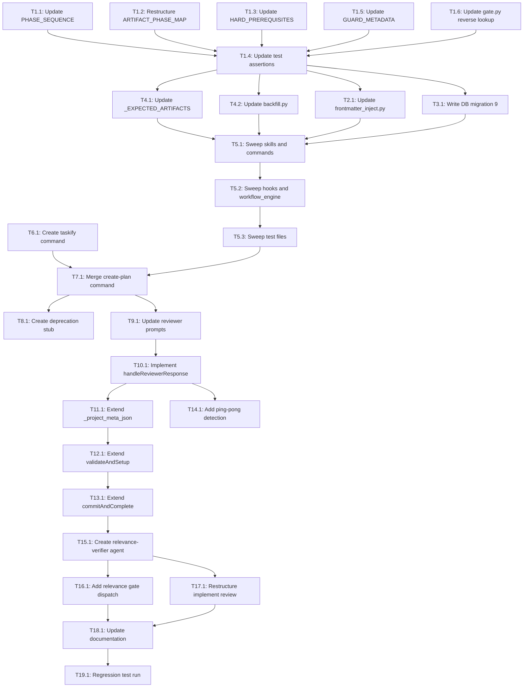

# Tasks: Workflow Hardening

## Dependency Graph



## Execution Strategy

### Parallel Group 1 (No dependencies)
- T1.1: Remove create_tasks from PHASE_SEQUENCE
- T1.2: Restructure ARTIFACT_PHASE_MAP to dict[str, list[str]]
- T1.3: Update HARD_PREREQUISITES (remove create-tasks entry)
- T1.5: Update GUARD_METADATA (14 guards)
- T1.6: Update gate.py reverse lookup
- T6.1: Create /pd:taskify command (independent of Stage 0)

### Parallel Group 2 (After T1.1-T1.6)
- T1.4: Update transition_gate test assertions

### Parallel Group 3 (After T1.4)
- T2.1: Update frontmatter_inject.py
- T3.1: Write DB migration 9
- T4.1: Update _EXPECTED_ARTIFACTS
- T4.2: Update backfill.py

### Sequential Group 4 (After Group 3 — must run in order)
- T5.1: Sweep skills and commands (establishes canonical replacement decisions)
- T5.2: Sweep hooks and workflow_engine (after T5.1)
- T5.3: Sweep test files (after T5.2)

### Sequential Group 5 (After Group 4 + T6.1)
- T7.1: Merge create-plan command
- T8.1: Create deprecation stub

### Sequential Group 6 (After T7.1)
- T9.1: Update reviewer prompts
- T10.1: Implement handleReviewerResponse
- T11.1: Extend _project_meta_json
- T12.1: Extend validateAndSetup
- T13.1: Extend commitAndComplete
- T14.1: Add ping-pong detection

### Sequential Group 7 (After Group 6)
- T15.1: Create relevance-verifier agent
- T16.1: Add relevance gate dispatch
- T17.1: Restructure implement review

### Parallel Group 8 (After Group 7)
- T18.1: Update documentation
- T19.1: Regression test run

## Task Details

### Stage 0: Infrastructure

#### Task 1.1: Remove create_tasks from PHASE_SEQUENCE
- **Why:** Plan item 1 — PHASE_SEQUENCE is the canonical phase order imported by all workflow components
- **Depends on:** None
- **Blocks:** T1.4
- **Files:** `plugins/pd/hooks/lib/transition_gate/constants.py`
- **Do:**
  1. Open `constants.py`, find `PHASE_SEQUENCE` tuple (line 12-20)
  2. Remove `Phase.create_tasks` from the tuple
  3. Result: 6 phases: `(brainstorm, specify, design, create_plan, implement, finish)`
  4. Update `COMMAND_PHASES` (derived from PHASE_SEQUENCE[1:]) — automatic if PHASE_SEQUENCE changes
- **Test:** `grep -n 'create_tasks' plugins/pd/hooks/lib/transition_gate/constants.py` returns only ARTIFACT_PHASE_MAP and GUARD_METADATA (not PHASE_SEQUENCE)
- **Done when:** PHASE_SEQUENCE has exactly 6 entries, create_tasks absent

#### Task 1.2: Restructure ARTIFACT_PHASE_MAP to dict[str, list[str]]
- **Why:** Plan item 1 — create-plan now produces both plan.md and tasks.md
- **Depends on:** None
- **Blocks:** T1.4, T1.6
- **Files:** `plugins/pd/hooks/lib/transition_gate/constants.py`
- **Do:**
  1. Find `ARTIFACT_PHASE_MAP` (line ~50)
  2. Change type from `dict[str, str]` to `dict[str, list[str]]`
  3. Update entries:
     - `"specify": ["spec.md"]`
     - `"design": ["design.md"]`
     - `"create-plan": ["plan.md", "tasks.md"]`
     - `"implement": []` (no single artifact)
     - `"finish": ["retro.md"]`
  4. Remove `"create-tasks": "tasks.md"` entry
- **Test:** `python3 -c "from transition_gate.constants import ARTIFACT_PHASE_MAP; print(type(list(ARTIFACT_PHASE_MAP.values())[0]))"` outputs `<class 'list'>`
- **Done when:** ARTIFACT_PHASE_MAP values are all lists, create-plan maps to ["plan.md", "tasks.md"]

#### Task 1.3: Update HARD_PREREQUISITES
- **Why:** Plan item 1 — prerequisites map controls which artifacts must exist before a phase starts
- **Depends on:** None
- **Blocks:** T1.4
- **Files:** `plugins/pd/hooks/lib/transition_gate/constants.py`
- **Do:**
  1. Find `HARD_PREREQUISITES` dict (line ~30)
  2. Remove `"create-tasks"` entry entirely
  3. Verify `"create-plan"` requires `["spec.md", "design.md"]` (unchanged)
  4. Verify `"implement"` requires `["spec.md", "tasks.md"]` (unchanged — tasks.md now produced by create-plan)
- **Test:** `python3 -c "from transition_gate.constants import HARD_PREREQUISITES; assert 'create-tasks' not in HARD_PREREQUISITES; print('OK')"`
- **Done when:** HARD_PREREQUISITES has no create-tasks key, implement still requires tasks.md

#### Task 1.4: Update transition_gate test assertions
- **Why:** Tests encode the old 7-phase sequence and dict[str, str] ARTIFACT_PHASE_MAP — must reflect new structure
- **Depends on:** T1.1, T1.2, T1.3, T1.5, T1.6
- **Blocks:** T2.1, T3.1, T4.1, T4.2
- **Files:** `plugins/pd/hooks/lib/transition_gate/test_gate.py`, `plugins/pd/hooks/lib/transition_gate/test_constants.py`
- **Do:**
  1. Update all PHASE_SEQUENCE assertions to expect 6 phases
  2. Update ARTIFACT_PHASE_MAP assertions to expect dict[str, list[str]] values
  3. Update reverse lookup test (if any) to expect flattened dict
  4. Update HARD_PREREQUISITES assertions to remove create-tasks
  5. Update GUARD_METADATA assertions to replace create-tasks with create-plan in affected_phases
- **Test:** `plugins/pd/.venv/bin/python -m pytest plugins/pd/hooks/lib/transition_gate/ -v`
- **Done when:** All transition_gate tests pass with updated assertions

#### Task 1.5: Update GUARD_METADATA and PHASE_GUARD_MAP (14 guards + map)
- **Why:** Plan item 1 — 14 guards reference create-tasks in affected_phases; PHASE_GUARD_MAP has create-tasks keys
- **Depends on:** None
- **Blocks:** T1.4
- **Files:** `plugins/pd/hooks/lib/transition_gate/constants.py`
- **Do:**
  1. Find GUARD_METADATA dict
  2. For each of G-04, G-08, G-11, G-17, G-18, G-22, G-23, G-25, G-36, G-37, G-45, G-50, G-51, G-60:
     - Replace `'create-tasks'` with `'create-plan'` in `affected_phases` list
  3. Remove any guards that are create-tasks-specific (G-36, G-37 if they only apply to create-tasks)
  4. Merge create-tasks guards into create-plan guards if needed
  5. In PHASE_GUARD_MAP: remove 'create-tasks' key from both 'review_quality' and 'phase_handoff' sub-dicts
- **Test:** `python3 -c "from transition_gate.constants import GUARD_METADATA; assert all('create-tasks' not in g.get('affected_phases', []) for g in GUARD_METADATA.values()); print('OK')"`
- **Done when:** No GUARD_METADATA entry references create-tasks in affected_phases

#### Task 1.6: Update gate.py reverse lookup
- **Why:** Plan item 1 / Design TD-6 — reverse lookup breaks with list values
- **Depends on:** T1.2
- **Blocks:** T1.4
- **Files:** `plugins/pd/hooks/lib/transition_gate/gate.py`
- **Do:**
  1. Find reverse lookup at line ~160: `{v: k for k, v in ARTIFACT_PHASE_MAP.items()}`
  2. Replace with: `{a: k for k, artifacts in ARTIFACT_PHASE_MAP.items() for a in artifacts}`
  3. Verify the reverse lookup is used for artifact→phase resolution
- **Test:** `python3 -c "from transition_gate.gate import *; print('OK')"` — no import errors
- **Done when:** gate.py imports and runs without error with new ARTIFACT_PHASE_MAP structure

### Stage 0 continued

#### Task 2.1: Update frontmatter_inject.py ARTIFACT_PHASE_MAP
- **Why:** Plan item 2 — separate ARTIFACT_PHASE_MAP maps artifact_type→phase
- **Depends on:** T1.4
- **Blocks:** T5.1
- **Files:** `plugins/pd/hooks/lib/entity_registry/frontmatter_inject.py`
- **Do:**
  1. Find ARTIFACT_PHASE_MAP (line ~52-59)
  2. Change `"tasks": "create-tasks"` to `"tasks": "create-plan"`
  3. Leave all other entries unchanged (this map stays dict[str, str])
- **Test:** `plugins/pd/.venv/bin/python -m pytest plugins/pd/hooks/lib/entity_registry/test_frontmatter*.py -v`
- **Done when:** frontmatter_inject.py maps "tasks" → "create-plan", all frontmatter tests pass

#### Task 3.1: Write DB migration 9
- **Why:** Plan item 3 — workflow_phases CHECK constraint still allows 'create-tasks'
- **Depends on:** T1.4
- **Blocks:** T5.1
- **Files:** `plugins/pd/hooks/lib/entity_registry/database.py`
- **Do:**
  1. Add `_migration_9_remove_create_tasks` function following migration 8 template
  2. Use self-managed transaction (BEGIN IMMEDIATE / COMMIT / ROLLBACK)
  3. Rebuild workflow_phases table with updated CHECK constraint excluding 'create-tasks'
  4. Migrate existing rows: `UPDATE workflow_phases SET workflow_phase = 'create-plan' WHERE workflow_phase = 'create-tasks'` — unconditional 1:1 mapping since create-plan now covers both plan and task breakdown
  5. Add to MIGRATIONS dict: `9: _migration_9_remove_create_tasks`
- **Test:** `plugins/pd/.venv/bin/python -m pytest plugins/pd/hooks/lib/entity_registry/ -v -k migration`
- **Done when:** Migration 9 runs without error, CHECK constraint rejects 'create-tasks', existing rows migrated

#### Task 4.1: Update _EXPECTED_ARTIFACTS
- **Why:** Plan item 4 — finish phase artifact validation
- **Depends on:** T1.4
- **Blocks:** T5.1
- **Files:** `plugins/pd/mcp/workflow_state_server.py`
- **Do:**
  1. Find `_EXPECTED_ARTIFACTS` dict (line ~613)
  2. Verify both standard and full mode lists include 'tasks.md' (already present — produced by create-plan now)
  3. No change needed if tasks.md is already listed; confirm and move on
- **Test:** `grep -A5 '_EXPECTED_ARTIFACTS' plugins/pd/mcp/workflow_state_server.py` shows tasks.md in both modes
- **Done when:** _EXPECTED_ARTIFACTS includes tasks.md for both standard and full modes

#### Task 4.2: Update backfill.py phase sequence
- **Why:** Plan item 4 — backfill.py has hardcoded phase sequence
- **Depends on:** T1.4
- **Blocks:** T5.1
- **Files:** `plugins/pd/hooks/lib/entity_registry/backfill.py`, `plugins/pd/hooks/lib/entity_registry/test_backfill.py`
- **Do:**
  1. Find phase sequence in backfill.py (line ~33)
  2. Remove 'create-tasks' from the sequence
  3. Update _derive_next_phase() logic: 'create-plan' → 'implement' (was 'create-plan' → 'create-tasks')
  4. Update test_backfill.py assertions at lines ~1857-1869, ~1885
- **Test:** `plugins/pd/.venv/bin/python -m pytest plugins/pd/hooks/lib/entity_registry/test_backfill.py -v`
- **Done when:** backfill.py phase sequence has 6 phases, _derive_next_phase('create-plan') returns 'implement'

#### Task 5.1: Sweep create-tasks references in skills and commands
- **Why:** Plan item 5 — skills and commands reference old phase name
- **Depends on:** T2.1, T3.1, T4.1, T4.2
- **Blocks:** T5.2
- **Files:** `skills/workflow-transitions/SKILL.md`, `skills/planning/SKILL.md`, `skills/implementing/SKILL.md`, `skills/reviewing-artifacts/SKILL.md`, `skills/workflow-state/SKILL.md`, `commands/create-plan.md`, `commands/secretary.md`, `commands/show-status.md`, `commands/list-features.md`
- **Do:**
  1. `grep -rn 'create.tasks' plugins/pd/skills/ plugins/pd/commands/ --include='*.md'`
  2. Apply these three decision rules for each match:
     - **Phase name references** (in phase sequences, test data, documentation) → replace `create-tasks` with `create-plan`
     - **Command references** (YOLO auto-chain `/pd:create-tasks`) → replace with `/pd:implement` (create-plan now handles task breakdown, so the next phase after create-plan is implement)
     - **Deprecation stub** (`commands/create-tasks.md`) → leave as-is (this IS the redirect)
- **Test:** `grep -rn 'create.tasks' plugins/pd/skills/ plugins/pd/commands/ --include='*.md' | grep -v 'create-tasks.md' | wc -l` = 0
- **Done when:** Zero create-tasks references in skills/ and commands/ (excluding commands/create-tasks.md deprecation stub)

#### Task 5.2: Sweep create-tasks references in hooks and workflow_engine
- **Why:** Plan item 5 — hooks and workflow engine reference old phase
- **Depends on:** T5.1
- **Blocks:** T5.3
- **Files:** `hooks/session-start.sh`, `hooks/yolo-stop.sh`, `hooks/lib/workflow_engine/templates.py`, `hooks/lib/workflow_engine/kanban.py`
- **Do:**
  1. `grep -rn 'create.tasks' plugins/pd/hooks/ --include='*.sh' --include='*.py' | grep -v test_ | grep -v .venv`
  2. For each match: replace 'create-tasks' with 'create-plan' or remove
  3. In yolo-stop.sh: update phase sequence used for next-phase determination
  4. In session-start.sh: update detect_phase() if it references create-tasks
- **Test:** `grep -rn 'create.tasks' plugins/pd/hooks/ --include='*.sh' --include='*.py' | grep -v test_ | grep -v .venv | wc -l` = 0
- **Done when:** Zero create-tasks references in hooks (non-test files)

#### Task 5.3: Sweep create-tasks references in test files
- **Why:** Plan item 5 — test files with hardcoded phase names will fail
- **Depends on:** T5.2
- **Blocks:** T7.1
- **Files:** `hooks/lib/workflow_engine/test_reconciliation.py`, `hooks/lib/workflow_engine/test_entity_engine.py`, `hooks/lib/workflow_engine/test_kanban.py`, `hooks/lib/workflow_engine/test_rollup.py`, `hooks/tests/test_yolo_stop_phase_logic.py`, `hooks/lib/doctor/test_checks.py`, `ui/tests/test_*.py`
- **Do:**
  1. `grep -rn 'create.tasks' plugins/pd/ --include='*.py' | grep test_ | grep -v .venv`
  2. For each match: update assertion to use 'create-plan' or remove create-tasks test case
  3. Run each affected test suite to verify
- **Test:** Full test suite: `plugins/pd/.venv/bin/python -m pytest plugins/pd/hooks/lib/workflow_engine/ plugins/pd/hooks/lib/doctor/ -v`
- **Done when:** Zero create-tasks references in test files, all tests pass

### Stage 1: Standalone Taskify

#### Task 6.1: Create /pd:taskify command
- **Why:** Plan item 6 / Design C4 — standalone task breakdown with quality review
- **Depends on:** None (fully independent)
- **Blocks:** T7.1
- **Files:** `plugins/pd/commands/taskify.md`
- **Do:**
  1. Create `plugins/pd/commands/taskify.md` with frontmatter: `description: "Break down any plan into atomic tasks with verified DoDs"`, `argument-hint: "<plan-path> [--spec=<path>] [--design=<path>] [--output=<path>]"`
  2. Step 1: Parse arguments — plan_path (required), spec_path, design_path, output_path (default: {plan_dir}/tasks.md)
  3. Step 2: Validate plan file exists and has content
  4. Step 3: Invoke breaking-down-tasks skill with plan content (+ spec/design if provided)
  5. Step 4: Dispatch task-reviewer agent (max 3 iterations, automatic):
     - Iteration 1: fresh dispatch with plan + tasks + optional spec/design
     - Iterations 2-3: auto-correct issues, re-dispatch reviewer
     - After approval or 3 iterations: output final tasks.md
  6. Step 5: Write tasks.md to output_path
  7. No MCP calls, no .meta.json, no entity registry
- **Test:** Run `/pd:taskify docs/features/073-yolo-relevance-gate/plan.md --output=agent_sandbox/test-taskify-tasks.md`. Verify: (1) output file exists, (2) contains `## Dependency Graph` section, (3) contains at least one parallel group, (4) each task has a `Done when` field, (5) no MCP tool calls in agent transcript.
- **Done when:** tasks.md exists at output path with dependency graph, parallel groups, and atomic tasks with DoDs. Task-reviewer approval appears in output. No MCP calls made.

### Stage 2: Merged Create-Plan

#### Task 7.1: Merge create-plan to invoke both skills
- **Why:** Plan item 7 / Design C3/I6 — single phase producing plan.md + tasks.md
- **Depends on:** T5.3, T6.1
- **Blocks:** T8.1, T9.1
- **Files:** `plugins/pd/commands/create-plan.md`
- **Do:**
  1. Read current create-plan.md and create-tasks.md command files
  2. In create-plan.md Step 4:
     a. After planning skill produces plan.md, invoke breaking-down-tasks skill to produce tasks.md
     b. Combined review loop (max 5 iterations):
        - Dispatch plan-reviewer first. If fails → fix plan.md, re-run breaking-down-tasks, loop.
        - If plan-reviewer passes → dispatch task-reviewer. If fails → fix tasks.md, loop.
        - If task-reviewer passes → dispatch phase-reviewer. If fails → fix plan/tasks, loop.
        - All 3 pass → APPROVED
  3. Update commitAndComplete to commit both ["plan.md", "tasks.md"]
  4. Update YOLO auto-chain: after completion, invoke /pd:implement (was /pd:create-tasks)
  5. Add relevance gate dispatch point after commitAndComplete (placeholder for T16.1)
- **Test:** Run `/pd:create-plan` on a feature with design.md, verify both plan.md and tasks.md produced
- **Done when:** `/pd:create-plan` produces both artifacts, combined 3-reviewer loop works, YOLO chains to implement

#### Task 8.1: Create deprecation stub for /pd:create-tasks
- **Why:** Plan item 8 / Design FR-12 — backward compatibility
- **Depends on:** T7.1
- **Blocks:** None
- **Files:** `plugins/pd/commands/create-tasks.md`
- **Do:**
  1. Replace existing create-tasks.md content with deprecation stub
  2. Output: "Note: /pd:create-tasks has been merged into /pd:create-plan. Redirecting..."
  3. Invoke `/pd:create-plan` with same arguments
- **Test:** Run `/pd:create-tasks`, verify deprecation message and redirect
- **Done when:** `/pd:create-tasks` shows deprecation notice and invokes `/pd:create-plan`

### Stage 3: Backward Travel

#### Task 9.1: Update 6 reviewer agent prompts with backward_to
- **Why:** Plan item 9 / Design I1 — reviewers must be able to recommend backward travel
- **Depends on:** T7.1
- **Blocks:** T10.1
- **Files:** `plugins/pd/agents/spec-reviewer.md`, `plugins/pd/agents/design-reviewer.md`, `plugins/pd/agents/plan-reviewer.md`, `plugins/pd/agents/task-reviewer.md`, `plugins/pd/agents/phase-reviewer.md`, `plugins/pd/agents/implementation-reviewer.md`
- **Do:**
  1. For each agent, add to the Output Format section:
     ```
     Optional backward travel fields (include only when root cause is upstream):
     "backward_to": "specify",  // phase name earlier than current
     "backward_reason": "AC-2 is not testable",
     "backward_context": {
       "source_phase": "create-plan",
       "target_phase": "specify",
       "findings": [...],
       "downstream_impact": "..."
     }
     ```
  2. Add instruction: "If the root cause of a blocker is in an upstream artifact, include backward_to to recommend the workflow return to that phase for correction."
- **Test:** Read each agent file, verify backward_to is in the output schema
- **Done when:** All 6 reviewer agents have backward_to/backward_context in their response schema

#### Task 10.1: Implement handleReviewerResponse() in workflow-transitions
- **Why:** Plan item 10 / Design I2 — central orchestration for backward travel
- **Depends on:** T9.1
- **Blocks:** T11.1, T14.1
- **Files:** `plugins/pd/skills/workflow-transitions/SKILL.md`
- **Do:**
  1. Add new section "### handleReviewerResponse" after the reviewer dispatch parse step
  2. Input: reviewer_response (parsed JSON), feature_type_id, current_phase
  3. If backward_to present:
     a. Validate backward_to is earlier than current_phase in PHASE_SEQUENCE
     b. Store backward_context in entity metadata via update_entity MCP
     c. Store backward_return_target = current_phase in entity metadata
     d. Update backward_transition_reason in workflow_phases (existing column)
     e. Append to backward_history array in metadata: {source_phase, target_phase, reason, timestamp, issue_count}
     f. Call transition_phase(feature_type_id, backward_to)
     g. YOLO: output "Continue to /pd:{backward_to} [YOLO_MODE]"
     h. Interactive: prompt "Reviewer recommends going back to {phase}. Proceed?"
  4. If approved AND zero blocker/warning: return "approve"
  5. Else: return "iterate"
- **Test:** (1) For test feature 073, manually craft a reviewer response JSON with `backward_to: "specify"` and `backward_context: {source_phase: "create-plan", ...}`. (2) Run the create-plan command. (3) After backward_to is processed, call `get_entity("feature:073-yolo-relevance-gate")` MCP and verify metadata contains backward_context, backward_return_target="create-plan", and backward_history with 1 entry. (4) Verify output contains "Continue to /pd:specify".
- **Done when:** Entity metadata contains backward_context + backward_return_target + backward_history[1]. Output instructs to continue to target phase.

#### Task 11.1: Extend _project_meta_json() for backward fields
- **Why:** Plan item 11 — validateAndSetup reads .meta.json, needs backward fields projected
- **Depends on:** T10.1
- **Blocks:** T12.1
- **Files:** `plugins/pd/mcp/workflow_state_server.py`
- **Do:**
  1. Find `_project_meta_json()` function (line ~295)
  2. After existing field projections (phase_timing, brainstorm_source, etc.), add:
     ```python
     if metadata.get("backward_context"):
         meta["backward_context"] = metadata["backward_context"]
     if metadata.get("backward_return_target"):
         meta["backward_return_target"] = metadata["backward_return_target"]
     # Do NOT project backward_history (audit-only, stays in DB)
     ```
  3. Verify _atomic_json_write includes these fields in output
- **Test:** Store backward_context via update_entity, call _project_meta_json, verify .meta.json contains the field
- **Done when:** .meta.json contains backward_context and backward_return_target when present in entity metadata

#### Task 12.1: Extend validateAndSetup() for backward context injection
- **Why:** Plan item 12 / Design I3 — upstream phases must receive backward context
- **Depends on:** T11.1
- **Blocks:** T13.1
- **Files:** `plugins/pd/skills/workflow-transitions/SKILL.md`
- **Do:**
  1. Add Step 1b after existing Step 1 (validate transition):
  2. Read .meta.json (already read in Step 1)
  3. If backward_context exists:
     a. Format as markdown block with source_phase, findings, downstream_impact
     b. Prepend to phase prompt context
     c. If target is brainstorm: add "Run in clarification mode — research already completed"
  4. After phase completes: clear backward_context from entity metadata via update_entity
- **Test:** Set backward_context in entity metadata, run a phase, verify context is injected and cleared after completion
- **Done when:** Upstream phase receives backward context as formatted markdown, field cleared after phase completes

#### Task 13.1: Extend commitAndComplete() for forward re-run
- **Why:** Plan item 13 / Design I4 — one-phase-at-a-time advancement after backward fix
- **Depends on:** T12.1
- **Blocks:** T15.1
- **Files:** `plugins/pd/skills/workflow-transitions/SKILL.md`
- **Do:**
  1. Add Step 3b after existing Step 3 (Phase Summary):
  2. Read entity metadata for backward_return_target
  3. If backward_return_target exists AND != current_phase:
     a. Determine next_phase from PHASE_SEQUENCE
     b. Clear backward_context (already used)
     c. Output "Continue to /pd:{next_phase} [YOLO_MODE]" (reuses existing auto-chain)
  4. If backward_return_target == current_phase:
     a. Clear backward_return_target from metadata
     b. Resume normal flow (standard auto-chain)
  5. If no backward_return_target: normal flow
- **Test:** Set backward_return_target, complete a phase, verify workflow advances one step and eventually clears target
- **Done when:** Forward re-run advances one phase at a time, clears target when reached

#### Task 14.1: Add ping-pong detection to handleReviewerResponse
- **Why:** Plan item 14 / Design I9 — prevent infinite backward travel loops
- **Depends on:** T10.1
- **Blocks:** None (can run parallel with T11-T13)
- **Files:** `plugins/pd/skills/workflow-transitions/SKILL.md` (within handleReviewerResponse)
- **Do:**
  1. In handleReviewerResponse, after backward_to is detected:
  2. Read backward_history from entity metadata
  3. Filter entries with same (source_phase, target_phase) pair
  4. If ≥2 previous entries exist for this pair:
     a. Compare current issue_count against most recent previous entry's issue_count
     b. If current >= previous (no progress): ping-pong detected
     c. YOLO: force approve with warnings, log "ping-pong detected"
     d. Interactive: prompt "Same issues recurring. Force approve or continue?"
  5. If issue_count decreased: allow backward travel (legitimate progress)
- **Test:** Simulate 3 backward travels with non-decreasing issue count, verify ping-pong detection fires
- **Done when:** Ping-pong detection triggers on 3rd backward travel with same/increasing issue count

### Stage 4: Relevance Gate

#### Task 15.1: Create relevance-verifier agent
- **Why:** Plan item 15 / Design C2 — new agent for artifact chain verification
- **Depends on:** T13.1
- **Blocks:** T16.1, T17.1
- **Files:** `plugins/pd/agents/relevance-verifier.md`
- **Do:**
  1. Create agent file with frontmatter: `name: relevance-verifier`, `model: opus`, `tools: [Read, Glob, Grep]`
  2. Agent reads spec.md, design.md, plan.md, tasks.md
  3. Checks: coverage (spec ACs → task DoDs), completeness (design components → tasks), testability (binary DoDs), coherence (task approaches reflect design decisions)
  4. Returns JSON: `{pass, checks: [{name, pass, details, gaps}], backward_to?, backward_context?, summary}`
  5. Include backward_to support natively (created with it, not retrofitted)
- **Test:** Dispatch agent with test artifacts, verify structured response with per-check results
- **Done when:** Agent file exists, returns structured JSON with 4 checks and optional backward_to

#### Task 16.1: Add relevance gate dispatch to create-plan completion
- **Why:** Plan item 16 / Design I5 — pre-implementation coherence check
- **Depends on:** T15.1
- **Blocks:** T18.1
- **Files:** `plugins/pd/commands/create-plan.md`, `plugins/pd/hooks/yolo-guard.sh`
- **Do:**
  1. In create-plan.md, after commitAndComplete but before auto-chain to implement:
     a. Dispatch relevance-verifier agent with spec, design, plan, tasks
     b. If pass: proceed to implement (standard auto-chain)
     c. If fail with backward_to: invoke handleReviewerResponse (triggers backward travel)
     d. If fail without backward_to: emit "relevance verification failed" message
  2. In yolo-guard.sh: add "relevance verification failed" to SAFETY_KEYWORDS array (line ~62)
- **Test:** Run create-plan on a feature with a spec gap, verify gate catches it
- **Done when:** Relevance gate runs after create-plan, halts YOLO on failure, backward travel works from gate

### Stage 5: Post-Implementation 360 QA

#### Task 17.1: Restructure implement.md review section
- **Why:** Plan item 17 / Design C5/I8 — 3-level sequential QA
- **Depends on:** T13.1 (forward re-run), T15.1 (relevance-verifier agent)
- **Blocks:** T18.1
- **Files:** `plugins/pd/commands/implement.md`
- **Do:**
  1. Replace existing 3-reviewer parallel dispatch with sequential 3-level verification:
     Level 1: implementation-reviewer — verifies each task's DoD against implementation
     Level 2: relevance-verifier — verifies spec ACs against implementation
     Level 3: code-quality-reviewer + security-reviewer — engineering standards
  2. Max 5 total iterations shared across all levels
  3. Level 1/2 failures may trigger backward travel via handleReviewerResponse
  4. Level 3 failures fixed in-place (no backward travel for style)
  5. Preserve existing YOLO circuit breaker at 5 iterations
- **Test:** Run implementation with a task DoD gap, verify Level 1 catches it
- **Done when:** 3-level QA runs sequentially, backward travel works from Level 1/2, standards fixed in-place

### Stage 6: Documentation & Cleanup

#### Task 18.1: Update documentation
- **Why:** Plan item 18 — CLAUDE.md doc sync rules
- **Depends on:** T16.1, T17.1
- **Blocks:** T19.1
- **Files:** `README.md`, `README_FOR_DEV.md`, `plugins/pd/README.md`, `CLAUDE.md`
- **Do:**
  1. Update phase sequence references (6 phases, create-tasks removed)
  2. Update command tables (add /pd:taskify, note create-tasks deprecated)
  3. Update agent counts (add relevance-verifier)
  4. Update test commands if paths changed
  5. Run `./validate.sh` to verify component counts
- **Test:** `./validate.sh` passes with no component count mismatches
- **Done when:** All documentation reflects new phase sequence, taskify command, and relevance-verifier agent

#### Task 19.1: Regression test run
- **Why:** Plan item 19 — zero regression verification
- **Depends on:** T18.1
- **Blocks:** None
- **Files:** None
- **Do:**
  1. Run all test suites listed in CLAUDE.md
  2. Verify zero failures attributable to this feature
- **Test:** All suites pass
- **Done when:** entity_registry, workflow_engine, memory_server, doctor, transition_gate, reconciliation, UI tests all pass

## Summary

- Total tasks: 25
- Parallel groups: 8
- Critical path: T1.1 → T1.4 → T5.1 → T5.3 → T7.1 → T9.1 → T10.1 → T11.1 → T12.1 → T13.1 → T15.1 → T16.1 → T18.1 → T19.1
- Max parallelism: 6 (Group 1: T1.1-T1.6 + T6.1)
