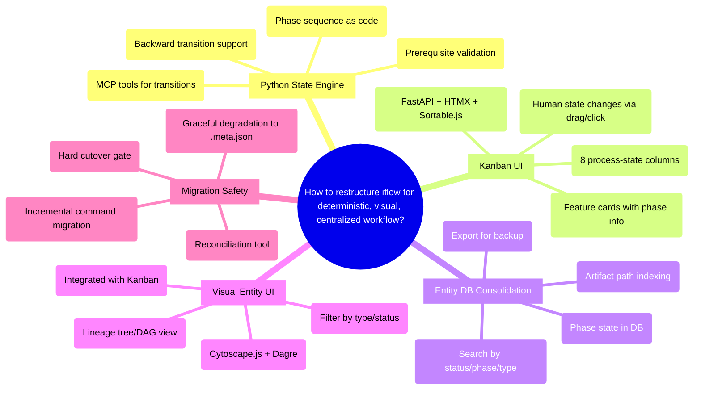

# PRD: iflow Architectural Evolution — Deterministic State Engine, Kanban UI, Entity Consolidation

## Status
- Created: 2026-03-01
- Last updated: 2026-03-01
- Status: Draft
- Problem Type: Technical/Architecture + Product/Feature
- Archetype: improving-existing-work

## Problem Statement

iflow's workflow state management is encoded as text in skill/command markdown files. The LLM reads phase progression tables, branching logic, and validation rules — all deterministic operations — and re-interprets them on every invocation. This is fragile (5 duplicated phase sequence locations that can drift), token-heavy (~1,500 lines of duplicated reviewer boilerplate across commands, implement.md alone is 52KB), and carries non-determinism risk (identical transitions could produce different results depending on context window state — theoretical risk, no observed failures to date but the architectural exposure is real). Additionally, there is no visual collaboration interface for observing workflow progress, and workflow artifacts are scattered across the filesystem with no single source of truth.

### Evidence
- Phase sequence duplicated in 5 locations: `workflow-state/SKILL.md` (3 representations), `secretary.md` (Phase Progression Table), `create-specialist-team.md` (inline prose) — Evidence: Codebase analysis
- ~1,500 lines of reviewer loop boilerplate duplicated across 5 commands (`specify.md`, `design.md`, `create-plan.md`, `create-tasks.md`, `implement.md`): ~150 lines per loop × 2 reviewer roles × 5 commands — Evidence: Codebase analysis (approximate, actual per-loop size varies)
- `implement.md` is 52KB — largest command file, heaviest context load — Evidence: Codebase analysis
- `.meta.json` schema inconsistent across phases: design has `stages` sub-object, other phases use flat `started/completed/iterations/reviewerNotes` — Evidence: Codebase analysis, `workflow-state/SKILL.md:240-364`
- `mode` field (standard/full) set at feature creation but never read back during phase execution — Evidence: Codebase analysis
- Entity registry has no phase-level tracking — only 4 entity types (backlog, brainstorm, project, feature) with coarse status — Evidence: `database.py:10-75`
- Backfill is one-shot and non-re-runnable; entities created when MCP is down are silently lost — Evidence: `backfill.py:33-58`
- 148 total `.meta.json` references across 34 files (14 commands = 46 refs, 10 skills = 36 refs, 9 hook-related files = 64 refs, plus test files) — Evidence: Codebase grep analysis. Note: migration surface is the subset of write references only; read-only references can be updated after write paths are migrated

## Goals
1. Replace text-LLM-driven workflow state management with a deterministic Python state engine exposed via MCP tools
2. Provide a visual Kanban board for human-agent collaboration with configurable column views
3. Consolidate all workflow artifacts into the entity DB as the single source of truth
4. Provide a visual entity UI for exploring entities, lineage, and relationships
5. Achieve significant token savings by removing state control logic from LLM context

## Success Criteria

### Release 1: State Engine + Entity DB Consolidation (Reliability)
- [ ] Zero text-LLM state control: no phase progression tables, `validateTransition()`, or `validateArtifact()` pseudocode in any skill/command markdown
- [ ] Python state engine MCP tools handle all phase transitions, prerequisite validation, and state queries
- [ ] Entity DB indexes all workflow artifacts (PRDs, specs, designs, plans, tasks, .meta.json data) with queryable phase state via `workflow_phases` table
- [ ] Entity DB supports export/backup functionality (JSON with schema version)
- [ ] All phase commands (`specify`, `design`, `create-plan`, `create-tasks`, `implement`, `finish-feature`) use MCP tool calls instead of inline state manipulation
- [ ] Token reduction measured: context size of phase commands reduced by >50% from removing state logic
- [ ] Reconciliation tool detects and reports drift between `.meta.json` and DB state

### Release 2: Kanban UI + Entity Explorer (Observability)
- [ ] Single web application (`iflow-ui`) serves both Kanban board and entity explorer views
- [ ] Visual Kanban board renders features across 8 columns in a local web UI
- [ ] Visual entity UI allows exploring entities, lineage trees, and artifact relationships in a browser
- [ ] Kanban card click-through navigates to entity detail/lineage view
- [ ] Entity explorer shows current Kanban column for feature entities
- [ ] Shared data access layer: both views read from same `entities.db` via single server process

## User Stories

### Story 1: Deterministic Phase Transition
**As a** developer using iflow **I want** phase transitions to be deterministic Python logic **So that** identical inputs always produce identical state changes regardless of LLM context window state.
**Acceptance criteria:**
- Agent calls `transition_phase(feature_id, "design", "create-plan")` via MCP tool
- Python validates prerequisites (design.md exists, >100 bytes, has required sections)
- Python updates state atomically (DB write, not .meta.json text edit)
- Invalid transitions return structured error (not LLM interpretation)

### Story 2: Kanban Board Visibility
**As a** developer **I want** a visual Kanban board showing all work items across workflow phases **So that** I can see what's in progress, blocked, or awaiting review at a glance.
**Acceptance criteria:**
- Board opens in browser via `localhost:{port}`
- Cards show feature name, current phase, assignee (agent or human), and last activity
- Columns represent process states (a dimension orthogonal to workflow phases — see Kanban Column Mapping below)
- Primary card types: `feature` entities traverse all 8 columns; `brainstorm` and `backlog` entities appear only in `backlog` and `prioritised` columns (they don't have phases)
- Card type badge indicates the entity type (feature, brainstorm, backlog)

### Story 3: Entity DB as Single Source of Truth
**As a** developer **I want** all workflow state and artifact references in one queryable database **So that** I can answer "what phase is feature X in?" or "show all features in review" without grepping the filesystem.
**Acceptance criteria:**
- Entity DB stores phase state (replaces `.meta.json` `lastCompletedPhase`)
- All artifact paths indexed in entity DB
- Query by status, phase, parent, or metadata via MCP tools
- Export all entities to JSON/markdown for backup

### Story 4: Visual Entity Explorer
**As a** developer **I want** a visual UI to explore entity lineage and relationships **So that** I can navigate from backlog item to brainstorm to project to features visually.
**Acceptance criteria:**
- Tree/DAG view of entity hierarchy
- Click-through navigation from parent to children
- Filter by entity type, status, or phase
- Accessible via browser alongside or integrated with Kanban

## Use Cases

### UC-1: Agent Requests Phase Transition
**Actors:** LLM agent | **Preconditions:** Feature exists, current phase is "design" (completed)
**Flow:** 1. Agent calls `transition_phase("feature:006", "design", "create-plan")` 2. Python engine validates: design.md exists, >100 bytes, has required sections 3. Engine updates DB: `lastCompletedPhase = "create-plan"`, sets started timestamp 4. Returns `{ "success": true, "phase": "create-plan", "state": {...} }` 5. Agent proceeds with create-plan execution (no need to read phase tables from context)
**Postconditions:** Feature state atomically updated in DB
**Edge cases:** Agent requests invalid transition (e.g., skip from brainstorm to implement) → engine returns `{ "success": false, "error": "prerequisite_missing", "missing": ["spec.md", "design.md", "plan.md", "tasks.md"] }`

### UC-2: Human Reviews Kanban Board
**Actors:** Developer | **Preconditions:** Kanban server running
**Flow:** 1. Developer opens `localhost:37800` 2. Board shows features as cards in columns by process state 3. Developer drags card from "agent review" to "human review" (or clicks to change state) 4. Board updates DB via API 5. Next agent invocation reads updated state from DB
**Postconditions:** Feature state reflects human's decision
**Edge cases:** Server not running → commands fall back to DB-only operation (no UI dependency on critical path)

### UC-3: Export Entity Lineage for Backup
**Actors:** Developer | **Preconditions:** Entity DB populated
**Flow:** 1. Developer calls `export_entities(format="json", output_path="backup/")` via MCP or CLI 2. Python exports all entities with relationships, phase state, and artifact paths 3. Writes to specified path
**Postconditions:** Complete entity snapshot on filesystem
**Edge cases:** Empty DB → exports empty structure with schema version metadata

## Edge Cases & Error Handling
| Scenario | Expected Behavior | Rationale |
|----------|-------------------|-----------|
| MCP state server unreachable | Commands fall back to reading `.meta.json` directly (degrade to current behavior) | Antifragility: failure of enhancement returns system to previous working state |
| Invalid phase transition requested | Return structured error with missing prerequisites; do not attempt transition | Fail fast: deterministic rejection |
| Concurrent writes to same feature | SQLite WAL mode + busy_timeout handles; second write retries | Single-user system; contention is rare but must not corrupt |
| Feature has no `.meta.json` (legacy) | State engine creates default state from artifact existence scan | Backward compatibility during migration |
| Kanban UI server not started | All CLI/agent operations work normally; UI is enhancement-only | UI must never be on critical path |
| DB schema migration on running system | Migration runs on server startup; existing connections see new schema after restart | Standard SQLite migration pattern already used in entity registry |
| `.meta.json` and DB state diverge | Reconciliation tool detects drift and reports diff; does not auto-correct without user confirmation | Safety: never silently overwrite one truth source with another |

## Constraints

### Behavioral Constraints (Must NOT do)
- Must NOT make Kanban UI a dependency for CLI/agent operations — Rationale: UI is an enhancement; workflow must function without it
- Must NOT break existing entity MCP tool signatures (register_entity, set_parent, get_entity, get_lineage, update_entity, export_lineage_markdown) — Rationale: existing consumers depend on these
- Must NOT store artifact file content as blobs in the DB — Rationale: DB stores paths and metadata only; files remain on filesystem for git tracking
- Must NOT require running a persistent server for basic state operations — Rationale: MCP stdio transport is per-invocation; persistent server only for UI

### Technical Constraints
- SQLite is the storage backend (existing infrastructure) — Evidence: entity registry and memory server both use SQLite
- Python is the implementation language (existing venv at `plugins/iflow/.venv/`) — Evidence: all existing MCP servers are Python
- Starlette 0.52.1, Uvicorn 0.41.0, SSE-Starlette 3.2.0 already in venv — Evidence: pip list analysis
- FastAPI not yet installed; compatibility with existing Starlette 0.52.1 needs verification via `pip install --dry-run` before Phase 5 — Evidence: assumption, needs verification
- MCP 2025-11-25 Tasks primitive is experimental and does not map to iflow's 7-phase model — Evidence: internet research, FastMCP 1.26.0 does not expose Tasks API
- Entity DB has immutable constraints on `type_id` and `entity_type` columns (trigger-enforced) — Evidence: `database.py` triggers

## Kanban Column Mapping

Kanban process-state columns are **orthogonal to workflow phases**. A feature's workflow phase (brainstorm, specify, design, etc.) describes *what work is being done*; the Kanban column describes *where in the collaboration process it sits*.

| Kanban Column | Meaning | Typical Phase Occupants | Who Moves Cards Here |
|---------------|---------|------------------------|---------------------|
| backlog | Not yet prioritised | Any (brainstorm, backlog items, unprioritised features) | Human |
| prioritised | Ready for work | Any (brainstorm → feature promotion, or feature awaiting start) | Human |
| WIP | Agent actively working | specify, design, create-plan, create-tasks, implement | Agent (auto on phase start) |
| agent review | Agent reviewing own output | specify, design, create-plan, create-tasks, implement | Agent (auto on reviewer dispatch) |
| human review | Awaiting human feedback | Any phase requiring human decision | Agent (auto on AskUserQuestion) |
| blocked | Cannot proceed | Any phase | Agent or Human |
| documenting | Updating docs post-implementation | finish-feature | Agent (auto) |
| completed | Done or cancelled | finish-feature completed, or cancelled at any phase | Agent or Human |

Automatic transitions: the state engine sets the Kanban column based on workflow events. Humans can override by dragging cards in the UI.

## Requirements

### Functional

#### Release 1: State Engine + Entity DB
- FR-1: Python state engine exposes MCP tools: `get_feature_state(feature_id)`, `transition_phase(feature_id, from_phase, to_phase)`, `validate_prerequisites(feature_id, phase)`, `list_features_by_phase(phase)`, `list_features_by_status(status)`
- FR-2: State engine validates all hard prerequisites (artifact existence, size, required sections) deterministically
- FR-3: State engine validates soft prerequisites (phase ordering) and returns warnings for forward-jumps
- FR-4: State engine supports backward transitions (re-running completed phases) with confirmation metadata
- FR-5: State engine tracks phase data in a new `workflow_phases` table (not metadata JSON blob): `lastCompletedPhase`, per-phase `{started, completed, iterations, reviewerNotes}`, `skippedPhases[]`, `mode`, `status`, `kanban_column`
- FR-8: Entity DB indexes all workflow artifacts with paths and phase metadata
- FR-9: Entity DB supports search/query by status, phase, entity_type, and name
- FR-10: Entity DB supports full export to JSON with schema version for backup/restore
- FR-12: All phase commands use MCP tool calls for state management instead of inline `.meta.json` manipulation
- FR-13: `yolo-stop.sh` hook uses state engine MCP tool instead of inline `phase_map` dict
- FR-14: Reconciliation tool compares `.meta.json` and DB state, reports drift, prompts user for resolution
- FR-15: State engine gracefully degrades to reading `.meta.json` directly if MCP server is unreachable; agents are not blocked (degradation notice returned with result)

#### Release 2: Unified iflow-ui Web Application
- FR-6: Kanban board renders features as cards across 8 configurable columns
- FR-7: Kanban board supports card state changes via UI interaction (click or drag)
- FR-11: Visual entity UI renders entity lineage as navigable tree/DAG
- FR-16: Single `iflow-ui` server process (FastAPI/Starlette) serves both Kanban and entity explorer as routes within one application — no Datasette as separate process
- FR-17: Kanban card click-through navigates to entity detail view showing lineage, artifact paths, phase history, and current Kanban column
- FR-18: Shared data access layer — both views use a common DB session/connection pool reading from `entities.db` (`entities` table + `workflow_phases` table)

### Non-Functional
- NFR-1: Phase command context size reduced by >50% (measured in tokens)
- NFR-2: State transitions complete in <100ms (SQLite local performance)
- NFR-3: Kanban UI loads in <2 seconds for up to 100 features
- NFR-4: Graceful degradation: all operations work when UI server is not running
- NFR-5: Entity DB supports export of all data for backup within 5 seconds for up to 1000 entities
- NFR-6: Zero data loss during migration: `.meta.json` data preserved until explicitly deleted after full migration verification

## Non-Goals
- Multi-user collaboration or real-time sync — Rationale: single-developer tool; no need for websockets or conflict resolution
- Storing artifact content (markdown files) as blobs in the DB — Rationale: files remain on filesystem for git tracking; DB stores paths only
- Using MCP 2025-11-25 Tasks primitive as the state engine — Rationale: experimental, 5-state machine doesn't map to iflow's 7-phase model with backward transitions
- Full REST API for the state engine — Rationale: MCP tools are the agent interface; UI server has its own routes
- Mobile-responsive Kanban UI — Rationale: local dev tool, always used on desktop

## Out of Scope (This Release)
- Cross-project Kanban views (aggregating across multiple project roots) — Future consideration: once single-project is stable
- Kanban card time tracking or velocity metrics — Future consideration: after core board is functional
- Automated notifications (email, Slack) on state changes — Future consideration: when multi-user support is added
- Entity DB migration to Postgres or other RDBMS — Future consideration: if SQLite performance becomes insufficient
- Embedding-based semantic search on entities — Future consideration: currently only the memory system uses embeddings

## Research Summary

### Internet Research
- LangGraph: state machines as directed graphs with reducer-driven state schemas; agents are nodes, transitions are edges triggered by tool calls — Source: sparkco.ai/blog/mastering-langgraph-state-management-in-2025
- MCP 2025-11-25 Tasks primitive: 5-state durable machines (working/input_required/completed/failed/cancelled); experimental, FastMCP 1.26.0 does not expose it — Source: workos.com/blog/mcp-async-tasks-ai-agent-workflows
- bsmi021/mcp-task-manager-server: SQLite-backed MCP server with 12 tools, 4-column Kanban (todo/in-progress/review/done), dependency resolution, priority ordering — Source: github.com/bsmi021/mcp-task-manager-server
- sprint-dash: FastAPI + HTMX + Sortable.js + SQLite Kanban board with drag-and-drop, burndown charts — Source: github.com/simoninglis/sprint-dash
- Datasette: zero-config SQLite web explorer with auto-generated JSON API — Source: datasette.io (evaluated but not adopted: running a separate Datasette process alongside the Kanban server adds process management overhead; a custom entity list/detail view in the unified `iflow-ui` app is simpler)
- FastAPI + HTMX + SQLModel: dominant Python stack for local dev dashboards with zero JS build step — Source: medium.com/@hadiyolworld007
- Cytoscape.js + Dagre: standard pattern for rendering DAG/tree hierarchy in web UIs — Source: github.com/cytoscape/cytoscape.js-dagre

### Codebase Analysis
- Phase sequence duplicated in 5 locations across 3 files — Location: `workflow-state/SKILL.md:19,37,142`, `secretary.md:30-39`, `create-specialist-team.md:112`
- 148 `.meta.json` references across 34 files (14 commands = 46 refs, 10 skills = 36 refs, 9 hook-related files = 64 refs) — Location: all phase command, skill, and hook files. Migration surface = write references only
- Reviewer loop boilerplate (~150 lines × 2 roles × 5 commands ≈ ~1,500 lines) not extracted to shared skill — Location: `specify.md`, `design.md`, `create-plan.md`, `create-tasks.md`, `implement.md`
- Entity DB schema: 4 types (backlog, brainstorm, project, feature), immutable type_id/entity_type triggers, recursive CTE for cycle detection, 1 migration — Location: `database.py:10-75`
- `yolo-stop.sh` has hardcoded `phase_map` dict duplicating workflow-state logic — Location: hooks
- Design phase has unique `stages` sub-object in `.meta.json`; other phases use flat structure — Location: `workflow-state/references/design-stages-schema.md`
- Venv already has starlette, uvicorn, sse-starlette, pydantic, mcp — Location: `plugins/iflow/.venv/`

### Existing Capabilities
- `detecting-kanban` skill: detects Vibe-Kanban MCP tools and falls back to TodoWrite; only called by `create-feature` — How it relates: shows Kanban integration was previously considered but only for card creation, not phase sync
- `show-status` command: artifact-based phase detection (checks which files exist) — How it relates: duplicates phase inference; would be replaced by state engine query
- `list-features` command: same artifact-based phase detection — How it relates: same replacement path
- `show-lineage` command: thin wrapper over `get_entity` and `get_lineage` MCP tools — How it relates: already works with entity DB; UI would be a visual version of this
- Entity registry: 6 MCP tools, SQLite with WAL mode, migration framework — How it relates: foundation to extend, not replace

## Structured Analysis

### Problem Type
Technical/Architecture + Product/Feature — This is both a system redesign (state engine, DB consolidation) and a user-facing product (Kanban UI, entity explorer).

### SCQA Framing
- **Situation:** iflow provides a structured feature development workflow with 7 phases (brainstorm → specify → design → create-plan → create-tasks → implement → finish). State management (phase transitions, prerequisite validation, artifact tracking) is encoded as markdown text that the LLM reads and interprets on every invocation. An entity registry DB exists for artifact lineage tracking.
- **Complication:** The text-LLM approach to deterministic state operations is fragile (5 duplicated phase locations), token-heavy (1,600 lines of duplicated boilerplate, 52KB implement.md), and non-deterministic. There is no visual interface for observing workflow progress. Artifacts are scattered across the filesystem with no single queryable source of truth. The entity DB tracks lineage but not workflow phase state.
- **Question:** How should we restructure iflow's state management, collaboration interface, and data architecture to make the workflow deterministic, visually manageable, and centrally tracked?
- **Answer:** Three-pillar restructuring: (1) Python state engine exposed via MCP for deterministic transitions, (2) Kanban UI for visual human-agent workflow management, (3) Entity DB consolidation as single source of truth with visual explorer. Delivered as sequentially-gated increments working backwards from the end state.

### Decomposition

**Issue Tree (Technical/Architecture):**
```
Why is the current workflow architecture problematic?
├── Factor 1: State management is non-deterministic
│   ├── LLM re-interprets pseudocode on every invocation → different results possible
│   └── Phase sequence duplicated in 5 locations → drift causes routing errors
├── Factor 2: Token overhead is excessive
│   ├── ~1,500 lines of duplicated reviewer boilerplate consumed as context
│   ├── implement.md at 52KB is the heaviest context load
│   └── State tables, validation rules, branching logic all injected needlessly
├── Factor 3: No single source of truth
│   ├── .meta.json per feature (filesystem) vs entity DB (SQLite) → dual truth
│   ├── Artifact paths are implicit (convention-based) not indexed
│   └── Phase state invisible to entity registry → no cross-feature queries
└── Factor 4: No visual observability
    ├── All interaction is CLI-only → no at-a-glance status
    ├── Entity lineage requires MCP tool calls → no human-friendly navigation
    └── Agent work status (reviewing, blocked, WIP) is invisible
```

**MECE Decomposition (Product/Feature):**
```
How should the user experience change?
├── State Control Interface
│   ├── Agent: MCP tool calls (transition_phase, validate_prerequisites)
│   └── Human: Kanban card drag/click or CLI commands
├── Observability
│   ├── Kanban board: cards across 8 process-state columns
│   ├── Entity explorer: lineage tree/DAG navigation
│   └── Dashboard: replaces text-based show-status
├── Data Management
│   ├── Entity DB: all artifacts indexed, phase state stored
│   ├── Export: JSON/markdown backup of all entities
│   └── Reconciliation: detect drift between DB and filesystem
└── Migration Safety
    ├── Graceful degradation: fall back to .meta.json if MCP unavailable
    ├── Incremental: migrate commands one-by-one, smallest first
    └── Cutover gate: explicit milestone where .meta.json writes are deleted
```

### Mind Map


## Strategic Analysis

### First-principles
- **Core Finding:** The stated problem conflates three distinct concerns — state management reliability, collaboration visibility, and data consolidation — and the proposed solution risks solving symptoms (fragile markdown) while introducing a heavier system whose core assumption (that deterministic state control requires a Python engine) has not been tested against actual observed failure modes.
- **Analysis:** The first question to ask is: what actually breaks today? The claims of "fragile, token-heavy, non-deterministic" are three separate assertions, each needing independent validation. Fragility implies observed failures — have there been documented instances where the LLM misread a phase table and corrupted workflow state? Token-heavy is measurable — what percentage of context budget is consumed? Non-deterministic implies different state decisions given identical inputs — is this observed or theoretical?

  The second assumption to examine is whether a Python state engine solves the right thing. Consider the alternative: the LLM reading markdown state tables is not the bug — it is the feature. It allows contextual reasoning about state, graceful edge-case handling, and explainability. A deterministic engine eliminates that flexibility. Every workflow deviation (blocked task, scope change, emergency fix) now requires either a code path or a workaround. This is the premature formalization trap: encoding rules that were deliberately left soft into hard constraints.

  The third assumption is that Kanban, entity DB consolidation, and visual UI belong in the same initiative. Each is independently valuable and independently complex. Bundling them under one success criteria set means all three must succeed for the initiative to succeed — a multiplicative failure risk.
- **Key Risks:**
  - Building an expensive solution for a problem that may not yet exist at scale
  - Formalizing state in Python eliminates LLM's graceful edge-case handling; every edge case becomes a bug rather than a judgment call
  - Three parallel subproblems triple the surface area for failure
  - Single source of truth goal assumes entity DB schema can absorb artifact types it was not designed for
  - A persistent Python MCP server introduces operational complexity absent from current stateless approach
- **Recommendation:** Before designing the state engine, instrument the current system to document actual observed failure instances. If fewer than five such instances are found in the last 30 days, the right first problem to solve may be visibility (Kanban only), not state control. Validate the engine assumption with a minimal spike: replace one phase transition with an MCP tool call and measure whether it produces meaningfully better outcomes.
- **Evidence Quality:** moderate

### Working Backwards
- **Press Release:** Today, iflow ships a deterministic workflow engine that eliminates the last class of LLM non-determinism in structured feature development. Developers no longer write phase transition logic in markdown — a Python state engine exposed via MCP enforces all transitions, prerequisites, and validations with zero text-LLM involvement. A local web UI opens in the browser showing a live Kanban board where humans and agents collaborate on feature cards across eight named columns, and an entity explorer renders the full lineage from backlog item to shipped feature. The entity DB is now the single source of truth — all feature artifacts, phase records, and subfiles are stored and queryable in one place.
- **Analysis:** The four success criteria reveal a compound deliverable — four distinct systems delivered together. The risk of bundling all four is that "done" never arrives because one incomplete component blocks the announcement. The only measurable criterion is "Zero text-LLM state control" — count the places in markdown that contain transition logic and reduce to zero. "Entity DB as single source of truth" is undefined until someone specifies what "all artifacts" includes — path indexing or content storage are architecturally different commitments.

  The codebase confirms the entity DB already exists with migrations, lineage traversal, and an MCP server. The detecting-kanban skill shows Vibe-Kanban was previously considered. The gap is real: workflow-state SKILL.md contains ~160 lines of pseudocode transition logic that the LLM must approximate. The state engine deliverable is grounded in observable code pain.
- **Skeptical FAQ:**
  1. *"You already have .meta.json and transition validation. Why Python?"* — Because the LLM reads pseudocode and re-interprets it. `validateTransition` is not executed — it is approximated. A Python engine produces identical results every time and can be unit-tested.
  2. *"Vibe-Kanban already exists. What are you building?"* — It's unclear whether this is deeper Vibe-Kanban integration, a purpose-built replacement, or a local server rendering iflow state. These have radically different build costs. **Decision needed.**
  3. *"What does 'entity DB as single source of truth' actually change?"* — Currently, finding artifacts requires knowing filesystem conventions. The DB enables queries by status, phase, or parent. But if "single source of truth" means storing content in DB vs indexing paths, the scope difference is unbounded.
- **Minimum Viable Deliverable:** (1) Python state engine replacing `validateTransition` and `validateArtifact` pseudocode, and (2) entity DB updated to index all phase artifacts (paths only, not content). Kanban UI and entity explorer sharpen the experience but don't make the core announcement false.
- **Recommendation:** Split into two releases: Release 1 = state engine + entity DB consolidation (reliability). Release 2 = Kanban UI + entity explorer (observability). Resolve the open definition: "entity DB as single source of truth" means path indexing, not content storage.
- **Evidence Quality:** strong

### Pre-mortem
- **Core Finding:** The project fails because the migration boundary between the old text-driven system and the new code-driven system is never cleanly enforced — both systems run in parallel indefinitely, the Python engine drifts out of sync with still-evolving markdown, and the Kanban/UI surface consumes delivery capacity that should go to state correctness.
- **Analysis:** The constraint is "safe incremental migration" and the codebase has 5 duplicated phase-sequence locations. Incremental migration means both systems coexist. The strong prior from migration post-mortems is that teams underestimate dual-system maintenance overhead. Any change to the Python engine not reflected in all 5 phase-sequence locations creates silent divergence: the Python engine says "phase X is complete", the markdown says "hard prerequisite missing", the LLM follows the markdown. The cutover point — where Python's authority supersedes markdown — is not defined and is the most likely point of indefinite deferral.

  The success criteria bundles four deliverables. Kanban and UI are the most visible and most speculative — they will consume disproportionate attention. The actual failure-prevention work (eliminating .meta.json inconsistency, making mode field readable, making backfill re-runnable) is unglamorous and will be deprioritized once a Kanban prototype exists and feels like progress.

  The constraint "minimal changes to existing entity management" is in direct tension with "entity DB as single source of truth". The current schema has 4 types with no phase column and a metadata blob. Promoting it to single source of truth requires either adding columns (a schema migration) or overloading the metadata blob (reproducing .meta.json's inconsistency problem). Neither is "minimal".
- **Key Risks:**
  - Dual authority window never closes — LLM follows markdown because it's in the prompt; Python engine becomes dead code (likelihood: high, impact: critical)
  - Entity DB schema incompatibility — immutable entity_type constraint and no phase tracking means "single source of truth" requires real schema migration (likelihood: high, impact: high)
  - Kanban/UI consumes delivery capacity at expense of core state correctness (likelihood: moderate, impact: moderate)
  - implement.md at 52KB is highest-surface-area file for divergence (likelihood: high, impact: high)
  - Backfill non-re-runnability blocks state initialization recovery (likelihood: moderate, impact: high)
- **Recommendation:** Define a hard, enforceable cutover gate — a specific milestone after which the Python engine is sole authority and markdown phase tables are deleted, not patched. Decouple UI deliverables from state-engine correctness work.
- **Evidence Quality:** strong

### Feasibility
- **Core Finding:** The migration is technically buildable — all dependencies exist in the venv (starlette, uvicorn, pydantic, mcp) — but carries high coupling risk: 148 `.meta.json` references across 34 files must all be re-pointed incrementally.
- **Analysis:** The biggest technical unknown is the authority boundary between the Python state engine and the 14 command files that currently read/write `.meta.json`. The entity DB has WAL-mode SQLite, recursive CTEs, and migration support — but no concept of workflow phases. Adding a `workflow_phases` table is low-risk and follows established patterns.

  MCP Tasks primitive (2025-11-25) is a structural mismatch to iflow's 7-phase model and should not be used. A custom `workflow-state` MCP server reusing `EntityDatabase` patterns is the right approach. For the UI, Datasette can satisfy the entity browser criterion with zero code. Kanban requires FastAPI+HTMX (FastAPI compatibility with existing Starlette 0.52.1 needs verification).

  Recommended proof-of-concept path: Release 1 in 4 phases (state engine foundation → small command migration → large command migration → cutover, 11-18 days). Release 2 in 2 phases (Kanban UI → entity explorer, 5-8 days). Each phase retires one risk before committing to the next.
- **Key Risks:**
  - 148 `.meta.json` references across 34 files define the true migration surface — wider than "14 command files" suggests
  - implement.md at 52KB is highest regression risk — migrate last
  - MCP Tasks mismatch — do not use as state engine
  - Dual-write during migration creates synchronization gap
  - `mode` field enforcement gap will become breaking validation failure post-migration without backfill
- **Recommendation:** Proceed with the two-release plan. Each phase has a concrete proof-of-concept that retires one risk before committing to the next.
- **Evidence Quality:** strong

### Antifragility
- **Core Finding:** The proposed migration replaces five known, visible fragilities with three new SPOFs that are harder to observe and recover from — trading text-file brittleness for process-level brittleness at a deeper layer.
- **Analysis:** The current system's weaknesses — duplicated phase sequences, 52KB context loads, .meta.json as sole state — are text-file fragilities. They are observable (diff them), recoverable (edit by hand), and degrade locally (one feature's corruption doesn't spread). A developer with grep and a text editor can diagnose and repair without running infrastructure. This is accidentally antifragile.

  The Python MCP state engine as a persistent process introduces a system-wide SPOF. Unlike .meta.json, a crashed MCP server is invisible by default — Claude Code silently fails to call tools rather than emitting errors. The entity server already exhibits this pattern: backfill failures are caught and logged to stderr only. The same silent-failure pattern will propagate.

  The migration-period dual state (markdown + DB) creates a consistency gap. The existing backfill is one-shot and silently drops entities when MCP is down. During live migration with partially-migrated features, the same race condition applies. The FastAPI Kanban UI adds a third process dependency with no lifecycle management.
- **Key Risks:**
  - MCP state server as system-wide SPOF — crash blocks all features simultaneously; failure mode is silent (likelihood: medium, severity: critical)
  - Dual-state consistency gap during migration — no reconciliation mechanism specified (likelihood: high, severity: high)
  - Silent backfill failure already in production — same pattern will repeat in state engine (likelihood: high, severity: medium)
  - DB schema changes under running system require explicit versioning and rollback (likelihood: medium, severity: high)
  - FastAPI UI server process lifecycle — no supervisor, no health check, no graceful degradation (likelihood: medium, severity: medium)
- **Recommendation:** Design the state engine so that if the MCP server is unreachable, commands fall back to reading `.meta.json` directly (degrade to current behavior, not to a broken state). This makes the Python engine antifragile: the enhancement works under normal operation, and failure returns to previous working state. Make backfill failures loud (stderr + sentinel flag file), add a health-check tool to each MCP server, and implement a reconciliation check comparing `.meta.json` vs DB state.
- **Evidence Quality:** moderate

## Current State Assessment

### Workflow State Management
- **Where state lives:** `.meta.json` per feature (filesystem), read/written by LLM via command markdown
- **How transitions work:** LLM reads `validateTransition()` pseudocode from `workflow-state/SKILL.md`, evaluates conditions, writes results to `.meta.json`
- **Phase sequence:** `brainstorm → specify → design → create-plan → create-tasks → implement → finish`, duplicated in 5 locations
- **Token cost:** ~1,500 lines of duplicated boilerplate; implement.md alone is 52KB of context
- **Reliability:** Non-determinism risk — identical inputs could theoretically produce different transition decisions depending on context window state (no observed failures to date, but architectural exposure is real)

### Entity Registry
- **Schema:** 4 entity types (backlog, brainstorm, project, feature) in SQLite DAG
- **Capabilities:** register, set_parent, get, get_lineage, update, export_lineage_markdown
- **Gaps:** No phase-level tracking, no search/query, no delete, no re-runnable backfill
- **Strengths:** Migration framework, immutability triggers, cycle detection, WAL mode

### Artifact Organization
- **Feature artifacts:** `{artifacts_root}/features/{id}-{slug}/` — prd.md, spec.md, design.md, plan.md, tasks.md, .meta.json, .review-history.md
- **Brainstorms:** `{artifacts_root}/brainstorms/{timestamp}-{slug}.prd.md`
- **Projects:** `{artifacts_root}/projects/{id}-{slug}/` — prd.md, roadmap.md, .meta.json
- **Backlog:** `{artifacts_root}/backlog.md` (single markdown table)

## Change Impact

### What Changes
1. **New Python module:** `workflow_state.py` — state machine logic, MCP tools, DB operations
2. **New DB table:** `workflow_phases` — phase state per feature (migration 2 in entity DB)
3. **New UI server (Release 2):** `kanban_server.py` — FastAPI/Starlette + HTMX + Jinja2 templates
4. **Modified skills:** `workflow-state/SKILL.md` (hollowed to delegation wrapper), `workflow-transitions/SKILL.md` (state writes become MCP calls)
5. **Modified commands:** All 7 phase commands (specify, design, create-plan, create-tasks, implement, finish-feature, create-feature) — replace inline state manipulation with MCP tool calls
6. **Modified hooks:** `yolo-stop.sh` — replace hardcoded `phase_map` with state engine query
7. **Modified entity server:** `entity_server.py` — add workflow phase tools, search capabilities, enhanced export

### Who Is Affected
- All phase commands (7 commands)
- All workflow skills (2 skills)
- Hooks with phase logic (at least `yolo-stop.sh`)
- Entity server (extended, not replaced)
- show-status and list-features commands (replace artifact-based phase detection with DB query)
- detecting-kanban skill (replaced by integrated Kanban)

### What Stays Unchanged
- Memory system (semantic memory DB, MCP server, injector)
- Brainstorming workflow (Stage 1-6 process)
- Agent dispatching (reviewer agents, advisory agents)
- Git operations (branch creation, commit, merge)
- Plugin structure (plugin.json, hooks.json)
- Existing entity MCP tool signatures

## Migration Path

### Release 1: State Engine + Entity DB Consolidation

#### Phase 1: State Engine Foundation (PoC — 2-3 days)
1. Create `workflow_state.py` module with state machine logic extracted from `workflow-state/SKILL.md`
2. Add `workflow_phases` table to entity DB (migration 2) — stores phase state per feature with `kanban_column` field
3. Add MCP tools: `get_feature_state`, `transition_phase`, `validate_prerequisites`, `list_features_by_phase`, `list_features_by_status`
4. State engine reads from `.meta.json` (compatibility bridge) and hydrates DB on first access per feature
5. Update `yolo-stop.sh` to call state engine MCP tool instead of inline `phase_map`
6. **Validation:** Run existing workflow end-to-end; state engine answers match current behavior

#### Phase 2: Command Migration — Small Commands (3-5 days)
1. Migrate 3 smallest commands first: `finish-feature.md` → `create-plan.md` → `create-tasks.md`
2. Each migration: replace inline `.meta.json` writes with MCP `transition_phase()` calls
3. Add entity search MCP tool: `search_entities(query, filters)`
4. Add export tool: `export_entities(format, output_path)` for JSON/markdown backup
5. Keep `.meta.json` as read-fallback throughout
6. **Validation:** Migrated commands pass end-to-end tests; reconciliation shows zero drift

#### Phase 3: Command Migration — Large Commands (5-8 days)
1. Migrate remaining commands: `specify.md` → `design.md` → `implement.md` (largest last)
2. Add reconciliation tool: compare `.meta.json` and DB state, report drift
3. **Validation:** Full workflow passes with zero `.meta.json` writes for all commands

#### Phase 4: Cutover + Cleanup (1-2 days)
1. Delete `.meta.json` write paths from all commands/skills
2. Remove `validateTransition()` and `validateArtifact()` pseudocode from `workflow-state/SKILL.md`
3. Remove phase progression tables from `secretary.md` and `create-specialist-team.md`
4. Remove `phase_map` from `yolo-stop.sh`
5. Measure token savings across all phase commands
6. Update documentation (CLAUDE.md, README.md, README_FOR_DEV.md)
7. **Validation:** `./validate.sh` passes; grep confirms zero remaining `.meta.json` write patterns in commands

**Release 1 total estimate: 11-18 days**

### Release 2: Kanban UI + Entity Explorer

#### Phase 5: Unified iflow-ui Server + Kanban (3-5 days)
1. Verify FastAPI compatibility with existing Starlette 0.52.1 (`pip install --dry-run`); install if compatible, use plain Starlette if not
2. Create `iflow_ui/` package with single FastAPI/Starlette app serving all UI routes
3. Implement shared data access layer: common DB session reading both `entities` and `workflow_phases` tables from `entities.db`
4. Build Kanban board view (`/board`) with Jinja2 + HTMX + Sortable.js — reads `workflow_phases` for columns, `entities` for card metadata
5. Card state changes via drag/click update DB via internal API routes
6. **Validation:** Board renders all features with correct phases and Kanban columns; single `uvicorn iflow_ui:app` process serves everything

#### Phase 6: Entity Explorer Views (2-3 days)
1. Add entity detail view (`/entity/{type_id}`) showing: entity metadata, artifact paths, phase history from `workflow_phases`, current Kanban column, parent/child links
2. Add lineage visualization page (`/lineage/{type_id}`) with Cytoscape.js + Dagre rendering DAG from `entities` table
3. Add Kanban card click-through: clicking a feature card navigates to `/entity/feature:{id}-{slug}`
4. Add entity list view (`/entities`) with filter by type, status, phase — replaces Datasette dependency
5. **Validation:** Entity lineage navigable in browser; Kanban → entity detail navigation works; filters by type/status work

**Release 2 total estimate: 5-8 days**

### Rollback Strategy
- Each phase is independently revertible via git
- `.meta.json` files preserved as read-fallback throughout Phases 1-3
- DB can be deleted and rebuilt from `.meta.json` via backfill (note: backfill must be made re-runnable as a prerequisite — currently one-shot)
- UI server is enhancement-only — stopping it has zero impact on CLI operations

## Review History

### Review 1 (Stage 4, Iteration 1/3)
- **Result:** Not approved — 4 blockers, 4 major, 4 minor issues
- **Key corrections applied:**
  1. Adopted two-release split per Working Backwards recommendation (R1: state engine + DB, R2: Kanban + explorer)
  2. Reframed non-determinism as theoretical risk with zero observed failures; initiative driven by measurable token overhead and architectural risk reduction
  3. Corrected .meta.json reference count from 106/24 to 148/34 files; noted migration surface = write refs only
  4. Defined Kanban column mapping as orthogonal to workflow phases (new section added)
  5. Resolved OQ-3: new `workflow_phases` table (not metadata blob)
  6. Resolved OQ-4: columns are process states, not phase aliases
  7. Resolved OQ-7: zero observed failures, initiative driven by measurables
  8. Revised timeline: R1 = 11-18 days (was 7-12), R2 = 5-8 days (was bundled)
  9. Added FR-14: reconciliation tool
  10. Clarified entity types on Kanban cards (features traverse all columns; brainstorms/backlog only in backlog/prioritised)
  11. Fixed reviewer boilerplate count: ~150 lines × 2 roles × 5 commands ≈ ~1,500 lines
  12. Added OQ-8: entity type CHECK constraint question

### Review 2 (Stage 4, Iteration 2/3)
- **Result:** Approved with 2 warnings, 3 suggestions
- **Corrections applied:**
  1. Fixed stale .meta.json count in Feasibility section (106/24 → 148/34)
  2. Aligned boilerplate line count across all sections (~1,600 → ~1,500 in SCQA, Issue Tree, Current State)
  3. Added non-determinism qualifier to Current State Assessment reliability claim
  4. Fixed rollback strategy: noted backfill must be made re-runnable as prerequisite
  5. Updated Feasibility PoC path to reference two-release structure

## Open Questions

### Resolved
- **OQ-2 (resolved):** "Entity DB as single source of truth" means **path indexing** — DB stores artifact paths and metadata, not file content. Files remain on filesystem for git tracking.
- **OQ-3 (resolved):** Phase state stored in a **new `workflow_phases` table** (not metadata JSON blob). Rationale: enables SQL queries, avoids reproducing .meta.json inconsistency, entity DB already has migration framework.
- **OQ-4 (resolved):** Kanban columns are **orthogonal to workflow phases** — they represent collaboration process states, not development phases. See "Kanban Column Mapping" section above for full mapping.
- **OQ-7 (resolved):** Zero observed LLM state management failures to date. The initiative is driven by **measurable problems** (token overhead from 148 `.meta.json` references, 5 duplicated phase sequences, 52KB implement.md context load, lack of visibility) and **architectural risk reduction** (theoretical non-determinism exposure), not by observed failures.

### Open
- **OQ-6:** What is the hard cutover gate for Phase 4? — Recommended: milestone-based (all commands migrated + reconciliation shows zero drift + one full workflow pass), not date-based
- **OQ-8:** Will new entity types be added to the CHECK constraint, or will phase state be tracked exclusively via the new `workflow_phases` table referencing existing entity type_ids? — Recommended: no new entity types; `workflow_phases` references existing `feature` entities by type_id

### Also Resolved (R2 Architecture Clarification)
- **OQ-1 (resolved):** Purpose-built local server rendering iflow state. Not Vibe-Kanban integration (too tightly coupled to external tool). Single `iflow-ui` FastAPI/Starlette application serves both Kanban and entity explorer views.
- **OQ-5 (resolved):** UI server is a **separate process** from MCP servers. Rationale: MCP servers use stdio transport (per-invocation); UI server is persistent (HTTP). Different lifecycles. They share the same `entities.db` file via SQLite WAL mode (concurrent readers safe).

## Next Steps
Ready for /iflow:create-feature or /iflow:create-project to begin implementation after review.
