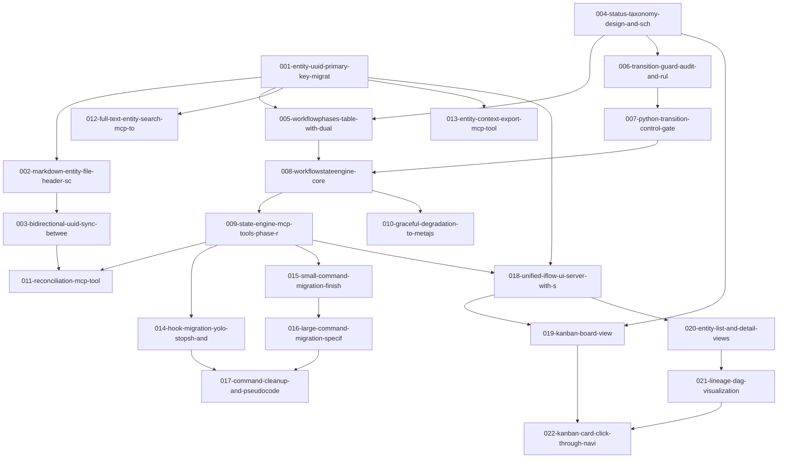

# Roadmap: iflow Architectural Evolution

<!-- Arrow: prerequisite (A before B) -->

## Dependency Graph

## Execution Order

1. **004-status-taxonomy-design-and-sch** -- Status taxonomy design and schema ADR (depends on: none)
2. **001-entity-uuid-primary-key-migrat** -- Entity UUID primary key migration (depends on: none)
3. **013-entity-context-export-mcp-tool** -- Entity context export MCP tool (depends on: 001)
4. **012-full-text-entity-search-mcp-to** -- Full-text entity search MCP tool (depends on: 001)
5. **006-transition-guard-audit-and-rul** -- Transition guard audit and rule inventory (depends on: 004)
6. **005-workflowphases-table-with-dual** -- WorkflowPhases table with dual-dimension status (depends on: 004, 001)
7. **002-markdown-entity-file-header-sc** -- Markdown entity file header schema (depends on: 001)
8. **007-python-transition-control-gate** -- Python transition control gate (depends on: 006)
9. **003-bidirectional-uuid-sync-betwee** -- Bidirectional UUID sync between files and DB (depends on: 002)
10. **008-workflowstateengine-core** -- WorkflowStateEngine core (depends on: 007, 005)
11. **010-graceful-degradation-to-metajs** -- Graceful degradation to .meta.json (depends on: 008)
12. **009-state-engine-mcp-tools-phase-r** -- State Engine MCP tools — phase read/write (depends on: 008)
13. **018-unified-iflow-ui-server-with-s** -- Unified iflow-UI server with SSE (depends on: 009, 001)
14. **015-small-command-migration-finish** -- Small command migration — finish-feature, show-status (depends on: 009)
15. **014-hook-migration-yolo-stopsh-and** -- Hook migration — yolo-stop.sh and state-writing hooks (depends on: 009)
16. **011-reconciliation-mcp-tool** -- Reconciliation MCP tool (depends on: 009, 003)
17. **020-entity-list-and-detail-views** -- Entity list and detail views (depends on: 018)
18. **019-kanban-board-view** -- Kanban board view (depends on: 018, 004)
19. **016-large-command-migration-specif** -- Large command migration — specify, design, create-plan, create-tasks, implement (depends on: 015)
20. **021-lineage-dag-visualization** -- Lineage DAG visualization (depends on: 020)
21. **017-command-cleanup-and-pseudocode** -- Command cleanup and pseudocode removal (depends on: 016, 014)
22. **022-kanban-card-click-through-navi** -- Kanban card click-through navigation (depends on: 019, 021)

## Milestones

### M0: Identity and Taxonomy Foundations

- 001-entity-uuid-primary-key-migrat
- 002-markdown-entity-file-header-sc
- 003-bidirectional-uuid-sync-betwee
- 004-status-taxonomy-design-and-sch
- 005-workflowphases-table-with-dual

### M1: Transition Guard Foundation

- 006-transition-guard-audit-and-rul
- 007-python-transition-control-gate

### R1-P1: State Engine Foundation

- 008-workflowstateengine-core
- 009-state-engine-mcp-tools-phase-r
- 010-graceful-degradation-to-metajs

### R1-P2: Command and Hook Migration

- 014-hook-migration-yolo-stopsh-and
- 015-small-command-migration-finish
- 016-large-command-migration-specif
- 017-command-cleanup-and-pseudocode

### R1-P3: Entity DB Capabilities and Reconciliation

- 011-reconciliation-mcp-tool
- 012-full-text-entity-search-mcp-to
- 013-entity-context-export-mcp-tool

### R2-P4-Core: Unified UI Server and Kanban

- 018-unified-iflow-ui-server-with-s
- 019-kanban-board-view

### R2-P4-Complete: Entity Explorer and Click-Through

- 020-entity-list-and-detail-views
- 021-lineage-dag-visualization
- 022-kanban-card-click-through-navi

## Cross-Cutting Concerns

- NFR-1: All state transitions must be deterministic Python — no LLM-driven state changes
- NFR-2: Zero-downtime migration with graceful degradation fallback to .meta.json
- NFR-3: iflow-ui communicates with State Engine via MCP protocol — no code-level import
- NFR-4: All transitions (forward and backward) logged to entity DB as audit trail
- NFR-5: Sub-100ms response for state queries
- NFR-7: Test regression checks required for each migration step
- UUID canonical identity: UUID v4 as primary key; text-based type:id becomes display-only
- Dual-read compatibility: Support both text-id and UUID lookups during migration period
- Status taxonomy ADR prerequisite: Research-backed ADR must be approved before implementing status columns
- Transition guard audit prerequisite: Complete inventory of all current guards before encoding in Python
- transition_gate.py as single source of truth: All transition rules in one deterministic Python module
- Schema versioning: Lightweight schema_version migrations table (not Alembic) for entity DB changes
- Migration surface audit: 148+ .meta.json references across 34+ command and hook files
- DB schema ownership: Entity registry owns the schema — no direct SQL from commands or skills
- Flexible entity hierarchy: Entity type system supports arbitrary nesting (project > feature > subtask) without rigid Jira-like constraints
- Bidirectional sync invariant: UUID in MD file header = foreign key to DB record; file renames don't break linkage
