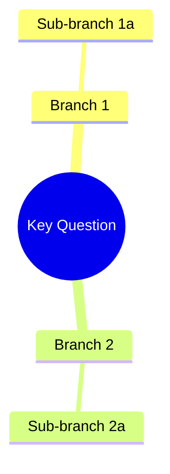

# Brainstorming Phase

Guide divergent thinking through a structured 7-stage process that produces a PRD.

## Getting Started

### 1. Create Scratch File

- Get topic from user argument or ask: "What would you like to brainstorm?"
- Generate slug from topic:
  - Lowercase
  - Replace spaces/special chars with hyphens
  - Max 30 characters
  - Trim trailing hyphens
  - If empty, use "untitled"
- Create file: `docs/brainstorms/YYYYMMDD-HHMMSS-{slug}.prd.md`
  - Example: `docs/brainstorms/20260129-143052-api-caching.prd.md`

### 2. Run 7-Stage Process

Follow the Process below, writing content to the PRD file as you go.

## Process

The brainstorm follows 7 stages in sequence:

```
Stage 1: CLARIFY → Stage 2: RESEARCH → Stage 3: DRAFT PRD
                                                    ↓
                                        Stage 4: CRITICAL REVIEW (prd-reviewer)
                                                    ↓
                                        Stage 5: AUTO-CORRECT
                                                    ↓
                                        Stage 6: READINESS CHECK (brainstorm-reviewer)
                                                    ↓
                                        Stage 7: USER DECISION
```

---
### Stage 1: CLARIFY

**Goal:** Resolve ambiguities through Q&A before research begins.

**Rules:**
- Ask ONE question at a time
- Use AskUserQuestion with multiple choice options when possible
- Apply YAGNI: challenge "nice to have" features

**Required information to gather:**
1. Problem being solved
2. Target user/audience
3. Success criteria
4. Known constraints
5. Approaches already considered

**Exit condition:** User confirms understanding is correct, OR you have answers to all 5 required items.

**After exit condition is satisfied, always run Steps 6-8 before proceeding to Stage 2:**

#### Step 6: Problem Type Classification
Present problem type options via AskUserQuestion:
```
AskUserQuestion:
  questions: [{
    "question": "What type of problem is this?",
    "header": "Problem Type",
    "options": [
      {"label": "Product/Feature", "description": "User-facing product or feature design"},
      {"label": "Technical/Architecture", "description": "System design, infrastructure, or technical debt"},
      {"label": "Financial/Business", "description": "Business model, pricing, or financial analysis"},
      {"label": "Research/Scientific", "description": "Hypothesis-driven investigation or experiment"},
      {"label": "Creative/Design", "description": "Visual, UX, or creative exploration"},
      {"label": "Skip", "description": "No framework — proceed with standard brainstorm"}
    ],
    "multiSelect": false
  }]
```

(User sees 7 options: 6 above + built-in "Other" for free text.)

#### Step 7: Optional Framework Loading
**If user selected a named type (not "Skip"):**
1. Derive sibling skill path: replace `skills/brainstorming` in Base directory with `skills/structured-problem-solving`
2. Read `{derived path}/SKILL.md` via Read tool
3. If file not found: warn "Structured problem-solving skill not found, skipping framework" → skip to Step 8
4. Read reference files as directed by SKILL.md
5. Apply SCQA framing to the problem
6. Apply type-specific decomposition (or generic issue tree for "Other")
7. Generate inline Mermaid mind map from decomposition
8. Write `## Structured Analysis` section to PRD (between Research Summary and Review History)

**If user selected "Other" (free text):**
- Apply SCQA framing (universal) + generic issue tree decomposition
- Store custom type string as-is

**If "Skip":** Set type to "none", skip Step 7 body entirely.

**Loop-back behavior:** If `## Structured Analysis` already exists in the PRD (from a previous Stage 7 → Stage 1 loop), delete it entirely before re-running Steps 6-8. Do NOT duplicate.

#### Step 8: Store Problem Type
- Add `- Problem Type: {type}` to PRD Status section (or `none` if skipped)

#### Step 9: Domain Selection
Present domain options via AskUserQuestion:
```
AskUserQuestion:
  questions: [{
    "question": "Does this concept have a specific domain?",
    "header": "Domain",
    "options": [
      {"label": "Game Design", "description": "Apply game design frameworks (core loop, engagement, aesthetics, viability)"},
      {"label": "None", "description": "No domain-specific analysis"}
    ],
    "multiSelect": false
  }]
```
If "None": skip Step 10, proceed to Stage 2.

#### Step 10: Domain Loading
1. Derive sibling skill path: replace `skills/brainstorming` in Base directory with `skills/game-design`
2. Read `{derived path}/SKILL.md` via Read tool
3. If file not found: warn "Game design skill not found, skipping domain enrichment" → skip to Stage 2
4. Execute the game-design skill inline (read reference files, apply frameworks to concept)
5. **Two-phase write:** Hold analysis in memory — do NOT write to PRD yet. Stage 3 writes it during PRD drafting.
6. Store domain review criteria (from skill output) for Stage 6 dispatch
7. Store `domain: game-design` context for Stage 2 query enhancement

**Loop-back behavior:** If `## Game Design Analysis` already exists in the PRD (from a previous Stage 7 → Stage 1 loop), delete it entirely, clear domain context, and re-prompt Step 9.

---
### Stage 2: RESEARCH

**Goal:** Gather evidence from 3 sources in parallel.

**Action:** Dispatch 3 Task tool calls in a single response:

1. **Internet research:**
   - Tool: `Task`
   - subagent_type: `iflow-dev:internet-researcher`
   - prompt: Query about the topic with context
   - **If `domain: game-design` active**, append to prompt:
     - "Research current game engines/platforms suitable for this concept"
     - If tech-evaluation-criteria.md was loaded: "Evaluate against these dimensions: {dimensions from file}"
     - "Include current market data for the game's genre/platform"

2. **Codebase exploration:**
   - Tool: `Task`
   - subagent_type: `iflow-dev:codebase-explorer`
   - prompt: Query about existing patterns/constraints

3. **Skills search:**
   - Tool: `Task`
   - subagent_type: `iflow-dev:skill-searcher`
   - prompt: Query about related capabilities

**Collect results:** Each agent returns JSON with `findings` array and `source` references.

**Fallback:** If an agent fails, note warning and proceed with available results.

**Exit condition:** All 3 agents have returned (success or failure).

---
### Stage 3: DRAFT PRD

**Goal:** Generate a complete PRD document with evidence citations.

**Action:** Write PRD to file using the PRD Output Format section below.

**Citation requirements:** Every claim must have one of:
- `— Evidence: {URL}` (from internet research)
- `— Evidence: {file:line}` (from codebase)
- `— Evidence: User input` (from Stage 1)
- `— Assumption: needs verification` (unverified)

**Exit condition:** PRD file written with all sections populated.

---
### Stage 4: CRITICAL REVIEW

**Goal:** Challenge PRD quality using prd-reviewer agent.

**Action:** Dispatch Task tool:
- Tool: `Task`
- subagent_type: `iflow-dev:prd-reviewer`
- prompt: Full PRD content + request for JSON response

**Expected response:**
```json
{ "approved": true/false, "issues": [...], "summary": "..." }
```

**Fallback:** If reviewer unavailable, show warning and proceed to Stage 5 with empty issues array.

**Exit condition:** Reviewer response received and parsed.

---
### Stage 5: AUTO-CORRECT

**Goal:** Apply actionable improvements from the review.

**For each issue in the issues array:**

1. If `severity: "blocker"` or `severity: "warning"`:
   - Determine if fix is actionable (has `suggested_fix`)
   - Apply the fix to the PRD content
   - Record: `Changed: {what} — Reason: {issue description}`

2. If `severity: "suggestion"`:
   - Consider but don't require action
   - Record if applied

**Update the PRD file** with all corrections.

**Add to Review History section:**
```markdown
### Review 1 ({date})
**Findings:**
- [{severity}] {description} (at: {location})

**Corrections Applied:**
- {what changed} — Reason: {reference to finding}
```

**Exit condition:** All actionable issues addressed and PRD file updated.

---
### Stage 6: READINESS CHECK

**Goal:** Validate brainstorm is ready for feature promotion (first quality gate).

**Action:** Dispatch Task tool:
- Tool: `Task`
- subagent_type: `iflow-dev:brainstorm-reviewer`
- prompt: |
    Review this brainstorm for promotion readiness.

    ## PRD Content
    {read PRD file and paste full markdown content here}

    ## Context
    Problem Type: {type from Step 8, or "none" if skipped/absent}
    {If domain context exists, add:}
    Domain: game-design
    Domain Review Criteria:
    - Core loop defined?
    - Monetization risks stated?
    - Aesthetic direction articulated?
    - Engagement hooks identified?

    Return your assessment as JSON:
    { "approved": true/false, "issues": [...], "summary": "..." }

**Expected response:**
```json
{ "approved": true/false, "issues": [...], "summary": "..." }
```

**Store result:** Keep `approved` status and `issues` for Stage 7.

**Fallback:** If reviewer unavailable, show warning and proceed with `approved: unknown`.

**Exit condition:** Readiness status determined.

---
### Stage 7: USER DECISION

**Goal:** Present readiness status and let user decide next action.

**Step 1: Display readiness status**
- If `approved: true` with no blockers: Output "Readiness check: PASSED"
- If `approved: true` with warnings: Output "Readiness check: PASSED ({n} warnings)" + list warnings
- If `approved: false`: Output "Readiness check: BLOCKED ({n} issues)" + list all issues
- If `approved: unknown`: Output "Readiness check: SKIPPED (reviewer unavailable)"

**Step 2: Present options based on status**
If PASSED or SKIPPED:
```
AskUserQuestion:
  questions: [{
    "question": "PRD complete. What would you like to do?",
    "header": "Decision",
    "options": [
      {"label": "Promote to Feature", "description": "Create feature and continue workflow"},
      {"label": "Refine Further", "description": "Loop back to clarify and improve"},
      {"label": "Save and Exit", "description": "Keep PRD, end session"}
    ],
    "multiSelect": false
  }]
```

If BLOCKED:
```
AskUserQuestion:
  questions: [{
    "question": "PRD has blockers. What would you like to do?",
    "header": "Decision",
    "options": [
      {"label": "Address Issues", "description": "Loop back to clarify and fix blockers"},
      {"label": "Promote Anyway", "description": "Create feature despite blockers"},
      {"label": "Save and Exit", "description": "Keep PRD, end session"}
    ],
    "multiSelect": false
  }]
```

**Step 3: Handle response**

| Response | Action |
|----------|--------|
| Promote to Feature / Promote Anyway | Ask for mode → Invoke `/iflow-dev:create-feature --prd={current-prd-path}` → STOP |
| Refine Further / Address Issues | Loop back to Stage 1 with issue context |
| Save and Exit | Output "PRD saved to {filepath}." → STOP |

**Mode selection (when promoting):**
```
AskUserQuestion:
  questions: [{
    "question": "Which workflow mode?",
    "header": "Mode",
    "options": [
      {"label": "Standard", "description": "All phases, optional verification"},
      {"label": "Full", "description": "All phases, required verification"}
    ],
    "multiSelect": false
  }]
```

---
## PRD Output Format
Write to `docs/brainstorms/YYYYMMDD-HHMMSS-{slug}.prd.md`:

```markdown
# PRD: {Feature Name}

## Status
- Created: {date}
- Last updated: {date}
- Status: Draft
- Problem Type: {type or "none" if skipped}

## Problem Statement
{What problem are we solving? Why does it matter?}
### Evidence
- {Source}: {Finding that supports this problem exists}

## Goals
1. {Goal 1}
2. {Goal 2}

## Success Criteria
- [ ] {Measurable criterion 1}

## User Stories
### Story 1: {Title}
**As a** {role} **I want** {capability} **So that** {benefit}
**Acceptance criteria:**
- {criterion}

## Use Cases
### UC-1: {Title}
**Actors:** {who} | **Preconditions:** {what must be true}
**Flow:** 1. {step} 2. {step}
**Postconditions:** {what is true after}
**Edge cases:** {edge case with handling}

## Edge Cases & Error Handling
| Scenario | Expected Behavior | Rationale |
|----------|-------------------|-----------|
| {case}   | {behavior}        | {why}     |

## Constraints
### Behavioral Constraints (Must NOT do)
- {Behavior to avoid} — Rationale: {why this would be harmful}
### Technical Constraints
- {Technical limitation} — Evidence: {source}

## Requirements
### Functional
- FR-1: {requirement}
### Non-Functional
- NFR-1: {requirement}

## Non-Goals
- {Non-goal} — Rationale: {why we're explicitly not pursuing this}

## Out of Scope (This Release)
- {Item} — Future consideration: {when/why it might be added}

## Research Summary
### Internet Research
- {Finding} — Source: {URL/reference}
### Codebase Analysis
- {Pattern/constraint found} — Location: {file:line}
### Existing Capabilities
- {Relevant skill/feature} — How it relates: {explanation}

## Structured Analysis
*(Only included when Problem Type is not "none")*
### Problem Type
{type} — {one-line description of why this type was selected}
### SCQA Framing
- **Situation:** {current state}
- **Complication:** {what changed / what's wrong}
- **Question:** {the key question to answer}
- **Answer:** {proposed direction}
### Decomposition
{Type-specific decomposition tree (text)}
### Mind Map


## Game Design Analysis
*(Only included when game-design domain is active)*

### Game Design Overview
- **Core Loop:** {core gameplay loop}
- **MDA Analysis:** Mechanics → Dynamics → Aesthetics
- **Player Types:** {primary Bartle type} — {rationale}
- **Genre-Mechanic Fit:** {genre} — {alignment assessment}

### Engagement & Retention
- **Hook Model:** Trigger → Action → Reward → Investment
- **Progression:** {type} — {mechanics}
- **Social Features:** {features or "single-player focus"}
- **Retention Strategy:** {D1/D7/D30 approach}

### Aesthetic Direction
- **Art Style:** {style} — {rationale}
- **Audio Design:** {approach}
- **Game Feel/Juice:** {key elements}
- **Mood:** {tone} — {reinforcement}

### Feasibility & Viability
- **Monetization Options:** {models with risk flags}
- **Market Context:** {landscape and sizing}
- **Platform Considerations:** {evaluation dimensions}

## Review History
{Added by Stage 5 auto-correct}

## Open Questions
- {Question that needs resolution}

## Next Steps
Ready for /iflow-dev:create-feature to begin implementation.
```

---
## Error Handling

- **WebSearch Unavailable:** Skip internet research with warning, proceed with codebase and skills research only
- **Agent Unavailable:** Show warning "{agent} unavailable, proceeding without", continue with available agents
- **All Research Fails:** Proceed with user input only, mark all claims as "Assumption: needs verification"
- **PRD Reviewer Unavailable:** Show warning, proceed directly to Stage 5 with empty issues array
- **Brainstorm Reviewer Unavailable:** Show warning, proceed directly to Stage 7 with `approved: unknown`

---
## Completion
After Stage 7, if user chooses "Promote to Feature":
1. Ask for workflow mode (Standard/Full)
2. Invoke `/iflow-dev:create-feature --prd={prd-file-path}` with the PRD path

---
## PROHIBITED Actions
When executing the brainstorming skill, you MUST NOT:
- Proceed to /iflow-dev:specify, /iflow-dev:design, /iflow-dev:create-plan, or /iflow-dev:implement
- Write any implementation code
- Create feature folders directly (use /iflow-dev:create-feature)
- Continue with any action after user says "Save and Exit"
- Skip the research stage (Stage 2)
- Skip the critical review stage (Stage 4)
- Skip the readiness check stage (Stage 6)
- Skip the AskUserQuestion decision gate (Stage 7)
