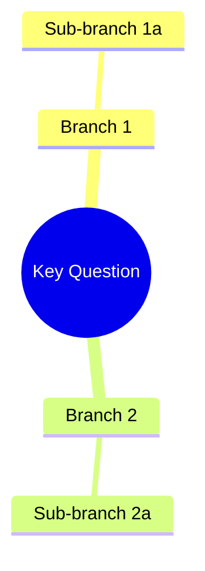

# PRD Output Format Template

Write to `docs/brainstorms/YYYYMMDD-HHMMSS-{slug}.prd.md`:

```markdown
# PRD: {Feature Name}

## Status
- Created: {date}
- Last updated: {date}
- Status: Draft
- Problem Type: {type or "none" if skipped}
- Archetype: {archetype or "none"}

## Problem Statement
{What problem are we solving? Why does it matter?}
### Evidence
- {Source}: {Finding that supports this problem exists}

## Goals
1. {Goal 1}
2. {Goal 2}

## Success Criteria
- [ ] {Measurable criterion 1}

## User Stories
### Story 1: {Title}
**As a** {role} **I want** {capability} **So that** {benefit}
**Acceptance criteria:**
- {criterion}

## Use Cases
### UC-1: {Title}
**Actors:** {who} | **Preconditions:** {what must be true}
**Flow:** 1. {step} 2. {step}
**Postconditions:** {what is true after}
**Edge cases:** {edge case with handling}

## Edge Cases & Error Handling
| Scenario | Expected Behavior | Rationale |
|----------|-------------------|-----------|
| {case}   | {behavior}        | {why}     |

## Constraints
### Behavioral Constraints (Must NOT do)
- {Behavior to avoid} — Rationale: {why this would be harmful}
### Technical Constraints
- {Technical limitation} — Evidence: {source}

## Requirements
### Functional
- FR-1: {requirement}
### Non-Functional
- NFR-1: {requirement}

## Non-Goals
- {Non-goal} — Rationale: {why we're explicitly not pursuing this}

## Out of Scope (This Release)
- {Item} — Future consideration: {when/why it might be added}

## Research Summary
### Internet Research
- {Finding} — Source: {URL/reference}
### Codebase Analysis
- {Pattern/constraint found} — Location: {file:line}
### Existing Capabilities
- {Relevant skill/feature} — How it relates: {explanation}

## Structured Analysis
*(Only included when Problem Type is not "none")*
### Problem Type
{type} — {one-line description of why this type was selected}
### SCQA Framing
- **Situation:** {current state}
- **Complication:** {what changed / what's wrong}
- **Question:** {the key question to answer}
- **Answer:** {proposed direction}
### Decomposition
{Type-specific decomposition tree (text)}
### Mind Map


## Strategic Analysis
*(Advisory team perspectives. Each subsection is one advisor's analysis field, with evidence quality appended by Stage 3.)*

### {Advisor Name}
- **Core Finding:** {one-sentence summary}
- **Analysis:** {2-3 paragraphs from advisor's perspective}
- **Key Risks:** {risks identified}
- **Recommendation:** {what to do about findings}
- **Evidence Quality:** {strong/moderate/weak/speculative}

*(Repeat for each advisor in the team)*

<!-- Archetype-specific sections (include based on archetype from archetypes.md):
  - fixing-something-broken: Symptoms, Reproduction Steps, Hypotheses, Evidence Map
  - exploring-an-idea / deciding-between-options: Options Evaluated, Decision Matrix
  - improving-existing-work: Current State Assessment, Change Impact, Migration Path
  - new-product-or-business: Market Context, Competitive Landscape, Risk Factors
-->

## Review History
{Added by Stage 5 auto-correct}

## Open Questions
- {Question that needs resolution}

## Next Steps
Ready for /iflow-dev:create-feature to begin implementation.
```
