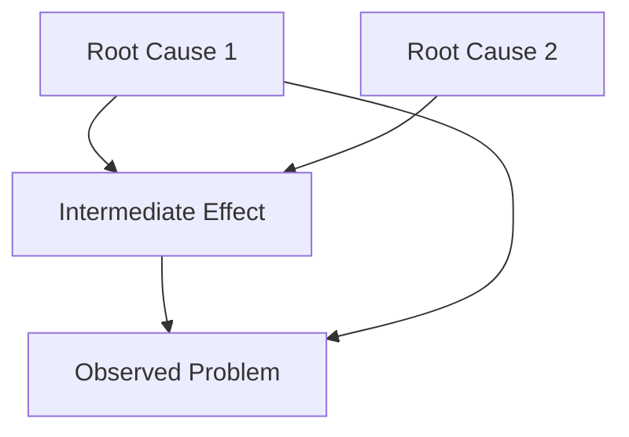
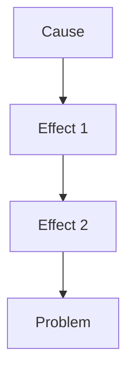
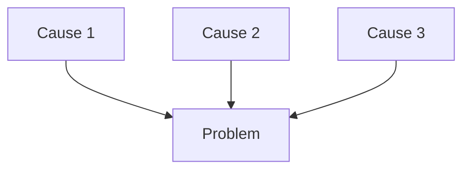
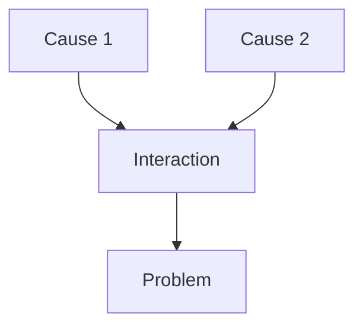
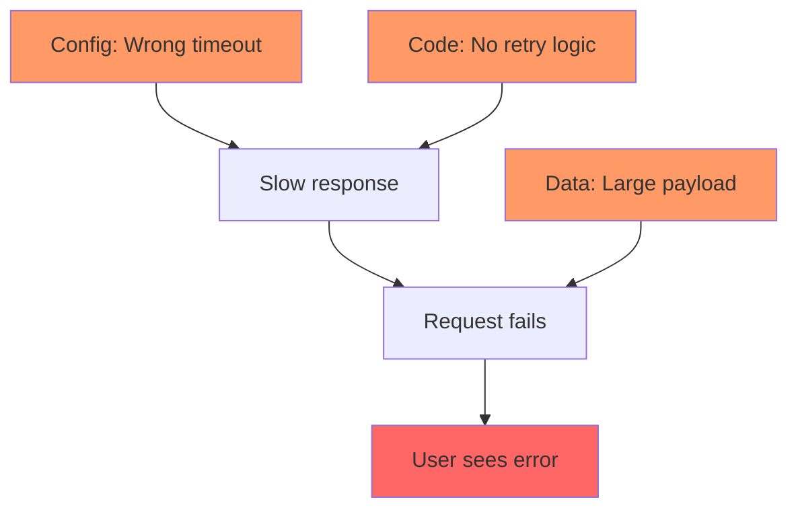

# Causal DAG (Directed Acyclic Graph)

A DAG represents causal relationships as directed edges from causes to effects. Unlike linear chains, DAGs capture:
- Multiple causes leading to one effect
- One cause leading to multiple effects
- Interaction effects where causes combine

## Cause Categories Checklist

Use this checklist to ensure you've considered all potential cause categories:

| Category | What to Check | Examples |
|----------|---------------|----------|
| **Code** | Logic errors, race conditions, edge cases | Off-by-one, null handling, async bugs |
| **Config** | Settings, environment variables, feature flags | Wrong env, missing config, typos |
| **Data** | Input validation, data corruption, schema | Bad input, migration issues, encoding |
| **Environment** | OS, runtime, network, resources | Memory, disk, network timeouts |
| **Dependencies** | Libraries, APIs, services | Version mismatch, API changes, outages |
| **Integration** | Component boundaries, protocols | Contract violations, timing issues |

## Mermaid DAG Template

## DAG Patterns

### Linear Chain

### Multiple Independent Causes

### Interaction Effect (Causes Combine)

### Complex (Real-World)

## Reading a Causal DAG

- **Root causes** have no incoming edges (leftmost nodes)
- **The problem** has no outgoing edges (rightmost node)
- **Paths** from root causes to problem show causal chains
- **Convergent nodes** indicate interaction effects
