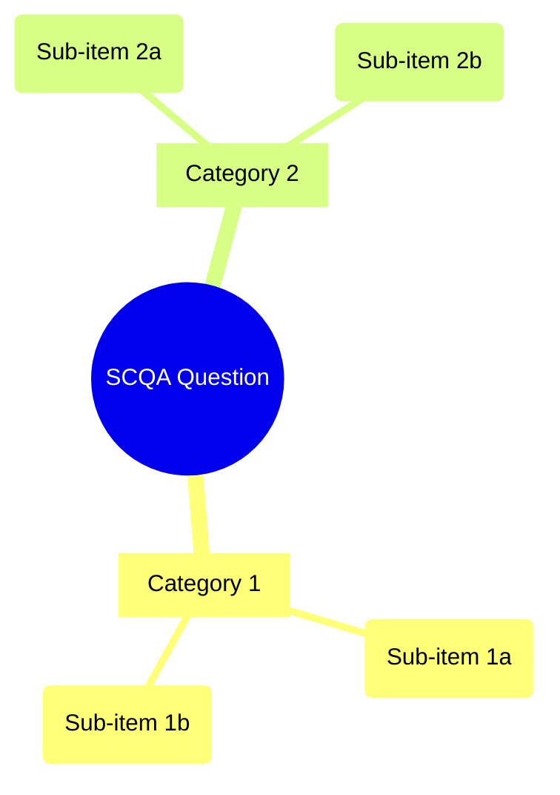
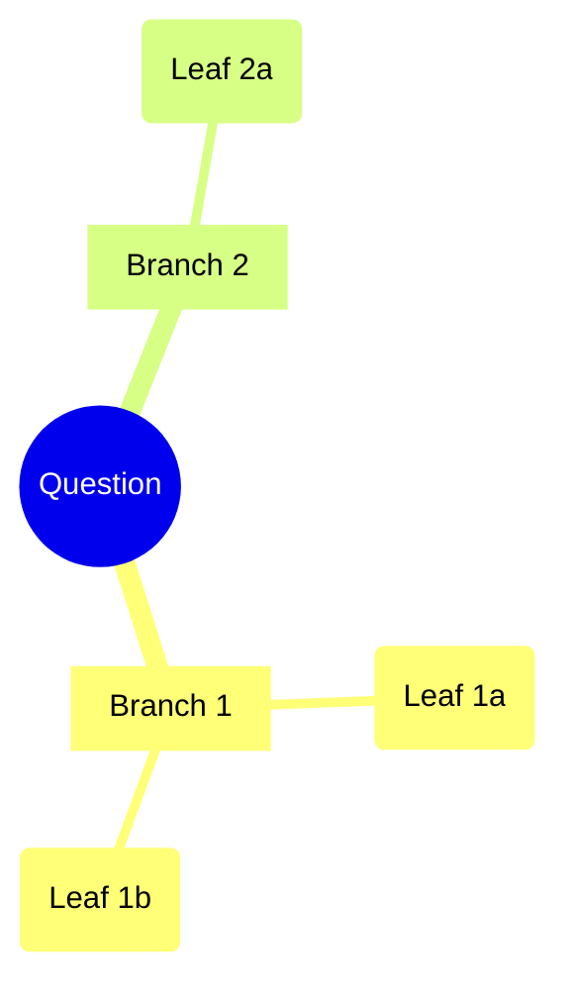

# Structured Problem-Solving

Apply SCQA framing and type-specific decomposition to produce a structured analysis for PRD insertion. This skill is invoked by the brainstorming skill (Stage 1, Step 7) — not standalone.

## Input

From the brainstorming Stage 1 context:
- **problem_type** — user's selection from Step 6 (e.g., "product/feature", "technical/architecture", or custom string from "Other")
- **problem_statement** — from Step 1 item 1
- **context** — target_user (item 2), success_criteria (item 3), constraints (item 4), approaches_considered (item 5)

## Process

### 1. SCQA Framing

Read [scqa-framing.md](references/scqa-framing.md) for the template and type-specific guidance.

Apply to the problem regardless of type:
1. Write the **Situation** (established context)
2. Write the **Complication** (what changed / what's wrong)
3. Derive the **Question** (flows from the complication)
4. Propose the **Answer** (direction or hypothesis)

The Question becomes the root node for decomposition.

### 2. Type-Specific Decomposition

Read [problem-types.md](references/problem-types.md) to look up the selected type's decomposition method.
Read [decomposition-methods.md](references/decomposition-methods.md) for the method's tree format and constraints.

Apply the matching method:
- **product/feature** → MECE Decomposition
- **technical/architecture** → Issue Tree
- **financial/business** → MECE Decomposition
- **research/scientific** → Hypothesis Tree
- **creative/design** → Design Space Exploration
- **Other (custom string)** → Generic Issue Tree

Build a tree with 2-3 levels depth, 2-5 items per layer.

### 3. Mind Map Generation

Convert the decomposition tree to a Mermaid mindmap. Write as an inline fenced code block (no MCP tool dependency).

**Syntax:**
```

```

**Shape conventions:**
- `((text))` — root node (circle, the SCQA Question)
- `[text]` — top-level branches (square, categories from decomposition)
- `(text)` — leaf nodes (rounded, specific items)

**Depth:** 2-3 levels maximum for readability.

## Output

Return a `## Structured Analysis` section with 4 subsections for PRD insertion:

```markdown
## Structured Analysis

### Problem Type
{type} — {one-line rationale for type selection}

### SCQA Framing
- **Situation:** {current state}
- **Complication:** {what changed / what's wrong}
- **Question:** {the key question to answer}
- **Answer:** {proposed direction}

### Decomposition
{Text tree using the type-specific method}

### Mind Map

```

Insert this section in the PRD between `## Research Summary` and `## Review History`.

## Graceful Degradation

If reference files are missing (e.g., cross-skill Read fails):

1. **Warn:** "Reference files not found, applying SCQA framing only"
2. **Apply hardcoded SCQA fallback:**
   - **Situation:** {Describe the current state}
   - **Complication:** {What changed or what's wrong}
   - **Question:** {The key question to answer}
   - **Answer:** {The proposed direction}
3. **Skip decomposition and mind map** — the Structured Analysis section will contain only Problem Type and SCQA Framing subsections
