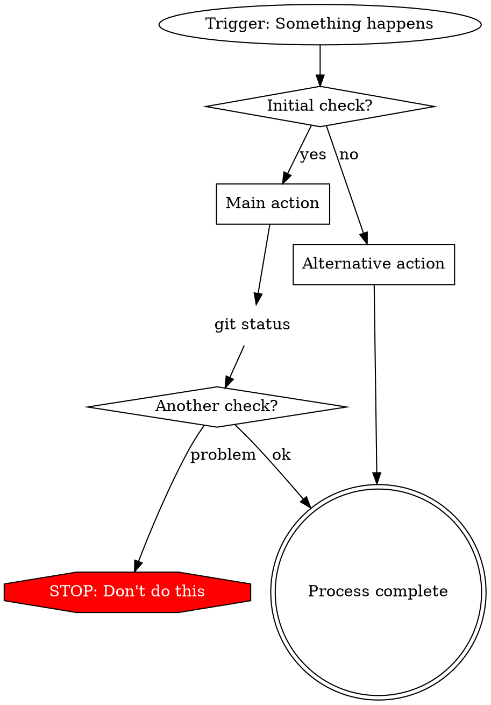
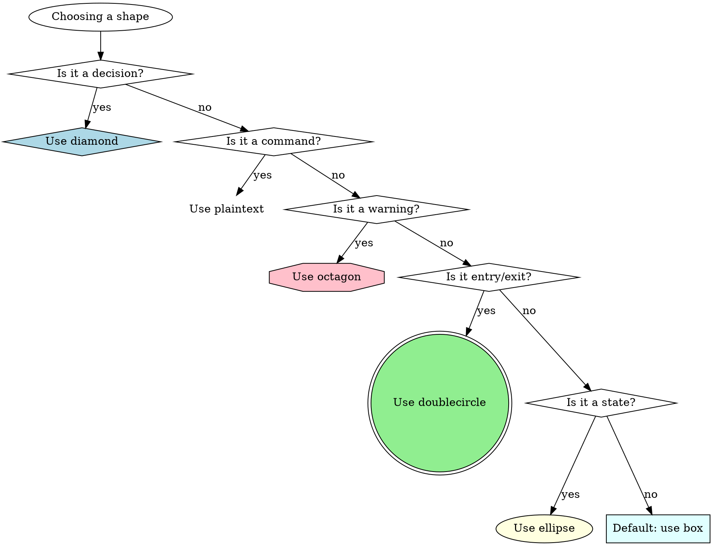
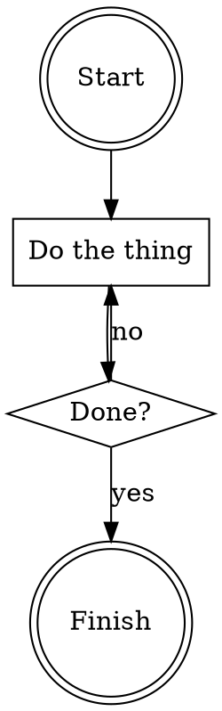

# Graphviz Conventions for Process Diagrams

Style guide for creating process flow diagrams in skills using DOT language.

## Node Types and Shapes

| Node Type | Shape | Example |
|-----------|-------|---------|
| Questions/Decisions | diamond | `"Is test passing?" [shape=diamond]` |
| Actions | box (default) | `"Write test first" [shape=box]` |
| Commands | plaintext | `"npm test" [shape=plaintext]` |
| States | ellipse | `"I am stuck" [shape=ellipse]` |
| Warnings | octagon (red) | `"NEVER do X" [shape=octagon, style=filled, fillcolor=red, fontcolor=white]` |
| Entry/Exit | doublecircle | `"Process complete" [shape=doublecircle]` |

## Edge Labels

### Binary Decisions

```dot
"Binary decision?" [shape=diamond];
"Yes path" [shape=box];
"No path" [shape=box];

"Binary decision?" -> "Yes path" [label="yes"];
"Binary decision?" -> "No path" [label="no"];
```

### Multiple Choices

```dot
"Multiple choice?" [shape=diamond];
"Option A" [shape=box];
"Option B" [shape=box];
"Option C" [shape=box];

"Multiple choice?" -> "Option A" [label="condition A"];
"Multiple choice?" -> "Option B" [label="condition B"];
"Multiple choice?" -> "Option C" [label="otherwise"];
```

### Process Triggers

```dot
"Process A done" [shape=doublecircle];
"Process B starts" [shape=doublecircle];

"Process A done" -> "Process B starts" [label="triggers", style=dotted];
```

## Naming Patterns

### Questions (End with ?)

- "Should I do X?"
- "Can this be Y?"
- "Is Z true?"
- "Have I done W?"

### Actions (Start with verb)

- "Write the test"
- "Search for patterns"
- "Commit changes"
- "Ask for help"

### Commands (Literal text)

- "grep -r 'pattern' ."
- "git status"
- "npm run build"

### States (Describe situation)

- "Test is failing"
- "Build complete"
- "Stuck on error"

## Process Structure Template



## Shape Selection Flowchart



## Good vs Bad Examples

### Good: Specific and Shaped Correctly

```dot
"Test failed" [shape=ellipse];
"Read error message" [shape=box];
"Can reproduce?" [shape=diamond];
"git diff HEAD~1" [shape=plaintext];
"NEVER ignore errors" [shape=octagon, style=filled, fillcolor=red, fontcolor=white];

"Test failed" -> "Read error message";
"Read error message" -> "Can reproduce?";
"Can reproduce?" -> "git diff HEAD~1" [label="yes"];
```

### Bad: Vague and Wrong Shapes

```dot
// DON'T DO THIS
"Something wrong" [shape=box];      // Should be ellipse (state)
"Fix it" [shape=box];               // Too vague
"Check" [shape=box];                // Should be diamond (decision)
"Run command" [shape=box];          // Should be plaintext with actual command
```

## Using Diagrams in SKILL.md

Embed diagrams using fenced code blocks:

````markdown
## Process Flow


````

## Rendering Diagrams

Use `scripts/render-graphs.js` to convert DOT blocks to SVG:

```bash
# Render each diagram separately
./scripts/render-graphs.js /path/to/skill-directory

# Combine all diagrams into one
./scripts/render-graphs.js /path/to/skill-directory --combine
```

Output goes to `skill-directory/diagrams/`.
