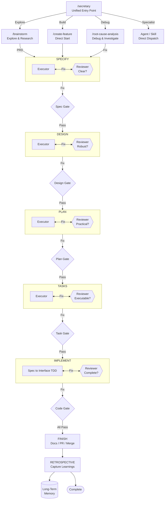

# iflow Plugin

Structured feature development workflow with skills, agents, and commands for methodical development from ideation to implementation.




## Components

| Type | Count |
|------|-------|
| Skills | 29 |
| Agents | 28 |
| Commands | 28 |
| Hooks | 11 |
| MCP Tools | 8 |

## Commands

**Start:**
| Command | Description |
|---------|-------------|
| `/iflow:brainstorm [topic]` | 7-stage PRD creation with research subagents and domain enrichment |
| `/iflow:create-feature <desc>` | Start building (creates folder + branch) |

**Build phases** (run in order):
| Command | Output |
|---------|--------|
| `/iflow:specify [--feature=ID]` | spec.md |
| `/iflow:design` | design.md (4-stage workflow) |
| `/iflow:create-plan` | plan.md |
| `/iflow:create-tasks` | tasks.md |
| `/iflow:implement` | Code changes |
| `/iflow:finish-feature` | Merge, retro, cleanup (iflow features) |
| `/iflow:wrap-up` | Wrap up implementation - review, retro, merge or PR |

**Anytime:**
| Command | Purpose |
|---------|---------|
| `/iflow:show-lineage` | Display entity lineage tree for the current feature branch or a specified entity |
| `/iflow:show-status` | See current feature state |
| `/iflow:list-features` | See all active features |
| `/iflow:retrospect` | Capture learnings |
| `/iflow:add-to-backlog <idea>` | Capture ideas for later |
| `/iflow:cleanup-brainstorms` | Delete old scratch files |
| `/iflow:sync-cache` | Reload plugin after changes |
| `/iflow:secretary` | Intelligent task routing to commands, agents, and skills |
| `/iflow:root-cause-analysis` | Investigate bugs and failures to find all root causes |
| `/iflow:create-project <prd>` | Create project from PRD with AI-driven decomposition |
| `/iflow:create-specialist-team` | Create ephemeral specialist teams for complex tasks |
| `/iflow:init-ds-project <name>` | Scaffold a new data science project |
| `/iflow:promptimize [file-path or inline text]` | Review a prompt against best practices and return an improved version |
| `/iflow:refresh-prompt-guidelines` | Scout latest prompt engineering best practices and update the guidelines document |
| `/iflow:review-ds-analysis <file>` | Review data analysis for statistical pitfalls |
| `/iflow:review-ds-code <file>` | Review DS Python code for anti-patterns |
| `/iflow:generate-docs` | Generate three-tier documentation scaffold or update existing docs |
| `/iflow:remember` | Capture a learning to long-term memory for future session recall |
| `/iflow:yolo [on\|off]` | Toggle YOLO autonomous mode |

## Review System

The iflow workflow uses a two-tier review pattern for quality assurance:

### Two-Tier Review Pattern

| Component | Role | Question |
|-----------|------|----------|
| **Phase Skeptic** | Challenges artifact quality | "Is this artifact robust?" |
| **Phase Reviewer** | Validates handoff completeness | "Can the next phase proceed?" |

### Specify Phase Workflow

```
spec-reviewer (Skeptic) → "Is spec testable and bounded?"
    ↓
phase-reviewer (Gatekeeper) → "Has what design needs?"
```

### Design Phase Workflow

The `/iflow:design` command uses a 5-stage workflow for robust design artifacts:

```
Stage 0: PRIOR ART RESEARCH → Existing solutions, patterns, standards, evidence gathering
    ↓
Stage 1: ARCHITECTURE DESIGN → High-level structure, components, evidence-grounded decisions, risks
    ↓
Stage 2: INTERFACE DESIGN → Precise contracts between components
    ↓
Stage 3: DESIGN REVIEW LOOP → design-reviewer challenges assumptions using independent verification (1-3 iterations)
    ↓
Stage 4: HANDOFF REVIEW → phase-reviewer ensures plan phase readiness
```

### Create Plan Phase Workflow

The `/iflow:create-plan` command uses a 2-stage review workflow:

```
Stage 1: PLAN-REVIEWER (Skeptical Review)
    │   • Failure modes - What could go wrong?
    │   • Untested assumptions - What's assumed but not validated?
    │   • Dependency accuracy - Are dependencies correct and complete?
    │   • TDD order - Interface → Tests → Implementation sequence?
    ↓
Stage 2: PHASE-REVIEWER (Execution Readiness)
    │   • Can an engineer break this into tasks?
    │   • Are all design items covered?
    ↓
[User Prompt: Run /create-tasks?]
```

### Implementation Review

The `/iflow:implement` command uses three reviewers in an iterative loop (up to 5 iterations). Only reviewers that failed re-run in intermediate iterations — passing reviewers are skipped. When all three have individually passed, a mandatory final validation round runs all three regardless to confirm end-to-end correctness.

| Reviewer | Focus | Validation |
|----------|-------|------------|
| implementation-reviewer | Requirements compliance | 4-level: Tasks→Spec→Design→PRD |
| code-quality-reviewer | Maintainability | SOLID, readability, testing |
| security-reviewer | Vulnerabilities | OWASP Top 10, injection, auth |

## Agents

| Agent | Purpose |
|-------|---------|
| advisor | Applies strategic/domain advisory lens to brainstorm problems |
| ds-analysis-reviewer | Reviews data analysis for statistical pitfalls and methodology |
| brainstorm-reviewer | Reviews brainstorm artifacts for completeness before promotion |
| code-quality-reviewer | Reviews implementation quality by severity |
| code-simplifier | Identifies unnecessary complexity and suggests simplifications |
| codebase-explorer | Analyzes codebase for patterns and constraints |
| design-reviewer | Challenges design assumptions and finds gaps (skeptic) |
| documentation-researcher | Researches documentation state and identifies update needs |
| documentation-writer | Writes and updates documentation |
| ds-code-reviewer | Reviews DS Python code for anti-patterns and best practices |
| generic-worker | General-purpose implementation agent |
| implementation-reviewer | Validates implementation against full requirements chain (4-level) |
| implementer | Task implementation with TDD and self-review |
| internet-researcher | Searches web for best practices and standards |
| investigation-agent | Read-only research before implementation |
| phase-reviewer | Validates artifacts have what next phase needs (gatekeeper) |
| plan-reviewer | Skeptical plan reviewer for failure modes and TDD compliance |
| prd-reviewer | Critical review of PRD drafts |
| project-decomposer | Decomposes project PRD into ordered features with dependencies |
| project-decomposition-reviewer | Validates project decomposition quality |
| rca-investigator | Finds all root causes through 6-phase systematic investigation |
| retro-facilitator | Runs data-driven AORTA retrospective with full intermediate context |
| secretary-reviewer | Validates secretary routing recommendations |
| security-reviewer | Reviews implementation for security vulnerabilities |
| skill-searcher | Finds relevant existing skills |
| spec-reviewer | Skeptically reviews spec.md for testability and assumptions |
| task-reviewer | Validates task breakdown quality and executability |
| test-deepener | Systematically deepens test coverage with spec-driven adversarial testing |

## MCP Tools

### Memory Server

The memory server (`mcp/memory_server.py`) exposes two tools for long-term semantic memory:

| Tool | Purpose |
|------|---------|
| `store_memory` | Save a learning (pattern, anti-pattern, or heuristic) to long-term memory |
| `search_memory` | Search long-term memory for relevant learnings by topic |

The server is declared in `plugin.json` via `mcpServers` and bootstrapped by `mcp/run-memory-server.sh`. On first session it auto-creates `.venv/` with core deps (`mcp`, `numpy`, `python-dotenv`). For embedding providers, install into the plugin venv:

```bash
$PLUGIN_ROOT/.venv/bin/pip install "google-genai>=1.0,<2"
```

### Entity Registry Server

The entity registry server (`mcp/entity_server.py`) exposes six tools for entity lineage tracking:

| Tool | Purpose |
|------|---------|
| `register_entity` | Register a new entity (feature, project, brainstorm) with type and status |
| `set_parent` | Set a parent-child relationship between two entities |
| `get_entity` | Retrieve entity details by type_id |
| `get_lineage` | Get the full lineage tree for an entity (ancestors and descendants) |
| `update_entity` | Update entity name, status, or metadata |
| `export_lineage_markdown` | Export lineage tree as a markdown file |

The server is bootstrapped by `mcp/run-entity-server.sh` and declared in `plugin.json` via `mcpServers`.

## Setup

After installing, run the setup script to configure the plugin environment:

```bash
# Check system health (read-only diagnostics)
bash plugins/iflow/scripts/doctor.sh

# Interactive setup (venv, embedding provider, API keys)
bash plugins/iflow/scripts/setup.sh
```

The setup script:
1. Runs diagnostics to check prerequisites (python3, git, rsync)
2. Creates/verifies the Python venv with core dependencies
3. Configures an embedding provider for semantic memory (gemini, openai, voyage, ollama, or none)
4. Sets up API keys and environment variables
5. Initializes project directories and config

Run `doctor.sh` anytime to troubleshoot issues — it provides OS-specific fix instructions.

## Installation

```bash
/plugin marketplace add .
/plugin install iflow@my-local-plugins
```
