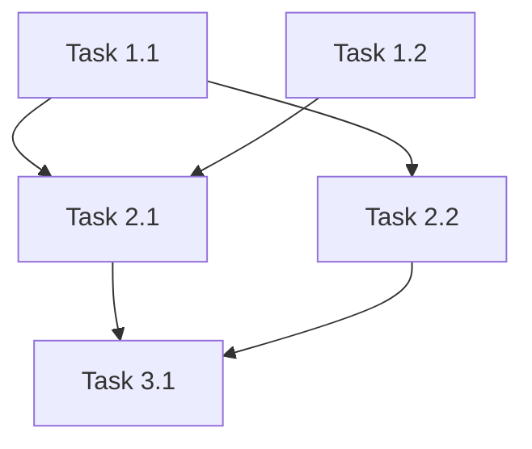

# Task Breakdown Phase

Create small, actionable, testable tasks with clear dependencies for parallel execution.

## Prerequisites

- If `plan.md` exists: Read for implementation order
- If not: "No plan found. Run /iflow:create-plan first."

## Read Feature Context

1. Find active feature folder in `docs/features/`
2. Read `.meta.json` for mode and context
3. Adjust behavior based on mode:
   - Standard: Full process with optional verification
   - Full: Full process with required verification

## Process

### 1. Break Down Each Plan Item

For each item in the plan:
- What are the smallest testable pieces?
- Each task: 5-15 minutes of work
- Each task: Clear completion criteria

### 2. Apply TDD Structure

For implementation tasks:
1. Write failing test
2. Implement minimal code
3. Verify test passes
4. Refactor if needed
5. Commit

### 3. Analyze Dependencies

For each task, determine:
1. Does this task need code/artifacts from another task?
2. Does this task modify files another task also modifies?
3. Does this task's test require another task's output?

**Parallel candidates:**
- Tasks touching different files
- Tasks with independent test suites
- Tasks in different domains (UI vs API vs DB)

**Sequential requirements:**
- Interface definition before implementation
- Schema migration before code using schema
- Shared utility before consumers

### 4. Group for Execution

Organize tasks into parallel groups:
- Group 1: Tasks with no dependencies (can start immediately)
- Group 2: Tasks that depend only on Group 1
- Group 3+: Continue until all tasks assigned

## Task Quality Requirements

### Task Naming
- Format: `{Verb} + {Object} + {Context}`
- Good: "Add validateEmail function to utils/validation.ts"
- Bad: "Handle email validation"

### Do Section Requirements
- Step-by-step instructions
- Exact file paths
- Specific function/class names
- No ambiguous terms ("properly", "appropriately", "as needed")

### Test Section Requirements
- Exact test command: `npm test -- path/to/test.ts`
- Or manual verification: "Run app, navigate to /login, submit empty form, verify error appears"

### Done When Requirements
- Binary (yes/no) criteria only
- Observable output (file exists, test passes, UI shows X)
- No subjective judgments ("code is clean", "works well")

## Output: tasks.md

Write to `docs/features/{id}-{slug}/tasks.md`:

```markdown
# Tasks: {Feature Name}

## Dependency Graph



## Execution Strategy

### Parallel Group 1 (No dependencies - can start immediately)
- Task 1.1: {brief description}
- Task 1.2: {brief description}

### Parallel Group 2 (After Group 1 completes)
- Task 2.1: {brief description} (needs: 1.1, 1.2)
- Task 2.2: {brief description} (needs: 1.1)

### Sequential Group 3 (After Group 2 completes)
- Task 3.1: {brief description} (needs: 2.1, 2.2)

## Task Details

### Phase 1: Foundation

#### Task 1.1: {Verb + Object + Context}
- **Depends on:** None (can start immediately)
- **Blocks:** Task 2.1, Task 2.2
- **Files:** `path/to/file.ts`
- **Do:**
  1. {Exact step 1}
  2. {Exact step 2}
  3. {Exact step 3}
- **Test:** `npm test -- path/to/file.test.ts`
- **Done when:** {Observable, binary criteria}
- **Estimated:** 10 min

#### Task 1.2: {Verb + Object + Context}
- **Depends on:** None (can start immediately)
- **Blocks:** Task 2.1
- **Files:** `path/to/other.ts`
- **Do:**
  1. {Exact step 1}
  2. {Exact step 2}
- **Test:** {Specific verification command or steps}
- **Done when:** {Binary criteria}
- **Estimated:** 15 min

### Phase 2: Core Implementation

#### Task 2.1: {Verb + Object + Context}
- **Depends on:** Task 1.1, Task 1.2
- **Blocks:** Task 3.1
- **Files:** `path/to/file.ts`
- **Do:**
  1. {Exact step 1}
  2. {Exact step 2}
- **Test:** {Specific verification}
- **Done when:** {Binary criteria}
- **Estimated:** 15 min

...

## Summary

- Total tasks: {n}
- Parallel groups: {m}
- Critical path: Task 1.1 → Task 2.1 → Task 3.1 ({estimated total} min)
- Max parallelism: {number of tasks in largest parallel group}
```

## State Tracking

If Vibe-Kanban available:
- Create card for each task
- Set dependencies

If TodoWrite:
- Create todo items

## Completion

"Tasks created. {n} tasks across {m} phases, {p} parallel groups."
"Run /iflow:verify to check, or /iflow:implement to start building."
