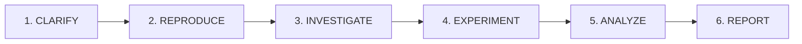

# Root Cause Analysis

A structured 6-phase process for finding ALL contributing causes, not just the first one.

## Process Overview



## Phase 1: CLARIFY

Gather context before investigation begins.

- **Actions:** Ask targeted questions about symptom, timeline, recent changes
- **Output:** Clear problem statement
- **Tools:** AskUserQuestion

Questions to ask:
1. What is the exact error or unexpected behavior?
2. When did this start happening?
3. What changed recently (code, config, dependencies)?
4. Is it reproducible or intermittent?
5. What has already been tried?

## Phase 2: REPRODUCE

Create isolated reproduction in sandbox.

- **Actions:** Copy relevant code to agent_sandbox/, create minimal reproduction
- **Output:** Reproduction script OR "intermittent" note if cannot reproduce after 3 attempts
- **Tools:** Bash (mkdir, cp), Write

Sandbox structure:
```
agent_sandbox/{YYYYMMDD}/rca-{slug}/
├── reproduction/    # Minimal reproduction code
├── experiments/     # Hypothesis verification scripts
└── logs/           # Captured output
```

## Phase 3: INVESTIGATE

Apply systematic analysis to generate hypotheses.

- **Actions:** Apply 5 Whys methodology, trace causality backward, search codebase
- **Output:** Hypothesis list (MINIMUM 3 - document considered alternatives if fewer genuine causes)
- **Tools:** Read, Glob, Grep
- **Reference:** [5 Whys Template](references/five-whys-template.md)

Investigation techniques:
- Trace the error backward through the call stack
- Search for similar patterns in codebase
- Check recent commits affecting related code
- Review configuration and environment differences

## Phase 4: EXPERIMENT

Test each hypothesis with verification scripts.

- **Actions:** Write verification scripts in sandbox, test each hypothesis
- **Output:** Evidence for/against each hypothesis
- **Tools:** Write, Bash, Edit

For each hypothesis:
1. Design a test that would confirm or refute it
2. Write the test script in agent_sandbox/
3. Run and capture results
4. Document evidence

## Phase 5: ANALYZE

Synthesize findings into root cause determination.

- **Actions:** Identify all contributing causes, check for interaction effects
- **Output:** Root cause list with evidence
- **Reference:** [Causal DAG](references/causal-dag.md) for cause categories and DAG templates

## Phase 6: REPORT

Generate formal RCA report and offer workflow handoff.

- **Actions:** Generate RCA report, offer handoff to /create-feature
- **Output:** `docs/rca/{YYYYMMDD}-{HHMMSS}-{slug}.md`
- **Reference:** [RCA Report Template](references/rca-report-template.md)

Report must include:
- Summary with dates and status
- Timeline of events
- Reproduction steps and result
- Hypotheses explored with evidence
- Experiments conducted
- Root causes (primary + contributing factors)
- Recommendations

## Behavioral Rules

- **MUST** reproduce before analyzing (or document failed attempts)
- **MUST** explore at least 3 hypothesis paths
- **MUST NOT** modify production code (agent_sandbox/ and docs/rca/ only)
- **MUST NOT** propose fixes (report causes only, fixing is a separate step)

## Related Resources

- [systematic-debugging](../systematic-debugging/SKILL.md) - Iron Law ("NO FIXES WITHOUT ROOT CAUSE INVESTIGATION FIRST"), 3-fix rule
