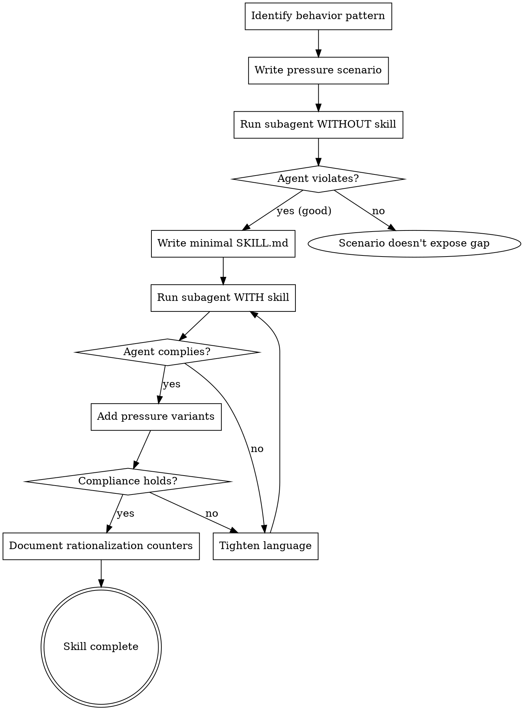

# Writing Skills

**Writing skills IS Test-Driven Development applied to process documentation.**

## The Iron Law

```
NO SKILL WITHOUT A FAILING TEST FIRST
```

If you didn't watch an agent fail without the skill, you don't know if the skill teaches the right thing.

Write skill before testing? Delete it. Start over.

## TDD Mapping

| TDD Concept | Skill Creation |
|-------------|----------------|
| Test case | Pressure scenario with subagent |
| Production code | Skill document (SKILL.md) |
| Test fails (RED) | Agent violates rule without skill |
| Test passes (GREEN) | Agent complies with skill present |
| Refactor | Close loopholes while maintaining compliance |

## Workflow



## SKILL.md Structure

```markdown
---
name: skill-name-with-hyphens
description: [What it does]. Use when [specific triggering conditions].
---

# Skill Name

## Overview
Core principle in 1-2 sentences.

## When to Use
Bullet list with symptoms and use cases.

## Core Pattern
Before/after or step-by-step.

## Common Mistakes
What goes wrong + fixes.
```

## Description Format

- Pattern: `"[What it does]. Use when [triggers]."`
- Third person ("Processes..." not "You can use this to...")
- Include specific triggers/symptoms
- Do NOT summarize workflow
- Under 500 characters

**Bad:** "Use for TDD - write test first, watch it fail..."
**Good:** "Enforces RED-GREEN-REFACTOR cycle. Use when implementing any feature or bugfix."

## When to Create

**Create when:**
- Technique wasn't intuitively obvious
- You'd reference this again across projects
- Pattern applies broadly
- Others would benefit

**Don't create for:**
- One-off solutions
- Standard practices documented elsewhere
- Project-specific conventions (put in CLAUDE.md)

## Validation Checklist

- [ ] Name uses lowercase and hyphens only
- [ ] Description follows "[What]. Use when [triggers]." pattern
- [ ] Description doesn't summarize workflow
- [ ] Under 500 lines
- [ ] Tested with pressure scenario
- [ ] Agent failed WITHOUT skill (RED)
- [ ] Agent complied WITH skill (GREEN)
- [ ] Loopholes closed after pressure variants
- [ ] `./validate.sh` passes

## Reference Materials

**Best Practices:**
- [Anthropic Best Practices](references/anthropic-best-practices.md) - Official skill authoring guide
- [Persuasion Principles](references/persuasion-principles.md) - Psychology of effective skills

**Testing:**
- [Testing Skills with Subagents](references/testing-skills-with-subagents.md) - TDD methodology
- [Pressure Test Scenarios](examples/pressure-test-scenarios.md) - Example test scenarios

**Diagrams:**
- [Graphviz Conventions](references/graphviz-conventions.md) - Process diagram style guide
- [render-graphs.js](scripts/render-graphs.js) - Render DOT diagrams to SVG

## Quick Reference: Persuasion Principles

| Principle | Application |
|-----------|-------------|
| Authority | Use definitive language ("MUST", "NEVER") |
| Commitment | Include explicit checklists |
| Social proof | Show universal application ("No exceptions") |
| Loss aversion | Make costs concrete ("3 hours debugging") |
| Unity | Frame as identity ("This is discipline") |

## Quick Reference: Pressure Types

| Type | Example | Counter |
|------|---------|---------|
| Time | "Production down" | "TDD is faster than debugging" |
| Sunk cost | "Already wrote code" | "Delete and start over" |
| Authority | "User wants speed" | "Explain why discipline matters" |
| Familiarity | "I know how" | "Knowing ≠ verified" |
| Simplicity | "Too simple" | "Simple things break. Test: 30 sec." |
