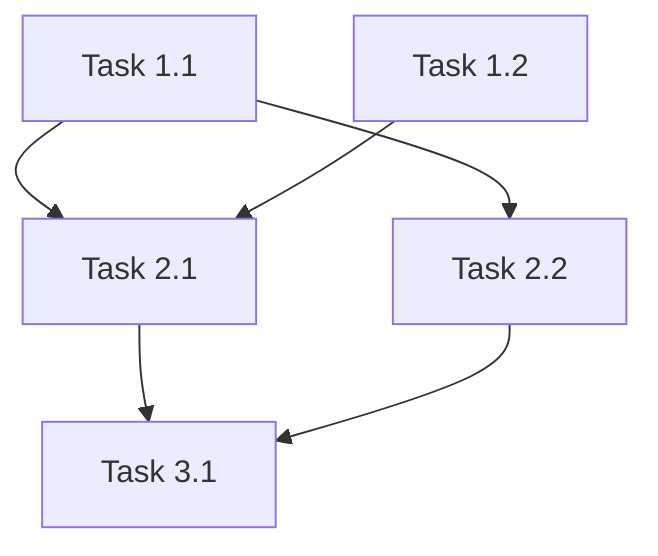

# Task Breakdown Phase

## Config Variables
Use these values from session context (injected at session start):
- `{pd_artifacts_root}` — root directory for feature artifacts (default: `docs`)

Create small, actionable, testable tasks with clear dependencies for parallel execution.

## Prerequisites

- If `plan.md` exists: Read for implementation order
- If not: "No plan found. Run /pd:create-plan first."

## Read Feature Context

1. Find active feature folder in `{pd_artifacts_root}/features/`
2. Read `.meta.json` for mode and context
3. Adjust behavior based on mode:
   - Standard: Full process with optional verification
   - Full: Full process with required verification

## Process

### 1. Break Down Each Plan Item

For each item in the plan:
- Each task must do ONE thing, with a concrete way to verify it's done.
- The task description must contain everything a subagent needs to execute it — no external context required. Include the "what" and "why" directly.
- Do not use time as a proxy measure for task sizing.

### 2. Apply TDD Structure

For implementation tasks:
1. Write failing test
2. Implement minimal code
3. Verify test passes
4. Refactor if needed
5. Commit

### 3. Analyze Dependencies

For each task, determine:
1. Does this task need code/artifacts from another task?
2. Does this task modify files another task also modifies?
3. Does this task's test require another task's output?

**Parallel candidates:**
- Tasks touching different files
- Tasks with independent test suites
- Tasks in different domains (UI vs API vs DB)

**Sequential requirements:**
- Interface definition before implementation
- Schema migration before code using schema
- Shared utility before consumers

### 4. Group for Execution

Organize tasks into strictly defined Execution Stages to prevent API crash loops:
- Group 1: Tasks with no dependencies (can start immediately)
- Group 2: Tasks that depend only on Group 1
- Group 3+: Continue until all tasks assigned
**Stage Cap**: Limit sequential (blocking) chains to **15 tasks** per Execution Stage to prevent batch drift. However, if a foundational group has zero internal dependencies, you may scale it infinitely in a single parallel stage to maximize swarm efficiency.

## Task Quality Requirements

### Task Naming
- Format: `{Verb} + {Object} + {Context}`
- Good: "Add validateEmail function to utils/validation.ts"
- Bad: "Handle email validation"

### Do Section Requirements
- Step-by-step instructions
- Exact file paths
- Specific function/class names
- No ambiguous terms ("properly", "appropriately", "as needed")

### Test Section Requirements
- Every task needs a concrete verification command.
- **For logic tasks:** Exact test command (e.g., `npm test -- path/to/test.ts`).
- **For structural tasks** (interfaces, config, routing stubs): Verify the file exists, is valid, and is properly exported/imported. Use localized checks only (e.g., `npx eslint path/to/file.ts`). **Never run global compilers** like bare `tsc` — they will false-fail on unbuilt parts of the project.

### Done When Requirements
- Binary (yes/no) criteria only
- Observable output (file exists, local test passes, static check passes)
- No subjective judgments ("code is clean", "works well")

### No Time Estimates

Do NOT include time estimates on tasks. Do not arbitrarily cap task count. You may generate as many tasks as necessary as long as they align with the mission requirements.

- BAD: `- **Estimated:** 10 min`
- BAD: `Critical path: 45 min total`
- GOOD: Use complexity level (Simple/Medium/Complex) if needed

## Output: tasks.md

Write to `{pd_artifacts_root}/features/{id}-{slug}/tasks.md`:

```markdown
# Tasks: {Feature Name}

## Global Subagent Context
> Shared context for all tasks below: architectural rules, cross-task interfaces, and design constraints. Individual tasks must still contain their own specific parameters (exact strings, queries, file paths) — do not force subagents to guess from this header.

## Dependency Graph



## Execution Strategy

### Parallel Group 1 (No dependencies - can start immediately)
- Task 1.1: {brief description}
- Task 1.2: {brief description}

### Parallel Group 2 (After Group 1 completes)
- Task 2.1: {brief description} (needs: 1.1, 1.2)
- Task 2.2: {brief description} (needs: 1.1)

### Sequential Group 3 (After Group 2 completes)
- Task 3.1: {brief description} (needs: 2.1, 2.2)

## Task Details

### Stage 1: Foundation

#### Task 1.1: {Verb + Object + Context}
- **Why:** Implements Plan {X.Y} / Design Component {Name}
- **Depends on:** None (can start immediately)
- **Blocks:** Task 2.1, Task 2.2
- **Files:** `path/to/file.ts`
- **Do:**
  1. {Exact step 1}
  2. {Exact step 2}
  3. {Exact step 3}
- **Test:** `npm test -- path/to/file.test.ts`
- **Done when:** {Observable, binary criteria}

#### Task 1.2: {Verb + Object + Context}
- **Why:** Implements Plan {X.Y} / Design Component {Name}
- **Depends on:** None (can start immediately)
- **Blocks:** Task 2.1
- **Files:** `path/to/other.ts`
- **Do:**
  1. {Exact step 1}
  2. {Exact step 2}
- **Test:** {Specific verification command or steps}
- **Done when:** {Binary criteria}

### Stage 2: Core Implementation

#### Task 2.1: {Verb + Object + Context}
- **Why:** Implements Plan {X.Y} / Design Component {Name}
- **Depends on:** Task 1.1, Task 1.2
- **Blocks:** Task 3.1
- **Files:** `path/to/file.ts`
- **Do:**
  1. {Exact step 1}
  2. {Exact step 2}
- **Test:** {Specific verification}
- **Done when:** {Binary criteria}

...

## Summary

- Total tasks: {n}
- Parallel groups: {m}
- Critical path: Task 1.1 → Task 2.1 → Task 3.1
- Max parallelism: {number of tasks in largest parallel group}
```

## State Tracking

If Vibe-Kanban available:
- Create card for each task
- Set dependencies

If TodoWrite:
- Create todo items

## Completion

"Tasks created. {n} tasks across {m} phases, {p} parallel groups."
"Run /pd:show-status to check, or /pd:implement to start building."
